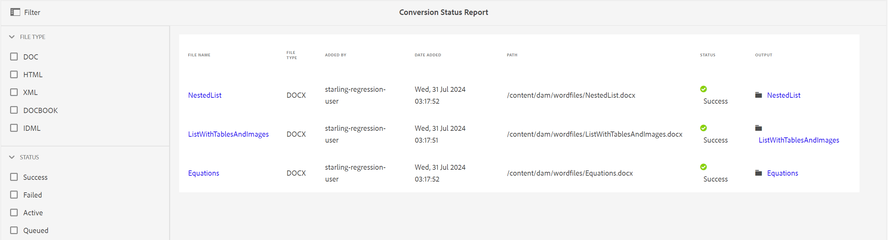
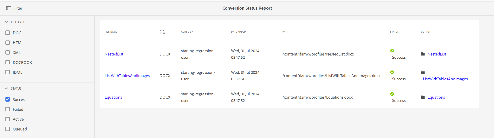

# 轉換狀態報表 {#id205BBA00WZZ}

Adobe Experience Manager Guides提供強大的轉換功能，可將各種格式的檔案轉換為DITA。 「轉換狀態報表」提供Experience Manager Guides執行之所有轉換工作的整合檢視。

執行下列步驟以檢視「轉換狀態報表」：

1. 選取頂端的Adobe Experience Manager標誌，然後選擇&#x200B;**工具**。

1. 從工具清單中選取&#x200B;**指南**。

1. 選取&#x200B;**轉換狀態報表**&#x200B;圖磚。

   系統會針對系統上執行的所有轉換工作，顯示「轉換狀態報告」。

   {width="800" align="left"}

1. 報告頁面分為兩個部分：

   - **篩選器：**

     您可以根據「檔案型別」和「轉換狀態」來篩選報表資料。 在「檔案型別」中，您可以選擇檢視Word檔案、結構化HTML、XML、DocBook和IDML型別檔案的報表資料。 在「狀態」中，您可以選擇檢視已順利執行、失敗、作用中或已佇列之工作的報表資料。

     下列熒幕擷圖顯示具有成功狀態的轉換任務的報表資料。

     {width="800" align="left"}

   - **報表資料：**

     報表資料包含以下欄：

      - **檔案名稱**：執行轉換程式之來源檔案的名稱。 選取「檔案名稱」連結會帶您前往來原始檔位置。

      - **檔案型別**：來原始檔的型別，可能是Word、結構化HTML、XML、IDML和DocBook。

      - **新增者**：執行轉換工作的使用者名稱。

      - **新增日期**：執行工作的日期。 在「新增日期」連結上選取可下載記錄檔。

      - **路徑**：來原始檔的完整路徑。

      - **狀態**：轉換任務的狀態 — 成功、失敗、作用中或佇列。

      - **輸出**：成功轉換檔案的路徑。 在「輸出」連結上選取可帶您前往儲存輸出的位置。

**父級主題：**[&#x200B;報告簡介](reports-intro.md)
