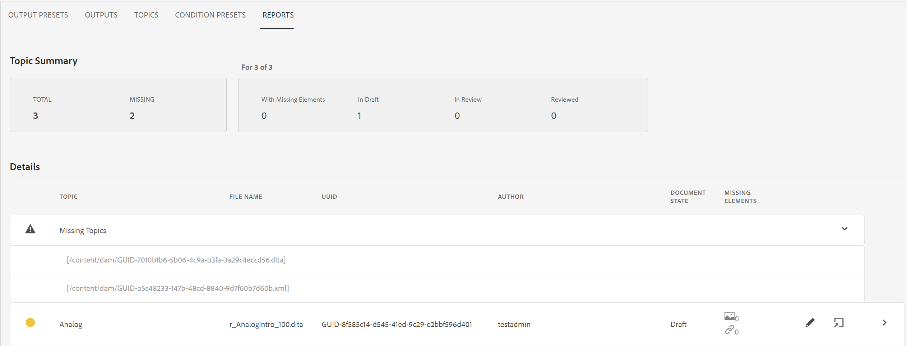
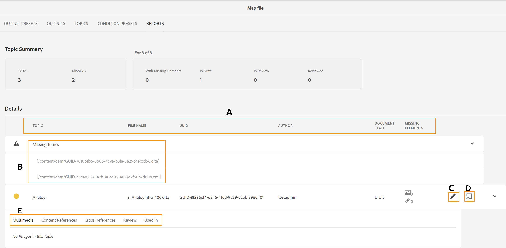
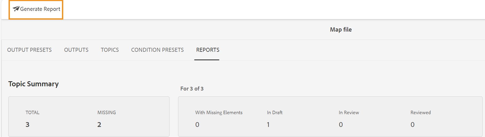
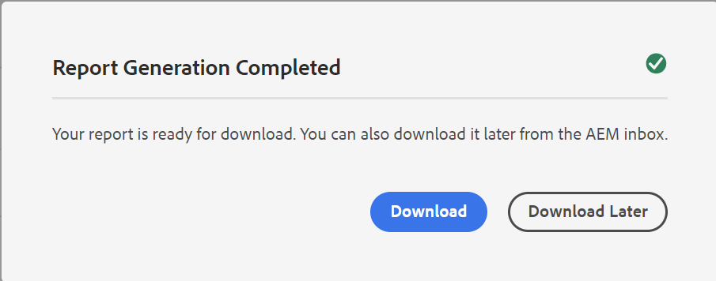

# DITA map報表（從map儀表板） {#id205BB800EEN}

Adobe Experience Manager Guides提供管理員報告功能，可在檔案上線或提供給一般使用者使用前，檢查檔案的整體完整性。 Experience Manager Guides中地圖控制面板的DITA map報告提供重要資訊，例如遺失主題、遺失元素的主題、參考主題和媒體檔案的UUID，以及每個主題的檢閱狀態。 詳細的個別主題層級報表也會提供DITA內容相關資訊，例如內容參照和遺失的影像或交叉參照。

>[!NOTE]
>
>每當地圖檔案中發生變更或主題檔案中的任何參照有所更新時，Experience Manager Guides都會重新整理此報告。

執行下列步驟以檢視DITA Map報表：

1. 在Assets UI中，導覽至並選取您要檢視其報表的DITA map檔案。

1. 選取&#x200B;**報表**。

   {width="800" align="left"}

   「報表」頁面分為兩個部分：

   - **主題摘要：**

     列出所選地圖檔案的整體摘要。 透過檢視「摘要」，您可以快速瞭解地圖中的主題總數、缺少的主題、具有缺少元素的主題數、主題的狀態 — 草稿中、稽核中或稽核狀態。

   - **詳細資料：**

     選取主題時，會顯示所選主題的詳細報告。

     {width="800" align="left"}

     在&#x200B;**A**、**B**、**C**&#x200B;和&#x200B;**D**&#x200B;下反白顯示的專案說明如下：

      - **主題**： DITA map中指定的主題標題。 將滑鼠指標停留在主題標題上會顯示主題的完整路徑。 如果主題中發生遺失參考或影像等問題，主題標題前會顯示一個紅點。

      - **檔案名稱**：檔案的名稱。

      - **UUID**：檔案的通用唯一識別碼\(UUID\)。

      - **作者**：上次處理此主題的使用者。

      - **檔案狀態**：檔案的目前狀態 — 草稿、檢閱中或已檢閱。

      - **遺失的元素**：列出遺失的影像數目或中斷的互動參照（如果有的話）。

      - **遺失主題\(B\)**：如果存在參照中斷的主題，則這些主題會列在「遺失主題」清單下。

      - **在Framemaker中開啟\(C\)**：列出遺失的影像或中斷的互動參照（如果有的話）數目。

      - **在編輯器中開啟\(D\)**：選取此圖示會在編輯器中開啟主題。

   在&#x200B;**E**&#x200B;下反白顯示的專案說明如下：

   - **多媒體**：此主題中使用的影像路徑與其UUID一起顯示。 如果您選取影像路徑，對應的影像會在彈出式視窗中開啟。 中斷的影像連結會以紅色列出。

   - **內容參考**：此主題中所參考內容的路徑會與其UUID一起顯示。 如果您選取參照內容的標題，對應的主題會在「預覽」模式中開啟。

   - **交叉引用**：交叉引用內容的路徑會與其UUID一起顯示。 如果您選取參照內容的標題，對應的主題會在「預覽」模式中開啟。 破斷的互動參照會以紅色列出。

   - **檢閱**：顯示主題檢閱工作的狀態。 您可以檢視所檢閱主題的狀態\（開啟或關閉\）、到期日和受指派人。 如果您選取主題連結，它會在稽核模式中開啟主題。

   - **用於**：顯示使用主題的其他主題或地圖清單。 也會列出所有這類主題和地圖的UUID。

除了每個個別主題的報告之外，管理員還可以存取資訊，例如DITA map的發佈歷史記錄。 如需產生之輸出的歷史記錄詳細資訊，請參閱[檢視輸出產生工作的狀態](generate-output-for-a-dita-map.md#viewing_output_history)區段。

## 產生DITA map報表的CSV

您可以下載並匯出DITA map報表的CSV。 CSV包含詳細的DITA map報表。

執行以下步驟來產生DITA map報表的CSV：

1. 選取左上方的&#x200B;**產生報表**&#x200B;以產生DITA map報表。

   {width="800" align="left"}

1. 報告可供下載後，您將會收到通知。 選取「下載&#x200B;****」以下載產生報表的CSV。

   {width="550" align="left"}

   您也可以稍後從「Experience Manager通知收件匣」下載產生報表的CSV檔案。

   在「收件匣」中選取產生的報告以下載報告。

   {width="300" align="left"}

報告下載至收件匣後，您也可以選取報告，並使用頂端的開啟圖示開啟所選的報告。

**父級主題：**[&#x200B;報告簡介](reports-intro.md)
