# 從Map Console建立DITA map報表 {#id231HF0Z0NXA}

Adobe Experience Manager Guides在Map Console中提供的功能可讓您檢查地圖的整體完整性，並為其產生報表。

您可以從[對映主控台]的&#x200B;**報表**&#x200B;索引標籤中檢視主題清單、管理所有參照的中繼資料、檢視多媒體清單，以及修正目前對映的所有中斷連結，存取方式如下：

1. 在&#x200B;**存放庫**&#x200B;面板中，在Map檢視中開啟DITA map檔案。

   >[!NOTE]
   >
   > 您也可以從首頁左上方的下拉式清單，直接在&#x200B;**對映主控台**&#x200B;標籤中開啟DITA map。

1. 選取&#x200B;**在地圖主控台中開啟**&#x200B;圖示。

   {width="600" align="left"}

1. 從左側面板選取&#x200B;**報表**。

您可以從&#x200B;**報告**&#x200B;面板找到所有四個報告。 您可以根據自己的需求，選取此處所示的任何報表。

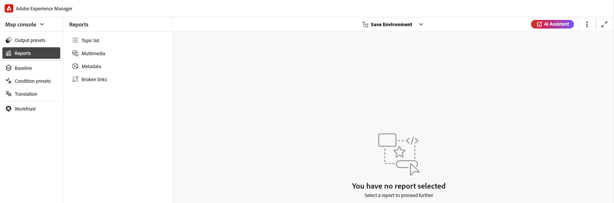{align="left"}

「報表」面板提供四種不同型別報表的存取權。 下文將詳細討論每個報表及其協助工具和功能。

## 主題清單報告

**主題清單**&#x200B;報告提供您主題的詳細資訊，例如參考型別、檔案狀態和作者。

您可以執行下列步驟來檢視地圖的主題清單報告：

1. 從「報表」面板中選取&#x200B;**主題清單**。 將顯示DITA map中的主題清單。

   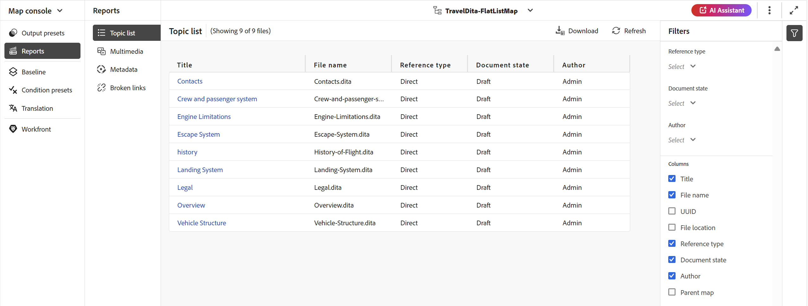{align="left"}

1. 從&#x200B;**篩選器**&#x200B;面板中，您可以根據&#x200B;**參考型別** \（直接或間接\）、**檔案狀態** \（例如，如果您的主題處於編輯、稽核中或稽核狀態，這些將會列出\）或主題的&#x200B;**作者**&#x200B;來篩選主題。

   >[!NOTE]
   >
   > 所有篩選器皆提供系統中所有選項的完整清單。

1. 您也可以使用下列主題篩選選項來選擇在清單中顯示下列欄：

   - **標題** DITA map中指定了主題標題。 您可以選取要編輯的主題。
   - **檔案名稱**&#x200B;檔案名稱。
   - **UUID**&#x200B;檔案的通用唯一識別碼\(UUID\)。
   - **檔案位置**&#x200B;主題的完整路徑。
   - **參考型別**&#x200B;參考型別 — 直接或間接參考。
   - **檔案狀態**&#x200B;主題的狀態。
   - **作者**&#x200B;上次處理此主題的使用者。 清單會以非同步方式分頁並載入，一次顯示一組有限的使用者，並在捲動或導覽時擷取更多內容。 這可改善載入速度和整體效能，尤其是在處理大量使用者時。
   - **父對映**&#x200B;直接參考主題的所有對映清單。
   >[!NOTE]
   >
   > 選取&#x200B;**重新整理**&#x200B;以取得新的主題清單，並檢視對映檔案中的任何變更，或主題檔案中的任何參考是否已更新。

1. 選取&#x200B;**下載**&#x200B;來下載DITA map中所有主題的快照。 Excel工作表包含選取的欄以及在&#x200B;**主題清單**&#x200B;檢視中篩選的主題。

## 中繼資料報表

**中繼資料報表**&#x200B;提供您目前DITA map中參考的詳細報表，例如參考型別、檔案狀態、標籤、檔案位置等。

您可以執行下列步驟來檢視地圖的中繼資料報表：

1. 從「報表」面板中選取&#x200B;**中繼資料**。 所有地圖參照的清單會與其中繼資料（例如標籤、檔案狀態、自訂中繼資料）一起顯示。 若要新增自訂中繼資料欄，請參閱[新增自訂中繼資料欄](#add-custom-metadata-columns)區段。

   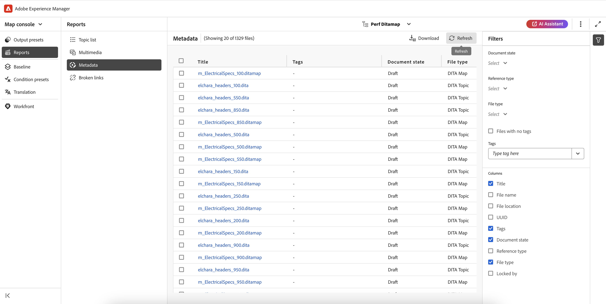{align="left"}

1. 從&#x200B;**篩選器**&#x200B;面板，您可以根據&#x200B;**檔案狀態**&#x200B;來篩選主題\（例如，如果您的主題處於編輯、稽核中或稽核狀態，這些將會列出\）、**參考** \（直接或間接\）、**檔案型別** \（地圖、主題、檔案、影像、視訊及其他\）。

   >[!NOTE]
   >
   > 所有篩選器皆提供系統中所有選項的完整清單。

1. 您也可以選擇只檢視沒有標籤的&#x200B;**檔案**，或是從&#x200B;**標籤**&#x200B;篩選條件中選擇特定標籤，以檢視與其相關的檔案。
1. 您也可以使用下列主題篩選選項來選擇在中繼資料清單中顯示下列欄：
   - **標題** \（預設為選取\）參考檔案的標題是在DITA map中指定的。 您可以選取要編輯的檔案。

     >[!NOTE]
     >
     > 出庫圖示也會出現在出庫檔案的標題附近。 您可以將滑鼠停留在圖示上以檢視使用者名稱。

   - **檔案名稱**&#x200B;檔案的名稱。
   - **檔案位置**&#x200B;檔案的完整路徑。
   - **UUID**&#x200B;檔案的通用唯一識別碼\(UUID\)。
   - **標籤** \（預設為選取\）套用至檔案的標籤。

     >[!NOTE]
     >
     > 依預設，您可以檢視檔案的兩個標籤。 若要檢視更多標籤，請選取&#x200B;**顯示更多**。 選取&#x200B;**顯示較少**&#x200B;以再次合約清單。

   - **檔案狀態** \（預設為選取\）參考檔案的目前狀態。
   - **參考型別**&#x200B;參考型別 — 直接或間接參考
   - **檔案型別** \（預設為選取\）來源檔案的型別。 可用的選項包括地圖、主題和影像。
   - **鎖定者**&#x200B;已鎖定檔案的使用者。

1. 選取&#x200B;**下載**&#x200B;來下載DITA map中所有參照的快照。 Excel工作表包含在&#x200B;**中繼資料**&#x200B;檢視中篩選的選取欄和參考。

### 從中繼資料報表大量管理中繼資料

您可以在個別主題上套用標籤，或使用大量標籤功能，在多個主題、DITA map或子對映上套用多個標籤。 您也可以將所有所選主題的檔案狀態變更為下一個可能的共同檔案狀態。

### 更新中繼資料

若要更新中繼資料，請執行下列步驟：

1. 若要更新中繼資料，請選取要更新的檔案。 您可以勾選顯示在&#x200B;**Title**&#x200B;旁的核取方塊，以選取出現在「中繼資料」面板中的檔案。 如果您要選取所有記錄，請使用標題列上方的&#x200B;**全選**&#x200B;標籤，如下所示。

   >[!NOTE]
   >
   > 您無法選取任何出庫檔案。 出庫圖示也會出現在出庫檔案的標題附近。 您可以將滑鼠停留在圖示上以檢視使用者名稱。

   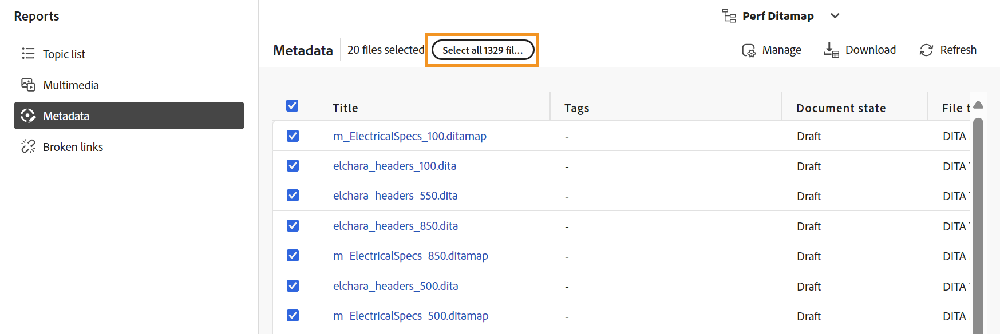{align="left"}

1. 從頂端選取&#x200B;**管理**。

   {width="350" align="left"}

1. 如果您想要新增任何新標籤，請從下拉式清單中選取新標籤，以將其套用至所有選取的主題。 您也可以選取標籤附近的十字圖示來刪除任何標籤。

   >[!NOTE]
   >
   > 會列出套用至所有選取主題的通用標籤。

1. 如果要變更所有所選參照的檔案狀態，請選取新的檔案狀態。 下拉式清單會顯示所有所選主題的一般可能狀態。 例如，如果您的主題目前狀態為「稽核中」，則您可以檢視「草稿」、「已核准」或「已檢閱」狀態。
1. 選取&#x200B;**更新**&#x200B;以更新中繼資料。 無論中繼資料更新成功還是更新失敗，系統都會顯示中繼資料的確認訊息。 您也可以選取&#x200B;**下載報表**&#x200B;來下載報表的快照。 此快照包含所選參照之更新狀態的詳細資訊。

### 新增自訂中繼資料欄

此功能可讓您視需要新增自訂中繼資料欄，這些欄隨後會顯示在中繼資料報表中。 此外，也提供更優異的中繼資料報表彈性。 若要新增自訂中繼資料欄，請執行下列步驟：

1. 若要新增自訂中繼資料欄，請從中繼資料頁面右上角的三個點中選取&#x200B;**Workspace設定** （顯示為&#x200B;**內部部署**&#x200B;的&#x200B;**設定**）。

   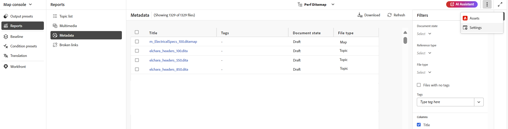{width="600" align="left"}

1. 在出現的快顯視窗的左側面板上選取&#x200B;**中繼資料**。
1. 使用&#x200B;**新增**&#x200B;索引標籤，根據需求新增自訂中繼資料欄位。

   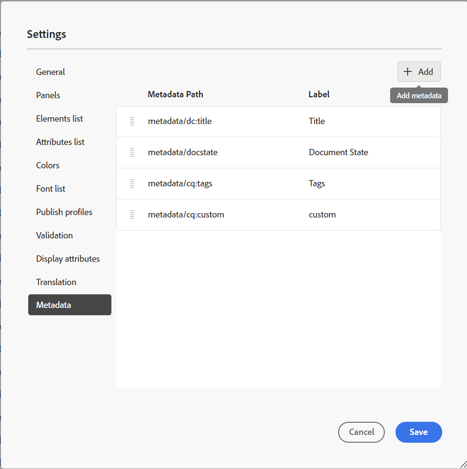{width="600" align="left"}

1. 指定您要在中繼資料報表欄中新增的特定中繼資料路徑和適當標題。 例如，會新增具有標題語言和特定路徑的自訂中繼資料。

   >[!NOTE]
   >
   > 如果您想要移除特定的中繼資料欄，可以從顯示的清單中刪除它。 此外，您可以編輯&#x200B;**標籤**&#x200B;以變更欄的顯示標題。

   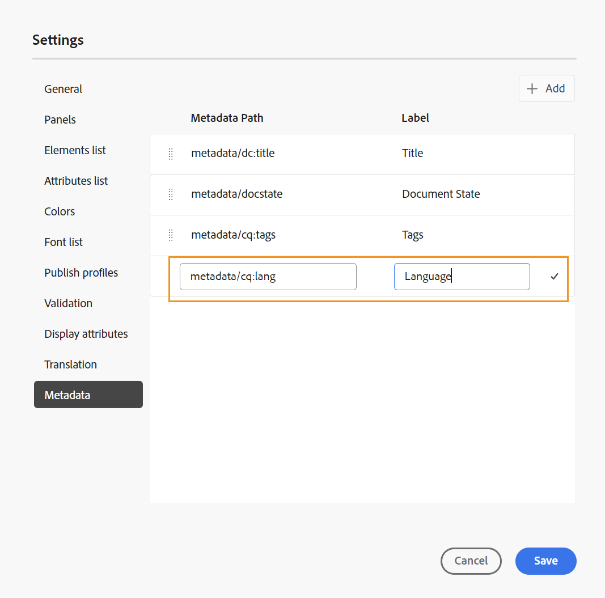{width="600" align="left"}

1. 選取&#x200B;**儲存**&#x200B;和&#x200B;**重新整理**&#x200B;中繼資料檢視。 新的自訂欄&#x200B;**語言**&#x200B;已新增到篩選器面板的欄清單中。

   >[!NOTE]
   >
   > 新增中繼資料欄也會反映在編輯器的&#x200B;**版本歷程記錄**&#x200B;面板中。 如需詳細資訊，請檢視&#x200B;**[中繼資料](web-editor-features.md)**。

   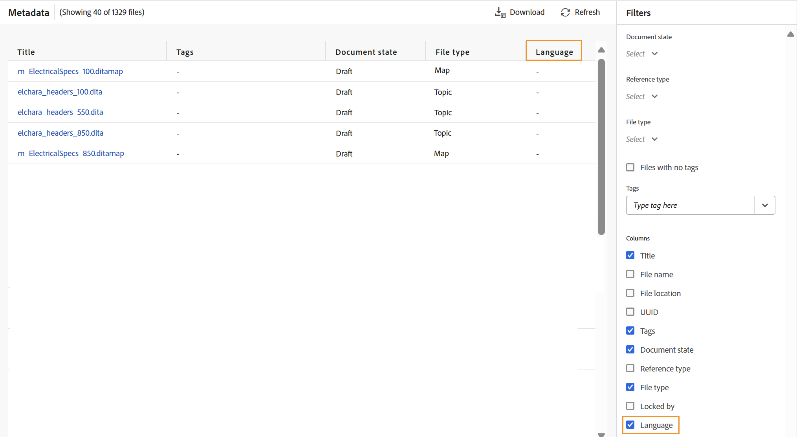{width="600" align="left"}

同樣地，您可以依照上述步驟，根據您在中繼資料報表中所需的需求，新增任何新的自訂中繼資料欄位。

## 多媒體報告

**多媒體**&#x200B;報告提供地圖中所使用多媒體的詳細資訊，例如標題、型別\（音訊、視訊和影像\）、使用多媒體的檔案以及使用多媒體的檔案的參考型別。 您也可以檢視UUID和存放庫中多媒體的位置。 您可以執行下列步驟來檢視多媒體的報告：

1. 從「報表」面板選取&#x200B;**多媒體**。 DITA map中呈現的多媒體清單隨即顯示。
1. 從&#x200B;**篩選器**&#x200B;面板中，您可以依照多媒體或參照中使用的名稱來排序清單。

   - 當您依&#x200B;**多媒體**&#x200B;排序時，多媒體的名稱會顯示在第一欄，而使用它們的所有參照名稱則會顯示在同一列的另一個欄中。 例如，下列熒幕擷圖顯示多媒體testSong.mp3在第一欄，而兩個使用它的參照顯示在同一列的第三欄。

     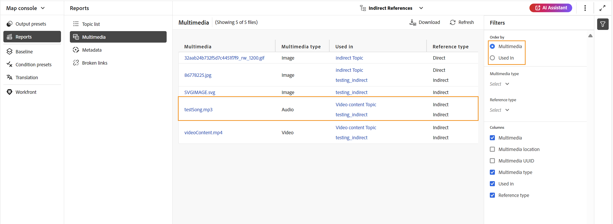{width="650" align="left"}

   - 如果您依&#x200B;**用於**&#x200B;欄排序，您將檢視已使用多媒體的參照名稱列在第一欄，而多媒體名稱則列在另一欄的不同列。 例如，下列熒幕擷圖顯示第一欄中兩個參照\（testing_indirect和Video content Topic\）的名稱，而多媒體testSong.mp3則顯示在第三欄的兩個獨立列中。

     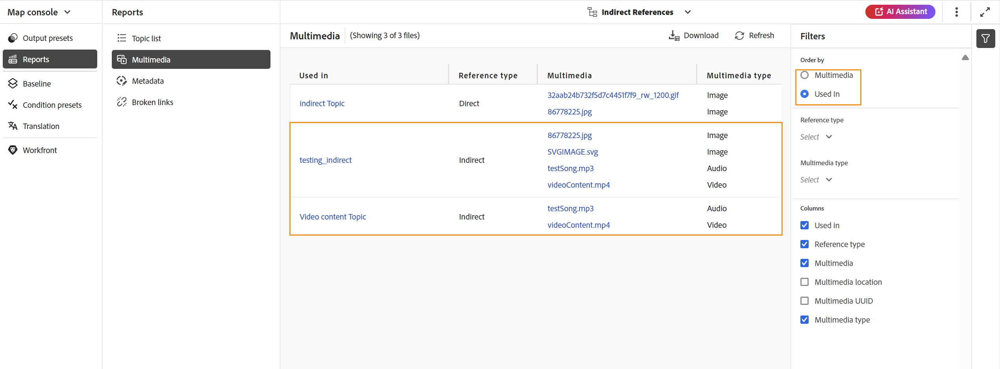{width="650" align="left"}

1. 您可以根據&#x200B;**多媒體型別**&#x200B;和&#x200B;**參考型別**&#x200B;來篩選您的多媒體。 多媒體檔案清單會根據您在下拉式清單中的選取專案而顯示。 例如，您可以選擇只顯示DITA map中的音訊參照，而檔案只會顯示其中使用的音訊參照。

1. 您也可以使用下列篩選選項來選擇在清單中顯示下列欄：

   - **多媒體** \（預設為選取\）多媒體標題是在DITA map中指定的。 您可以選取要編輯的多媒體。
   - **多媒體位置**&#x200B;多媒體的完整路徑。
   - **多媒體UUID**&#x200B;檔案的通用唯一識別碼\(UUID\)。
   - **多媒體型別** \（預設選取\）多媒體型別。 可用的選項有「音訊」、「視訊」或「影像」。
   - **使用於** \（預設為選取\）已使用多媒體的參考。 您可以選取參照來編輯它。
   - **參考型別** \（預設為選取\）參考型別 — 直接或間接參考。
   >[!NOTE]
   >
   > 選取&#x200B;**重新整理**&#x200B;以取得新的多媒體清單，並檢視地圖檔案中的任何變更，或是DITA map中的任何多媒體已更新。

1. 選取&#x200B;**下載**&#x200B;來下載DITA map中所有多媒體的快照。 Excel工作表包含在&#x200B;**多媒體**&#x200B;檢視中篩選的選取欄與多媒體。

## 中斷連結報表

**中斷連結**是實用的報表，可提供您目前地圖中中斷連結的詳細資料。 您可以檢視中斷連結，這些連結可用於DITA主題、多媒體檔案參照、內容關鍵參照等等。 您也可以在此處自行修正這些錯誤。
報表提供詳細資訊，例如中斷的連結、連結型別、使用參照的檔案以及使用的檔案型別。
您可以透過下列步驟來檢視中斷連結報表：

1. 從「報表」面板中選取&#x200B;**中斷連結**。 DITA map中出現的中斷連結或參照清單隨即顯示。
1. 從&#x200B;**篩選器**&#x200B;面板中，您可以依照連結或參照中所使用的名稱來排序清單。

    — 當您依&#x200B;**中斷連結**&#x200B;排序時，中斷連結的路徑會顯示在第一欄，而使用中斷連結的所有參照名稱則會顯示在另一個欄的個別列中。 如果在多個檔案中使用了相同的斷開連結，則它們會顯示在一列中，並顯示為分組或子列。 例如，下列熒幕擷圖顯示第一欄中有兩個中斷的連結，以及使用這些連結的參照，`m_ElectricalSpecs_900.ditamap`會顯示在第三欄的兩個個別列中。

   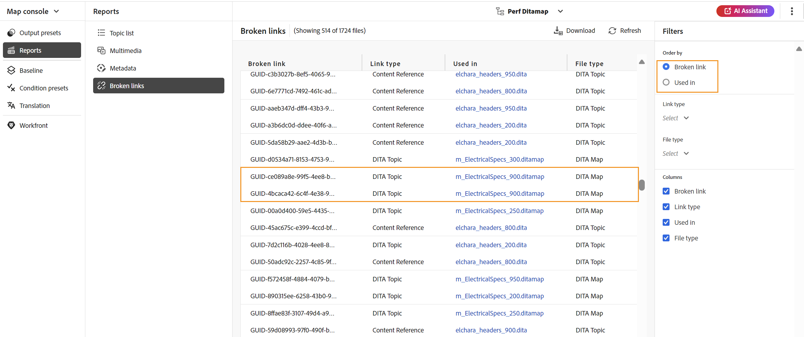{align="left"}

    — 如果您依&#x200B;**用於**&#x200B;欄排序，您將檢視已使用中斷連結的參照名稱列在第一欄，而中斷連結列在同一列的另一欄。 例如，下列熒幕擷圖顯示第一欄中的參照（使用中斷連結） `m_ElectricalSpecs_900.ditamap`，而同一列的第三欄中會顯示中斷連結。

   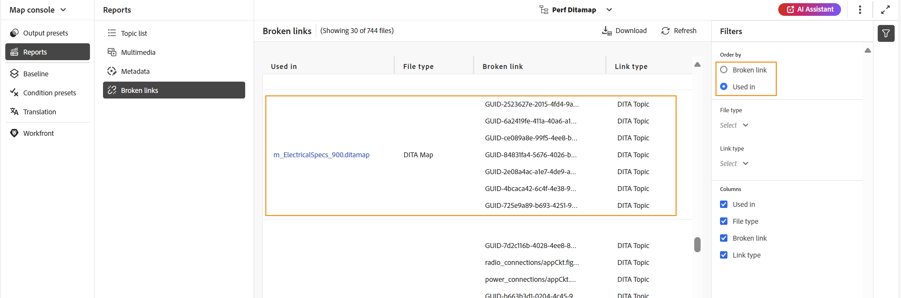{align="left"}

1. 您可以根據&#x200B;**檔案型別**&#x200B;和&#x200B;**連結型別**&#x200B;來篩選中斷的連結。 系統會根據您於下拉式清單中的選取專案，顯示失效連結清單。 例如，您可以選擇只顯示DITA map中的內容參照，而檔案只會顯示其中使用的中斷內容參照。

   DITA主題、DITA Map、檔案參照、索引鍵參照、內容參照、內容索引鍵參照、影像參照、多媒體檔案參照和多媒體索引鍵參照是&#x200B;**連結型別**&#x200B;下拉式清單的可用值，而DITA主題、DITA Map、檔案、影像、視訊、音訊和其他是&#x200B;**檔案型別**&#x200B;下拉式清單的可用值。
1. 您也可以使用下列篩選選項來選擇在清單中顯示下列欄：

   - **中斷連結** （預設為選取）中斷連結的路徑在DITA map中指定。

   - **連結型別** （預設為選取）連結型別。 可用的選項有「DITA主題」、「DITA對映」、「檔案參照」、「鍵參照」、「內容參照」、「內容鍵參照」、「影像參照」、「多媒體檔案參照」和「多媒體鍵參照」。

   - **使用於** （預設為選取）使用中斷連結的參照。 您可以選取參照以在作者模式中檢視它。

   - **檔案型別** （預設為選取）參照型別 — DITA主題、DITA Map、檔案、影像、視訊、音訊及其他。

   選取&#x200B;**重新整理**&#x200B;以取得中斷連結的新清單，並檢視對映檔案中的任何變更，或檢視DITA map中的任何中斷連結是否已更新。
1. 您可以在&#x200B;**修復連結**&#x200B;圖示()上選取以修復中斷的連結。

   >[!NOTE]
   >
   > 將游標暫留在「中斷連結」欄下方的中斷連結路徑上，以檢視「修復」連結()圖示。

   您可以修正兩個檢視中的連結 — 當您已依&#x200B;**中斷連結**&#x200B;或&#x200B;**用於**&#x200B;時。

   >[!NOTE]
   >
   > 當您在依中斷連結排序時修正中斷連結時，該連結將在所有使用該連結的檔案中修正（這些檔案會分組在單一列）。

1. 您需要在&#x200B;**更新連結**&#x200B;對話方塊中更新必要的參考詳細資料。 **更新連結**&#x200B;對話方塊中所需的詳細資訊將視參考型別而定。\
   修正連結後，該連結不會顯示在失效連結清單下。 反之，您可以在「主題清單」或「中繼資料」下檢視它。

1. 選取&#x200B;**下載**&#x200B;來下載DITA map中所有中斷連結的快照。 excel檔案包含在「中斷連結」檢視中篩選的選取欄和中斷連結。

**父級主題：**[&#x200B;報告簡介](reports-intro.md)
