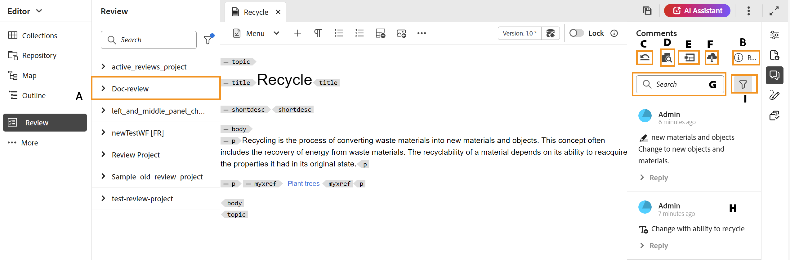
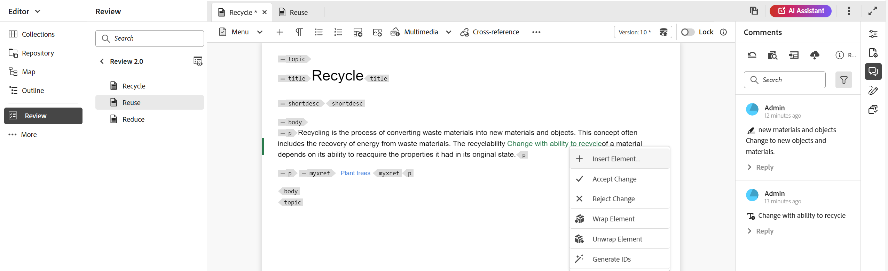
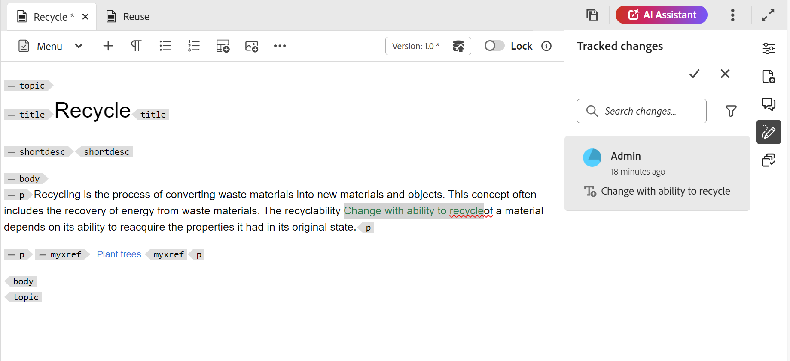
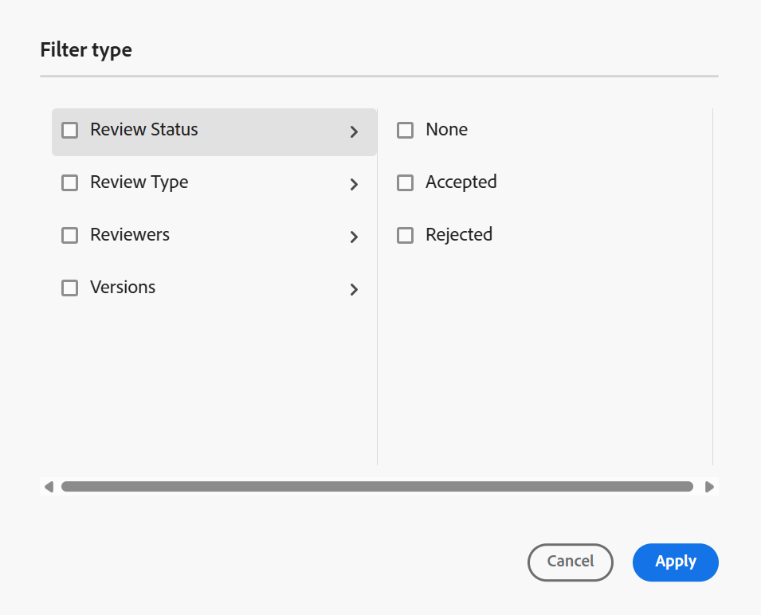
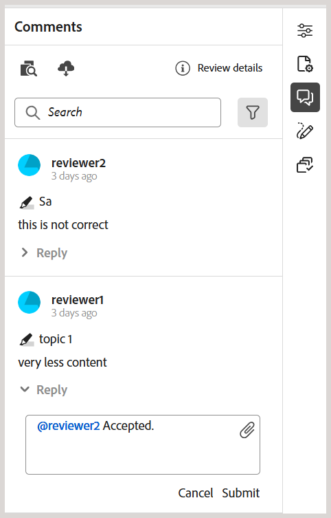
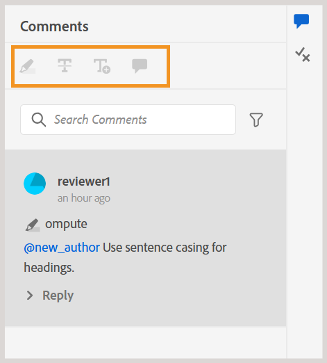

# 處理稽核意見 {#id2056B0X0KBI}

身為作者，您可以使用編輯器在主題中處理註解。 註解會根據在「稽核」面板中選取的稽核任務載入。 如需更多詳細資料，請在&#x200B;**左側面板**&#x200B;區段中檢視檢閱[面板](../user-guide/web-editor-features.md#id2051EA0M0HS)功能說明。

以下各節說明在編輯器中處理註解的方法。

作者可從編輯器處理檔案中的註解。 視覺指示器可指示註釋是插入\(text\)、刪除還是反白顯示。 每個註解專案頂端也會提及註解型別。

>[!NOTE]
>
> 處理稽核註解\（針對使用中的稽核檔案\）時，請確保未在啟用完整標籤檢視的多個標籤中開啟稽核中主題，請勿在「作者」和「Source」檢視模式之間切換。

{align="left"}

在編輯器中，右側面板包含稽核和追蹤變更圖示。 「檢閱」面板會顯示檢閱者在您的檔案中所做的所有註解。 **追蹤變更**&#x200B;面板會顯示檔案中所有插入和刪除的註解狀態。

- **A**：選取稽核任務以檢視稽核註解。 如果您的主題已在多個稽核任務中共用以供稽核，您將檢視此下拉式清單中列出的任務。

  當您從清單中選取稽核任務時，您可以檢視稽核者在該任務中所做的註解。 您可以在工作中獨立處理稽核註解，這表示註解的任何更新只會顯示給該個別任務的稽核者。

- **B：**&#x200B;在&#x200B;**註解**&#x200B;面板中選取檢閱詳細資料&#x200B;****&#x200B;以檢視檢閱工作的詳細資訊：

   - **名稱**：稽核工作的名稱。
   - **檢閱版本**：顯示與所選檢閱工作相關的版本。 這可協助您追蹤您共用以供檢閱的版本
   - **狀態**：稽核工作的目前狀態。

  >[!NOTE]
  >
  > 如果稽核任務的根對映與編寫根對映不同，則會顯示其相關資訊，以指出編寫與稽核根對映不相符。

- **C**：如果您在起始稽核之後更新了主題，則選取&#x200B;**將主題回覆為稽核版本**&#x200B;圖示會將您的工作復本回覆為共用供稽核的版本。 這可讓您更輕鬆地直接將稽核意見納入共用以供稽核的版本中。 結合意見回饋後，您可以將變更儲存在還原版本中，或建立主題的新修訂版本。 如果您選擇建立主題的新修訂版本，則會從共用以供檢閱的主題版本建立新分支。 例如，如果您在目前編寫版本為`1.2`時共用主題的`1.3`版以供檢閱，則可以使用此圖示切換回版本`1.2`以結合檢閱註解。 如果您選擇在合併版本`1.2`的變更之後建立新的修訂版本，則會為此主題建立版本為`1.2.0`的新分支。

  通常，在合併稽核意見回饋後，您會想要合併來自主題最新版本的變更。 若要這麼做，請使用[合併](web-editor-features.md#id205DF04E0HS)功能，取得共用主題以供檢閱後所做的所有更新。

- **D**：開啟並排檢視以顯示註解的主題版本。 如上述熒幕擷圖所示，最左側的區段是您可以進行變更的最新版主題。 下一節是主題的註解版本。 當您在主題中的註解之間導覽時，側檢視會變更並顯示註解所在的主題版本。 註解面板中的每個註解都會連結至此區段中對應的文字。 它有助於您識別註解的文字。 註解會以檔案中註解文字的順序顯示。

  您可以在側檢視頂端檢視版本號碼。 再次選取此圖示會隱藏該主題的註解版本。

- E：直接匯入主題中插入和刪除的\（或刪除線\）註解。 選取「匯入」圖示後，所有文字插入和刪除都會顯示在主題的工作復本中。 現在，接受或拒絕評論的方式有兩種。

  如果要一次合併一個建議的變更\（插入或刪除\），只需在內容中的註解上按一下滑鼠右鍵，然後選取「接受變更」或「拒絕變更」。 根據您的選擇，會接受或拒絕註解。 若為接受的評論，內容會新增至內容中；若為拒絕，則會從內容中移除。 此外，註解的狀態會在「稽核」面板中變更。

  {align="left"}

  您也可以使用「追蹤變更」面板來接受或拒絕註解。 選取任何註解都會反白檔案中的註解。

  {align="left"}

  >[!IMPORTANT]
  >
  > 匯入註解功能僅適用於自共用供檢閱後未變更的檔案。 如果您在傳送檔案以供檢閱之後做了任何變更，您將會收到通知，提醒您&#x200B;**強制將**&#x200B;註解匯入檔案中。 但是，這樣做會遺失您在檔案中進行的所有更新。 如果在外部建立檔案，然後共用以進行稽核，也會顯示&#x200B;**強制匯入**&#x200B;警報。 您可以繼續並匯入註解。

  當您接受或拒絕註解時，該註解會從「追蹤的變更」清單中移除。 這也作為檔案中需要處理多少注釋的指標。

- **F**：從[更多選項]功能表，下載評論主題中可用的所有附件。
- **G**：搜尋評論中的文字。
- **H**：接受或拒絕註解。

- **I**：在評論上套用篩選。 您可以根據「稽核型別」\（全部、反白顯示、刪除、插入或註解\）、「稽核狀態」\（全部、接受、拒絕或無\）、「稽核者」\(全部或特定稽核者\(s\)\)或「主題版本」來篩選以檢視註解。 依預設，不會選取任何篩選器。

  {width="350" align="left"}
  **藉由標籤其他使用者來回覆註解**

身為稽核工作的作者與發起人，您可以回複稽核意見，並標籤參與相同稽核工作的其他使用者，以引導其注意或指派後續追蹤。 此功能僅適用於進行中的檢閱工作。

>[!NOTE]
>
> 若要檢視指派給稽核工作的使用者清單並在註解中標籤這些使用者，您必須在&#x200B;*節點上具有*&#x200B;讀取`/home/users and /home/groups`存取權。 如需詳細資訊，請檢視[使用者管理與安全性](../cs-install-guide/user-admin-sec.md#additional-notes-on-user-groups)。  如果在確認存取後仍無法進行標籤，您的管理員可能需要指派`user-admin`授權才能啟用此功能。

{width="350" align="left"}
*註解:Tag使用者，作為發起人/作者*

標籤的使用者會收到電子郵件和AEM通知，以確保他們及時獲得通知。 如需有關檢閱通知如何觸發的詳細資訊，請檢視[瞭解檢閱通知](./review-understanding-review-notifications.md)。

**使用檢閱UI存取檢閱註解**

如果您是稽核任務的發起人或作者，並從&#x200B;**專案主控台**&#x200B;開啟它，則主題將在稽核UI中啟動。 由於此任務未指派給您，因此您可以檢視並回覆註解，但無法執行任何稽核動作。 對於未指派給任務的使用者，註釋工具列保持停用狀態。

{width="350" align="left"}

**父級主題：**[&#x200B;檢閱簡介](review.md)
