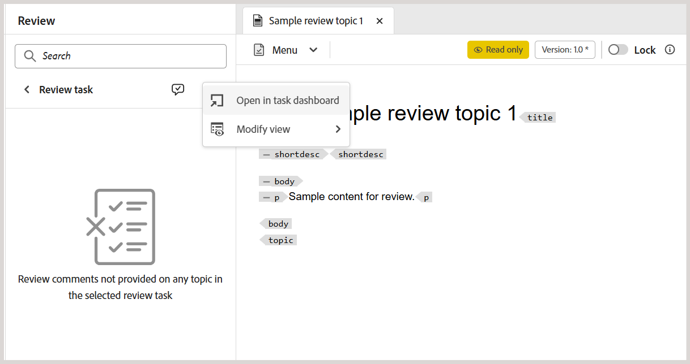
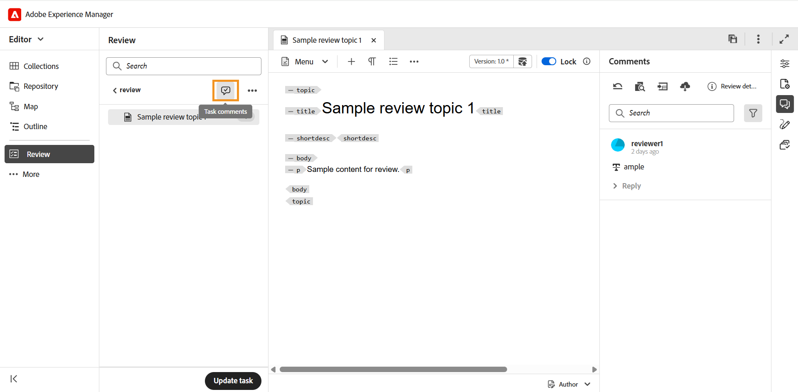
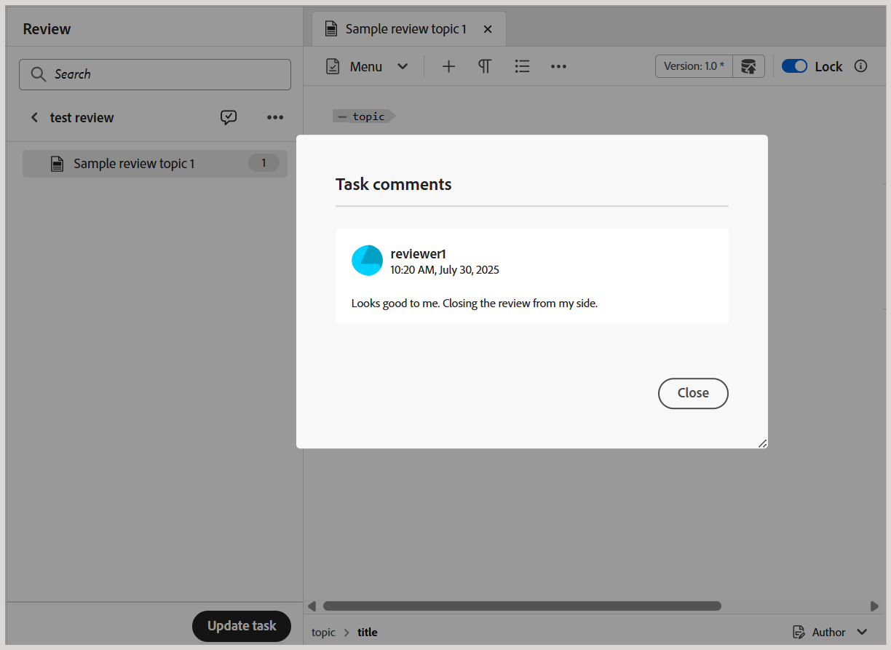
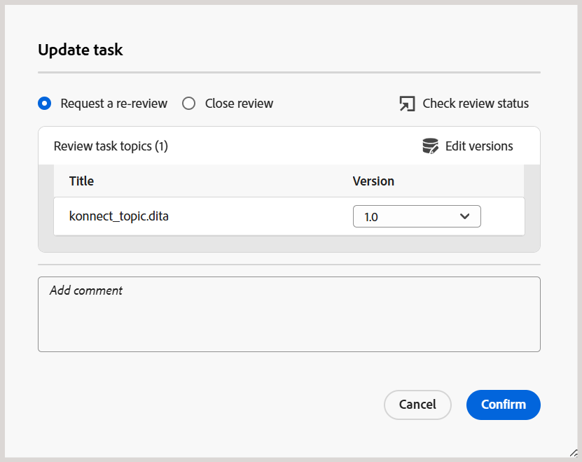
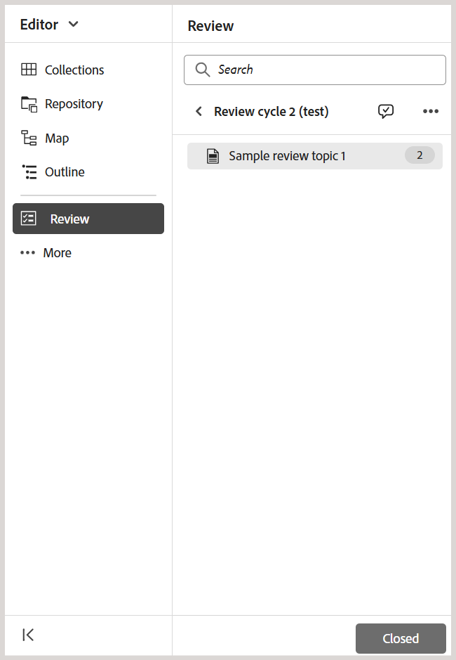
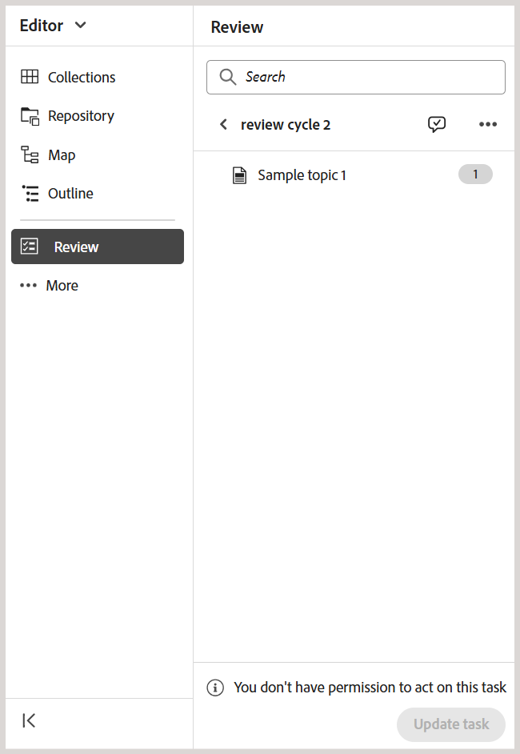

# 以作者身分要求重新檢閱或關閉檢閱任務

>[!IMPORTANT]
>
> Experience Manager Guides as a Cloud Service第2508發行版本預設會啟用本文所述的新功能。 移轉前建立的檢閱不會受到影響，並將繼續使用舊版工作流程。 如果您偏好繼續使用現有功能而不進行這些更新，請聯絡您的客戶成功團隊以停用新功能。

當稽核任務被稽核者標籤為完成時，會觸發通知給任務發起者，讓他們能夠存取及稽核任務和相關任務層級的註解。

身為稽核任務的發起者，您可以根據意見來決定如何繼續。 可使用的選項包括：

- 要求重新檢閱
- 關閉稽核任務

## 要求重新檢閱或關閉檢閱任務

執行下列步驟，要求重新複查或關閉複查工作：

1. 在編輯器中開啟稽核工作。
2. 在「稽核」面板中，從&#x200B;**作用中工作**&#x200B;清單中選取稽核工作。

   >[!NOTE]
   >
   > 您也可以在任務控制面板中開啟任務，以取得更完整的檢視。 若要這麼做，請從任何作用中稽核任務的[選項]功能表中選取[在任務儀表板中開啟]。 ****&#x200B;這會在專案主控台中開啟任務詳細資訊。

   
3. 選取&#x200B;**工作註解**&#x200B;對話方塊以存取及檢閱檢閱者新增的工作層級註解。

   。

   **任務註解**&#x200B;對話方塊會顯示在右側。

   {width="350" align="left"}。
4. 選取「**更新任務**」以針對選取的稽核任務採取進一步的動作。
5. 在&#x200B;**更新工作**&#x200B;對話方塊中，選擇下列其中一個動作：

   - **要求重新檢閱**：起始另一輪檢閱。 您可以選取不同的主題版本進行檢閱。 依預設，會選取傳送供檢閱之主題或對應檔案的最新（或上次編輯的）版本。 完成先前稽核的稽核者將收到通知，就更新版本提供意見反應。 其他未將稽核任務標示為完成的稽核者會收到有關主題更新的通知。

   - **關閉評論**：關閉評論任務。 檢閱面板底部的&#x200B;**更新任務**&#x200B;按鈕變更為&#x200B;**已關閉**，並且會傳送通知給所有參與檢閱任務的使用者，以指示其關閉。

   如需有關檢閱通知如何觸發的詳細資訊，請檢視[瞭解檢閱通知](./review-understanding-review-notifications.md)。

   。

6. 選取&#x200B;**確認**。

作為評論任務的作者或發起者，當您關閉任務時，出現在評論面板底部的&#x200B;**更新任務**&#x200B;按鈕將變更為&#x200B;**已關閉**，這表示任務不再有效。

{width="350" align="left"}

此外，檢閱面板中存在的&#x200B;**更新任務**&#x200B;按鈕對於檢閱任務的其他使用者仍為停用。 例如，作為稽核任務的稽核者之一，如果您在編輯器中開啟該任務，則「更新任務」按鈕將會停用，並出現訊息&#x200B;**您沒有許可權執行此任務**。 只有稽核任務的發起者才有權從編輯器更新任務。

{width="350" align="left"}