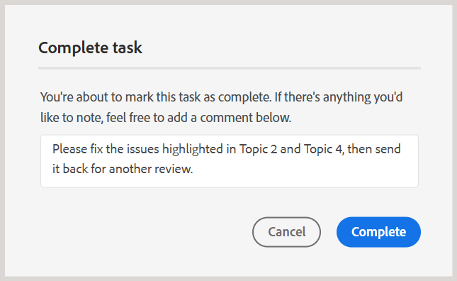
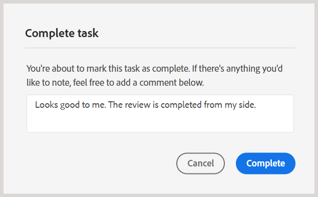
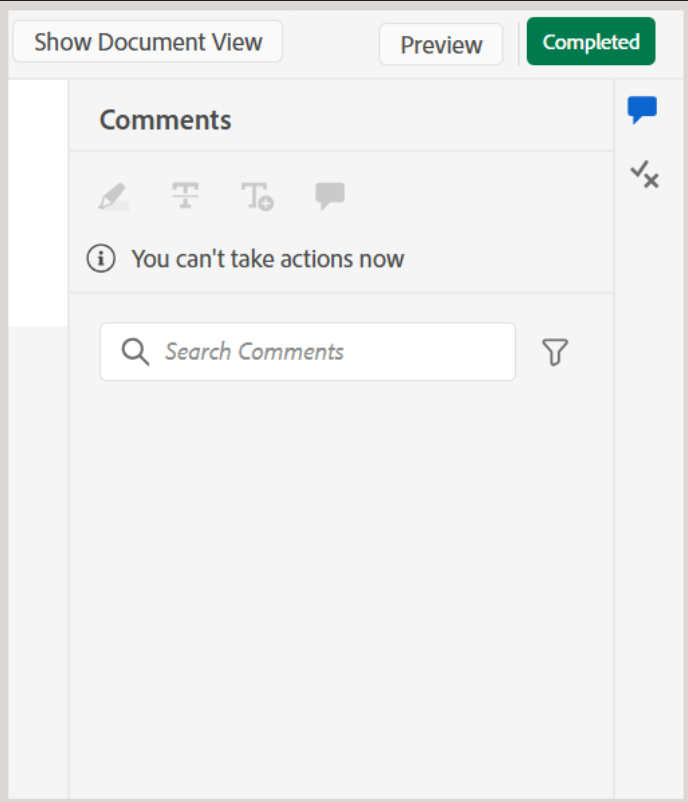
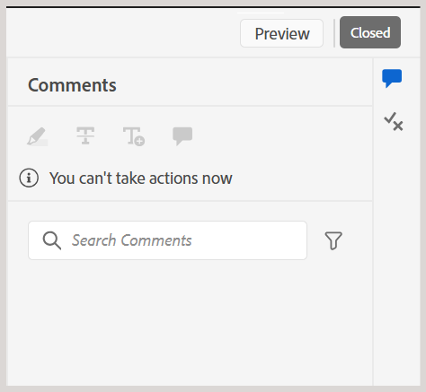
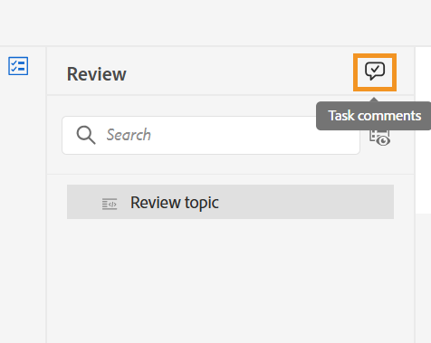
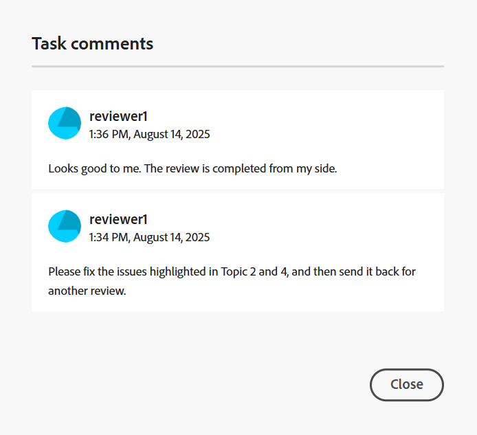

# 以檢閱者身分完成檢閱任務

>[!IMPORTANT]
>
> 本文所述的新功能預設會在2508年的Experience Manager Guides as a Cloud Service版本中啟用。 移轉前建立的檢閱不會受到影響，並將繼續使用舊版工作流程。 如果您偏好繼續使用現有功能而不進行這些更新，請聯絡您的客戶成功團隊以停用新功能。

檢閱者可在檢閱完所有內容並想要通知作者後，將檢閱任務標示為完成。 您也可以在此階段留下任何最終註解。

執行下列步驟以完成複查作業：

1. 開啟指派給您的稽核任務。
2. 從頂端選取&#x200B;**標籤為完成**，如下所示：

   {width="350" align="left"}

   顯示&#x200B;**完成任務**&#x200B;對話方塊。
3. 在&#x200B;**完成工作**&#x200B;對話方塊中，新增作者的最終註解，並選取&#x200B;**完成**。

   >[!NOTE]
   >
   > 任務層級的註解作為摘要或最終註解，與主題稽核期間新增的文字層級註解不同。 在此對話方塊中，您可以概述後續動作，例如要求作者處理特定註解並重新傳送工作以供檢閱，或指出檢閱已完成。

   例如，身為檢閱者，您可以新增註解作為作者的後續動作：

   {width="350" align="left"}

   或者，新增註解以指出工作已完成，如下所示：

   {width="350" align="left"}

您已成功將工作標示為已完成，其狀態現在已設為&#x200B;**已完成**。 一旦任務標示為完成，就不允許執行進一步的動作。 系統會傳送通知給稽核任務的作者或發起人，以立即引起他們的注意。 如需有關檢閱通知如何觸發的詳細資訊，請檢視[瞭解檢閱通知](./review-understanding-review-notifications.md)。

{width="350" align="left"}

根據意見回饋，如果任務的作者或發起者決定[關閉稽核任務](./review-close-review-task.md)，則稽核UI上的任務狀態將變更為&#x200B;**已關閉**。

{width="350" align="left"}

## 檢視任務層級註解

所有工作層級的註解都會顯示在&#x200B;**工作註解**&#x200B;對話方塊中，該對話方塊以唯讀模式提供。 當您完成含有最終註解的稽核任務時，您的輸入將記錄在此對話方塊中，以供日後參考。

若要從檢閱UI存取任務層級註解，請導覽至左側面板，並選取&#x200B;**任務註解**&#x200B;圖示。

{width="350" align="left"}

**任務註解**&#x200B;對話方塊會顯示在右側。

{width="350" align="left"}

對話方塊中的註解會依時間順序顯示，最近的註解會顯示在最前，最舊的註解則會顯示在最後。 此順序可協助您隨著時間推移追蹤交談。

**工作註解**&#x200B;對話方塊可供所有參與稽核工作的使用者存取，包括稽核工作的作者或發起者以及其他稽核者。 因此，來自其他稽核者（如果涉及）的註解可能也會顯示在「工作註解」對話方塊中。 這有助於確保在整個稽核過程中進行清楚且可追蹤的溝通。

在稽核任務層級的意見回饋後，作者可以請求重新稽核或關閉稽核任務。 在這兩種情況下，在檢閱程式期間擷取的所有註解仍可在&#x200B;**任務註解**&#x200B;對話方塊中參考使用。
