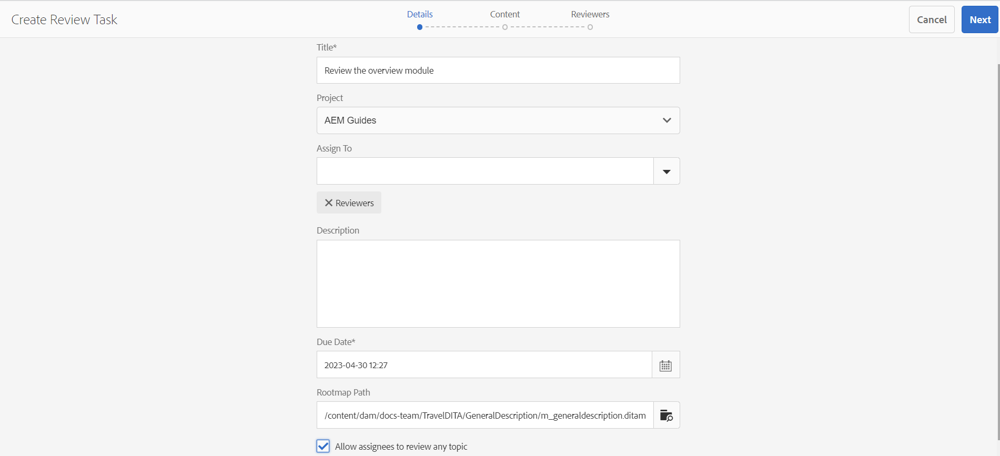
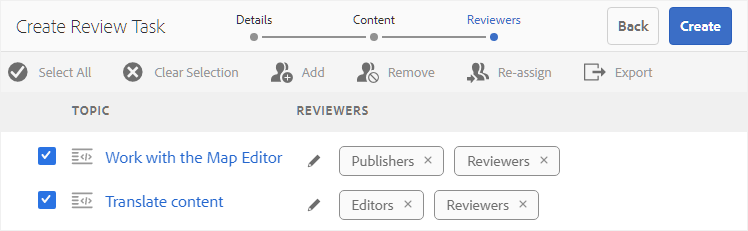
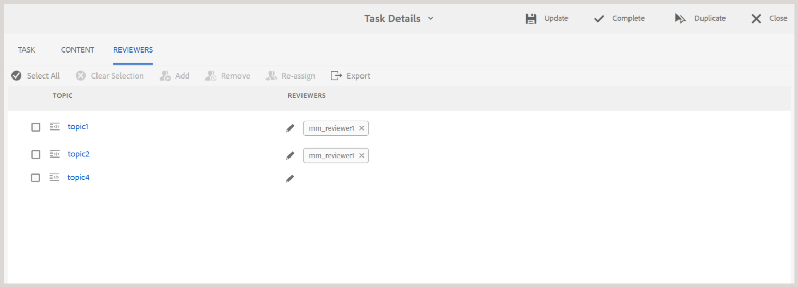

# 傳送主題以供檢閱 {#id199RD0S035Z}

稽核工作流程會建立多個稽核者環境，其中發起者會指定要稽核的主題清單、新增多個稽核者，以及指派稽核任務的時間表。 Adobe Experience Manager Guides可讓屬於Author和Publishers群組的使用者啟動稽核。

由於稽核工作流程是專案專用的，稽核發起人必須是專案團隊的一員或擁有建立專案的許可權。 在建立專案時，您可以為專案定義專案團隊成員，並為其指派各種角色或群組。 如需有關專案的詳細資訊，請檢視[建立DITA專案](authoring-create-dita-project.md#)。

您可以透過以下方式建立稽核任務：

- **編輯器**：可讓您傳送個別主題或DITA map以供檢閱。 請注意，建立稽核任務的工作流程在編輯器和Assets UI中很常見。 只有啟動稽核工作流程的方法不同。 如需有關從編輯器啟動稽核工作流程的資訊，請在編輯器中檢視[建立稽核工作](web-editor-left-panel.md#review)功能。

- **Assets UI**：可讓您傳送一或多個主題和DITA map以供檢閱。 本主題涵蓋如何從Assets UI工作流程共用檔案以供檢閱。

從Assets UI中，作者/發佈者可以透過兩種方式建立稽核任務：

- 傳送一或多個主題以供檢閱
- 從DITA map傳送多個主題以供檢閱

## 傳送一或多個主題以供檢閱 {#id1721E600FY4}

>[!IMPORTANT]
>
> 在建立稽核任務之前，請確定您已建立專案並新增稽核者至該專案。

若要建立複查工作並傳送要複查的主題，請執行下列步驟：

>[!NOTE]
>
> 您必須是DITA專案的作者或發行者，才能建立稽核任務。

1. 導覽至Assets UI中的必要資料夾。

1. 選擇快速動作中的&#x200B;**選取**&#x200B;圖示，並選取您要傳送供檢閱的主題。

   {width="300" align="left"}

1. 在工具列中選取&#x200B;**建立稽核工作**。 此時會顯示複查任務建立頁面。

   >[!NOTE]
   >
   > 您只能為具有修訂版本的主題建立稽核任務。 如果所選主題沒有修訂版本，您將會看到提示。

   {width="650" align="left"}

1. 輸入任務的&#x200B;**標題**&#x200B;並選取DITA專案。

1. 在&#x200B;**專案**&#x200B;下拉式欄位中，選取此稽核任務的DITA專案。 您也可以輸入專案名稱，以便在下拉式清單中快速找到它。

1. 在&#x200B;**指派給**&#x200B;下拉式欄位中，選取您要將主題傳送給稽核對象的稽核者。

   您可以將稽核任務指派給專案的個別使用者或使用者群組。 請注意，只有當您是專案的管理員群組的一部分時，才能將稽核任務指派給個別使用者，否則您只會在「指派給」欄位中檢視使用者群組。

   >[!NOTE]
   >
   > 稽核工作流程是專案專屬的。 當您建立專案時，您會將專案團隊成員新增至專案，並將他們指派至群組。 因此，當您在這裡選取專案時，您可以選取屬於該專案的成員。 如需有關專案的詳細資訊，請檢視[建立DITA專案](authoring-create-dita-project.md#)。

1. 輸入任務的&#x200B;**描述**。

   此說明會用作傳送給稽核者之通知電子郵件的內文。

1. 選取&#x200B;**到期日**&#x200B;和時間，以標示檢閱的截止日期。

   >[!NOTE]
   >
   > 到達截止日期時，會傳送電子郵件給發起人，通知稽核任務已完成。 啟動器可以從[檢閱控制面板](review-manage-tasks-review-dashboard.md#)延長檢閱工作的截止日期。

1. 從&#x200B;**根對映路徑**&#x200B;中選取根對映。 此Rootmap用於解析稽核內容中使用的所有關鍵參考資料和字彙表辭彙。 如果您未選取rootmap，則在傳送主題以供檢閱之前，不會解析與DITA主題相關聯的關鍵參考或字彙表辭彙。

   如果您正在建立DITA map的檢閱，則依預設，**Rootmap路徑**&#x200B;會設定為該對映的路徑。 如果您正在建立單一或多個主題的稽核，則依預設，**根對映路徑**&#x200B;會設定為使用者偏好設定中定義的對映。

   >[!NOTE]
   >
   > 選取的根對映解析關鍵參照的優先順序最高。 如需詳細資訊，請檢視[解析金鑰參考](map-editor-other-features.md#id176GD01H05Z)。

1. 由於您可以將不同的稽核者指派給不同的主題，因此&#x200B;**允許受指派者稽核任何主題**&#x200B;選項會控制稽核者是否可以稽核稽核稽核任務中的所有主題，或僅稽核他們被指派稽核的主題。

   如果要允許所有稽核者稽核稽核任務中的任何主題，請選取&#x200B;**允許受指派者稽核任何主題**。

   如果您未選取此選項，則新增到&#x200B;**指派給**&#x200B;欄位的稽核者將有權僅稽核指派給他們的那些主題。

1. 選取&#x200B;**「下一步」**。

   隨即顯示「內容」頁面。

   {align="left"}

1. 在「內容」頁面上，選取您要共用以供檢閱的主題版本。

   您可以使用下列其中一種方法來選取版本：

   - *\（預設\）*&#x200B;選擇選項&#x200B;**他們的最新版本**&#x200B;以選取上次儲存的主題修訂版本。
   - 選擇&#x200B;**版本為**&#x200B;選項，並指定在指定的日期和時間選取版本的日期和時間。 如果在指定的日期沒有可用的主題版本，則會選取在指定的日期和時間之後立即可用的版本。
   - 選擇&#x200B;**選取標籤**&#x200B;選項，然後從下拉式清單中選取標籤。
1. 選擇好版本之後，請選取&#x200B;**套用**。

   根據所選選項為主題選擇版本。

   >[!NOTE]
   >
   > 您也可以從每個主題的&#x200B;**版本**&#x200B;下拉式清單中手動選取所要的版本。

1. 選取&#x200B;**「下一步」**。

   會顯示「稽核者」頁面，您可以在其中新增或移除稽核者。 依預設，在「指派給」欄位中新增的稽核者會自動新增至為稽核選取的每個主題。

   {width="650" align="left"}

1. 在「稽核者」頁面上，您可以新增或移除稽核者。 「檢閱者」頁面提供下列作業：

   - **全選**：選取主題清單中的所有主題。 選取所有主題後，您可以輕鬆執行批次作業。
   - **清除選取專案**：取消選取主題清單中選取的主題。

     >[!NOTE]
     >
     > 您也可以透過選取主題旁邊的核取方塊，個別選取或取消選取主題。

   - **新增**：顯示[新增檢閱者]對話方塊。 您可以輸入檢閱者或使用者角色\（或群組\）的名稱，以作為檢閱者新增至選取的主題。
   - **移除**：顯示[移除稽核者]對話方塊。 您可以鍵入要從所選主題中移除作為稽核者的稽核者或使用者角色\（或群組\）的名稱。

     >[!NOTE]
     >
     > 您也可以在稽核者方塊中選取交叉符號，從主題中移除稽核。

   - **重新指派**：顯示[重新指派稽核者]對話方塊。 您可以鍵入要指派稽核任務的稽核者或使用者角色\（或群組\）的名稱。 這會從所選主題中移除所有現有的稽核者，並將新選取的稽核者指派給那些主題。
   - **匯出**：可讓您匯出CSV檔案的稽核任務詳細資料。 檔案包含主題的路徑和標題、檢閱者名稱以及傳送供檢閱之主題的版本等詳細資訊。
   - **編輯稽核者**：選取主題清單中的圖示，會顯示[編輯稽核者]對話方塊。 您可以在此對話方塊中為選取的主題新增或移除稽核者。
1. 選取「**建立**」以建立稽核任務。

   成功建立稽核任務時，會顯示確認訊息。 已傳送供檢閱之主題的[檔案狀態](web-editor-document-states.md#)設定為[檢閱]。

   >[!NOTE]
   >
   > 您也可以選取畫面右上方的通知鈴鐺，並確認已成功建立稽核任務。 在「通知」面板中，您會找到屬於稽核任務的稽核者各自的一個通知，以及稽核發起者的一個通知。

系統會傳送電子郵件給所有稽核者，通知他們已被指派一或多個要稽核的主題。 電子郵件包含一個直接連結，他們可用來在瀏覽器視窗中存取主題。

如果指派了多個主題，稽核者可以在網頁瀏覽器的主題下拉式清單中檢視並選取它們。

## 從DITA map傳送多個主題以供檢閱

DITA map是書冊中主題的邏輯組織。 當您傳送個別主題進行稽核時，稽核者不會取得有關該主題在報表簿中的位置的任何資訊。 如果稽核者具有有關稽核主題的確切位置的資訊，則稽核者可獲得稽核主題更佳的上下文。

Experience Manager Guides可讓您同時在DITA map中傳送一或多個主題以供檢閱。 檢閱者可檢視完整的地圖檔案，以及已共用供檢閱的主題。 這可讓檢閱者更輕鬆地取得地圖或書籍檔案中主題的上下文。

您可以在中共用相同的DITA map，以供多個稽核工作進行稽核。 例如，如果在DITA map中有主題A、B、C、D和E。在一個稽核任務中，您可以共用A、B和C以供稽核，而在另一個稽核任務中，您可以傳送主題C、D和E以供稽核。 檢閱程式允許在多個檢閱工作中共用相同主題和對應檔案。 對於多個稽核任務中的共同主題，一個稽核任務中提供的註釋不會覆寫或與其他稽核任務中的註釋合併。

>[!IMPORTANT]
>
> 如果地圖檔案的主題已在多個稽核任務中共用，則其狀態將顯示為「稽核中」，直到所有稽核任務完成為止。

若要將一個或多個主題與對應檔案一起傳送以供檢閱，請執行下列步驟：

>[!IMPORTANT]
>
> 透過對映檔案啟動稽核後，您不得透過新增主題或移除現有主題來變更對映檔案的結構。

1. 導覽至Assets UI中的必要資料夾。

   >[!NOTE]
   >
   > 請確定主控台的檢視設定為卡片檢視或清單檢視。

1. 選取您要將主題傳送至何處以供檢閱的對應。

1. 在工具列中選取&#x200B;**建立稽核工作**。 此時會顯示複查任務建立頁面。

1. 輸入任務的&#x200B;**標題**。

1. 在&#x200B;**專案**&#x200B;下拉式欄位中，選取此稽核任務的DITA專案。 您也可以輸入專案名稱，以便在下拉式清單中快速找到它。

   >[!NOTE]
   >
   > 您只能為具有修訂版本的主題建立稽核任務。 如果地圖包含沒有修訂的主題，則會顯示包含此類檔案清單的提示。 沒有修訂版本的檔案會從稽核任務中排除。

1. 在&#x200B;**指派給**&#x200B;下拉式欄位中，選取您要將主題傳送給稽核對象的稽核者。

   您可以將稽核任務指派給專案的個別使用者或使用者群組。 請注意，只有當您是專案的管理員群組的一部分時，才能將稽核任務指派給個別使用者，否則您只會在「指派給」欄位中檢視使用者群組。

   >[!NOTE]
   >
   > 稽核工作流程是專案專屬的。 當您建立專案時，您會將專案團隊成員新增至專案，並將他們指派至群組。 因此，當您在這裡選取專案時，您可以選取屬於該專案的成員。 如需有關專案的詳細資訊，請檢視[建立DITA專案](authoring-create-dita-project.md#)。

1. 輸入任務的&#x200B;**描述**。

   此說明會用作傳送給稽核者之通知電子郵件的內文。

1. 選取&#x200B;**到期日**&#x200B;和時間，以標示檢閱的截止日期。

   >[!NOTE]
   >
   > 到達截止日期時，會傳送電子郵件給發起人，通知稽核任務已完成。 啟動器可以從[檢閱控制面板](review-manage-tasks-review-dashboard.md#)延長檢閱工作的截止日期。

1. 由於您可以將不同的稽核者指派給不同的主題，因此&#x200B;**允許受指派者稽核任何主題**&#x200B;選項會控制稽核者是否可以稽核稽核稽核任務中的所有主題，或僅稽核他們被指派稽核的主題。

   如果要允許所有稽核者稽核稽核任務中的任何主題，請選取&#x200B;**允許受指派者稽核任何主題**。

   如果您未選取此選項，則新增到&#x200B;**指派給**&#x200B;欄位的稽核者將有權僅稽核指派給他們的那些主題。

1. 選取&#x200B;**「下一步」**。

   隨即顯示「內容」頁面，其中包含從對應檔案參照的所有主題。 如果您的DITA map包含巢狀對映，則巢狀對映中的主題也會在此處列出。

   {align="left"}

1. 在「內容」頁面上，選取您要共用以供檢閱的主題版本。

   您可以使用下列其中一種方法來選取版本：

   - *\（預設\）*&#x200B;選擇選項&#x200B;**他們的最新版本**&#x200B;以選取上次儲存的主題修訂版本。
   - 選擇&#x200B;**版本為**&#x200B;選項，並指定日期和時間，以根據日期和時間選取版本。 如果在指定的日期沒有可用的主題版本，則會選取在指定的日期和時間之後立即可用的版本。
   - 選擇&#x200B;**選取標籤**&#x200B;選項，然後從下拉式清單中選取標籤。 在&#x200B;**版本**&#x200B;下拉式清單中選取了包含所選標籤的所有主題。
   - 選擇&#x200B;**選取基準線**&#x200B;選項，然後從下拉式清單中選取基準線。 屬於選取之基準線的所有主題版本，都會在&#x200B;**版本**&#x200B;下拉式清單中選取。
1. 選擇好版本之後，請選取&#x200B;**套用**。

   根據所選選項為主題選擇版本。

   >[!NOTE]
   >
   > 您也可以從每個主題的&#x200B;**版本**&#x200B;下拉式清單中手動選取所要的版本。

1. 選取&#x200B;**「下一步」**。

   會顯示「稽核者」頁面，您可以在其中新增或移除稽核者。 依預設，在「指派給」欄位中新增的稽核者會自動新增至為稽核選取的每個主題。

1. 在「稽核者」頁面上，您可以新增或移除稽核者。 「檢閱者」頁面提供下列作業：

   - **全選**：選取主題清單中的所有主題。 選取所有主題後，您可以輕鬆執行批次作業。
   - **清除選取專案**：取消選取主題清單中選取的主題。

     >[!NOTE]
     >
     > 您也可以透過選取主題旁邊的核取方塊，個別選取或取消選取主題。

   - **新增**：顯示[新增檢閱者]對話方塊。 您可以輸入檢閱者或使用者角色\（或群組\）的名稱，以作為檢閱者新增至選取的主題。
   - **移除**：顯示[移除稽核者]對話方塊。 您可以鍵入要從所選主題中移除作為稽核者的稽核者或使用者角色\（或群組\）的名稱。
   - **重新指派**：顯示[重新指派稽核者]對話方塊。 您可以鍵入要指派稽核任務的稽核者或使用者角色\（或群組\）的名稱。 這會從所選主題中移除所有現有的稽核者，並將新選取的稽核者指派給那些主題。
   - **匯出**：可讓您匯出CSV檔案的稽核任務詳細資料。 檔案包含主題的路徑和標題、檢閱者名稱以及傳送供檢閱之主題的版本等詳細資訊。
   - **編輯稽核者**：選取主題清單中的圖示，會顯示[編輯稽核者]對話方塊。 您可以在此對話方塊中為選取的主題新增或移除稽核者。
   >[!IMPORTANT]
   >
   > 您必須至少指派一個稽核者才能建立稽核任務。

1. 選取「**建立**」以建立稽核任務。

   成功建立稽核任務時，會顯示確認訊息。 已傳送供檢閱之主題的[檔案狀態](web-editor-document-states.md#)設定為[檢閱]。

   >[!NOTE]
   >
   > 您也可以選取介面右上方的通知面板，並確認已成功建立任務。 在「通知」面板中，您會找到屬於稽核任務之稽核的每個通知，以及稽核發起人的一個通知。

   >[!IMPORTANT]
   >
   > 啟動稽核後，您不得將DITA map或主題移動或刪除。 這樣做會導致稽核流程中斷。

會傳送電子郵件給所有稽核者，通知他們已被指派稽核主題。 電子郵件包含一個直接連結，他們可用來在瀏覽器視窗中存取主題。 主題以及DITA map會以檢閱模式開啟。

## 從進行中的稽核任務新增或移除主題

作為稽核任務的作者或發起者，您可以將新主題新增到進行中的稽核任務中（如果先前未傳送這些主題以供稽核），或從進行中的稽核任務中移除主題，而不會影響稽核工作流程。

執行下列步驟，從進行中的稽核工作中新增或移除主題：

1. 在[檢閱]面板中，瀏覽至您要修改的檢閱工作，並從內容功能表選取&#x200B;**開啟工作詳細資料**。

   顯示&#x200B;**工作詳細資料**&#x200B;頁面。

1. 選取&#x200B;**CONTENT**&#x200B;索引標籤以檢視目前包含在評論任務中的主題。
1. 檢閱主題清單，並視需要修改選取專案。

   - 選取先前未傳送以供檢閱的新主題。
   - 取消選取要從稽核任務移除的主題。

   >[!NOTE]
   >
   > 至少必須保持選取一個主題，才能更新進行中的稽核任務。

   

1. 修改主題清單後，對應的更新會自動傳播到[工作詳細資訊]頁面的&#x200B;**檢閱者**&#x200B;索引標籤。

   

   檢閱「檢閱者」標籤中更新的主題清單。 對於新增的任何新主題，您必須指派稽核者，除非為您的稽核任務啟用&#x200B;**允許受指派者稽核任何主題**&#x200B;設定。
1. 選取「**更新**」。

更新稽核任務後，稽核者會根據其稽核狀態接收通知(AEM和電子郵件)：

- **進行中**：仍在處理任務的檢閱者會收到任務已更新的通知。
- **已完成**：完成稽核的稽核者會收到要求重新稽核的通知。

如需更多詳細資料，請檢視[瞭解檢閱通知](./review-understanding-review-notifications.md)。

**父級主題：**&#x200B;[&#x200B;檢閱簡介](review.md)
