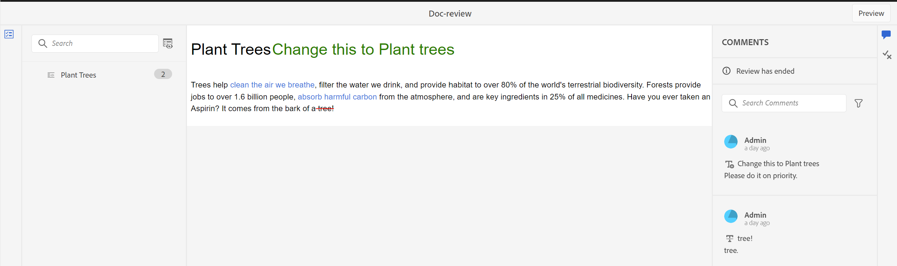
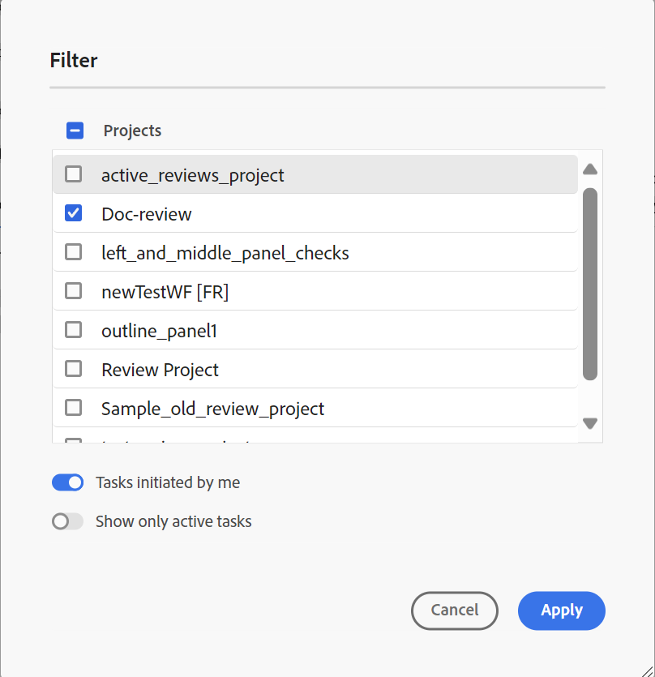
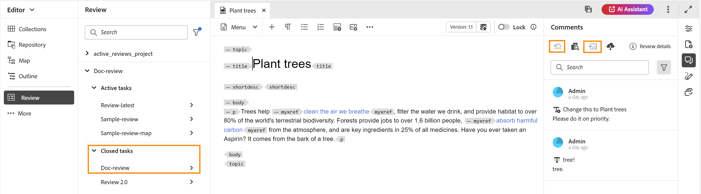

# 檢視完成的稽核任務

您可以為身為作者（或發起人）的專案完成稽核任務。 稽核任務完成後，您和所有稽核者都可以在唯讀模式下存取它。

## 作為稽核者

作為稽核者，您可以在評論面板中檢視指示器，以顯示稽核已結束。 註解工具列不會顯示，因此您無法反白、刪除線、插入文字或新增註解。 您可以讀取註解，但無法編輯或刪除任何註解。 您也無法新增回覆至註解。 您無法檢視內容工具列（用來反白或刪除任何文字）。 已過時的註解圖示也不會顯示在已完成的稽核任務中。

不過，您可以搜尋或篩選任何註解。 您也可以選擇顯示或隱藏條件，並據此顯示條件化內容。 您可以下載任何附件，但無法上載或刪除註釋的任何附件。

{width="800" align="left"}

## 作為作者

您可以在專案層級的&#x200B;**檢閱**&#x200B;面板中，從&#x200B;**已關閉的任務**&#x200B;區段檢視已完成的檢閱任務，如熒幕擷圖所示。 您可以根據專案搜尋或篩選稽核任務。 例如，您可以在&#x200B;**篩選器**&#x200B;對話方塊中選取特定專案，並將它們顯示在作用中檢閱面板中。 您可以使用由我起始的&#x200B;**工作**&#x200B;和&#x200B;**只顯示作用中工作**&#x200B;選項，進一步篩選結果。

{width="800" align="left"}

對於已關閉的稽核任務，您可以讀取註釋，但無法接受或拒絕註釋。 您無法編輯或刪除任何註解。 您也無法為該註解新增任何回覆。 對於已完成的稽核任務，不會顯示「過時的註解」圖示和「將註解匯入作者檢視」圖示。 如熒幕擷圖所示，回覆主題圖示和匯入圖示會在稽核任務完成後停用。

您也可以搜尋或篩選「檢閱」面板中出現的任何註解。 您可以下載任何附件，但無法上載或刪除註釋的任何附件。

{width="800" align="left"}

因此，無論是檢閱者還是作者，您都可以檢視檢閱內容以及註解，但您無法在已完成的檢閱任務中進行任何變更。
