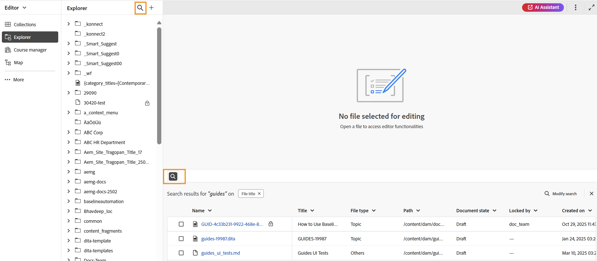
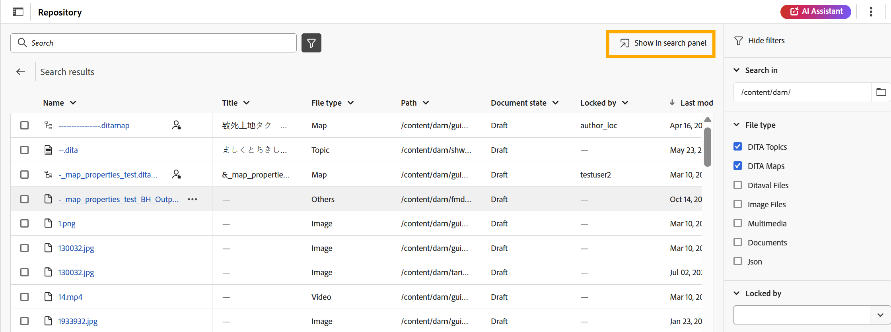
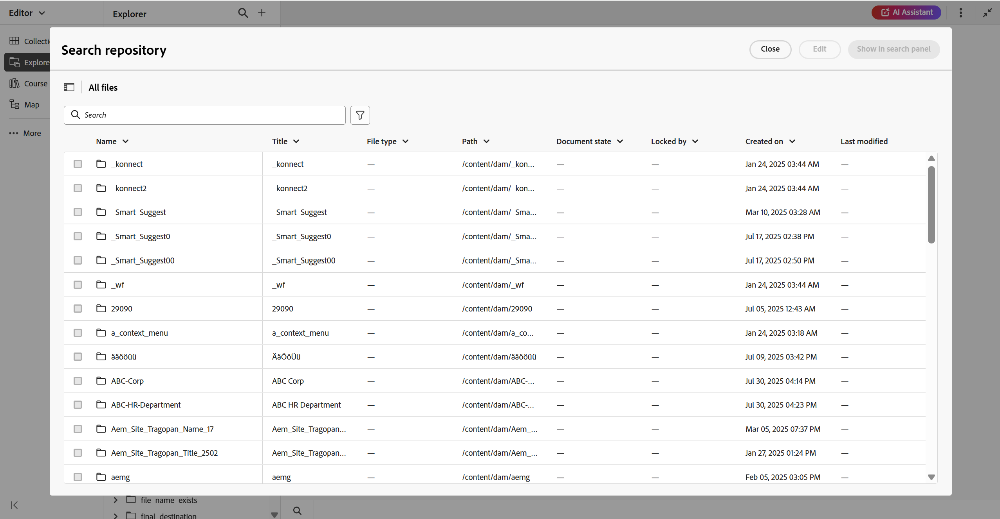
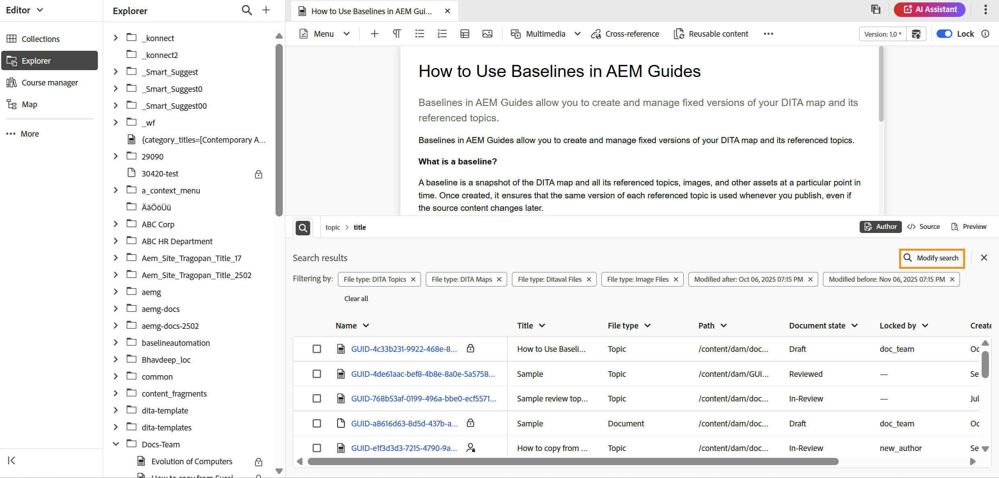
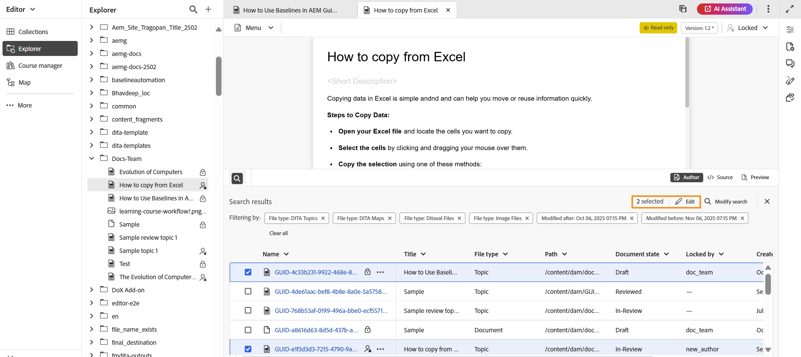
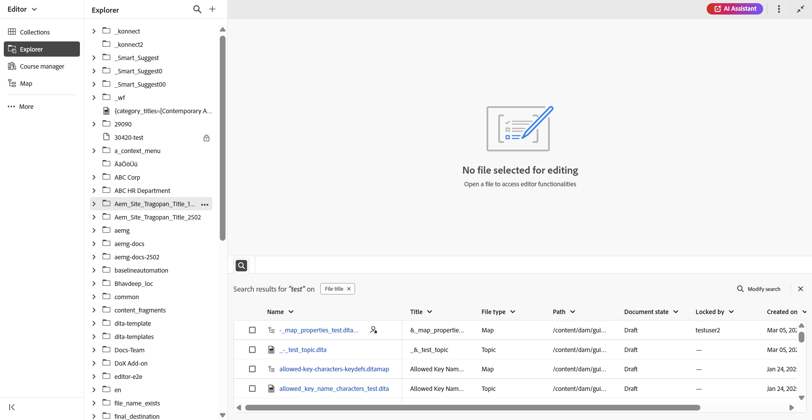

# 搜尋面板

編輯器中的「搜尋」面板可讓您快速存取檔案子集，在編輯內容時根據搜尋字詞或套用的篩選器顯示，藉此提高生產力。 它可協助您輕鬆開啟一或多個搜尋的檔案，或僅透過拖放至主題或地圖中，在現有檔案中使用這些檔案。 您可以在編輯器底部找到&#x200B;**搜尋面板**。

「搜尋」面板可從下列位置存取：

- **編輯器介面**：從&#x200B;**Explorer面板**&#x200B;選取&#x200B;**搜尋圖示**，或使用&#x200B;**內容編輯區域**&#x200B;左下角的&#x200B;**搜尋圖示**。 如需詳細資訊，請從Explorer面板檢視[搜尋](#search-from-the-explorer-panel)。

  {align="left"}

- **首頁**：從首頁的存放庫介面導覽時，使用&#x200B;**在搜尋面板中顯示**&#x200B;選項。 如需詳細資料檢視，[從存放庫搜尋](#search-from-the-repository-interface-on-the-home-page)。

  {align="left"}

## 主要優點

- 集中檢視所有搜尋結果，以方便參考。
- 拖放功能可將參照直接插入您目前的主題或地圖。
- 有彈性的選項，可在不離開編輯器的情況下修改或調整搜尋。

## 從Explorer面板搜尋

使用編輯器介面時，您可以篩選檔案集以檢視所需相關檔案的子集。 執行以下步驟以從Explorer搜尋檔案：

1. 從&#x200B;**Explorer面板**&#x200B;的右上角選取&#x200B;**搜尋**&#x200B;圖示，或選取&#x200B;**內容編輯區域**&#x200B;左下角的&#x200B;**搜尋**&#x200B;圖示。 這會開啟&#x200B;**搜尋存放庫**&#x200B;對話方塊，提供與首頁上的存放庫介面相同的搜尋和篩選體驗。

   >[!NOTE]
   >
   >如果目前工作階段已有某些搜尋結果，選取Explorer中的&#x200B;**搜尋圖示**&#x200B;或「內容」編輯區域左下角的圖示，即可開啟顯示先前結果的面板。 若要更新或調整搜尋，請選取&#x200B;**修改搜尋**。

   {align="left"}

2. 視需要執行搜尋並套用篩選器。 如需搜尋和篩選選項的詳細指示，請檢視[搜尋和篩選體驗](./home-page-repository-view.md#search-and-filter-experience)。

3. 搜尋完成後，請選取&#x200B;**在搜尋面板中顯示**。 您最近的搜尋會隨即顯示在編輯器底部的「搜尋」面板中。

   {align="left"}

4. 若要更新您的搜尋結果，請選取[搜尋]面板中的[修改搜尋] **選項，並更新條件以取得新結果。**

   {align="left"}

在「搜尋」面板中顯示搜尋結果後，您可以直接從面板開啟並編輯一或多個檔案，或將選取的檔案拖放到現有主題或地圖中來新增參照，以使用這些搜尋結果。

{align="left"}

## 從首頁的儲存區域介面搜尋

當您在首頁的存放庫介面中執行搜尋並套用篩選器時，選取&#x200B;**在搜尋面板中顯示**，會將您重新導向編輯器介面。 您的所有搜尋結果都會反映在編輯器介面底部的「搜尋」面板中。

從「搜尋」面板，您可以&#x200B;**拖放**&#x200B;個檔案到目前的主題中，以順暢地附加參照，或是同時編輯多個檔案。 此外，您可以使用「搜尋」面板中可用的&#x200B;**修改搜尋**&#x200B;選項來縮小搜尋結果。

{align="left"}

