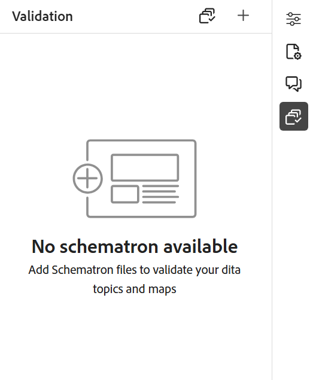
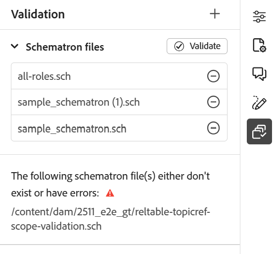
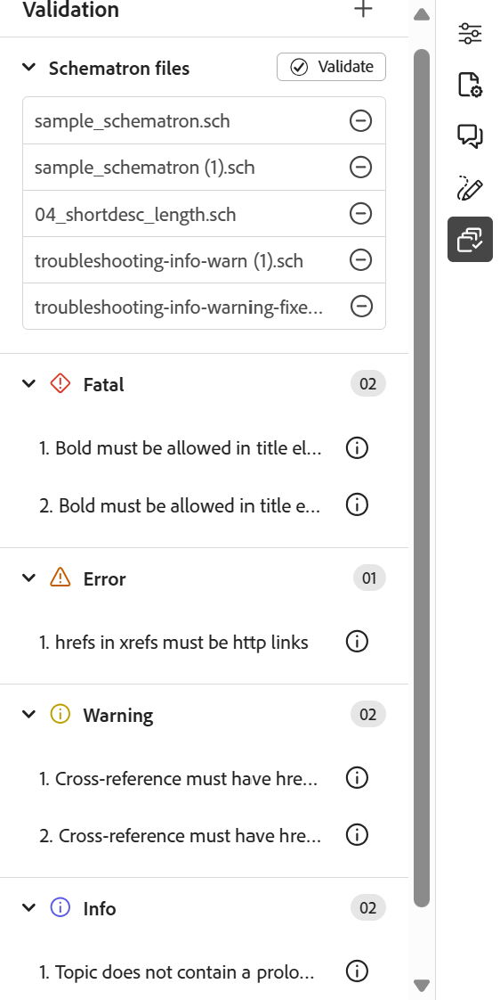

# 支援Schematron檔案

「Schematron」是指用於定義XML檔案測試的規則型驗證語言。 編輯器支援Schematron檔案。 您可以匯入Schematron檔案，也可以在編輯器中編輯它們。 使用Schematron檔案，您可以定義某些規則，然後針對DITA主題或地圖驗證這些規則。

>[!NOTE]
>
>編輯器支援ISO架構。

## 匯入Schematron檔案

執行以下步驟來匯入Schematron檔案：

1. 瀏覽至&#x200B;*存放庫*&#x200B;中的必要資料夾（您要上傳檔案的位置）。
1. 選取&#x200B;**選項**&#x200B;圖示以開啟內容功能表，然後選擇&#x200B;**上傳資產**。
1. 在&#x200B;**上傳資產**&#x200B;對話方塊中，您可以在&#x200B;**選取資產資料夾**&#x200B;欄位中變更目的地資料夾。
1. 選取&#x200B;**選擇檔案**&#x200B;並瀏覽以選取Schematron檔案。 您可以選取一或多個Schematron檔案，然後選取&#x200B;**上傳**。

## 使用Schematron驗證DITA主題或地圖

匯入Schematron檔案後，您可以在編輯器中編輯它們。 您可以使用Schematron檔案來驗證主題或DITA map。 例如，您可以為DITA map或主題建立下列規則：

* 已為DITA map定義標題。
* 已新增特定長度的簡短說明。
* 地圖中應至少有一個topicref。

在編輯器中開啟主題時，「架構驗證」面板會顯示在右側。 執行以下步驟，使用Schematron檔案新增並驗證主題或地圖：

{width="350"}

1. 選取結構描述圖示，開啟結構描述面板。
1. 使用&#x200B;**新增Schematron檔案**&#x200B;來新增Schematron檔案。

   >[!NOTE]
   >
   >新增無效的Schematron檔案時，「驗證」面板中會顯示錯誤訊息：

   {width="350"}

1. 如果Schematron檔案沒有錯誤，則會新增並列在「驗證」面板中。 對於包含錯誤的Schematron檔案，會顯示錯誤訊息。

   >[!NOTE]
   >
   >您可以使用Schematron檔案名稱附近的十字圖示來移除它。

1. 選取&#x200B;**驗證**，以使用新增的Schematron檔案來驗證主題。

   * 如果主題未破壞任何規則，則會顯示檔案的驗證成功訊息。
   * 如果主題破壞規則，例如，如果它不包含標題並為上述給定結構描述驗證，它會顯示驗證錯誤。

   >[!NOTE]
   >
   > 根據Schematron檔案中定義的角色屬性顯示驗證結果。 如需詳細資訊，請檢視[瞭解驗證結果和嚴重性層級](#understanding-validation-results-and-severity-levels)。

1. 選取錯誤訊息，在開啟的主題/地圖中反白顯示包含錯誤的元素。

編輯器中的Schematron支援可協助您根據一組規則來驗證檔案，並維護主題間的一致性和正確性。

## 瞭解驗證結果和嚴重性層級

根據Schematron檔案中定義的角色屬性顯示驗證結果。 問題會分類為`Fatal`、`Error`、`Warn`或`Info`，而「驗證」面板中的每個類別都有可見的計數。

{width="350"}

為了判斷問題的嚴重性，會評估在對應的Schematron檔案中定義的角色屬性的&#x200B;_區分大小寫_&#x200B;值。

下列程式碼片段顯示Schematron規則中定義的支援角色屬性值：

* `<sch:assert role="error" test="@id">Element must have an ID.</sch:assert>`
* `<sch:report role="info" test="not(@alt)">Image should have an alt attribute.</sch:report>`
* `<sch:assert role= "fatal" test="b"> Bold must be there in <sch:name/> element</sch:assert>`
* `<sch:assert role= "warn" test="b"> Recommended formatting is missing in <sch:name/> element</sch:assert>`

如果未指定role屬性，或使用了不支援的值，則問題會在「驗證」面板中分類為`Error`。 此行為也適用於未定義角色屬性的現有Schematron檔案；在這種情況下，所有問題都會分組到`Error`下。

**檔案儲存情境**

儲存檔案相依於&#x200B;**在[Workspace設定](../cs-install-guide/workspace-settings.md#validation)中儲存檔案**&#x200B;設定之前執行驗證檢查：

* 啟用後，在未解決`Fatal`或`Error`層級的問題之前，不允許儲存檔案。
* 停用時，即使出現`Fatal`或`Error`層級問題，也不會執行驗證檢查且可以儲存檔案。

## 使用判斷提示和報表陳述式來檢查規則{#schematron-assert-report}

Experience Manager Guides也支援Schematron中的判斷提示和報表陳述式。 這些陳述式可協助您驗證DITA主題。

### Assert陳述式

當測試陳述式評估為false時，判斷提示陳述式會產生訊息。 例如，如果您希望標題為粗體，可以為其定義判斷提示陳述式。

```XML
<sch:rule context="title"> 
    <sch:assert test = "b"> Title should be bold </sch:assert>
  </sch:rule>
```

當您使用結構描述驗證DITA主題時，您會收到標題不是粗體的主題訊息。

### 報表陳述式

當測試陳述式評估為true時，報表陳述式會產生訊息。 例如，如果您希望簡短說明少於或等於150個字元，可以定義報表陳述式，以檢查簡短說明超過150個字元的主題。

使用結構描述驗證DITA主題時，您會獲得規則完整的報告，其中報告陳述式的評估為true。 因此，您會收到一則主題訊息，其中簡短說明超過150個字元。

```XML
<sch:rule context="shortdesc"> 
        <sch:let name="characters" value="string-length(.)"/> 
        <sch:report test="$characters &gt; 150">  
        The short description has <sch:value-of select="$characters"/> characters. It should contain more than 150 characters.      
        </sch:report>   
    </sch:rule> 
```

>[!NOTE]
>
>寫入Schematron規則時只使用Xpath 2.0運算式。

## 使用規則運算式{#schematron-regex-espressions}

您也可以使用Regex運算式定義具有matches()函式的規則，然後使用Schematron檔案執行驗證。

例如，如果標題只包含一個單字，您可以使用它來顯示訊息。

```XML
<assert test="not(matches(.,'^\w+$'))"> 
No one word titles.
</assert>
```

## 定義抽象模式{#schematron-abstract-patterns}

Experience Manager Guides也支援Schematron中的抽象模式。 您可以定義一般抽象模式，重複使用這些抽象模式。  您可以建立指定實際模式的預留位置引數。

使用抽象模式可減少規則的重複，並更容易管理和更新驗證邏輯，藉此簡化您的Schematron方案。 它也能讓您的結構描述更易於理解，因為您可以在可在整個結構描述中重複使用的單一抽象模式中定義複雜的驗證邏輯。

例如，下列XML程式碼會建立抽象模式，然後實際模式會使用id來參照它。

```XML
<sch:pattern abstract="true" id="LimitNoOfWords"> 

<sch:rule context="$parentElement"> 

<sch:let name="words" value="string-length(.)"/> 

<sch:assert test="$words &lt; $maxWords"> 

You have <sch:value-of select="$words"/> letters. This should be lesser than <sch:value-of select="$maxWords"/>. 

</sch:assert>  

<sch:assert test="$words &gt; $minWords"> 

You have <sch:value-of select="$words"/> letters. This should be greater than <sch:value-of select="$minWords"/>. 

</sch:assert>  

</sch:rule> 

</sch:pattern> 

<sch:pattern is-a="LimitNoOfWords" id="extend-LimitNoOfWords"> 

<sch:param name="parentElement" value="title"/> 

<param name="minWords" value="1"/> 

<param name="maxWords" value="8"/> 

</sch:pattern> 
```

## 使用文位元組點內容定義規則

您可以定義具有文位元組點內容的Schematron規則，例如`context="//text()"`，讓規則直接根據文位元組點評估，而不是要求您列舉可以包含該文字的每個可能的DITA元素。

例如，下列規則會在主題文字中的任何位置標示直引號：

```XML
<sch:pattern id="quotation-marks-straight-v2">
  <sch:rule context="//text()">
    <sch:report role="info" test="contains(., '&quot;')">Please use typographic quotes instead of straight quotes.</sch:report>
  </sch:rule>
</sch:pattern>
```

當此規則符合時，驗證結果會指向觸發它的確切文位元組點，而不是僅指向結尾的元素。

使用明確元素內容（例如`context="//p"`）的規則會繼續如前一樣運作，而且您仍然可以使用任一方法，這取決於您想要的比對精確度和錯誤位置。
