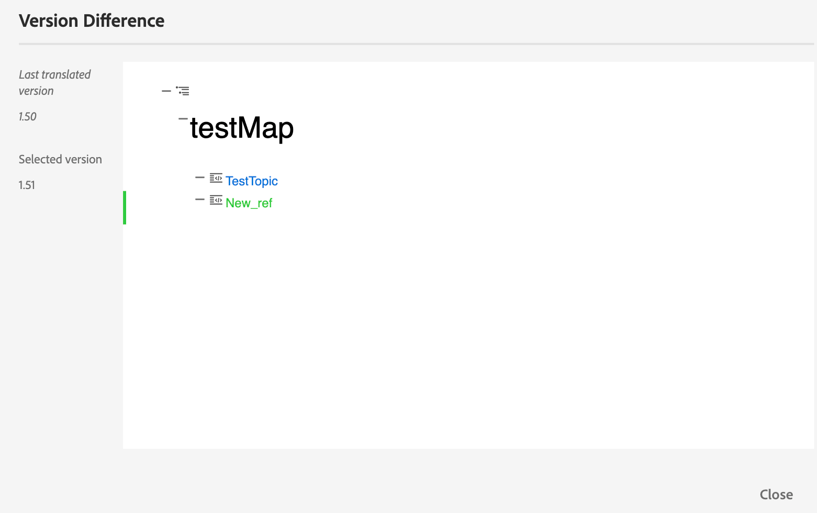

# 從網頁編輯器翻譯檔案 {#id21BKF0Z0YZF}

>[!TIP]
>
> 如果您已升級至AEM Guides 2022年2月as a Cloud Service版或更新版本，建議使用網頁編輯器的此翻譯功能。

AEM Guides在網頁編輯器中提供強大的功能，可讓您將內容翻譯成多種語言。 您可以建立新的翻譯專案，稍後再新增翻譯工作至現有的翻譯專案。 您也可以建立多語言翻譯專案，其中包含所有選定語言的翻譯工作。

>[!NOTE]
>
> 您的管理員可以在網頁編輯器中設定管理標籤\（用於翻譯\）。 如需詳細資訊，請參閱「安裝與設定Adobe Experience Manager Guides」as a Cloud Service中的&#x200B;*在Web編輯器設定翻譯功能*&#x200B;區段。

## 開始之前

在執行此程式中的步驟之前，請確定您已建立必要的語言根目錄和目標資料夾

1. 建立根資料夾以儲存您的來源內容。 根資料夾必須以語言名稱\（例如英文\）或語言代碼\(en\)建立。
1. 建立您要翻譯內容的目的地資料夾。 例如，如果您想要將內容翻譯成德文或法文，則必須建立名為 — de \（適用於德文\）或 — fr \（適用於法文\）的資料夾。

>[!NOTE]
>
> 根資料夾和目的地資料夾必須在相同層級建立。

## 建立翻譯專案

1. 在&#x200B;**存放庫**&#x200B;面板中，以地圖檢視開啟DITA map檔案。
1. 按一下「**管理**」標籤。 **翻譯面板**&#x200B;會顯示可用的語言群組。

1. 身為使用者，您可以檢視設定至資料夾設定檔的語言群組。 語言群組會顯示語言資料夾及其語言代碼。 例如，名為G1的語言群組包含義大利文\(it\)、德文\(de\)、法文\(fr\)和英文\(en\)語言資料夾。

   {width="300" align="left"}

   *選取您要翻譯檔案的語言群組或語言。*

   >[!IMPORTANT]
   >
   > 您只能選取並翻譯成您為其建立目標資料夾的語言，且平行於來源語言。 在任何其他層級建立的語言資料夾（例如從來源語言資料夾往下一個層級）也不會顯示。 請確定您建立的所有目標語言資料夾都與來源語言資料夾處於同一層級。

1. 您可以選取任何語言群組作為翻譯的目標。 如果您&#x200B;**選取全部**，則選取的檔案會翻譯成現有語言群組中的所有可用語言。

   語言資料夾選項會顯示為灰色，並顯示警告符號：

   - 如果缺少語言的目標資料夾。
   - 如果目標語言與來源相同。

   >[!NOTE]
   >
   > 如果您在建立語言群組之後建立語言的目標資料夾，請重新整理瀏覽器以啟用語言群組中的語言。

1. 如果您選擇特定語言，該語言會在您選取的所有語言群組下顯示為已選取。 因此，當您翻譯成任何語言時，所有語言群組都會一次性翻譯。 例如，如果德文同時存在於G1和G2語言群組中，則會同時選取德文。

1. 從&#x200B;**其他語言**&#x200B;中，您可以選擇已建立目標資料夾的任何語言，但不是任何語言群組的一部分。

1. 您也可以選取下列其中一個選項來翻譯專案：

   **無**&#x200B;選取此選項可翻譯檔案的預設版本。 依預設，會選取此選項。

   **使用基準線：**&#x200B;您可以選取基準線來翻譯專案。 按一下使用基準線，然後選擇在地圖上建立的基準線。 所有屬於所選「基準線」一部分的檔案都會顯示在「轉譯」頁面中。 翻譯內容後，即可匯出翻譯的「基準線」。 如需匯出已翻譯基準線的詳細資訊，請參閱[匯出已翻譯基準線](generate-output-use-baseline-for-publishing.md#id196SE600GHS)。

   **使用最新版本為**：選擇根據主題的建立日期和時間篩選主題的版本。 當您選取日期和時間時，只會顯示所選日期和時間當天或之前建立的最新版本檔案。

1. 按一下&#x200B;**套用**。 隨即顯示包含主題和相關資產詳細資訊的清單。
1. 選取您要傳送以進行翻譯的主題。 您也可以對下列欄位使用主題篩選選項：

   - **標題**：來源檔案的標題。  將滑鼠停留在來源檔案的標題上，即可檢視目標或翻譯檔案的標題。
   - **檔案名稱**：來源檔案的名稱
   - **檔案型別**：來源檔案的型別。 可用的選項包括地圖、主題和影像。
   - **參考型別**：直接或間接參考
   - **版本**：來源檔案的版本號碼
   - **版本標籤**：來源檔案所選版本的標籤
   - **目標版本**：目標檔案的版本號碼
   - **檔案狀態**：來源檔案的狀態。 可用的選項有「草稿」、「稽核中」和「已稽核」。
   - **目標語言**：您要翻譯來源檔案的語言
   - **翻譯狀態**：可用選項為：不同步、遺漏復本、進行中及同步中。
   - **目標標籤**：目標檔案所選版本的標籤
1. 按一下右上角的&#x200B;**傳送以進行翻譯**。

   {width="800" align="left"}

1. 從下拉式清單中，選取&#x200B;**建立新翻譯專案**。

   {width="350" align="left"}

   除了新的翻譯專案外，您也可以選取下列選項：

   - 您可以選擇&#x200B;**只為翻譯專案**&#x200B;建立結構。
   - 您可以選擇&#x200B;**建立新的XLIFF翻譯專案**，將XML內容轉換成XML本地化交換檔案格式(XLIFF)。 XLIFF是一種開放的XML型格式，用來標準化內容翻譯過程中使用的各種工具之間的資料傳輸。 AEM Guides支援XLIFF 1.2版。
在XLIFF專案中，內容會匯出為產業標準XLIFF格式，並提供給翻譯廠商。 XLIFF格式可讓您重複使用已在翻譯階段翻譯的區段。\
     翻譯XLIFF內容後，可將其匯入AEM Guides，建立原始DITA專案的翻譯版本。

     >[!NOTE]
     >
     > XLIFF匯出僅適用於人工翻譯設定。

   - 您可以選取&#x200B;**建立新的多語言翻譯專案**，其中包含您已選取要翻譯的所有語言的翻譯工作。 例如，如果您已選取法文、德文和西班牙文，則會建立一個專案，其中包含所有三種語言的翻譯工作。
   - 如果您已經有翻譯專案，您可以新增主題至該專案。 從「專案」清單中選取「新增至&#x200B;**現有翻譯專案**」選項，然後從「現有翻譯專案」清單中選擇專案。 您可以依照最近、升序或降序來排序這些專案。

     >[!NOTE]
     >
     > 如果您的現有專案是範圍專案，其名稱中會附加「\(Scoping\)」。

   - 如果您需要為要翻譯的專案建立範圍，可以選取&#x200B;**建立新的範圍設定翻譯專案**。 這不會傳送副本以供翻譯，並且會維護檔案的原始翻譯狀態。 對於為了設定範圍而傳送的參照主題，其目的地語言副本沒有影響。
1. 在「專 **案標題** 」欄位中，輸入專案標題。
1. 按一下&#x200B;**建立**&#x200B;以建立新的翻譯專案。

   新翻譯專案會以選取的主題版本建立。 此時，會顯示快顯訊息，確認已建立翻譯專案。 一旦所有目標語言副本在翻譯專案中可用，您會在收件匣中收到通知。 一旦翻譯專案中有目標語言副本可用，您就可以開始翻譯工作。 如需詳細資訊，請參閱[開始翻譯工作](translation-first-time.md#id225IK030OE8)。

   >[!NOTE]
   >
   > 如果您拒絕翻譯工作中一個或多個主題的翻譯，則所有已拒絕主題的&#x200B;**進行中**&#x200B;翻譯狀態將恢復為原始狀態。 參照主題的狀態會根據最新翻譯狀態檢查並回覆。 此外，在目標專案中建立的翻譯檔案不會被刪除，即使它們被拒絕翻譯。

## 新增翻譯規則

AEM Guides可讓管理員設定翻譯規則。 SRX （分段規則交換）格式是在不同使用者和不同翻譯環境之間交換分段規則的標準。 您可以建立資料夾並將自訂SRX檔案新增到資料夾中。

SRX檔案應該命名為`<language-code>.srx`。 例如，en-US或ar-AE。

>[!NOTE]
>標題不區分大小寫，因此您可以有&#39;en-US&#39;、&#39;en-us&#39;或&#39;EN-us&#39;。 此外，AEM Guides也可以解析&#39;-&#39; （連字型大小）或&#39;_&#39; （底線）。 因此，您可以有&#39;en-US&#39;或&#39;en_US&#39;。

此外，您可以將這些檔案放入AEM資產根目錄下的任何資料夾(`./content/dam`)中。

建立包含SRX檔案的資料夾後，您可以在資料夾設定檔的翻譯SRX位置設定中新增資料夾路徑。

建議您只將SRX檔案保留在資料夾設定檔中設定的資料夾中，以提升效能。

AEM Guides會根據翻譯專案的來源語言挑選SRX規則。 它會尋找某種語言的自訂SRX檔案，如果您未定義自訂SRX檔案，則會根據現成的翻譯規則挑選規則。

如需設定全域和資料夾層級設定檔的詳細資訊，請參閱安裝和設定Adobe Experience Manager Guidesas a Cloud Service中的&#x200B;*設定撰寫範本*&#x200B;區段。

## 將版本標籤傳遞至目標版本

AEM Guides可讓您將來源檔案的標籤傳遞至目標檔案。 這可協助您輕鬆識別翻譯檔案的來源版本。

若要在目標復本中新增來源版本標籤，您的系統管理員必須在&#x200B;**編輯器設定**&#x200B;的&#x200B;**翻譯**&#x200B;索引標籤下，選取選項&#x200B;**將來源版本標籤傳播到目標版本**。

例如，如果您有套用版本標籤`Release 1.0`的原始程式檔，那麼您也可以將原始程式標籤\(`Release 1.0`\)傳遞給轉譯的檔案。

{width="650" align="left"}

>[!NOTE]
>
> 來源標籤只會附加至一個目標版本。 如果您將來源標籤移動到另一個版本，它會自動反映在最新的目標標籤中。

## 檢視不同步檔案的版本差異 

AEM Guides提供的功能可檢查主題的所選版本與上次翻譯來源版本之間的差異。 您可以選擇根據所做的變更來翻譯&#x200B;**不同步**&#x200B;檔案。

{width="650" align="left"}

選取主題的&#x200B;**顯示差異**&#x200B;圖示\(\)，檢視上次翻譯版本與選取檔案目前版本之間的差異。

>[!NOTE]
>
> **顯示差異**&#x200B;圖示\(\)只會對翻譯狀態為&#x200B;**不同步**&#x200B;的DITA檔案顯示。

**版本差異**&#x200B;對話方塊就會顯示。 它會在左側顯示&#x200B;**上次翻譯版本**&#x200B;和&#x200B;**選取的版本**&#x200B;編號。 預覽視窗會顯示上次翻譯版本與所選主題版本之間的差異。

{width="650" align="left"}

## 關閉不同步的資產

若您變更部分資產，這些資產會變成「不同步」。 您可以重新翻譯修改的資產，或選擇關閉「不同步」狀態。 例如，如果您做了一些非常次要的變更，但其實不需要翻譯，您可以將它們的狀態標示為「同步中」。

若要關閉「不同步」狀態，請執行下列步驟：

1. 選取您要變更其狀態的不同步資產。
1. 選取頂端的&#x200B;**標示為同步**&#x200B;按鈕\(\)。 **標示為同步**&#x200B;對話方塊就會顯示。

   {width="550" align="left"}

1. 按一下&#x200B;**強制同步**。 它會針對選取的「不同步」資產，將狀態設定為「同步」。

>[!NOTE]
>
> **標示為同步**&#x200B;按鈕\(\)只會對翻譯狀態為「不同步」的資產顯示。

## 檢視地圖或主題的進行中翻譯專案

您的翻譯控制面板上的一些參考可能處於進行中狀態。 這些參考在&#x200B;**翻譯狀態**&#x200B;欄下有&#x200B;**進行中**&#x200B;連結。 當您按一下連結時，**進行中的專案**&#x200B;對話方塊會開啟。 在對話方塊中，您可以看到包含所選參考的所有進行中翻譯專案的清單\（連同目標語言\）。

>[!NOTE]
>
> 您可以在「進行中」連結中檢視在AEM Guides 2023年2月as a Cloud Service版本或更新版本中建立的翻譯專案。

在對話方塊中按一下參照的名稱，以在預覽模式中開啟它。 您也可以按一下翻譯專案以開始翻譯。

{width="550" align="left"}

## 自動刪除或停用已完成的翻譯專案

>[!NOTE]
> 
>此功能適用於您使用Experience Manager Guides 2404版本或更新版本建立的新翻譯專案。  這不會影響任何現有的專案。

您的管理員可以在&#x200B;**編輯器設定**&#x200B;中的&#x200B;**翻譯**&#x200B;索引標籤下設定&#x200B;**完成後翻譯專案清理**&#x200B;選項，以自動停用或刪除翻譯專案。

為了達到檔案管理效果，Experience Manager Guides提供在完成翻譯後刪除翻譯專案的功能。

您也可以停用翻譯專案，以便稍後使用。 刪除專案會刪除專案中存在的所有檔案和資料夾。 停用專案並不會刪除專案，而是將其保留在存放庫中。 但您無法更新或編輯已停用的專案。  刪除或停用專案不會影響任何參考的翻譯狀態。

**上層主題：**[&#x200B;使用網頁編輯器](web-editor.md)
