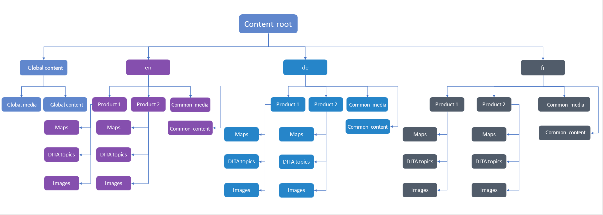

# 內容翻譯的最佳實務 {#id1678G0S702F}

翻譯內容時請考慮以下幾點：

- 資料夾和檔案名稱必須符合檔案命名標準，例如 — 不應有空格、單引號、大括弧、等號、特殊或非ASCII字元。

- 如果您翻譯不同語言的內容，則必須建立與每種語言對應的資料夾。 每個語言資料夾都會包含對應於該語言的內容。 例如，您可以使用語言指示項建立資料夾，例如`de`代表德文，`fr`代表法文等等。 或者，您可以使用語言和區域指示項(例如`fr-FR`代表法文（如法國所用）或`fr-CA`代表法文（如加拿大所用）來建立資料夾。
- 目標語言也應該根據執行個體上的目標語言資料夾選取實際地區設定。
- 雲端設定應與來源資料夾的雲端設定相同，且一個資料夾中應只有一個雲端設定。 如果要使用多個翻譯聯結器，您可以在/conf下建立多個資料夾。
- 資料夾中的檔案不應超過1000個。
- 確保負責啟動翻譯流程的使用者擁有來源和目標語言資料夾的讀取、修改、建立及刪除許可權。
- 由於翻譯內容需要建立翻譯專案，因此使用者必須擁有在Adobe Experience Manager中建立專案的存取權。
- 如果要將條件預設集與地圖搭配使用，您必須在啟動翻譯程式之前建立它們。 由於「條件預設集」也隨附在翻譯版本的地圖中，因此在啟動翻譯程式之前建立預設集可確保它們在翻譯版本中可用。
- 內容翻譯程式必須從DITA map主控台(而非Adobe Experience Manager Assets UI)啟動。
- 如果您透過人工翻譯來翻譯內容，則不得使用元件式DITA翻譯工作流程。 不過，此選項必須用於機器翻譯。
- 全球使用的內容與媒體若不需要本地化，應避免使用語言副本。
- 所有必須本地化的通用內容都應儲存在語言資料夾下的通用資料夾中。

下圖顯示當您全域使用內容和三個語言副本時，Adobe Experience Manager中的資料夾結構範例。

{align="left"}

## 設定翻譯服務

執行以下步驟，設定要使用的人工或機器翻譯服務：

1. 在Assets UI中，選取來源語言資料夾。

1. 開啟資料夾屬性，然後前往&#x200B;**雲端服務**&#x200B;標籤。

1. 在&#x200B;**雲端服務**&#x200B;索引標籤中，設定您要使用的翻譯服務。

   您可以設定機器翻譯或人工翻譯。

   確保一個資料夾中只有一個轉譯聯結器的設定。 如果有多個翻譯聯結器，可在/conf下建立多個資料夾。 在開始翻譯程式之前，來源語言資料夾必須選取雲端設定。

   >[!NOTE]
   >
   > 檢視Adobe Experience Manager檔案中的[設定翻譯整合架構](https://experienceleague.adobe.com/docs/experience-manager-cloud-service/sites/administering/reusing-content/translation/integration-framework.html?lang=zh-Hant)，以取得有關與協力廠商翻譯服務整合的詳細資訊。

1. 選取&#x200B;**儲存並關閉**&#x200B;以儲存更新的資料夾屬性。

## 開始翻譯工作 {#id225IK030OE8}

執行以下步驟以開始翻譯工作：

1. 在&#x200B;**專案**&#x200B;主控台中，導覽至您為本地化所建立的專案資料夾。

1. 選取本地化專案以開啟詳細資訊頁面。

1. 選取&#x200B;**翻譯工作**&#x200B;方塊上的箭頭，然後從清單中選取&#x200B;**開始**&#x200B;以開始翻譯工作流程。

   >[!NOTE]
   >
   > 如果您使用人工翻譯服務，則需要匯出內容以供翻譯。 取得翻譯內容後，您需要將其匯入回翻譯專案。

1. 若要檢視翻譯工作的狀態，請選取&#x200B;**翻譯工作**&#x200B;拼貼底部的省略符號。

翻譯完成後，翻譯工作的狀態會變更為&#x200B;*準備好檢閱*。 若要完成翻譯程式，您必須在「專案」主控台的「翻譯工作」方塊中，接受翻譯的復本和資產中繼資料。 如果要開始新的翻譯專案，請檢視[建立翻譯專案](translate-documents-web-editor.md#create-a-translation-project)。

>[!NOTE]
>
>- 如果您拒絕翻譯工作中一個或多個主題的翻譯，則所有已拒絕主題的&#x200B;**進行中**&#x200B;翻譯狀態將恢復為原始狀態。 參照主題的狀態會根據最新翻譯狀態檢查並回覆。 此外，即使拒絕在目標語言資料夾中建立的翻譯檔案，也不會刪除這些檔案。
>- 如果您拒絕、刪除或取消出現在多個專案（針對任何一個專案）中的主題的翻譯工作，則不會還原該主題的&#x200B;**進行中**&#x200B;翻譯狀態，但會從該指定資產的&#x200B;**進行中**&#x200B;專案清單中移除該專案。
>- 此外，如果您取消或刪除翻譯工作或刪除整個專案，**進行中**&#x200B;的翻譯狀態將恢復為原始狀態。

**上層主題：**&#x200B;[&#x200B;內容翻譯概觀](translation.md)
