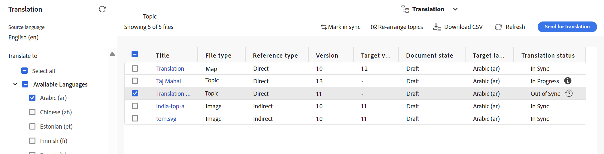

# 翻譯修改的主題 {#id16A5A0B6072}

如果您對某些主題進行了更改，則需要重新翻譯這些主題。 您可以從DITA map追蹤修改的主題。 從來源語言副本資料夾中，從「對映控制檯」中選取DITA map檔案，然後選取翻譯索引標籤。 您可以檢視每個主題的狀態，無論是否需要重新翻譯。

執行以下步驟，傳送已修改的主題以供重新翻譯：

1. 從編輯器中的&#x200B;**Map主控台**&#x200B;的來源語言復本資料夾中選取DITA map檔案。

1. 選取&#x200B;**翻譯**&#x200B;索引標籤。

1. 在左側的&#x200B;**翻譯**&#x200B;面板中，選取您要檢查其狀態的&#x200B;**可用語言**，並選取&#x200B;**套用**。

   您可以檢視每個主題的翻譯狀態。 有其他修訂版主題可供翻譯的主題顯示&#x200B;**不同步**&#x200B;狀態。

   >[!NOTE]
   >
   > 翻譯工作流程會比較來源語言資料夾中主題檔案上次儲存的修訂版本與翻譯版本。

   如果您選取箭頭來檢視進一步的詳細資訊，則可以檢視不同步的特定語言副本。

   {width="800" align="left"}

1. 選取核取方塊以選取您要傳送以供重新翻譯的主題。

   當您選取不同步主題時，標題列上方會出現&#x200B;**標示為同步**&#x200B;按鈕。

   您可以使用&#x200B;**標籤為同步**&#x200B;按鈕覆寫DITA map中主題的「不同步」狀態。  例如，如果您做了一些非常次要的變更，但其實不需要翻譯，您可以將它們的狀態標示為「同步中」。

   >[!NOTE]
   >
   > 如果您選取「**標示為同步**」按鈕，它會將選取的「不同步」主題的主題狀態設定為「同步」。

1. 您可以選取&#x200B;**傳送以進行翻譯按鈕**。

1. 您可以選擇建立新的翻譯專案，或將主題新增至現有的翻譯專案。 提供設定翻譯專案所需的詳細資訊。

1. 選取&#x200B;**提交**。

   系統會顯示確認訊息，指出已傳送主題以供翻譯。

1. 導覽至專案主控台中的翻譯專案。 新的翻譯工作卡片會建立在資料夾中。 選取省略符號即可檢視資料夾中的資產。

   {width="300" align="left"}

1. 若要開始翻譯，請選取翻譯工作卡片上的箭頭，然後從清單中選取&#x200B;**開始**。 訊息會通知工作已開始。

   選擇翻譯工作卡片底部的省略符號時，您還可以檢視正在翻譯的主題的狀態。

   >[!NOTE]
   >
   > 如果您使用人工翻譯服務，則需要匯出內容以供翻譯。 取得翻譯內容後，您需要將其匯入回翻譯專案。

1. 翻譯完成後，狀態會變更為&#x200B;**準備檢閱**。 選取省略符號以檢視主題詳細資訊，並從工具列執行下列任一項作業：

   - 選取&#x200B;**在Assets中顯示**&#x200B;以檢視及驗證翻譯。

   - 如果您認為變更已正確翻譯，請選取&#x200B;**接受翻譯**。 隨即顯示確認訊息。

   - 如果您認為需要重新完成工作，請選取&#x200B;**拒絕翻譯**。 系統會顯示拒絕訊息。

   >[!NOTE]
   >
   > 請務必接受或拒絕翻譯的資產，否則檔案會停留在暫存位置，不會複製到DAM。

1. 在Assets UI中導覽回來源語言資料夾中的DITA map檔案。 重新翻譯的主題現在已同步。

**上層主題：**[&#x200B;內容翻譯概觀](translation.md)
