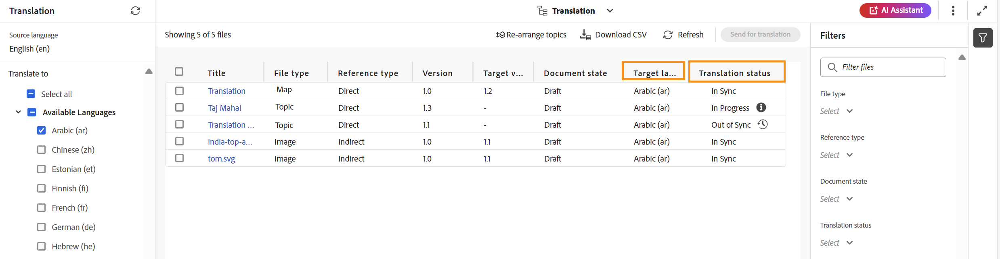

# 檢視翻譯狀態 {#id169SEK00KOW}

您可以在DITA map中檢視每個主題的翻譯狀態和翻譯的語言副本。

執行以下步驟來檢視DITA map的轉譯狀態：

1. 透過編輯器中的&#x200B;**Map主控台**&#x200B;瀏覽至必要的DITA map檔案。
1. 選取&#x200B;**翻譯**&#x200B;索引標籤。
1. 在左側的&#x200B;**翻譯**&#x200B;面板中，從您要檢查狀態的&#x200B;**可用語言**&#x200B;清單中檢查語言，並選取&#x200B;**套用**。
1. 所有目標語言為選取的主題都會與   翻譯狀態。

   >[!NOTE]
   >
   > 您可以根據內容的翻譯狀態\（如不同步、缺少副本、進行中或同步\）、Source型別\（如全部、DITA、DITA map或資源\）和修改日期來進一步篩選內容。 此外，您可以輸入關鍵字來搜尋特定主題。 如果已進行任何變更，您可以使用&#x200B;**重新整理**&#x200B;來更新狀態。

   {width="800" align="left"}

**上層主題：**[&#x200B;內容翻譯概觀](translation.md)
