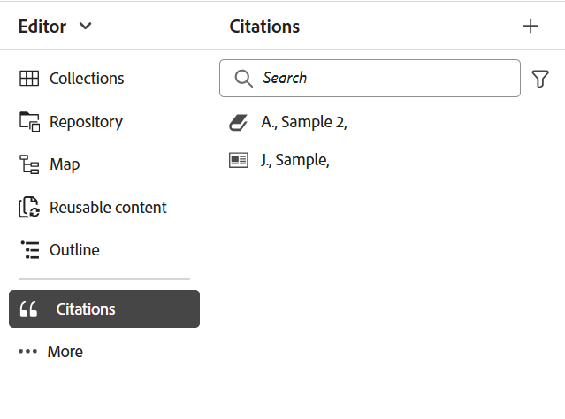
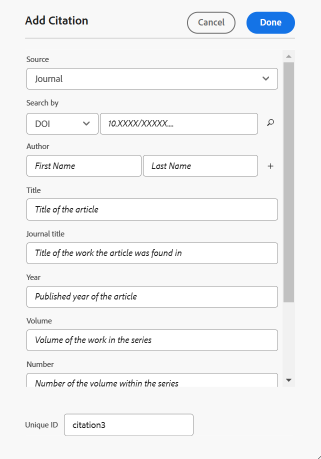
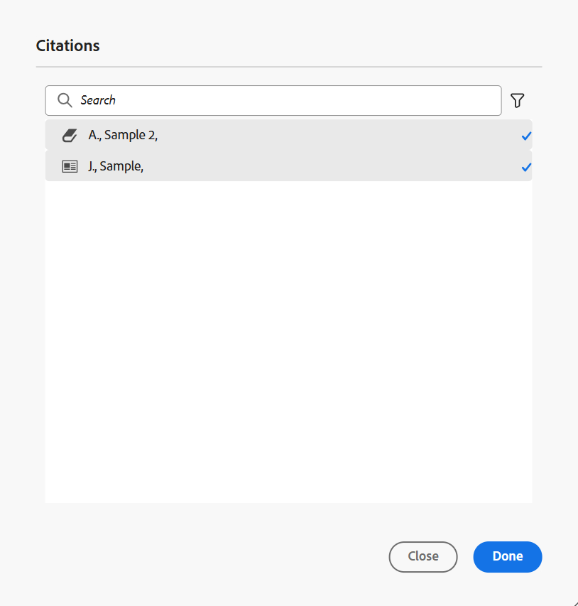
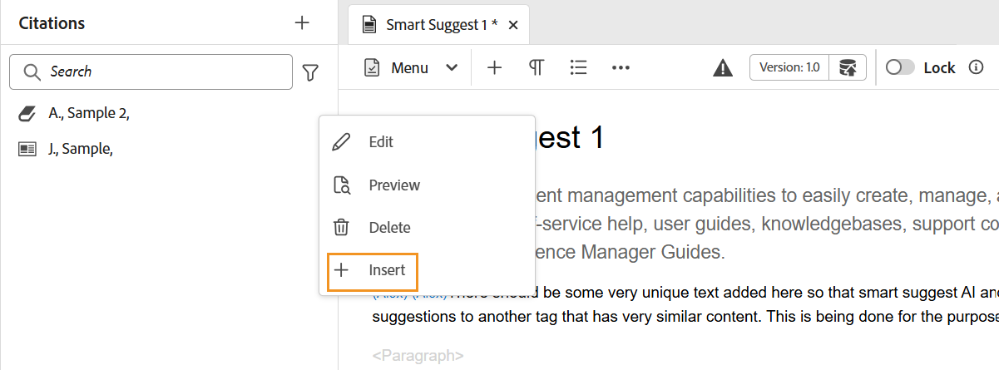
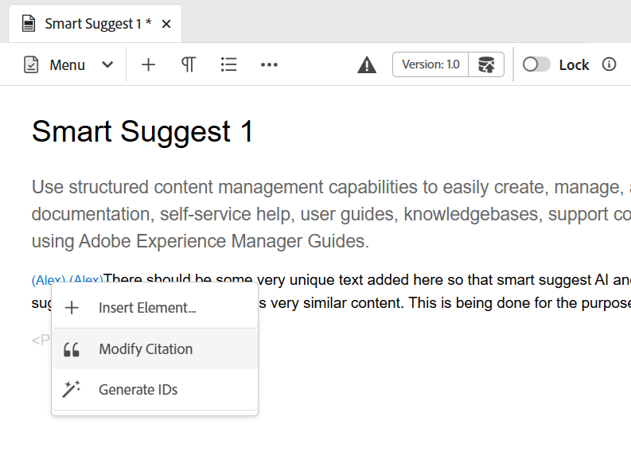

# 新增和管理內容中的引文

引文是新增至內容之資訊來源的參考。 使用引文，您可以為來源資訊的作者評分，並幫助讀者追蹤來源資訊。 新增引文可讓您的內容更可靠，並防止剽竊。 它們也可讓您顯示經過充分研究的內容。

在Adobe Experience Manager Guides中，您可以新增和匯入引文，並將其套用至您的內容。 您可以從任何書籍、網站和分錄來源新增這些引文。

Experience Manager Guides可協助您編輯、預覽和排序您的引用。 將引文新增至內容後，您可以使用原生PDF產生輸出。 您也可以在原生PDF輸出中新增目錄或參考頁面。

Experience Manager Guides支援多種型別的引用，例如現代語言協會(MLA)、美國心理協會(APA)、芝加哥、電氣和電子工程師協會(IEEE)和美國心臟協會(AHA)。 建議清晰且一致地使用這些量度。

>[!NOTE]
>
>目前Experience Manager Guides僅支援原生PDF的引文功能。

## 新增引文

若要新增引文，請執行下列步驟：

1. 選取左側面板中的&#x200B;**引文** 圖示。

   **引文**&#x200B;面板隨即開啟。

   {width="350" align="left"}

1. 在&#x200B;**引文**&#x200B;面板中，選取。 從下拉式清單中，您可以選擇新增引文或匯入引文。

1. 選取&#x200B;**新增引文**&#x200B;以新增引文。

   **新增引文**&#x200B;對話方塊開啟。

   網頁編輯器中的 {width="300" align="left"}

1. 填寫&#x200B;**新增引文**&#x200B;對話方塊中的欄位。

   >[!NOTE]
   >
   >您也可以新增ISBN、DOI或PubMed ID。 AEM Guides會自動填入其他欄位。

   | 書冊 | 網站 | 日誌 |
   | --- | ---|---|
   | **Source**  從下拉式清單中，選取引文來源作為「書冊」。 | **Source** &#x200B;從下拉式清單中，選取網站引文的來源。 | **Source**  從下拉式清單中，選取引文來源作為日誌。 |
   | **搜尋依據**  從下拉式清單中選取&#x200B;**ISBN**&#x200B;或&#x200B;**DOI**，以搜尋連結至引文的數位識別碼。    DOI：數位物件識別碼  ISBN：唯一數值簿識別碼 | **搜尋依據**  從下拉式清單中選取&#x200B;**DOI**&#x200B;以搜尋連結至引文的數位識別碼。 | **搜尋依據**  從下拉式清單中選取&#x200B;**DOI**&#x200B;或PubMed ID，以搜尋連結至引文的數位識別碼。     |
   | **作者**  新增引文作者的名字和姓氏。 選取以新增更多名稱。 | **作者**  新增引文作者的名字和姓氏。 選取以新增更多名稱。 | **作者**  新增引文作者的名字和姓氏。 選取以新增更多名稱。 |
   | **標題**  新增書名。 | **標題**  新增網頁的標題。 | **標題**  新增文章標題。 |
   | **編輯者**  新增書籍的編輯者。 | **網站名稱**  新增網站名稱。 | **日誌標題**  新增找到文章的工作標題。 |
   | **版本**  新增書籍的版本。 | **URL**  新增網站的網頁連結以瀏覽內容。 | **年**  新增文章發佈的年份。 |
   | **城市**  新增出版物的城市。 | **存取日期** &#x200B;新增存取網站內容的日期。 | **磁碟區**  新增系列中的工作磁碟區。 |
   | **發行者**  新增書籍的發行者名稱。 | **發佈日期**  新增網站內容發佈的日期。 | **數字**  新增陣列中的磁碟區數目。 |
   | **年**  新增出版書籍的年份。 | **更新日期**  新增更新網站內容的日期。 | **頁面**  新增找到文章的頁碼或頁面範圍。 |
   | **版本**  新增書冊的版本。 | **唯一識別碼**  為引文新增唯一識別碼。 唯一ID是該引文的唯一識別碼。 | **URL**  新增網頁連結至日誌。 |
   | **系列**  新增書籍系列。 |  | **唯一識別碼**  為引文新增唯一識別碼。唯一識別碼為該引文的唯一識別碼。 |
   | **URL**  將網頁連結新增到書冊。 |  |  |
   | **唯一識別碼**  為引文新增唯一識別碼。 唯一ID是該引文的唯一識別碼。 |  |  |

1. 選取「**完成**」。

   新的引文會新增至「引文」面板。

>[!NOTE]
>
> 必須為引文欄位新增唯一ID。  在新增引文後，您就無法變更唯一ID。

## 匯入引用

若要匯入引文，請執行下列步驟：

1. 在左側面板中，選取&#x200B;**引文** 。

   **引文**&#x200B;面板隨即開啟。

1. 在&#x200B;**引文**&#x200B;面板中，選取，然後從下拉式清單中選取&#x200B;**匯入**。
1. 從您的系統瀏覽.bib檔案並匯入它。

   >[!TIP]
   >
   > .bib副檔名是BibTeX書目資料庫檔案。 它是特別格式化的文字檔，列出特定資訊來源的參照。

   成功匯入檔案後，您即可在引用面板中檢視參照。

   >[!NOTE]
   > <ol><li> Experience Manager Guides只會匯入不重複且不存在的引用。
   > &gt; <li> Experience Manager Guides可以從書籍、日誌或網站匯入引用。 目前不支援其他來源的引文。

## 管理引文

引文在左側面板中按字母排序。 根據主題中使用的來源搜尋引文。

### 篩選器

選取搜尋列旁的&#x200B;**篩選器** 圖示，並從下拉式清單中選取來源選項以篩選引文清單。 它允許單一和多重選取。

* **所有來源**：它會顯示完整的引用清單，包括所有來源。

* **書冊**：它會顯示來自書冊的引文清單。

* **網站**：它會顯示來自網站的引文清單。

* **日誌**：它顯示來自日誌的引文清單。

### 搜尋

搜尋您內容的引文。

1. 在左側面板中，選取「引文」。
**引文**&#x200B;面板隨即開啟。

1. 使用搜尋列從長清單中搜尋適當的引文。

### 變更引文樣式 {#change-citation-style}

您的系統管理員可以從&#x200B;**設定**&#x200B;中&#x200B;**一般**&#x200B;索引標籤的&#x200B;**引文**&#x200B;下拉式清單中變更引文樣式。
這些樣式決定引文在預覽窗格或原生PDF輸出中的顯示方式。

下拉式清單中有以下選項：

| MLA | APA | 芝加哥 | IEEE | AHA |
|---|---|---|---|---|
| 現代語言關聯樣式  | 美國心理協會風格 | 芝加哥風格手冊 | 電氣與電子工程師風格協會 | 美國心臟協會風格 |
| 範例：  Crawford， Claire等 *黑暗記憶的情感內容*。Edited by Memory， vol 16， 2010， Amsterdam。 | 範例：   Crawford， C.， J.， &amp;， C. (2010)。 *黑暗記憶的情感內容* （505-16版本）。 10.1080/09658210902067289 | 範例：   Crawford， Claire等 *黑暗記憶的情感內容*。 505-16， 2010。 | 範例：   C. Crawford， J. and C. ， *黑暗記憶的情感內容*。 阿姆斯特丹，2010年。 | 範例：   C. Crawford， J. and C. ， *黑暗記憶的情感內容*。 阿姆斯特丹，2010年。 |

## 編輯引文

若要編輯引文，請遵循下列步驟：

1. 將滑鼠懸停在清單中的引文名稱上。 選取 **選項**&#x200B;圖示。

1. 選取&#x200B;**編輯**。

**編輯引文**&#x200B;對話方塊開啟。

1. 進行必要的變更。 選取&#x200B;**完成**。
所選引文即會編輯。

>[!NOTE]
>
>在新增引文後，您就無法變更唯一ID。

## 預覽引用

若要預覽引文，請執行下列步驟：

將滑鼠懸停在清單中的引文名稱上。 選取      **選項**&#x200B;圖示。

1. 選取&#x200B;**預覽**。
您可以在預覽窗格中預覽引文的內容和格式。

   >[!NOTE]
   >
   >預覽是根據您的管理員在&#x200B;**設定**&#x200B;中選取的引文樣式。

1. 選取熒幕上的任意位置以關閉預覽方塊。

   {width="550" align="left"}

>[!NOTE]
>
> 您也可以從Assets UI或編輯器的預覽索引標籤，預覽主題中插入的引文。

## 插入引文

執行以下步驟，將引文插入主題：
1. 在存放庫面板中選取主題，然後按兩下以在編輯視窗中開啟主題。
1. 將游標放在要新增引文的主題位置。

您可以從主工具列或左側面板將引文插入主題。

### 從主工具列

1. 選取主工具列中的&#x200B;**引文** 圖示。
1. 在&#x200B;**引文**&#x200B;對話方塊中，選擇引文。 您也可以選取多個引文。
   {width="300" align="left"}
1. 您可以在&#x200B;**引文**&#x200B;對話方塊的搜尋面板中輸入前幾個字母來篩選引文。

1. 選取&#x200B;**完成**。
所選引文會新增至主題中的游標位置。

### 從左側面板

>[!NOTE]
> 
>若要從左側面板檢視&#x200B;**引用**&#x200B;圖示，您的系統管理員必須在&#x200B;**設定**&#x200B;的&#x200B;**面板**&#x200B;索引標籤中啟用&#x200B;**引用**&#x200B;選項。

1. 在左側面板中選取&#x200B;**引文** 圖示。
1. 從「**引文**」面板拖曳引文，並將其放置在主題中的適當位置。

   您也可以從&#x200B;**&#x200B;**&#x200B;選項中選取&#x200B;**插入**&#x200B;以插入引文。

   
1. 若要選取多個引文，請在主題中的引文上按一下滑鼠右鍵，然後從捷徑功能表中選取&#x200B;**修改引文**。
1. 從&#x200B;**引文**&#x200B;對話方塊中選取您要插入的引文。
1. 選取&#x200B;**完成**&#x200B;以新增至主題。

在主題中插入引文後，您可以在網頁編輯器中預覽它們。 您也可以使用原生PDF發佈引文內容。

## 刪除引文

您可以從「引文」面板或您已插入的主題中刪除引文。

### 從「引文」面板刪除引文

若要從「引文」面板中刪除引文，請執行下列步驟：

1. 將滑鼠懸停在清單中的引文名稱上。
1. 選取 **選項**&#x200B;圖示。
1. 選取   **刪除** 。
確認對話方塊開啟。
1. 選取&#x200B;**是**。
選取的引文會從引文面板中刪除。

### 從主題刪除引文

若要刪除主題中已使用的引文，請執行下列步驟：

在主題中，將游標放在引文的結尾。

1. 在主題中的引文上按一下滑鼠右鍵，然後從捷徑功能表中選取&#x200B;**修改引文**。 「引文」對話方塊開啟。
   

1. 您可以選擇要插入檔案的引文。

   >[!NOTE]
   >
   >主題中已使用的引文會取代為您從對話方塊中選取的引文。

1. 選取「**完成**」。

## 產生含有引文的內容輸出

在主題中插入引文後，您可以使用原生PDF發佈包含引文的內容。

在原生PDF輸出中，引文會出現在您已插入的內容中。 您也可以建立「書目」頁面。 當您選取引文時，系統會將您重新導向至書目頁面。

在PDF範本中建立&#x200B;**引文**&#x200B;頁面配置，並將其包含在您的檔案中。 書冊中使用的所有引文都會列在PDF輸出中顯示的單一頁面上。 若要深入瞭解如何建立版面配置，請檢視[建立版面配置](../native-pdf/components-pdf-template.md#create-page-layout)。

若要變更引文頁面的檢視與風格，請檢視[自訂PDF範本](../native-pdf/pdf-template.md)。

### 將內容樣式套用至引文

新增至主題時，套用格式至引文。

1. 在Native PDF輸出預設集的&#x200B;**範本**&#x200B;面板中選取&#x200B;**樣式表**。   它會開啟包含所有樣式選項的&#x200B;**樣式**&#x200B;面板。

1. 在[搜尋]面板中搜尋`<cite>`。

若要深入瞭解樣式，請檢視[使用常見的內容樣式](../native-pdf/stylesheet.md)。
