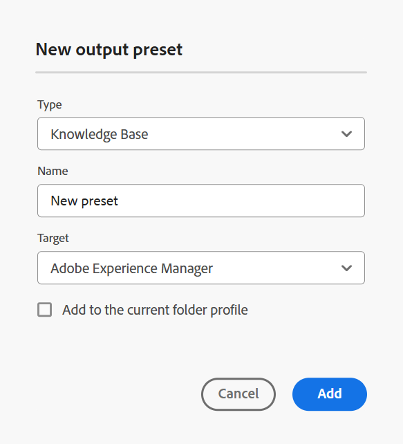
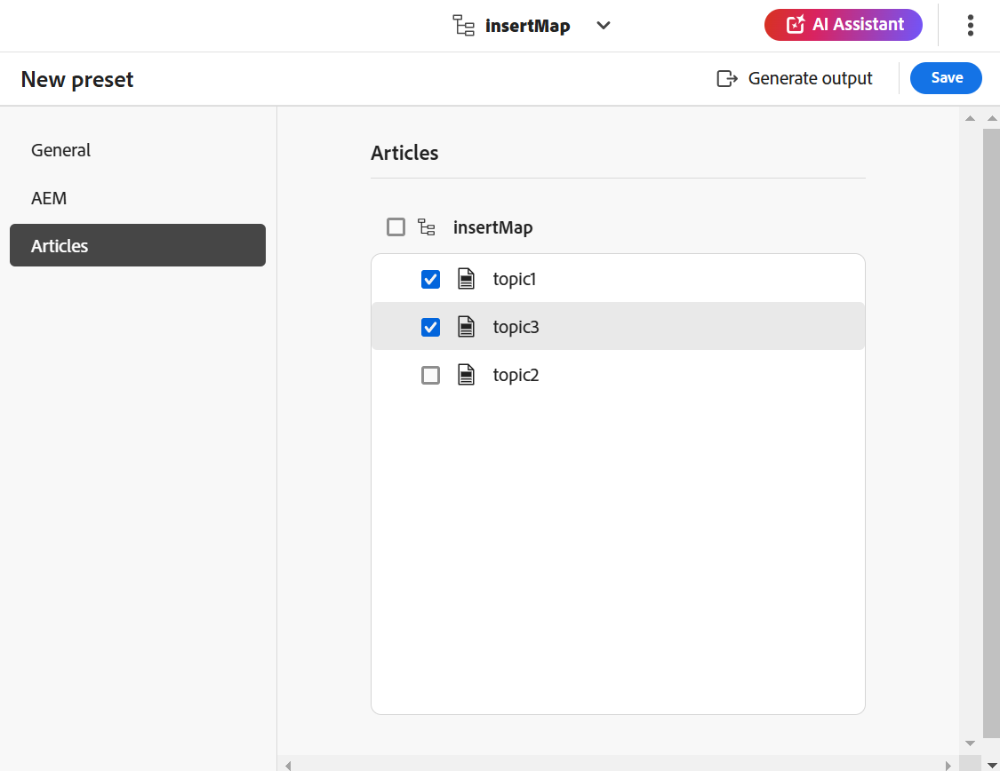
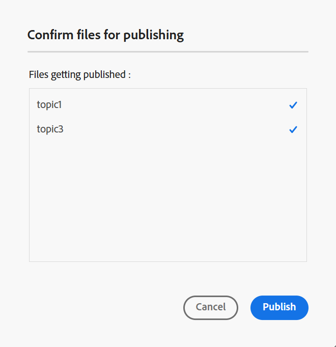
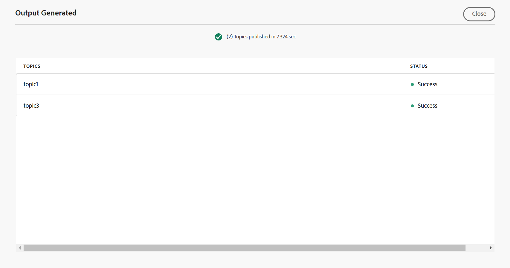

# 從編輯器建立知識庫的輸出預設集 {#id218CL400JW3}

執行以下步驟來建立DITA map的輸出預設集：

1. 在Assets UI中，導覽至您要編輯的地圖檔案。

1. 若要取得對應檔的獨佔鎖定，請選取對應檔，然後選取&#x200B;**簽出**。

1. 從地圖檔案的動作選單中選取&#x200B;**編輯主題**&#x200B;選項。

   將在編輯器中開啟對應檔案以進行編輯。

   >[!NOTE]
   >
   > 您可以使用進階地圖編輯器在地圖中新增或刪除任何主題。 如需詳細資訊，請檢視[使用進階地圖編輯器](map-editor-advanced-map-editor.md#)。

1. 選取&#x200B;**在地圖主控台中開啟**&#x200B;圖示。 地圖會在地圖主控台中開啟。

1. 導覽至&#x200B;**輸出預設集**&#x200B;標籤，並選取+圖示以建立DITA map的輸出預設集。

1. 從&#x200B;**型別**&#x200B;下拉式清單中選取&#x200B;**知識庫**，輸入名稱，並在&#x200B;**新增輸出預設集**&#x200B;對話方塊中選取&#x200B;**Adobe Experience Manager**。
1. 選取&#x200B;**新增至目前的資料夾設定檔**&#x200B;選項，為目前的資料夾設定檔建立輸出預設集。 圖示表示資料夾設定檔層級預設集。

   深入瞭解[管理全域和資料夾設定檔輸出預設集](./web-editor-manage-output-presets.md)。

1. 選取「**新增**」。

   會建立知識庫預設集。

   {align="left"}

建立預設集後，即可產生特定知識庫文章的輸出。 若要這麼做，請導覽至&#x200B;**文章**&#x200B;標籤，並選取您要產生輸出的主題。
1. 選取頂端的&#x200B;**產生輸出**&#x200B;以產生輸出。

   {align="left"}

1. 在&#x200B;**確認要發佈的檔案**&#x200B;提示中，選取您要發佈的檔案並透過選取&#x200B;**發佈**&#x200B;進行確認。

   {align="left"}

您將檢視輸出產生程式的狀態。 **主題**&#x200B;欄會列出正在產生輸出的主題，而&#x200B;**狀態**&#x200B;欄會顯示每個主題的發佈狀態。

{align="left"}

若要檢視輸出，請關閉[產生的輸出]對話方塊，並在預設頁面上選取&#x200B;**檢視輸出**。

>[!NOTE]
>
> 您也可以從「選項」選單中「重新命名」、「複製」或「刪除」現有的輸出預設集。

**父級主題：**[&#x200B;編輯器的文章式發佈](web-editor-article-publishing.md)
