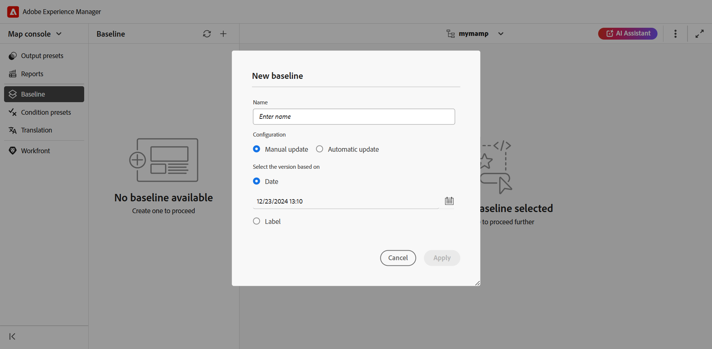
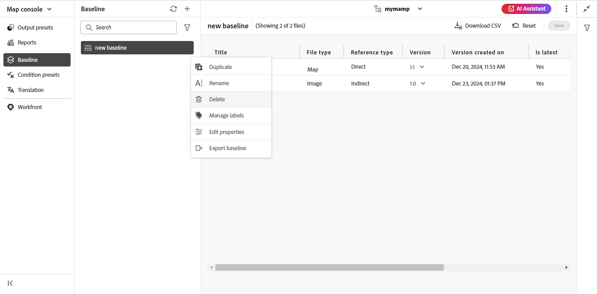
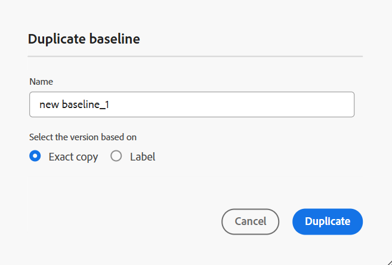

# 從Map主控台建立和管理基準線 {#id223MB0ZF043}

「基線」功能可讓您建立主題和資產的版本，然後將其用於發佈或翻譯。 例如，如果您的DITA map有`topicA`和`imageA`，您可以建立基準線以使用第3版`topicA`，但使用第4版`ImageA`。 設定好「基準線」後，您就可以在單一步驟中發佈或翻譯不同版本的主題。

對於輸出預設集而言，選取「基準線」是選用的，而DITA map可以有一個以上的「基準線」。 不過，DITA map中的每個輸出預設集只能與單一基線相關聯。 如果發佈時未指定基準線，則會使用最新版本的內容發佈輸出。

同樣地，選取基線以翻譯內容也是選擇性的。 不過，如果您選擇使用「基準線」來翻譯內容，則「基準線」的內容也會與翻譯的副本一起儲存。 然後，您可以使用翻譯後的基準線執行進一步的操作，例如與外部發佈者共用或封存它。

>[!TIP]
>
> 建議從Map主控台使用此基線功能。 不過，您也可以[使用地圖儀表板來建立和管理基準線](./generate-output-use-baseline-for-publishing.md)。

在&#x200B;**基準線**&#x200B;索引標籤中，您可以執行下列動作：

- [建立基準線](#create-a-baseline)
- [管理基準線](#manage-baselines)

## 建立基準線

您可以執行下列步驟，從「對映」主控台建立基準線：

1. [在Map主控台](./open-files-map-console.md)中開啟DITA map檔案。
1. 導覽至&#x200B;**基準線**&#x200B;標籤，並選取右上方的+圖示以開始建立基準線。
1. 在&#x200B;**新基準線**&#x200B;對話方塊中，提供下列詳細資料：

   {width="500" align="left"}

   - 在&#x200B;**名稱**&#x200B;欄位中輸入基準線的名稱。
   - 在&#x200B;**組態**&#x200B;中，選擇[手動更新](#configuring-baseline-for-manual-update)或[自動更新](#configuring-baseline-for-automatic-update)。
   - 選取&#x200B;**套用**。

會建立基準線。 基準線建立是非同步進行的，因此您可以繼續處理其他檔案。 建立基準線後，會顯示快顯訊息，確認基準線已建立，您也會收到該基準線的收件匣通知。

### 設定手動更新的基準線

您可以使用特定版本的主題和參考內容（可在特定日期和時間使用），或為主題版本定義的標籤，手動建立靜態基準線：

在&#x200B;**選取以為基礎的版本，**&#x200B;選取下列其中一個選項：

- **日期** ：在指定的日期和時間挑選主題的版本。
- **標籤**：選取此選項以根據套用至主題的主題標籤挑選主題。 如果主題有為其指定的標籤，則標籤會列在下拉式清單中。 您可以從清單中選擇標籤。 您也可以在文字方塊中新增標籤。

  對於靜態基準線中的直接參照，標籤會從最新儲存的地圖版本中提取。 例如，如果您已為主題A 1.0和1.1版建立標籤`Label Release 1.0`和`Label Release 1.1`，然後將主題A新增至儲存為1.0版的地圖。在此情況下，您可以在靜態基準線標籤的下拉式清單中檢視標籤`Label Release 1.0`和`Label Release 1.1`。

  當您選取&#x200B;**標籤，**&#x200B;時，您可以選擇直接和間接參照。
   - 對於DITA map中的直接參照，您可以選擇使用未套用指定標籤的最新版主題。

     >[!NOTE]
     >
     > 如果您輸入不存在的標籤，並選取選項&#x200B;**不要建立基準線**，則基準線建立會失敗，並在「基準線」面板的基準線名稱附近出現錯誤訊息。

   - 對於DITA map中的間接參照，您會獲得一個額外選項，可以使用未套用指定標籤的最新版主題。 您也可以選擇&#x200B;**自動挑選參考內容的**，系統會自動挑選與參考內容版本對應的參考內容版本。

一旦您選取標籤或版本為日期，就會相應地選取地圖中所有參照的主題和媒體檔案。 此主題選取範圍未顯示在使用者介面上，但會儲存在後端。

### 設定自動更新的基準線

選取此選項以建立基準線，以根據套用至主題的主題標籤自動挑選主題。

使用自動更新組態建立的基準會動態更新。 如果您產生基準線、下載基準線或使用基準線建立翻譯專案，系統會根據更新的標籤動態挑選檔案。 例如，如果您已將標籤版本為1.0的主題版本1.2用於基準線，並使用標籤版本為1.0更新版本1.5，則基準線將會動態更新，而版本1.5將會使用。

{width="300" align="left"}

- **標籤**：如果主題有為其指定的標籤，請使用&#x200B;**標籤**&#x200B;下拉式清單從[列出的標籤](#labels-list)中選擇。

  先選取的標籤會獲得較高的優先順序。

  >[!NOTE]
  >
  >提取標籤時，載入器會出現，且下拉式清單會停用。

  對於動態基準線，標籤會從最新儲存的版本和地圖目前的工作副本中提取。 例如，如果您已建立標籤   主題A 1.0和1.1版的`Label Release A.1.0 `和`Label Release A.1.1`，以及主題B 1.0和1.1版的`Label Release B.1.0`和`Label Release B.1.1`。 然後，您可以新增主題A至1.0版中的「對應A」，新增主題B至1.0*版中的「對應A」（工作復本）。 在此情況下，您可以在動態基準線標籤的下拉式清單中檢視`Label Release A.1.0 `、`Label Release A.1.1`、`Label Release B.1.0`和`Label Release B.1.1`。
- **間接參照**：對於DITA map中的間接參照，您會獲得下列選項：

   - **自動挑選**：您可以選擇&#x200B;**自動挑選參考內容**，系統會自動挑選與參考內容版本對應的參考內容版本。
   - **使用選取的標籤**：您可以使用為某個版本的主題定義的選取標籤，來建立基準線。
   - **使用最新版本或工作復本**：使用未套用指定標籤之主題的最新版本，或如果尚未建立任何版本，則使用主題的工作復本來建立基準線。

## 管理基準線

您可以使用「基準線」圖示板上的各種功能來管理現有的基準線。

- 您可以使用「基線」面板中的文字方塊來搜尋現有的基線。 使用&#x200B;**套用篩選器**&#x200B;圖示顯示所有基準或列出建立狀態為「成功」、「進行中」或「失敗」的基準。
- 使用「基準線」面板中的&#x200B;**重新整理**&#x200B;圖示可重新檢查所有基準線，並顯示在「對映檢視」中開啟之DITA map的新的基準線清單。
- 選取基準線以檢視或編輯&#x200B;**基準線**&#x200B;面板中現有靜態基準線的內容。 基準線編輯視窗會顯示DITA map檔案、map的內容或主題以及參照的內容。

  >[!NOTE]
  >
  >只建議對少量的參考變更執行靜態基準線的編輯操作。 不建議使用編輯操作來變更主要DITA map的版本，因為它必須重新計算所有參照。 這可能會造成大型DITA map的基準線更新失敗。 對於較大的DITA map，您可以建立新基準線或編輯基準線的屬性。
  >
  >當使用標籤在執行階段產生動態基準的參照時，動態基準的編輯作業可讓您編輯基準的屬性。

  基準線{width="500" align="left"}的選項

### 現有基準的可用動作

您也可以從「選項」功能表對基準線執行下列操作：

**複製基準線**

您可以複製基準線，並根據您的需求加以修改。

{width="300" align="left"}
*根據標籤複製基準線或建立精確副本。*

1. 從基準線的[選項]功能表選取[複製] **&#x200B;**。 **重複的基準線**&#x200B;對話方塊開啟。
>[!NOTE]
>
>基準線的預設名稱為`<selected baseline name>`_suffix （如sample-baseline_1）。 您可以根據自己的需求變更名稱。

   在&#x200B;**選取以**&#x200B;為基礎的版本中，您可以選擇&#x200B;**完全複製**&#x200B;選項或&#x200B;**標籤**&#x200B;選項：

   - **精確副本**： Experience Manager Guides會挑選相同版本的所有主題，並建立重複基準線的精確副本。
   - **標籤**：您可以使用下拉式清單，選擇[列出的標籤](#labels-list)之一。 Experience Manager Guides會挑選有為其定義所選標籤的主題版本，至於其餘主題，則會從複製的基準線中挑選版本。 例如，您從下拉式清單中選取標籤`Release 1.0`，然後它會挑選您已定義此標籤的主題版本。 對於所有其他主題，它會從複製的基準線中挑選版本。
1. 選取&#x200B;**複製**。

- **重新命名**，或&#x200B;**刪除**&#x200B;現有的基準線**。
- **管理標籤**，可讓您新增、移除或變更靜態基準線的現有標籤。 如果您的管理員已設定預先定義的標籤，則會在新增標籤下拉式清單中顯示這些標籤。 如需新增標籤的詳細資訊，請檢視[使用標籤](web-editor-use-label.md#)。

  >[!NOTE]
  >
  > 新增或移除標籤的程式會非同步進行，因此您可以繼續處理其他檔案。 新增或移除標籤後，會顯示快顯訊息，確認已新增或移除標籤，且您也會收到該標籤的收件匣通知。

- **編輯您在建立基準時所設定的現有靜態基準線的屬性**。
- **匯出基準線**&#x200B;選項會匯出Microsoft Excel檔案中基準線的快照，包括所有必要的詳細資訊，例如標題、檔案名稱、檔案型別、版本編號、檔案狀態及其他相關資訊。

### 標籤清單 {#labels-list}

下拉式清單中列出的標籤依據以下准則：
- 標籤應新增至DITA map （在其上建立基準線）中主題的其中一個版本。
- 而且只考慮DITA map的第一層級參照（主題或子對映）來挑選標籤。

## 基線篩選

使用&#x200B;**基線篩選**&#x200B;面板中的篩選圖示，您可以在基線編輯視窗中開啟的基線套用篩選：

{width="300" align="left"}

- 根據檔案名稱或檔案位置篩選檔案。
- 根據不同欄的值（如「檔案型別」、「參照型別」等）篩選檔案。
- 選擇要顯示在基準線編輯視窗中的欄。

>[!NOTE]
>
> 您可以選取欄標題，並根據基準線編輯視窗中的欄來排序檔案。

**儲存或重設基準線**

編輯基準線後，選取&#x200B;**儲存**&#x200B;以儲存基準線的變更。 如果您不想儲存變更並重設基準線，可以選取&#x200B;**重設**。 當您選取&#x200B;**重設**&#x200B;時，會顯示警告，指出您未儲存的變更將會遺失。

**父級主題：**&#x200B;[&#x200B;輸出產生](generate-output.md)

