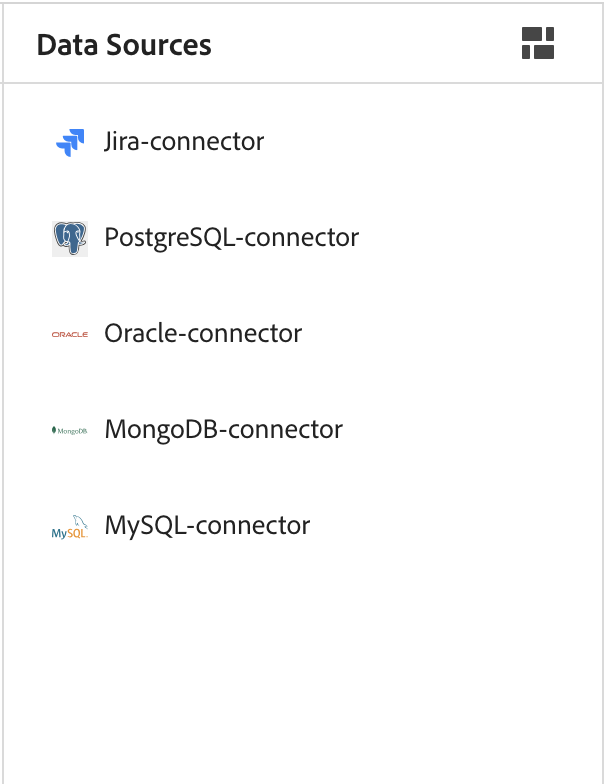
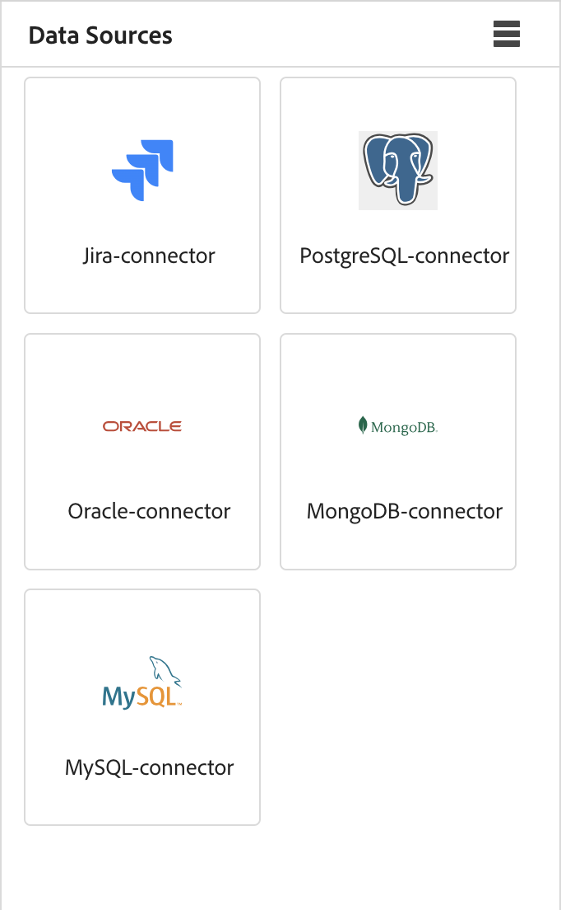
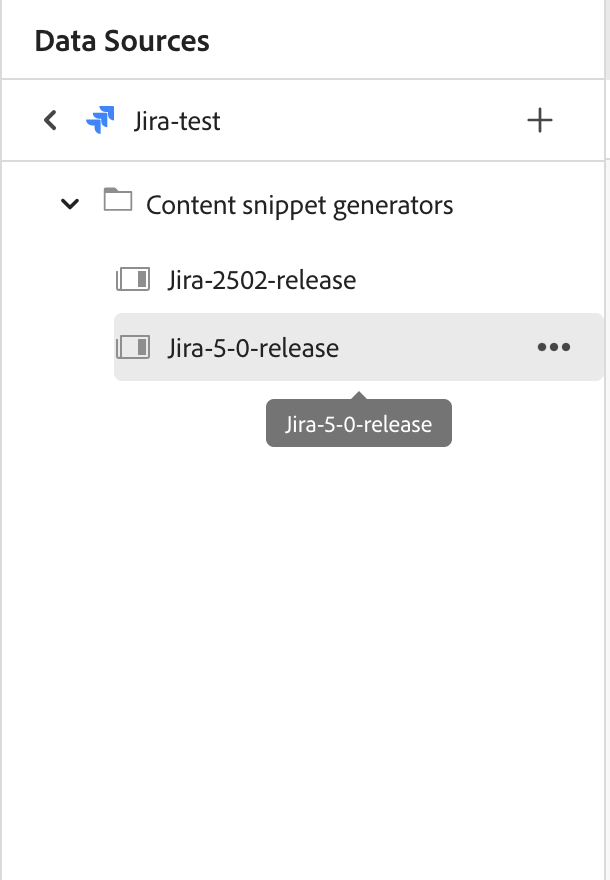
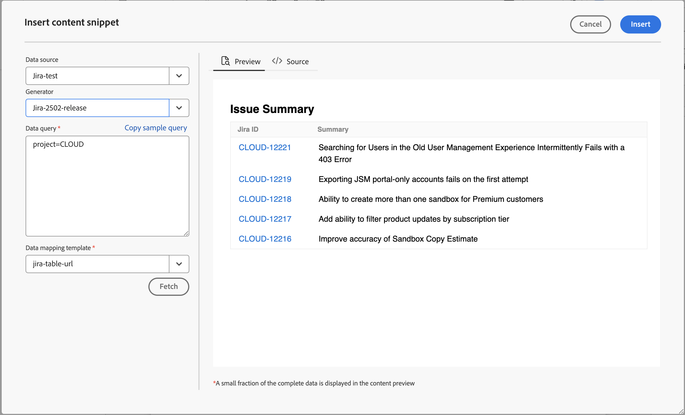
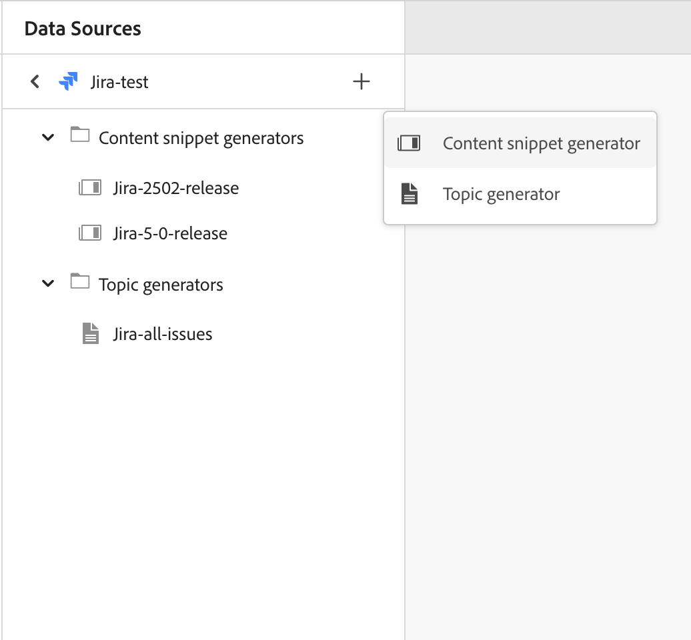
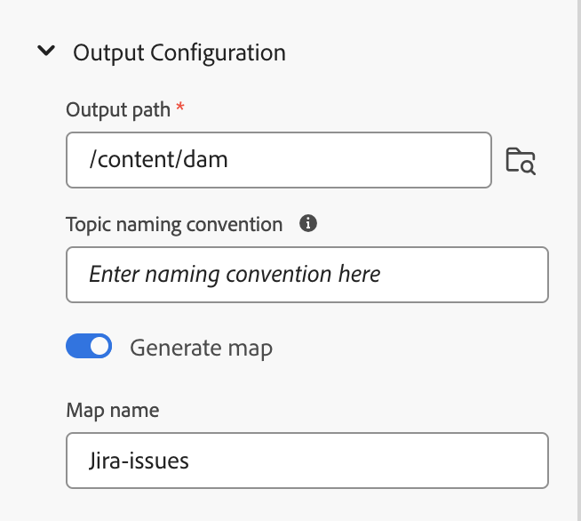
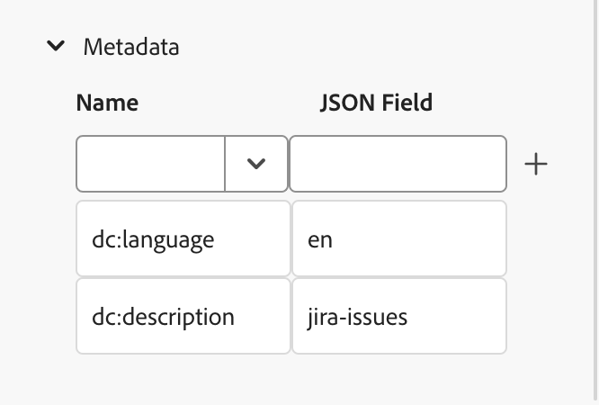
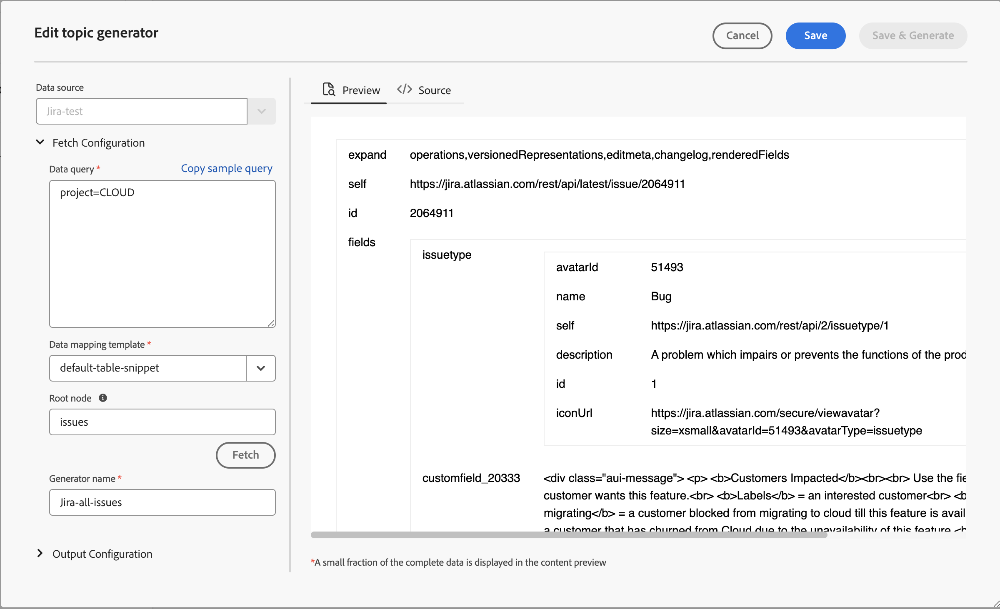

# 使用來自您的資料來源的資料

**資料來源**&#x200B;是您儲存和管理組織資料的系統。 這些是您的記錄系統，例如JIRA、SQL資料庫、PIM或PLM。 AEM Guides提供連線至您的資料來源的功能，並使用來自這些來源的資料。

您也可以使用檔案聯結器來連線至JSON資料檔案。 從您的電腦上傳JSON檔案，或從Adobe Experience Manager資產瀏覽該檔案。 然後，使用產生器建立內容片段或主題。

## 資料來源面板

在左側面板中選取&#x200B;**資料來源** 以檢視連線的資料來源。 「資料來源」面板隨即開啟並顯示所有連線的資料來源。

根據您的設定，管理員可以設定資料來源聯結器：

 雲端服務 

- 如果您使用的是2023年10月發行版本或更新版本，請在Cloud Service安裝與設定指南中瞭解如何[從使用者介面](../cs-install-guide/conf-data-source-connector-tools.md)設定資料來源聯結器。

- 如果您使用的是2023年7月或2023年9月版本，請在Cloud Service安裝與設定指南中瞭解如何[設定資料來源聯結器](../cs-install-guide/conf-data-source-connector.md)。

    

  內部部署軟體 

- 如果您使用4.3.1版或更新版本，在On-premise Installation and Configuration Guide中瞭解如何[從使用者介面](../cs-install-guide/conf-data-source-connector-tools.md)設定資料來源聯結器。

- 如果您使用4.3版，請在On-premise安裝與設定指南中瞭解如何[設定資料來源聯結器](../cs-install-guide/conf-data-source-connector.md)。

>[!NOTE]
>
> 您將會看到管理員已設定聯結器的資料來源。

## 顯示清單檢視或平鋪檢視

您可以在「清單檢視」或「並排檢視」之間切換，以清單形式或並排方式檢視各種資料來源。

選取資料來源以檢視所選資料來源可用的內容片段產生器和主題產生器。

### 清單檢視

{width="300" align="left"}

*連線的資料來源清單。*

### 平鋪檢視   

{width="300" align="left"}

*以圖磚檢視連線的資料來源。*

資料來源資料有兩種使用方式：
- 插入內容片段
- 建立主題

## 從您的資料來源插入內容片段

AEM Guides提供與您的資料來源連線的功能。 您可以擷取資料、將其插入主題並進行編輯。 您可以使用內容片段產生器輕鬆建立內容片段，並在主題中重複使用。

執行以下步驟，使用內容片段產生器建立內容片段並插入您的主題中：

1. 選取&#x200B;**資料來源**    以檢視連線的資料來源。

1. 選取資料來源，以檢視可用於所選資料來源的內容片段產生器。

   {width="300" align="left"}

   *「資料來源」面板會列出可用的內容片段產生器。*

1. 選取&#x200B;**新增**&#x200B;以新增內容片段產生器。 **新增內容片段產生器**&#x200B;面板開啟。

1. 在&#x200B;**資料查詢**&#x200B;文字方塊中輸入查詢。  選取&#x200B;**複製範例查詢**&#x200B;以快速複製資料查詢。 您可以將範例查詢複製並貼到&#x200B;**資料查詢**&#x200B;文字方塊中，而不是手動建立查詢。 之後，只要根據您的資料需求編輯查詢即可。

   >[!NOTE]
   >
   >Experience Manager為各種資料來源中的所有資源提供各種範例查詢。 這些會將對應至您要從中擷取資料的資料來源。

1. 如果使用檔案聯結器，您可以從電腦上傳JSON檔案，或從Adobe Experience Manager資產瀏覽JSON檔案。

   >[!NOTE]
   >
   > 如果您使用檔案聯結器，您將檢視上傳或瀏覽檔案以取代資料查詢的選項。

1. 從&#x200B;**資料對應範本**下拉式清單中選取與您的資料來源對應的範本。
所選資料來源的現成範本會顯示在下拉式清單中。 例如，您可以檢視名為「PostgreSQL」資料來源的「sql-table」範本。

   >[!NOTE]
   >  
   > 如果管理員已設定自訂範本，則您也會在下拉式清單中顯示這些範本（根據管理員完成的範本路徑設定）。
   >   
   >您也可以在範本中使用Velocity工具。 進一步瞭解如何[使用Velocity工具](#use-velocity-tools)。

1. **Resource**&#x200B;下拉式清單會出現在某些聯結器上，例如REST Client、Salsify、Akeneo和Microsoft ADO。  從下拉式清單中選取任何資源，並連線至該資源，以使用產生器建立內容片段或主題。

   >[!NOTE]
   >
   > 您的管理員可以在設定資料來源聯結器時，設定預設資源或為多個URL新增資源。

1. 按一下&#x200B;**擷取**&#x200B;從資料來源擷取資料，並將範本套用至從SQL查詢產生的資料。

1. 您可以在預覽或DITA來源檢視中檢視資料。

   1. 預覽會顯示資料插入內容時的顯示方式。 預覽會以所選範本的格式顯示資料的一小部分。
例如：
      - 如果您已選取sql表格範本，則可以使用表格格式檢視SQL資料。
      - 如果您已選取Jira排序清單範本，則可檢視Jira問題的排序清單。

   1. 來源檢視會顯示DITA來源檢視中的資料。
      {width="800" align="left"}
      *新增內容片段產生器。 以來源或預覽模式檢視資料。*

1. 若要儲存查詢的結果，請輸入產生器的名稱，然後按一下[新增]。****   新的內容片段產生器已新增至清單中。

   >[!NOTE]
   >
   > 您必須遵循新內容產生器名稱的檔案命名慣例。 內容片段產生器的名稱中不能有空格。 此外，您無法使用現有內容產生器的名稱儲存新的內容產生器。 發生錯誤。

### 內容片段產生器的選項

以滑鼠右鍵按一下內容片段產生器，開啟「選項」。 您可以使用這些選項執行下列操作：

- **預覽**：使用此選項可開啟窗格，並檢視資料在輸出中顯示方式的一小部分。
- **插入**：使用此選項將選取的內容片段插入在網頁編輯器中開啟進行編輯的主題。 當資料以片段形式插入時，您也可以在Web編輯器中編輯主題中的資料。

  >[!NOTE]
  > 
  > 只有在編輯主題時，才會顯示插入選項。

- **編輯**：使用此選項變更內容片段產生器並儲存。
- **刪除**：使用此選項來刪除選取的內容片段產生器。
- **重複**：使用此選項來建立所選內容片段產生器的重複或復本。 根據預設，會以尾碼（如generator_1）建立副本。

### 插入查詢程式碼片段

您也可以使用&#x200B;**插入查詢代碼片段**    將資料片段插入主題。  您可以從下拉式清單中選取產生器、編輯查詢，或變更範本並將資料插入主題中。

{width="800" align="left"}

*編輯並插入資料片段。*

## 使用主題產生器建立主題

主題產生器可協助您建立包含來源資料的主題。 您可以快速建立主題產生器，然後使用該產生器產生主題。 每個主題都可以包含各種格式的資料，例如表格、清單和段落。   例如，在主題中，您可以新增一個表格，其中包含所有新產品的詳細資訊以及將會停止銷售的所有產品清單。

主題產生器可針對所有主題建立包含資料和DITA map的主題。 您也可以在內容中`<conref>`這些主題。 這可協助您將資料與資料來源保持同步，並且您可以輕鬆更新資料。

### 建立主題

執行以下步驟，使用主題產生器建立主題：

1. 選取資料來源以檢視所選資料來源可用的內容片段產生器和主題產生器。

   {width="300" align="left"}

   *為連線的資料來源新增主題產生器。*

1. 選取&#x200B;**新增** ，並從下拉式清單中選取&#x200B;**主題產生器**，以新增主題產生器。 **新增主題產生器**&#x200B;面板開啟。

1. 在&#x200B;**新增主題產生器**&#x200B;面板的下列三個索引標籤底下的欄位中輸入值：

   **擷取組態**

   {width="300" align="left"}

   *新增主題產生器的資料查詢、資料對應範本和根節點詳細資訊，並在「擷取設定」面板中為其指定唯一名稱。*

   1. 在&#x200B;**資料查詢**&#x200B;文字方塊中輸入查詢。 選取&#x200B;**複製範例查詢**&#x200B;以快速複製資料查詢。 您可以將範例查詢複製並貼到&#x200B;**資料查詢**&#x200B;文字方塊中，而不是手動建立查詢。 之後，只要根據您的資料需求編輯查詢即可。

      >[!NOTE]
      >
      >Experience Manager為各種資料來源中的所有資源提供各種範例查詢。 這些會將對應至您要從中擷取資料的資料來源。

   1. 如果使用檔案聯結器，您可以從電腦上傳JSON檔案，或從Adobe Experience Manager資產瀏覽JSON檔案。

      >[!NOTE]
      >
      > 如果您使用檔案聯結器，您將檢視上傳或瀏覽檔案以取代資料查詢的選項。

   1. 從&#x200B;**資料對應範本**&#x200B;下拉式清單中選取與您的資料來源對應的範本。

      >[!NOTE]
      >
      > 如果管理員已設定自訂範本，則您也會在下拉式清單中顯示這些範本（根據管理員完成的範本路徑設定）。 例如，您可以建立包含排序清單、表格、段落或其他DITA元素的主題範本。

   1. 輸入&#x200B;**根節點**。 這是您要存取資料的節點。 然後，主題產生器在根節點中定義的層級建立每個主題。 例如，您可以在Jira中新增「問題」作為根節點。 因此，如果查詢傳回13個問題，您將獲得13個主題，每個問題一個主題。

   1. 按一下&#x200B;**擷取**&#x200B;從資料來源擷取資料，並將範本套用至從SQL查詢產生的資料。 預覽會顯示主題以所選範本格式顯示的一小部分。 例如，您可以檢視單一Jira問題，其中包含查詢產生的所有欄位。
   1. 輸入主題產生器的名稱。

      >[!NOTE]
      > 
      > 您必須遵循新主題產生器名稱的檔案命名慣例。 主題產生器的名稱中不能有空格。 此外，您無法使用現有主題產生器的名稱儲存新的主題產生器。 發生錯誤。

   **輸出組態**

   {width="300" align="left"}

   *在「輸出組態」面板中輸入輸出路徑和主題命名慣例詳細資料。 產生DITA map並命名它。*

   1. 輸入要儲存主題的&#x200B;**輸出路徑**&#x200B;詳細資料。
   1. 在&#x200B;**主題命名慣例**&#x200B;中，您可以輸入值或具有Velocity標籤的變數。 新主題將遵循慣例。 例如，您可以輸入`$key`以根據Jira金鑰建立主題。
   1. 若要建立包含所有產生之主題的對映，請啟用選項&#x200B;**產生對映**。
   1. 輸入新DITA map的名稱。

   >[!NOTE]
   >
   > 主題產生器會在與主題相同的輸出路徑上產生DITA map。

   **中繼資料**

   從下拉式清單中選取中繼資料屬性，以傳遞至主題。 **Name**&#x200B;下拉式清單同時列出自訂和預設屬性。

   例如，在下列熒幕擷圖中，`dc:description`、`dc:language`、`dc:title`和`docstate`是您可以定義值的預設屬性。 您可以建立自訂屬性（如author）並定義其值。

   {width="300" align="left"}

   *在中繼資料面板中新增中繼資料屬性，以傳遞至主題。*

1. 輸入產生器的名稱，然後按一下[儲存] ****&#x200B;以儲存查詢結果。 新的主題產生器已新增至清單中。

1. 按一下&#x200B;**儲存並產生**&#x200B;以儲存主題產生器，並從主題產生器產生新主題。

   {width="650" align="left"}

   *從現有主題產生器產生新主題。*

   >[!NOTE]
   >
   > 如果主題已經存在，則產生器會更新現有主題中的資料。

### 主題產生器的選項

在主題產生器上按一下滑鼠右鍵以開啟&#x200B;**選項**。 您可以使用這些選項執行下列操作：

- **產生**：此選項會產生所選主題產生器的主題。 您也可以使用此選項來更新現有的主題。 它會連線至資料來源並擷取更新的資料。 產生內容時，此選項會停用，而且您會檢視載入器。
  >[!NOTE]
  >
  >如果您的主題已經存在，您可以覆寫主題中的資料，或將其儲存為新版本。

  

  *產生主題，如果檔案已經存在，請將它儲存為新版本或覆寫它。*
- **檢視記錄**：選取此選項可檢視內容產生記錄檔。 日誌檔案會在新標籤中開啟。 您可以在記錄檔中檢視錯誤、警告、資訊訊息和例外。 如果您已產生所選主題產生器的內容，則會啟用此選項。

- **預覽**：使用此選項可開啟窗格，並檢視資料在輸出中顯示方式的一小部分。

- **編輯**：使用此選項變更並儲存主題產生器。 產生內容時，此選項會停用。
- **刪除**：使用此選項來刪除選取的主題產生器。 產生內容時，此選項會停用。
- **重複**：此選項會建立所選主題產生器的重複或復本。 根據預設，會以尾碼（例如`topic-sample_1`）建立副本。

## 在資料來源範本中使用Velocity工具 {#use-velocity-tools}

Experience Manager範本也支援Velocity工具（2.0版）。 這些工具可協助您將各種功能套用至從資料來源擷取的資料。 深入瞭解[Velocity工具](https://velocity.apache.org/tools/2.0/generic.html)的使用方式以及您可以套用的功能。

若要在範本中使用「速度」工具，請執行下列步驟：
1. 在網頁編輯器中編輯Velocity範本。
1. 以`<tool.function>`格式新增工具及其函式。 例如：
   - 若要使用數學工具產生隨機數字，請使用`$mathTool.random`。
   - 若要使用數學工具產生數字總和，請使用`$mathTool.add(num1, num2)`。
1. 使用範本建立內容片段或主題。
1. 將範本套用至資料後，您可以在預覽或DITA來源檢視中檢視資料。

您可以在Velocity範本內使用下列工具，將各種功能套用至您從聯結器擷取的資料：
-`$alternatorTool`
- `$classTool`
- `$contextTool`
- `$conversionTool`
- `$dateTool`
- `$comparisonDateTool`
- `$displayTool`
- `$escapeTool`
- `$fieldTool`
- `$loopTool`
- `$linkTool`
- `$listTool`
- `$mathTool`
- `$numberTool`
- `$renderTool`
- `$resourceTool`
- `$sortTool`
