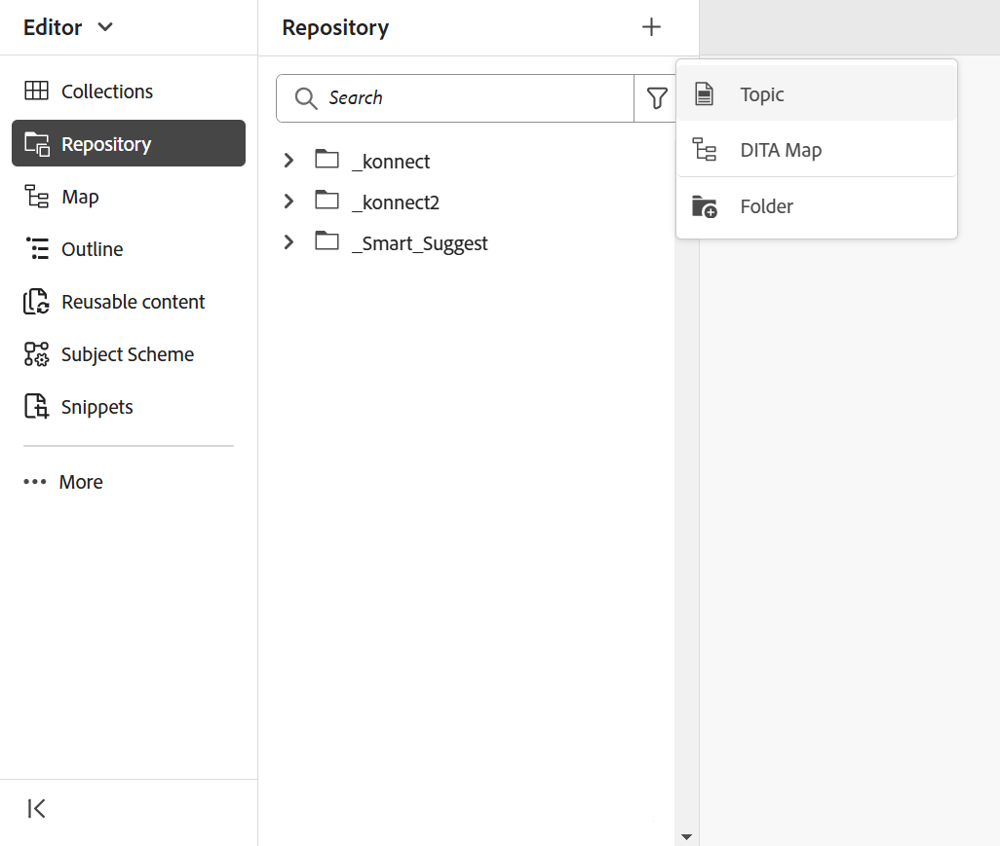
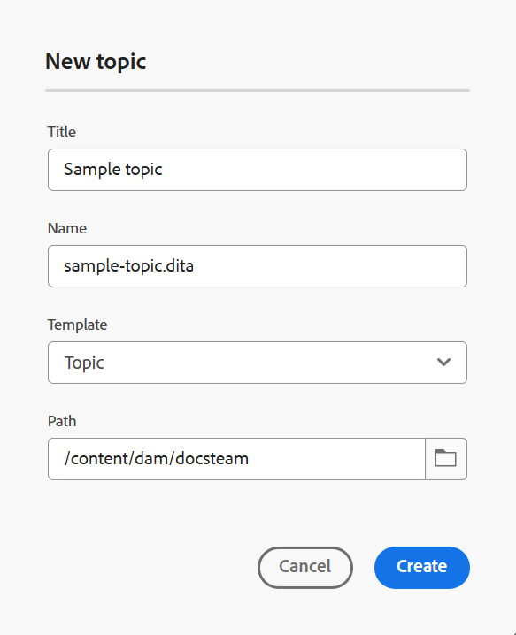
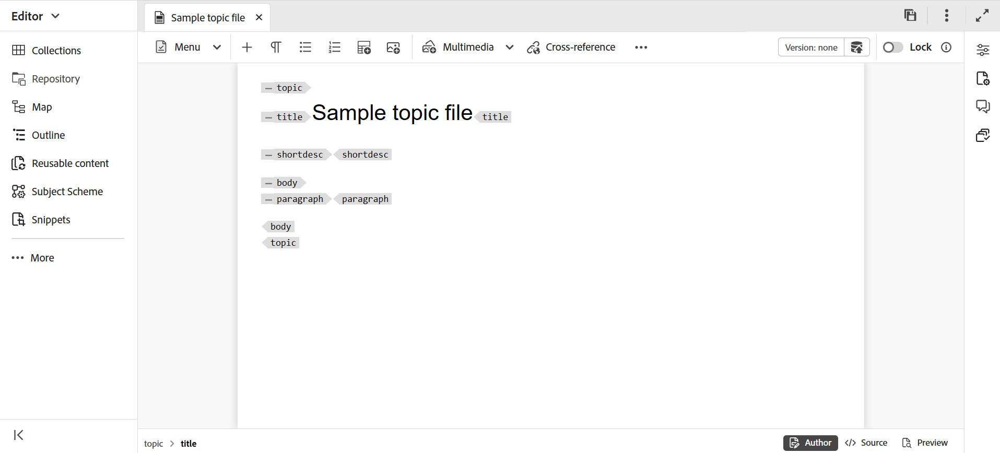
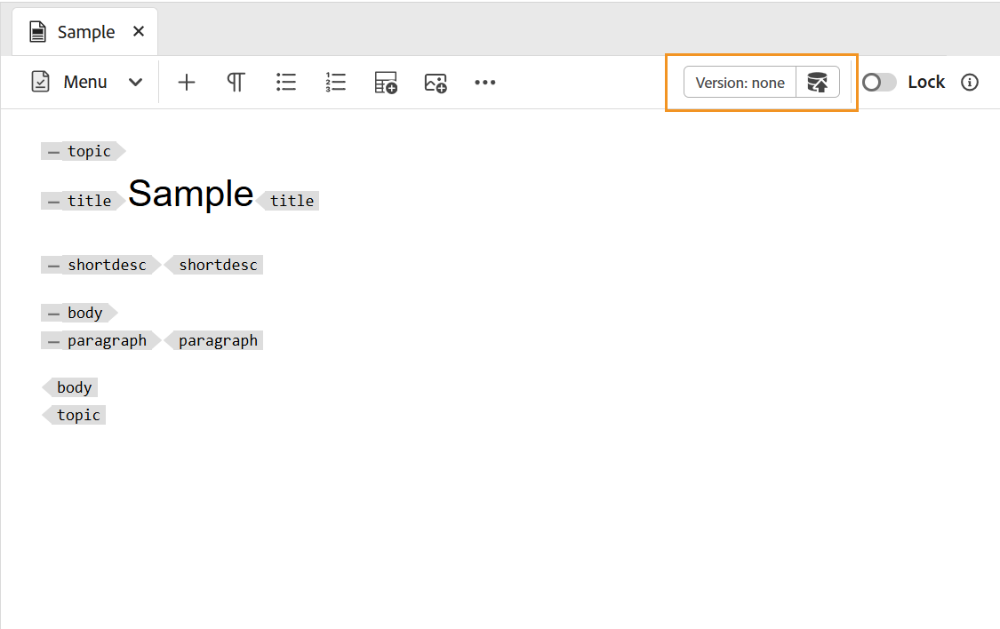

# 建立主題 {#id2056AL00O5Z}

Adobe Experience Manager Guides可讓您建立以下型別的DITA主題：主題、工作、概念、參考、字彙表、DITAVAL、Markdown等。 除了根據現成可用的範本建立主題外，您也可以定義自訂範本。 這些範本必須新增到資料夾設定檔，才能顯示在範本選擇Blueprint和編輯器中。

>[!NOTE]
>
> 全域和資料夾設定檔組態僅供資料夾層級管理使用者使用。 如需設定全域和資料夾層級設定檔的詳細資訊，請在安裝中檢視&#x200B;*設定撰寫範本*，並為您的設定設定Adobe Experience Manager Guides。

在Experience Manager Guides中建立主題有兩個方法：

- [從編輯器建立主題](#create-topics-from-the-editor)
- [從Assets UI建立主題](#create-topics-from-the-assets-ui)

## 從編輯器建立主題

執行以下步驟，從編輯器建立主題：

1. 在「存放庫」面板中，選取&#x200B;**新檔案**&#x200B;圖示，然後從下拉式功能表中選取&#x200B;**主題**。

   {width="500" align="left"}

   您也可以從[Experience Manager Guides首頁](./intro-home-page.md)以及存放庫檢視中資料夾的「選項」功能表存取此選項。

2. 顯示&#x200B;**新主題**&#x200B;對話方塊。

3. 在&#x200B;**新主題**&#x200B;對話方塊中，提供下列詳細資料：
   - 主題的標題。
   - \(Optional\)*主題的檔案名稱。 會根據主題「標題」自動建議檔案名稱。 如果您的管理員已根據UUID設定啟用自動檔案名稱，則您將不會檢視「名稱」欄位。
   - 主題將依據的範本。 例如，對於現成可用的設定，您可以從「空白」、「概念」、「DITAVAL」、「參考」、「任務」、「主題」、「Markdown」、「字彙表」和「疑難排解」範本中選擇。 如果您的資料夾上設定了「資料夾設定檔」，則您將只會檢視在「資料夾設定檔」上設定的主題範本。
   - 您要儲存主題檔案的路徑。 依預設，存放庫中目前所選資料夾的路徑會顯示在「路徑」欄位中。

4. 選取「**建立**」。

   {width="300" align="left"}

主題是在指定的路徑中建立。 此外，主題也會在編輯器中開啟以進行編輯。

{align="left"}

## 從Assets UI建立主題

執行以下步驟，從Assets UI建立主題：

1. 在Assets UI中，導覽至您要建立主題的位置。

1. 若要建立新主題，請選取&#x200B;**建立** \> **DITA主題**。

1. 在Blueprint頁面上，選取您要建立的DITA檔案型別，然後選取&#x200B;**下一步**。

   {align="left"}

   依預設，Experience Manager Guides提供最常用的DITA主題範本。 您可以根據組織需求設定更多主題範本，檢視「安裝」中的&#x200B;*設定撰寫範本*，並為您的設定設定Adobe Experience Manager Guides。

   >[!NOTE]
   >
   > 在Assets UI的清單檢視中，DITA主題型別會在「型別」欄中顯示為「主題」、「任務」、「概念」、「參照」、「Glossentry」、「Markdown」或「DITAVAL」。 DITA map會顯示為Map。

1. 在[內容]頁面上，指定檔案&#x200B;**標題**。

1. \（選用\）指定檔案&#x200B;**名稱**。

   如果您的管理員已根據UUID設定設定自動設定檔案名稱，則您將不會檢視指定檔案名稱的選項。 系統會自動為檔案指定以UUID為基礎的檔案名稱。

   如果檔案命名選項可用，也會根據檔案的&#x200B;**標題**&#x200B;自動建議名稱。 如果您要手動指定檔名稱，請確定&#x200B;**名稱**&#x200B;不含任何空格、單引號或大括弧，且結尾為.xml或.dita。 依預設，Experience Manager Guides會以連字型大小取代所有特殊字元。 檢視最佳作法指南中的檔案名稱區段，以取得有關命名DITA檔案的最佳作法。

1. 選擇 **建立**。「主題已建立」訊息便會顯示。

   您可以選擇在編輯器中開啟要編輯的主題，或將主題檔案儲存在Adobe Experience Manager存放庫中。

**其他資訊**

1. 您從Assets UI **建立** \> **DITA主題**&#x200B;或編輯器建立的每個新主題都會指派唯一的主題ID。 此ID的值是檔案名稱本身。 此外，新檔案會儲存為DAM中主題的最新工作副本。 除非儲存新建立主題的修訂版本，否則不會在「版本記錄」中檢視任何版本號碼。 如果您開啟主題進行編輯，版本資訊會顯示在工具列的右上角：

   {width="550" align="left"}

2. 新建立之主題的版本資訊顯示為&#x200B;*none*。 儲存新版本時，會為其指定版本編號1.0。

3. 如果您的管理員已將您的編輯器設定為在編輯之前鎖定檔案，則您將無法編輯該檔案，直到您將其鎖定為止。 同樣地，如果已設定，系統會在關閉前要求您解除鎖定任何鎖定的檔案。

4. 建立DITA主題後，請繼續儲存對工作副本所做的變更，並在完成主題更新後建立新版本。

**父級主題：**[&#x200B;建立和預覽主題](create-preview-topics.md)
