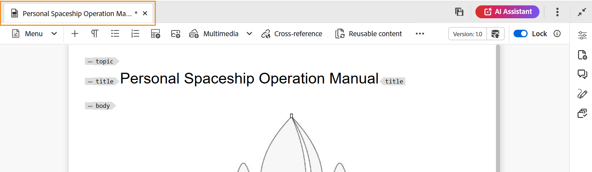
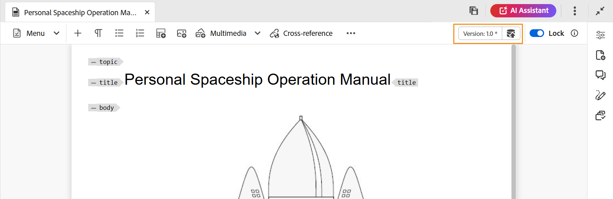

# 在網頁編輯器中編輯主題 {#id2056B040VUI}

Web編輯器提供了一系列編輯功能，可讓您輕鬆建立或修改主題檔案。 大致來說，您可以執行下列步驟，在網頁編輯器中編輯主題。

>[!IMPORTANT]
>
> 如果您在使用Web編輯器時遇到應用程式錯誤，請重新整理頁面以繼續工作。

1. 若要在主題中進行變更，請按一下所需元素的文字邊界並開始進行編輯。

1. 若要插入特定元素，請在要插入新元素後的元素結尾按一下，然後按一下工具列中的必要元素圖示。 您也可以使用鍵盤快速鍵 `Alt+Enter` 叫用 **插入元素** 快顯視窗。

   會顯示可用於主題中的元素清單。 AEM Guides會根據元素在主題中的有效位置，以智慧型方式放置元素。

   >[!NOTE]
   >
   > 您也可以設定「 」，選擇要顯示在工具列中的圖示， `ui_config.json` 檔案位於 —  `/etc/designs/fmdita/clientlibs/xmleditor/`. 如需自訂功能的詳細資訊，請連絡您的系統管理員。

1. 編輯完檔案後，按一下 **儲存**.

   >[!NOTE]
   >
   > 如果您不想將變更提交至AEM存放庫，請按一下 **關閉**，然後按一下 **關閉而不儲存** 在「未儲存的變更」對話方塊中。

## 跨元素的部分內容選取

Experience Manager指南也可讓您跨元素選取內容。 選取內容後，您可以執行下列操作：
- 格式設定和刪除：將選取的內容變為粗體、斜體、加底線，或甚至刪除選取的內容。 然後，有效開放標籤的內容會合併並顯示在單一元素下。 例如，您可以選取段落中的內容，並將選取範圍延伸至另一個段落。 然後，如果您將選取的內容設為粗體，則會合併開啟標籤中的所有粗體內容，並顯示在單一段落元素下。

同樣地，如果您刪除選取的內容，則會在開放標籤中刪除後合併剩餘的內容。

- 以有效元素包住內容：執行下列步驟，以有效元素包住內容：
   - 選取元素中的內容。
   - 選取  圖示從頂端的次要工具列檢視 **以元素括住** 對話方塊。 此對話方塊會列出所選內容的有效元素。
     >[!NOTE]
     >
     > 您也可以透過選取所選內容的前後關聯選單來檢視「含元素的圍繞」對話方塊。

   - 從對話方塊中選取元素。 所選內容會包裝在該元素下。 例如，如果您選取段落中的內容，然後選擇 `<note>` 元素來自 **以元素包圍** 對話方塊中，選取的內容會顯示在註記下方。\
      {width="300" align="left"}

## 編輯檔案時重新整理瀏覽器

當您在網頁編輯器中編輯內容時，「Experience Manager指南」支援您重新整理瀏覽器。 此功能可協助您繼續編輯內容，以防您在工作時遇到應用程式錯誤。 如果您在開啟一或多個含有未儲存變更的檔案進行編輯時按下瀏覽器重新整理，系統會警告您未儲存的變更可能會遺失。 您可以選擇取消重新整理作業並儲存檔案，以保留變更。

即使重新整理瀏覽器，左側和右側面板的檢視也會保留在網頁編輯器中。 當您重新整理瀏覽器時，「Experience Manager指南」會還原在「網頁編輯器」中開啟之檔案的上次儲存狀態。 例如，在「存放庫」面板中開啟的檔案會再次開啟。 地圖面板會與先前開啟的地圖一起保留。

活動主題或DITA map會在內容編輯區域中重新開啟。

右側面板也會重新開啟，並顯示與重新整理前相同的檢視。

## 工作復本指標

AEM Guides提供工作副本指示器，可顯示檔案的目前\（工作副本\）是否與儲存的版本同步。 如果您對目前的復本做了任何變更，而且尚未儲存檔案，則主題檔案標籤上的標題會出現\*標籤。 此指標會提醒您儲存變更，並在您儲存檔案時消失。

{width="550" align="left"}

AEM Guides也會指出上次儲存的檔案\(working\)復本是否與儲存的版本同步。 如果您在工作副本和上次儲存的版本之間有某些未儲存的變更，則會出現\*標籤，與版本資訊一起顯示在主題的檔案標籤右上角。 此指標會提醒您儲存檔案，並從目前的檔案\(working\)復本建立版本。

{width="550" align="left"}

## 在「存放庫檢視」中找到開啟的檔案

當您在Web編輯器中開啟檔案時，「Experience Manager指南」會提供在「存放庫檢視」中尋找檔案的功能。 例如，在您編輯主題時，它會找到目前的主題。

您可以關閉功能，以使用 **一律在存放庫中尋找檔案** 選項來自 **外觀** 的標籤 **使用者偏好設定**.

**父級主題：**[&#x200B;使用網頁編輯器](web-editor.md)
