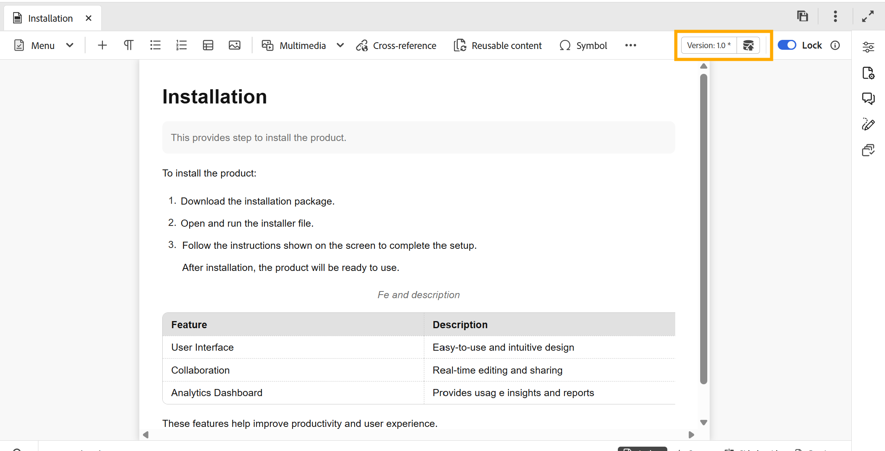

# 在編輯器中編輯主題 {#id2056B040VUI}

>[!INFO]
>
>此主題適用於新編輯器和舊編輯器。 雖然核心功能保持一致，但內容會使用索引標籤和圖說文字（如適用）來指出使用者介面、術語和互動的差異。

編輯器提供了一系列編輯功能，可讓您輕鬆建立或修改主題檔案。 大致來說，您可以執行下列步驟，在編輯器中編輯主題。

>[!IMPORTANT]
>
> 如果您在使用編輯器時遇到應用程式錯誤，請重新整理頁面以繼續工作。

>[!BEGINTABS]

>[!TAB 新編輯器]

1. 若要在主題中編輯或插入元素，請在所需元素的文字邊界內按一下以進行變更，或將游標置於要在其後新增新元素的元素結尾，然後從工具列選取所需元素（或按Alt+1開啟「插入元素」彈出式視窗），這會智慧地列出並僅插入主題中該位置的有效元素。

1. 此外，您可以使用「快速插入」選單，在游標位置輕鬆插入允許的元素。 選取&#x200B;**Control + /** for Windows或&#x200B;**Command + /** for Mac以存取元素。

   {width="650"}

   使用「快速插入」選單搜尋新元素或從我的最愛中選擇一個元素，然後將其插入目前的游標位置。 我的最愛包含您最常用的元素，而且只會顯示對目前游標位置有效的那些元素。 您可以透過[編輯器設定](./config-editor-settings.md)中提供的「快速插入」功能表，啟用或停用此功能並設定要插入的常用元素。

>[!TAB 舊編輯器]

1. 若要在主題中進行變更，請按一下所需元素的文字邊界並開始進行編輯。

1. 若要插入特定元素，請將游標移至要在其後插入新元素的元素結尾，然後在工具列中選取所需的元素圖示。 您也可以使用鍵盤快速鍵`Alt+1`來叫用&#x200B;**插入專案**&#x200B;快顯視窗。

   會顯示可用於主題中的元素清單。 Experience Manager Guides會根據元素在主題中的有效位置，以智慧方式放置元素。

   >[!NOTE]
   >
   > 您也可以設定位於 — `/etc/designs/fmdita/clientlibs/xmleditor/`的`ui_config.json`檔案，選擇要顯示在工具列中的圖示。 如需自訂功能的詳細資訊，請連絡您的系統管理員。

1. 完成檔案編輯之後，請選取&#x200B;**全部儲存**。

   >[!NOTE]
   >
   > 如果您不想要將變更提交至Adobe Experience Manager存放庫，請選取&#x200B;**關閉**，然後在[未儲存的變更]對話方塊中選取&#x200B;**關閉，但不儲存**。

>[!ENDTABS]

## 跨元素的部分內容選取

Experience Manager Guides也可讓您跨元素選取內容。 選取內容後，您可以執行下列操作：

- 格式化：與Editor 1.0相比，在「新編輯器」中將選取的內容格式化要輕鬆許多，如下圖所示。

>[!BEGINTABS]

>[!TAB 新編輯器]

您可以使用內容工具列，將選取的內容格式化為粗體、斜體或底線。 選取內容，然後在出現的功能表中按一下適當的格式圖示。 將選取的內容設為粗體、斜體或底線。 然後，有效開放標籤的內容會合併並顯示在單一元素下。

{width="650"}

>[!TAB 舊編輯器]

將選取的內容變為粗體、斜體，並將選取的內容加上底線。 然後，有效開放標籤的內容會合併並顯示在單一元素下。 例如，您可以選取段落中的內容，並將選取範圍延伸至另一個段落。 然後，如果您將選取的內容設為粗體，則會合併開啟標籤中的所有粗體內容，並顯示在單一段落元素下。

>[!ENDTABS]

- 刪除：如果您刪除選取的內容，則會在開放標籤中刪除後合併其餘內容。

- 以有效元素包住內容：執行下列步驟，以有效元素包住內容：

   - 選取元素中的內容。
   - 從頂端的工具列選取圖示以檢視&#x200B;**插入專案**&#x200B;對話方塊。 此對話方塊會列出所選內容的有效元素。

     >[!NOTE]
     >
     > 您也可以選取所選內容的內容功能表，來檢視「插入元素」對話方塊。

   - 從對話方塊中選取元素。 所選內容會包裝在該元素下。 例如，如果您選取段落中的內容，然後從&#x200B;**插入元素**&#x200B;對話方塊中選擇`<note>`元素，則選取的內容會顯示在附注下。

      {width="300"}

## 編輯檔案時重新整理瀏覽器

Experience Manager Guides支援您在編輯器中編輯內容時重新整理瀏覽器。 此功能可協助您繼續編輯內容，以防您在工作時遇到應用程式錯誤。 如果您在開啟一或多個含有未儲存變更的檔案進行編輯時按下瀏覽器重新整理，系統會警告您未儲存的變更可能會遺失。 您可以選擇取消重新整理作業並儲存檔案，以保留變更。

即使重新整理瀏覽器，編輯器中仍會保留左側和右側面板的檢視。 當您重新整理瀏覽器時，Experience Manager Guides會還原編輯器中開啟之檔案的最後儲存狀態。 例如，在「存放庫」面板中開啟的檔案會再次開啟。 地圖面板會與先前開啟的地圖一起保留。

活動主題或DITA map會在內容編輯區域中重新開啟。

右側面板也會重新開啟，並顯示與重新整理前相同的檢視。

## 工作復本指標

Experience Manager Guides提供工作副本指標，可顯示檔案的目前\（工作副本\）是否與儲存的版本同步。 如果您對目前的復本做了任何變更，而且尚未儲存檔案，則主題檔案標籤上的標題會出現\*標籤。 此指標會提醒您儲存變更，並在您儲存檔案時消失。

>[!BEGINTABS]

>[!TAB 新編輯器]

此檢視會顯示內容在新編輯器中呈現的方式。

{width="550"}

>[!TAB 舊編輯器]

此檢視會顯示內容在舊編輯器中呈現的方式。

{width="550"}

>[!ENDTABS]

Experience Manager Guides也會指出上次儲存的檔案\(working\)復本是否與儲存的版本同步。 如果您在工作副本和上次儲存的版本之間有某些未儲存的變更，則會出現\*標籤，與版本資訊一起顯示在主題的檔案標籤右上角。 此指標會提醒您儲存檔案，並從目前的檔案\(working\)復本建立版本。

>[!NOTE]
>
> 對[檔案屬性](./web-editor-right-panel.md#file-properties)下可用的中繼資料欄位所做的任何變更，或套用在後端的變更，也會在檔案版本上觸發星號`(*)`。  為了防止系統產生的中繼資料更新影響此指標，管理員可以設定中繼資料屬性的忽略清單。 如需有關如何設定中繼資料屬性的詳細資訊，請檢視[設定中繼資料屬性的忽略清單](../install-conf-guide/conf-metadata-prop.md)。

>[!BEGINTABS]

>[!TAB 新編輯器]

{width="650"}

>[!TAB 舊編輯器]

{width="650"}

>[!ENDTABS]

## 在作者和Source模式中存取鎖定的檔案

當DITA或Markdown檔案被其他使用者鎖定或出庫時，便無法編輯或修改內容。 不過，除了&#x200B;**預覽**&#x200B;模式外，您仍然可以在&#x200B;**作者**&#x200B;和&#x200B;**Source**&#x200B;模式下以唯讀格式檢視檔案。

在唯讀模式中，您可以檢視&#x200B;**作者**&#x200B;或&#x200B;**Source**&#x200B;模式中的內容、標籤和屬性。 您也可以修改檔案屬性。

>[!NOTE]
>
> 作為管理員，您可以存取&#x200B;**強制解除鎖定**&#x200B;功能，此功能可讓您解除鎖定被其他人鎖定的檔案。

<!-- This is no more available -->
<!--
The toolbar displays the following icons for read-only access:

- Toggle Tags view
- Version History
- Version Label

Experience Manager Guides also displays a **Read only access** indicator near the version number.
 

You can access the **Layout** view for read-only DITA maps. This view lets you see the DITA map and its properties but prevents edits.

>[!NOTE]
>
> Your folder-level administrative users must update *ui_config.json* so that you can harmoniously access the read-only files in the  Author, Source, and Layout modes.

 -->

## 在檔案總管中找出開啟的檔案

當您在編輯器中開啟檔案時，Experience Manager Guides會提供在Explorer中尋找檔案的功能。 例如，在您編輯主題時，它會找到目前的主題。

您可以關閉此功能，以便從&#x200B;**使用者偏好設定**&#x200B;的&#x200B;**外觀**&#x200B;索引標籤使用&#x200B;**永遠在檔案總管**&#x200B;中尋找檔案。

>[!NOTE]
>
>從2025.11.0版開始，設定&#x200B;**永遠尋找存放庫中的檔案**&#x200B;重新命名為&#x200B;**永遠尋找檔案總管**。 對於內部部署設定，在Experience Manager Guides 5.1版發行前，它仍可在存放庫中永遠尋找檔案中使用。

**父級主題：**&#x200B;[&#x200B;使用編輯器](web-editor.md)
