# 瞭解編輯器功能 {#id176NC500V5Z}

本節將逐步說明編輯器提供的各種功能。 我們可以將編輯器分成下列區段或區域：

- [標題列](#header-bar)
- [標籤列](#tab-bar)
- [工具列](#toolbar)
- [左側面板](#left-panel)
- [內容編輯區域](#content-editing-area)
- [右側面板](#right-panel)

以下子區段詳細涵蓋編輯器的各個區段。

## 標題列

標題列是顯示Adobe Experience Manager標誌的編輯器頂端列(如果您使用Unified Shell做為Experience Manager Guides UI，則為Unified Shell)。 當您選取標誌時，它會將您導向Experience Manager導覽頁面。

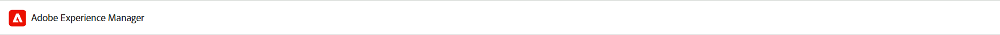

使用工具列中的&#x200B;**展開**&#x200B;圖示來隱藏標題列並最大化內容區域。 若要還原標準檢視，請選取&#x200B;**結束擴充的檢視**。


## 標籤列

標籤列位於編輯器介面的頂端，可讓您存取下列功能：

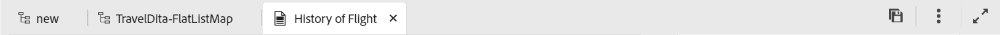

**索引標籤**

將編輯器中目前開啟的主題顯示為檔案標籤。 您可以同時開啟多個主題，這些主題會顯示在標籤列的個別標籤中。 依預設，您可以在標籤中檢視檔案標題。 當您將滑鼠停留在檔案上時，您可以檢視檔案標題和檔案路徑作為工具提示。

>[!NOTE]
>
> 身為管理員，您也可以選擇在索引標籤中依檔案名稱檢視檔案清單。 選取[使用者偏好設定](./intro-home-page.md#user-preferences)中&#x200B;**編輯器檔案顯示設定**&#x200B;區段的&#x200B;**檔案名稱**&#x200B;選項。

選取檔案索引標籤會開啟內容功能表，其中包含「另存為新版本」、「複製」、「尋找位置」、「新增至」、「屬性」、「分割」、「下載為PDF」和「關閉」選項。

**儲存全部**

儲存您在所有開啟的主題中所做的變更。 如果您在編輯器中開啟了多個主題，選取&#x200B;**全部儲存**&#x200B;或使用&#x200B;**Ctrl**+**S**&#x200B;快速鍵只要按一下即可儲存所有檔案。 您不必個別儲存每個檔案。

>[!NOTE]
>
> 「**儲存全部**」作業不會建立您主題的新版本。 若要建立新版本，請使用&#x200B;**另存為新版本**&#x200B;選項。

**AI小幫手**

強大的AI驅動工具，可透過智慧說明和撰寫功能提升生產力。 它將兩個強大的AI功能 — **製作**&#x200B;和&#x200B;**說明** — 整合到Experience Manager Guides介面中，讓您更快更有效率地編寫內容並存取Experience Manager Guides檔案中的資訊。

>[!NOTE]
>
>AI助理功能目前可供Adobe Experience Manager Guides as a Cloud Service使用。

**展開檢視**：可讓您使用&#x200B;**展開**&#x200B;圖示展開頁面檢視。 在此檢視中，包含Adobe Experience Manager標誌的標題列會隱藏。 如此可最大化內容空間以供編輯。 若要返回標準檢視，請使用&#x200B;**結束展開檢視**&#x200B;圖示。

**其他動作**：可讓您導覽至&#x200B;**Assets**&#x200B;和&#x200B;**設定**。

**Assets**&#x200B;選項會根據您的設定帶您前往目的地：

- **雲端服務**：如果您正在使用雲端服務，選取&#x200B;**Assets**&#x200B;選項會帶您前往AEM導覽頁面。

- **內部部署軟體**：如果您正在使用Adobe Experience Manager Guides （4.2.1和更新版本），選取&#x200B;**Assets**&#x200B;選項會帶您前往Assets UI中的目前檔案路徑。


**設定**&#x200B;選項僅供管理員和資料夾設定檔管理員使用，並可設定下列設定：

>[!NOTE]
>
> 如果您要更新任何預設設定，則應重新開啟檔案以使變更生效。

- **一般**：「一般」設定可讓您設定字典以搭配編輯器使用。 此索引標籤包含四個區段： **拼字檢查**、**條件**、**製作**&#x200B;以及&#x200B;**引文**。

  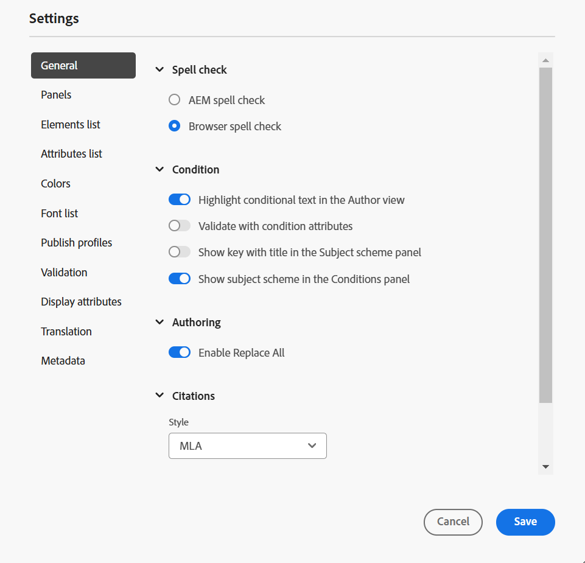{width="650" align="left"}

   - **拼字檢查**：有兩個選項 — **AEM拼字檢查**&#x200B;和&#x200B;**瀏覽器拼字檢查**。 依預設，編輯器會使用瀏覽器拼字檢查功能，其中拼字檢查是使用瀏覽器的內建字典執行。 您可以切換至AEM拼字檢查，以使用Adobe Experience Manager的字典，也可以自訂字典以新增自訂字詞清單。 如需自訂AEM字典的詳細資訊，請檢視安裝與設定AEM as a Cloud Service中的[自訂Adobe Experience Manager Guides的預設字典](../cs-install-guide/customize-aem-custom-dictionary.md)區段。

   - **狀況**

      - **在作者檢視中反白條件文字**：選取此選項以在作者檢視中反白條件文字。 條件內容會使用為條件定義的顏色反白顯示。

      - **使用條件屬性進行驗證**：選取此選項可允許驗證為屬性定義的值。 這可防止您新增任何不正確的值。

      - **在主旨配置面板中顯示具有標題的金鑰**：選取此專案可顯示主旨配置中的金鑰與標題。 如果您未選取此選項，則只會顯示標題。 例如，這裡的索引鍵「os」、「audience」和「other」也會與標題一起顯示。

        {width="550" align="left"}

      - **在[條件]面板中顯示主旨配置**：選取此專案，在條件面板中檢視主旨配置。 如果取消選取此專案，定義的條件會顯示在「條件」面板中。

   - **製作**

      - **啟用「全部取代」**：選取此項以檢視「**尋找和取代**」面板中的「**全部取代**」圖示。

   - **引文**
變更引文樣式。 從您要在專案中使用的下拉式清單中選擇引文樣式。 如需詳細資訊，請檢視[變更引文樣式](./web-editor-apply-citations.md#change-citation-style)。

   - **AI小幫手**
選取此項以啟用Experience Manager Guides中的[AI小幫手](./ai-assistant.md)功能。 取消選取以停用該功能。

**面板**：此設定會控制編輯器與地圖主控台的左右面板中顯示的面板。 您可以切換按鈕，以顯示或隱藏所需的面板。

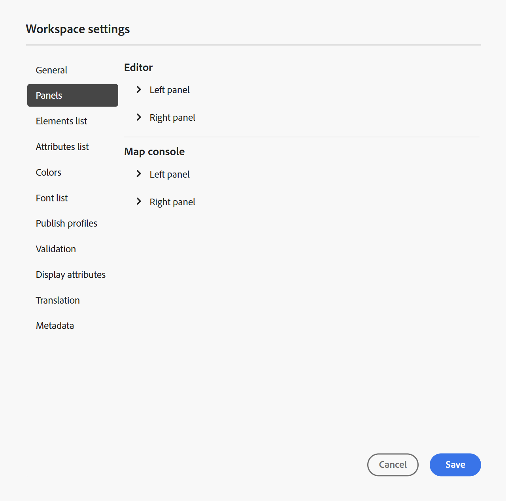{width="650" align="left"}

您也可以定義面板中特徵的顯示順序。 若要變更面板中可用功能的預設順序，請選取虛線以將功能標籤拖放到所需位置。 功能也可以從&#x200B;**更多**&#x200B;區段移至面板的主要區段，反之亦然。 重新排序後，功能會以相同的順序顯示在個別的右側和左側面板中。

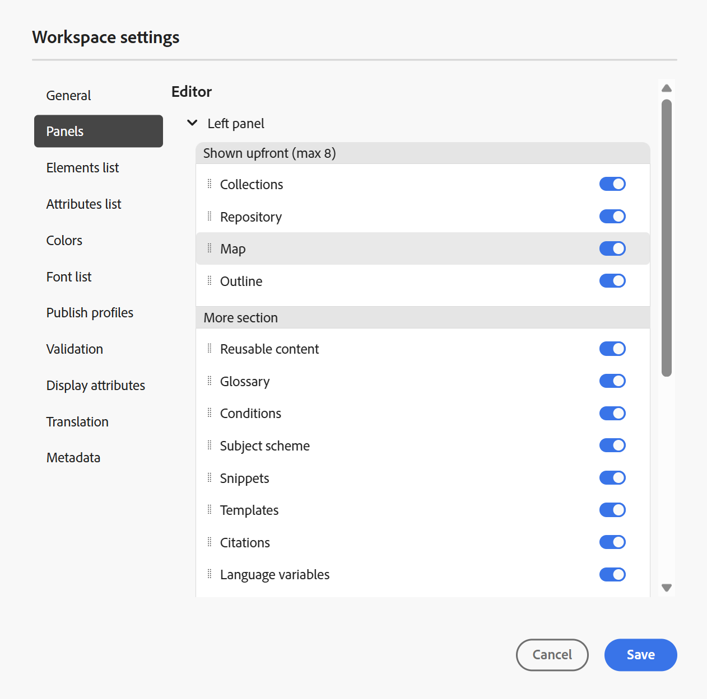{width="650" align="left"}


一次最多可以顯示8個面板。 對面板設定所做的任何變更都會立即套用。


>[!NOTE]
>
> 如果自訂面板已設定，則會顯示在面板清單中。 您可以切換開關，以顯示或隱藏自訂面板。

- **元素清單**：身為管理員，您可以控制作者可以插入檔案的元素清單，也可以定義元素的顯示名稱。 「元素」清單設定可讓您根據DITA規格來指定元素名稱，並指定您要使用的標籤，而不是DITA定義的元素名稱：

  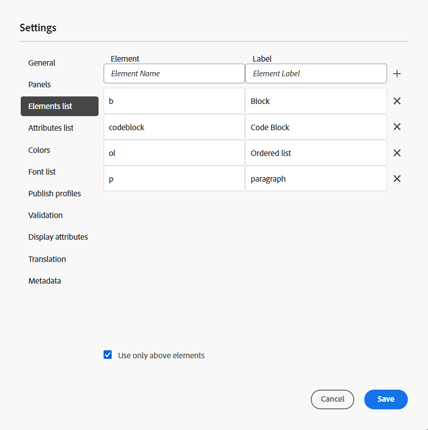{width="650" align="left"}

在上述熒幕擷圖中，`p`元素已被指定為Paragraph的標籤，而`codeblock`則被指定為Code Block的標籤以及其他一些元素。 如果您選取&#x200B;**僅使用以上元素**&#x200B;選項，則只有此清單中的有效元素\（在目前的插入點\）會顯示在&#x200B;**插入元素**&#x200B;對話方塊中。

在下列熒幕擷圖中，先前熒幕擷圖的4個已設定元素中只有3個會顯示在目前內容中：

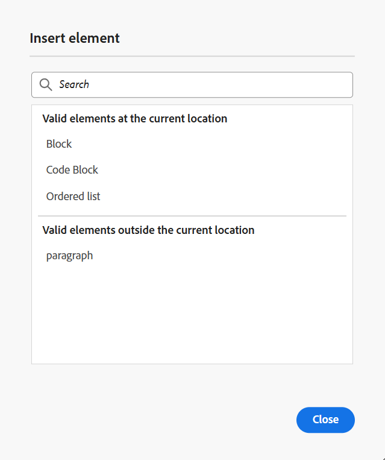{width="300" align="left"}

- **屬性清單**：與元素清單類似，您可以控制要在元素的屬性清單中顯示的屬性清單及其顯示名稱。 在下列熒幕擷圖中，只有3個屬性已設定為顯示在元素的屬性清單中：

  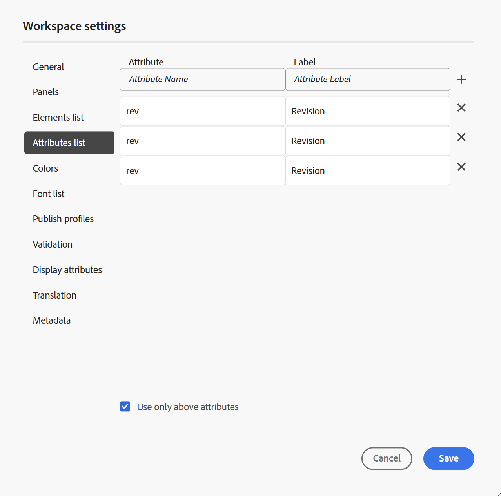{width="650" align="left"}

  透過此設定，當您嘗試將屬性新增至元素時，您只會檢視在清單中設定的屬性清單。

  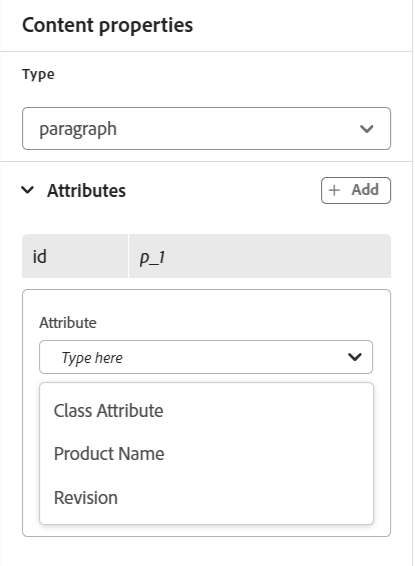{width="300" align="left"}

- **色彩**：顯示&#x200B;**條件**&#x200B;的預先設定背景色彩清單。 使用者可在將條件套用至主題時選取背景顏色。 作為管理員，您還可以建立自訂背景顏色並將其新增到清單中。 若要新增顏色，請在&#x200B;**顏色名稱**&#x200B;欄位中輸入所要的名稱，選擇自訂顏色，然後選取&#x200B;**+**&#x200B;圖示。 自訂顏色會顯示在顏色清單的末尾。

- **發佈設定檔**：這包含可用來發佈&#x200B;**知識庫**&#x200B;輸出的設定檔。 您可以為目標知識庫建立新的設定檔。 例如，Salesforce或ServiceNow。

   - **建立Salesforce設定檔**

     **必備條件**

      - 為Salesforce建立連線應用程式。 如需詳細資訊，請參閱[啟用API整合的OAuth設定](https://help.salesforce.com/s/articleView?id=sf.connected_app_create_api_integration.htm&amp;type=5)。

      - 設定連線應用程式時，請確定下列事項：

         - 指定回呼。

           `URL: http://<server name>:<port>/bin/dxml/thirdparty/callback/salesforce`

         - 選取下列OAuth範圍：
            - 完整存取權（完整）
            - 選取「透過API管理使用者資料(API)」

     設定應用程式後，Salesforce會提供&#x200B;**消費者金鑰**&#x200B;和&#x200B;**消費者機密**。 這些可用來建立Salesforce設定檔。


   - 若要建立Salesforce設定檔，請從&#x200B;**伺服器型別**&#x200B;下拉式清單中選取&#x200B;**Salesforce**&#x200B;知識庫。 輸入設定檔名稱。 在&#x200B;**網站URL**&#x200B;中，輸入您要用來發佈輸出的消費者網站，然後新增Salesforce消費者網站提供的&#x200B;**消費者金鑰**&#x200B;和&#x200B;**消費者機密**。 然後，**驗證**&#x200B;並&#x200B;**儲存**&#x200B;新建立的設定檔。

     在編輯器設定中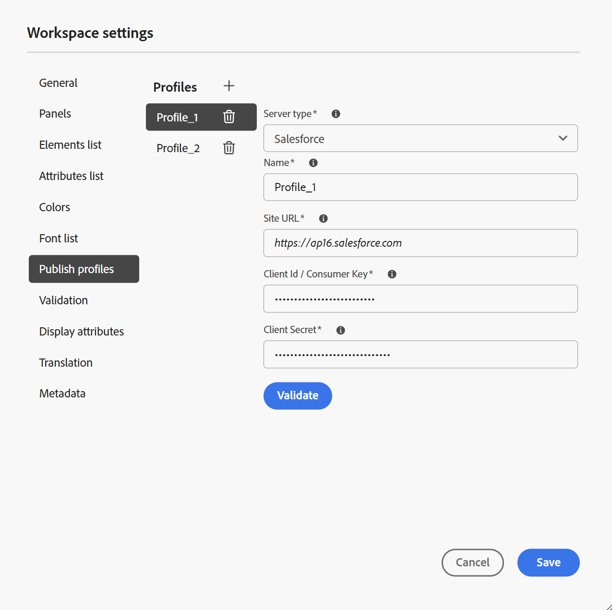{width="550" align="left"}

     >[!NOTE]
     >
     >若要在Experience Manager Guides中設定Salesforce的Proxy，請使用AEM中的Apache HTTP元件Proxy設定。 瞭解如何[設定AEM連結檢查器的Proxy](https://helpx.adobe.com/experience-manager/kb/How-to-configure-proxy-for-the-AEM-Link-Checker-AEM.html)。


   - **建立ServiceNow設定檔**

     **必備條件**

     設定ServiceNow伺服器以上傳資產。
      - 連線到&#x200B;**ServiceNow**&#x200B;伺服器。
      - 瀏覽至&#x200B;**系統屬性** > **安全性**。
      - 取消核取下列選項：

        **此屬性必須設定為啟動用於上傳的MIME型別檢查（所有版本Eureka及以上）。 啟用(true)或停用(false)檔案附件的mime型別驗證。 上傳期間將檢查透過glide.attachment.extensions設定的副檔名是否為MIME型別。**

      - 選取「**儲存**」。

     設定應用程式之後，請建立&#x200B;**ServiceNow**&#x200B;設定檔。

   - 若要建立設定檔，請從&#x200B;**伺服器型別**&#x200B;下拉式清單中選取ServiceNow知識庫。 輸入設定檔&#x200B;**名稱**。 在&#x200B;**ServiceNow URL**&#x200B;中，輸入您要用來發佈輸出的消費者網站，然後新增ServiceNow消費者網站所提供的&#x200B;**使用者名稱**&#x200B;和&#x200B;**密碼**。 然後，**驗證**&#x200B;並&#x200B;**儲存**&#x200B;新建立的設定檔。

     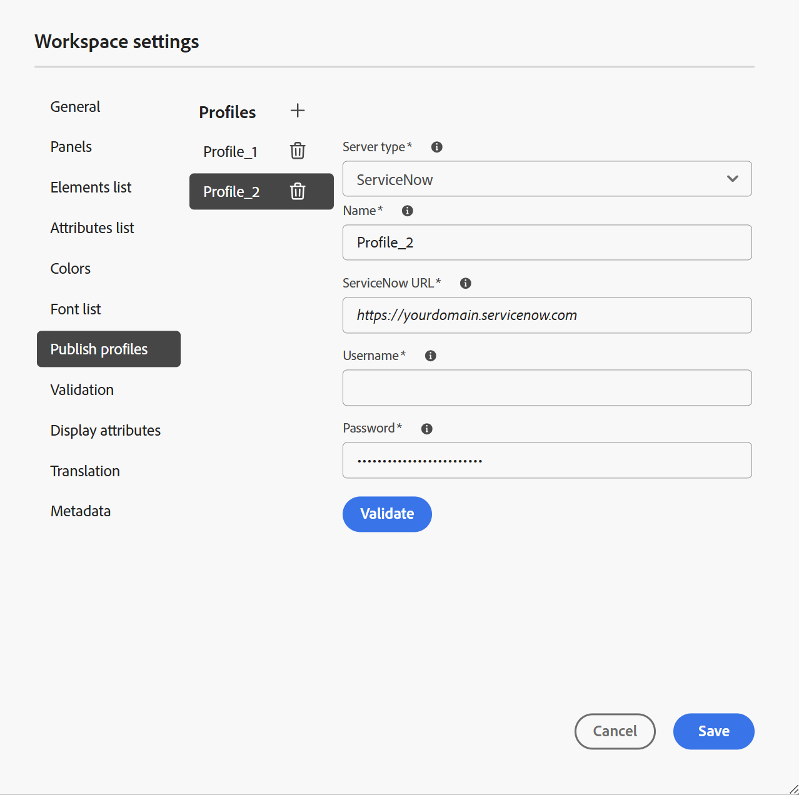{width="550" align="left"}

  驗證之後，您可以在DITA Map的輸出預設集中選取發佈設定檔，並使用它產生輸出至您選擇的&#x200B;**Salesforce**&#x200B;或&#x200B;**ServiceNow**&#x200B;伺服器。

  深入瞭解[知識庫](../user-guide/generate-output-knowledge-base.md)輸出預設集。


- **驗證**：此索引標籤包含在編輯器中設定Schematron驗證的選項。 您可以啟用下列功能：

   - **在儲存檔案之前執行驗證檢查**：選取此項以在任何儲存作業之前使用選取的Schematron檔案執行Schematron驗證。 您可以選取+圖示來新增Schematron檔案。 隨即列出選取的Schematron檔案。

     >[!NOTE]
     >
     >選取的結構描述檔案將會在選取的資料夾設定檔中持續存在。

     在編輯器設定中進行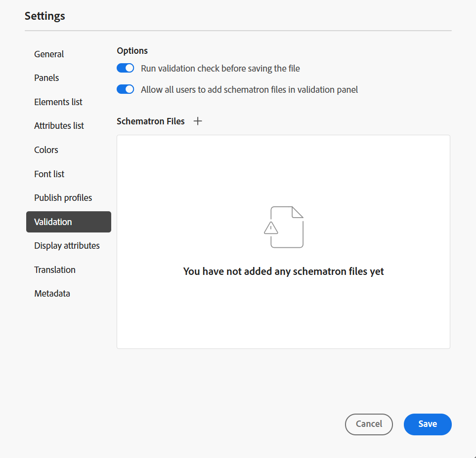{width="550" align="left"}

     這可防止使用者儲存任何破壞所選Schematron檔案中定義規則的檔案。 如果未選取此專案，在儲存變更之前，將不會驗證檔案。

   - **允許所有使用者在驗證面板中新增Schematron檔案**：選取此選項可允許使用者在編輯器的驗證面板中新增任何Schematron檔案。 這可讓使用者新增Schematron檔案，然後針對Schematron檔案驗證主題。 如果未選取此專案，則編輯器&#x200B;**驗證面板**&#x200B;的使用者無法使用新增結構描述檔案&#x200B;**新增結構描述檔案**&#x200B;按鈕的選項。


- **顯示屬性**：如同屬性清單一樣，您可以控制要在元素的屬性清單中顯示的屬性清單。 依照預設，有四個&#x200B;**顯示屬性** — 對象、平台、產品和prop已設定為顯示在元素的屬性清單中。 您也可以使用上方的&#x200B;**新增**&#x200B;圖示來新增顯示屬性。 您也可以使用&#x200B;**刪除**&#x200B;圖示來刪除任何顯示屬性。

  為元素定義的屬性會顯示在「配置圖」和「大綱」檢視中。

  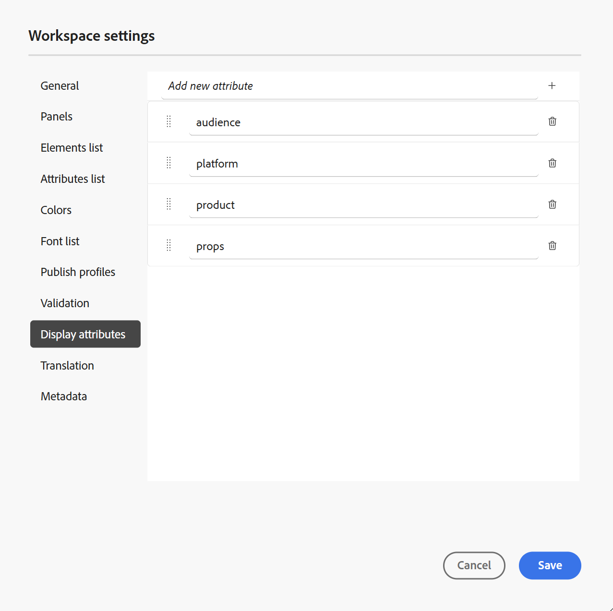{width="550" align="left"}

- **翻譯**：此索引標籤包含建立語言群組、將來源標籤傳播至目標版本，以及清除翻譯專案的選項。

  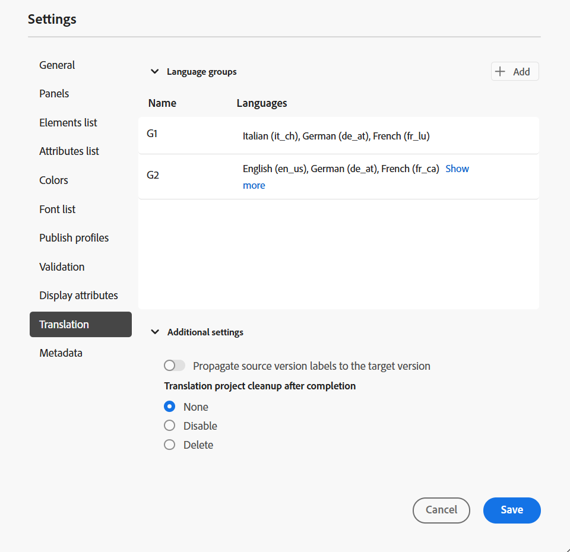{width="550" align="left"}

   - **語言群組**：身為管理員，您可以建立語言群組，並將它們當做一組來翻譯內容。

     執行以下步驟來建立新的語言群組：

      1. 選取「**新增**」。
      1. 輸入語言群組名稱。 每種語言都應該有唯一的名稱。 如果名稱欄位空白或名稱不是唯一的，您可以檢視錯誤。
      1. 從下拉式清單中選取語言。 您可以選取多種語言。

         輸入語言的前幾個字元，或輸入語言代碼以篩選所需的語言。 例如，輸入&#39;en&#39;以篩選名稱或程式碼開頭包含&#39;en&#39;的所有語言。

      1. 選取「完成」圖示，將選取的語言新增至群組。 隨即顯示語言。 新增三種或更多語言時，會顯示&#x200B;**顯示更多**&#x200B;選項。 您可以選取&#x200B;**顯示更多**&#x200B;來檢視群組中存在的所有語言。

         >[!TIP]
         >
         >將&#x200B;**顯示更多**&#x200B;切換為&#x200B;**顯示更少**&#x200B;並只檢視幾種語言。

      1. 將滑鼠停留在群組中的語言上以編輯或刪除語言群組。
      1. 儲存&#x200B;**設定**。

         >[!NOTE]
         >
         >身為使用者，您可以檢視設定至資料夾設定檔的語言群組。

   - **將來源版本標籤傳播到目標版本**：選取此選項可將來源檔案版本的標籤傳遞到轉譯的檔案。 預設為停用。
   - **翻譯專案完成後的清理**：選取此選項可設定在翻譯後自動停用或刪除翻譯專案。 依預設，會選取&#x200B;**無**，這樣專案在翻譯後就會存在。

     如果您想稍後再使用翻譯專案，可以停用這些專案。 刪除專案會永久刪除專案中存在的所有檔案和資料夾。


- **中繼資料**：您可以控制主題的版本中繼資料及其值顯示在&#x200B;**版本記錄**&#x200B;對話方塊中。  在中繼資料路徑中，指定您要從中挑選中繼資料的節點位置。 您也可以為中繼資料定義自訂名稱作為標籤。 預設屬性為「標題」、「檔案狀態」和「標籤」。

  中繼資料可從資產的`/jcr:content`節點下的任何屬性中擷取，因此您可以將屬性的路徑新增為中繼資料路徑。


  如果中繼資料路徑為空白，則會顯示錯誤。 如果您將標籤保留為空白，則會挑選最後一個元素作為標籤。


  編輯器設定中的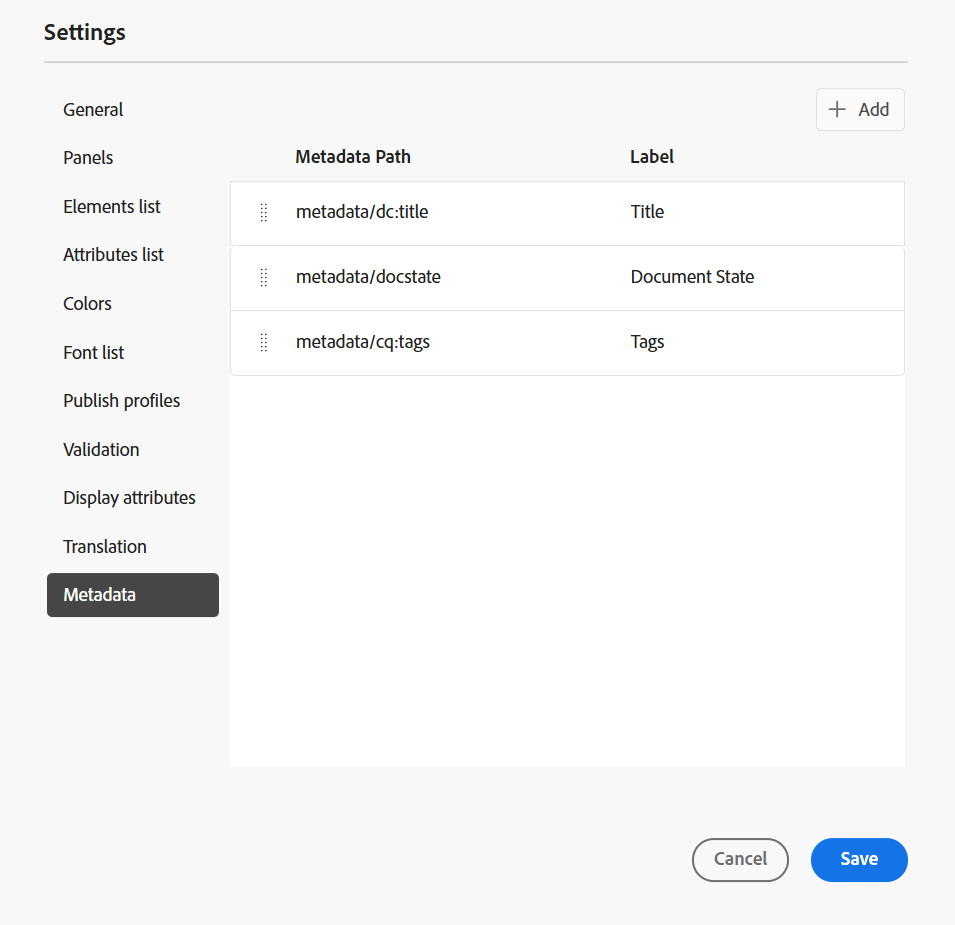{width="550" align="left"}

  *設定&#x200B;**版本記錄**對話方塊的中繼資料。*


  您也可以定義這些中繼資料標籤的顯示順序。 若要變更這些標籤的預設順序，請選取虛線以將標籤拖放到所需位置。
中繼資料標籤會以相同的順序顯示在編輯器的**版本記錄**&#x200B;對話方塊中。

## 工具列

在編輯器中開啟主題或地圖以進行編輯時，工具列隨即顯示。 工具列中的可用功能如下：

- [功能表下拉式清單](#menu-dropdown)
- [內容插入選項](#content-insertion-options)
- [版本資訊和另存為新版本按鈕](#save-as-new-version)
- [鎖定/解鎖](#lockunlock)

>[!NOTE]
>
> 以上列出的功能僅適用於主題檔案。 使用對應檔案時，會根據目前的「對應」編輯器檢視，在工具列中顯示不同的選項。 瞭解[地圖編輯器功能](./map-editor-advanced-map-editor.md)檔案中的地圖編輯器工具列選項。

### 功能表下拉式清單

「選單」下拉式清單提供編輯動作、「尋找和取代」、「版本記錄」、「版本標籤」、「合併」、「建立稽核任務」、「追蹤變更」和「標籤」功能的存取權。

這些功能的詳細說明如下：

**正在編輯動作**

在編輯器中編輯主題時，存取各種編輯動作，例如&#x200B;**剪下**&#x200B;或&#x200B;***Ctrl***+***X***、**複製**&#x200B;或&#x200B;***Ctrl***+***C***、**復原**&#x200B;或&#x200B;***Ctrl***+***Z***、**重做**&#x200B;或&#x200B;***Ctrl***+***Y***&#x200B;以及選單下拉選單中存在&#x200B;**刪除**。


**尋找和取代**

**尋找和取代**&#x200B;功能可在作者和Source檢視模式中使用。 啟用時，「尋找和取代」文字列會顯示在主題編輯區域的底部。 您可以使用快速鍵&#x200B;**CTRL**+**F**&#x200B;來叫用尋找與取代列。

{align="left"}

使用設定圖示\(\)，您可以切換&#x200B;**忽略大小寫**&#x200B;和僅&#x200B;**全字**&#x200B;搜尋選項。 若要執行不區分大小寫的搜尋，請開啟（或選取） **忽略大小寫**&#x200B;選項。 否則，如果您要執行區分大小寫的搜尋，請關閉（或取消選取） **忽略大小寫**&#x200B;選項。 您也可以選擇搜尋整個單字。

搜尋是即時的，這表示當您在&#x200B;**尋找**&#x200B;欄位中鍵入搜尋字詞或文字時，會立即在主題中搜尋並選取該字詞。 同樣地，若要取代主題中的文字，請在個別欄位中輸入搜尋字詞及其取代字詞，並選取&#x200B;**取代**&#x200B;或&#x200B;**全部取代**&#x200B;按鈕。

在Source檢視中，**尋找和取代**&#x200B;功能對於搜尋特定元素或屬性非常有用。 例如，如果您想取代`@product`屬性的值，可以從Source檢視輕鬆地完成此操作。 「作者」檢視不允許您根據屬性或元素進行搜尋。 不過，使用&#x200B;**全部取代**&#x200B;功能時必須小心，因為它可能會覆寫XML程式碼。

**版本記錄**

編輯器中的&#x200B;**版本記錄**&#x200B;功能可讓您檢查DITA檔案的可用版本、比較這些版本，以及還原編輯器本身的任何版本。 您可以將目前版本的內容和中繼資料（也可以是工作復本）與相同檔案的任何先前版本進行比較。 您也可以檢視比較版本的標籤和註解。

>[!NOTE]
>
> 只有在對主題或地圖的第一版本進行變更時，才會顯示版本記錄選項。

若要存取版本記錄並還原至主題的特定版本，請執行下列步驟：

1. 在編輯器中開啟主題。
1. 從&#x200B;**功能表**&#x200B;下拉式清單中選取&#x200B;**版本歷程記錄**。

   **版本記錄**&#x200B;對話方塊就會顯示。

   {width="550" align="left"}

   *預覽不同版本主題中的變更。*

1. 在&#x200B;**比較對象**&#x200B;下拉式清單中，選擇要比較或還原的主題版本。

   >[!NOTE]
   >
   > 如果版本套用了標籤，它們也會與版本編號一起顯示\（在方括弧中）。

1. 啟用&#x200B;**檢視標籤和註解**&#x200B;選項，以檢視套用至目前版本和比較版本的標籤和註解。
1. 您也可以在&#x200B;**版本記錄**&#x200B;對話方塊中檢視下列資訊：

   **預覽**&#x200B;標籤：新加入的內容是綠色字型，而刪除的內容是紅色字型。

   **中繼資料**&#x200B;標籤：新加入的中繼資料為綠色字型，而刪除的中繼資料為紅色字型。

   {width="550" align="left"}的中繼資料差異

   *比較版本記錄中不同版本的中繼資料。*

   >[!NOTE]
   >
   > 您的系統管理員可以從&#x200B;**設定**&#x200B;的中繼資料標籤變更要顯示的中繼資料。 如需詳細資訊，請參閱[索引標籤列](#tab-bar)的&#x200B;**更多動作**&#x200B;區段。

   您也可以檢視目前版本和比較版本的使用者和時間詳細資訊。

   從下拉式清單中選擇版本後，**還原為選取的版本**&#x200B;選項即可使用。 預覽視窗會顯示目前版本與所選主題版本之間的差異。

1. 選取&#x200B;**回覆至選取的版本**&#x200B;以回覆主題選取版本的工作復本。

   「回覆版本」對話方塊隨即顯示。

   {width="550" align="left"}

1. \（*選擇性*\）提供回覆至舊版的原因。 您也可以建立目前使用中之主題工作復本的新版本。

1. 選取&#x200B;**確認。**

   您的檔案工作復本將還原為所選版本。 如果您選擇建立目前作用中工作副本的新版本，則會建立包含所有工作變更的新版本檔案。

   當您回覆至較舊的版本時，會顯示視覺提示，指出您目前使用的版本不是最新版本。

   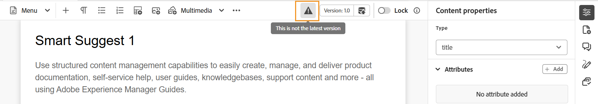{align="left"}

**版本標籤**

標籤可協助您識別特定主題在DDLC （檔案開發生命週期）中的階段。 例如，當您處理主題時，可以將標籤設定為「已核准」。 主題發佈並可供客戶使用後，您就可以為該主題指派「已發行」標籤。

Experience Manager Guides可讓您以自由格式文字格式指定標籤，或使用一組預先定義的標籤。 自訂標籤可讓系統中的任何作者根據其選擇指定標籤。 這可提供彈性，但會導致系統中出現不一致的標籤。 若要克服此問題，管理員可以設定一組預先定義的標籤。 如需有關設定預先定義標籤的詳細資訊，請在[安裝與設定Adobe Experience Manager Guides as a Cloud Service]中檢視&#x200B;*設定和自訂XML Web編輯器*。

這些標籤會以下拉式清單的形式顯示給需要指定標籤的作者。 這可確保在系統中只使用預先定義、一致的標籤。

您可以透過不同的方法將標籤套用至主題 — Assets UI、[基準](/help/product-guide/user-guide/generate-output-use-baseline-for-publishing.md) UI和編輯器中的[版本記錄](web-editor-use-label.md)面板。 編輯器中的版本標籤功能可讓作者快速輕鬆地為其主題指派標籤。

若要從編輯器將標籤新增至主題，請執行下列步驟：

1. 在編輯器中開啟主題。

1. 從功能表下拉式清單中選取&#x200B;**版本標籤**。

   隨即顯示「版本標籤管理」對話方塊。

   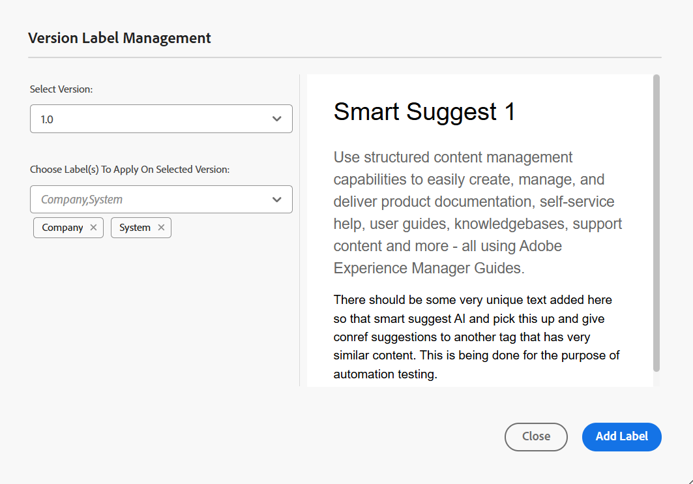{width="650" align="left"}

   「版本標籤管理」對話方塊分為兩個部分 — 左側面板包含可用於主題的版本清單，以及標籤下拉式清單\（或文字方塊以輸入標籤\），右側面板包含主題預覽。

1. 選取要套用標籤的版本。

   當您從版本清單中選擇不同的主題版本時，預覽面板會顯示目前版本和所選主題版本之間的變更

   >[!NOTE]
   >
   > 如果標籤已套用至版本，則會顯示在下拉式清單中的版本編號旁，以及「選取版本」清單的下方。 您可以選取標籤旁邊的\(**x**\)圖示來移除現有標籤。

1. 如果您的管理員已定義標籤清單，則會顯示一個標籤下拉式清單，您可以從中選擇要套用的標籤。 您可以從下拉式清單中選取多個標籤。

   否則，您會看到一個文字方塊，您可以在其中輸入要新增至主題的標籤。

   >[!NOTE]
   >
   > 您無法在一個主題的多個版本上套用相同的標籤。 如果您嘗試關聯現有的標籤，則系統會提供您選項，讓您從現有版本中移除該標籤，並將其套用至主題的所選版本。

1. 選取&#x200B;**新增標籤**。

1. 在「套用標籤」確認訊息中，選取&#x200B;**移動標籤（若用於其他版本）**&#x200B;選項，將標籤從現有版本移動至選取的版本。 如果您未選取此選項，而且有標籤指派給不同的主題版本，則不會將其移至所選主題的版本。 在標籤應用程式中會忽略此類標籤。

**合併**

當您在多作者環境中工作時，很難追蹤其他作者在主題或地圖中所做的變更。 「合併」功能可讓您更進一步控制檢視變更，以及哪些變更會保留在檔案的最新版本中。

- **合併主題檔案**

  若要合併主題中的變更，請執行下列步驟：

   1. 在編輯器中開啟主題。

   1. 選取&#x200B;**合併**。

      「合併」對話方塊隨即顯示。

      {width="550" align="left"}

   1. *\（選擇性\）*&#x200B;您也可以瀏覽並從存放庫的其他位置選取新檔案。

   1. 選取要與檔案目前版本進行比較的檔案版本。

   1. 從「選項」中選擇：

      - **從選取的版本追蹤變更**：此選項會以追蹤變更的形式顯示所有內容更新。 然後，您可以選擇一次接受或拒絕一個檔案變更，或一次接受或拒絕全部檔案變更。

      - **還原至選取的版本**：此選項會將檔案的目前版本還原至選取的版本。 此選項無法讓您控制接受或拒絕哪些內容。

   1. 選取「**完成**」。

   1. 如果您選取&#x200B;**從選取的版本**&#x200B;追蹤變更選項，則從選取的版本進行的所有變更都會顯示在右側面板的追蹤變更功能中。

      您可以從「追蹤的變更」面板選擇接受或拒絕所有註解，或接受或拒絕個別註解。


- **合併對應檔案**

  若要合併對映檔案中的變更，請執行下列步驟：

   1. 在編輯器中開啟對應。

   1. 選取&#x200B;**合併**。

      「合併」對話方塊隨即顯示。

      {width="550" align="left"}

   1. *\（選擇性\）*&#x200B;您也可以瀏覽並從存放庫的其他位置選取新檔案。

   1. 選取要與檔案目前版本進行比較的檔案版本。

   1. 從「選項」中選擇：

      - **從選取的版本追蹤變更**：此選項會以追蹤變更的形式顯示所有內容更新。 然後，您可以選擇一次接受或拒絕一個檔案變更，或一次接受或拒絕全部檔案變更。

      - **還原至選取的版本**：此選項會將檔案的目前版本還原至選取的版本。 此選項無法讓您控制接受或拒絕哪些內容。

   1. 選取「**完成**」。

   1. 如果您選取&#x200B;**從選取的版本**&#x200B;追蹤變更選項，則選取版本的所有變更都會顯示在「追蹤的變更」面板\（在右側\）中。

      您可以選擇從「追蹤的變更」面板接受或拒絕所有變更，或者接受或拒絕對應檔案中的個別變更。


**建立稽核任務**

您可以直接從編輯器[建立目前主題的稽核工作](./review-send-topics-for-review.md)或對應檔案。 開啟您要建立稽核工作的檔案，並從[功能表]下拉式清單中選取[建立稽核工作] **，以啟動稽核建立程式。**

**追蹤變更**

您可以啟用「追蹤變更」模式，以追蹤檔案上所做的所有更新。 啟用追蹤變更後，所有插入和刪除動作都會擷取到檔案中。 所有刪除的內容會使用「刪除線」反白顯示，而所有插入會以綠色文字反白顯示。 此外，您也會在主題頁面的邊緣取得變更列。 對於刪除的內容，再次顯示紅色列，對於新增的內容，則顯示綠色列。 如果同一行有新增和刪除，則會同時顯示綠色和紅色長條。

下列熒幕擷圖會醒目顯示刪除和插入的內容以及變更列：

{width="650" align="left"}

追蹤檔案中變更的典型使用案例可能是進行同級檢閱。 您可以啟用追蹤變更並共用檔案以供檢閱，然後檢閱者會進行變更並開啟追蹤變更。 當您收到檔案時，您應該具有檢視建議更新的機制，以及接受或拒絕變更的便利方式。

Experience Manager Guides提供追蹤變更功能，其中包含檔案中所做更新的相關資訊。 追蹤變更功能提供有關已進行哪些更新、誰進行這些更新以及何時進行的資訊。 使用追蹤的變更功能，您也可以輕鬆地接受或拒絕檔案中建議的更新。

若要存取此功能，請選取右側面板中的&#x200B;**追蹤變更**&#x200B;圖示。

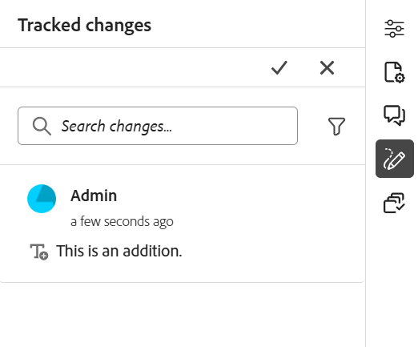{width="300" align="left"}

選取追蹤的變更會選取檔案中的變更內容。 您可以選取「接受變更」圖示來接受變更，或選取「拒絕變更」來拒絕變更。

如果您要接受或拒絕所有變更，只要按一下，請選取&#x200B;**接受所有變更**&#x200B;或&#x200B;**拒絕所有變更**。

>[!NOTE]
>
> 「預覽」模式可讓您檢視包含或不包含變更內容標示的檔案。 如需詳細資訊，請檢視[預覽](web-editor-views.md#preview-mode-id19AAGL00163)模式。

**標籤**

編輯器中的&#x200B;**標籤**&#x200B;功能是控制DITA元素可見性的切換按鈕。 啟用時，它會在內容中顯示結構標籤，讓您更有效地檢視和管理基礎DITA元素。 停用後，編輯器會隱藏這些標籤，提供更乾淨、更聚焦的製作環境。

下列熒幕擷圖顯示已啟用「標籤」檢視的檔案：

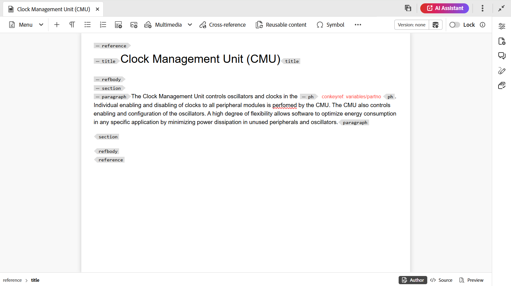{width="650" align="left"}

下列操作可在含有「標籤」的檔案中執行：

- **選取元素**：選取元素的開頭或結尾標籤，以選取其內容。

- **展開或收合標籤**：選取+或 — 登入標籤，以展開或收合標籤。

- **使用內容功能表**：內容功能表提供剪下、複製或貼上選取專案的選項。 您也可以在選取的元素之前或之後插入元素。 其他選項可讓您為選取的元素產生ID或開啟「屬性」面板。

- **拖放元素**：選取元素的標籤，然後輕鬆將其拖放到您的檔案中。 如果放置位置是允許元素的有效位置，則元素會放置在放置位置。


>[!NOTE]
>
> 如果使用者從編輯器啟用「標籤」檢視，則即使跨工作階段，該檢視也會保持啟用狀態。 這表示您不需要再次啟用標籤檢視即可稍後存取。 新使用者工作階段的標籤檢視預設值由`ui\_config.json`檔案中的`tagsView`屬性決定。 如需詳細資訊，請檢視安裝與設定Adobe Experience Manager Guides as a Cloud Service中的[設定標籤檢視的預設值](../cs-install-guide/configure-default-value-tags-view.md)區段。

### 內容插入選項

**元素** - 

在目前或下一個有效位置插入有效元素。 您也可以使用鍵盤快速鍵&#x200B;***Alt***+***Enter***&#x200B;來開啟[元素]對話方塊。 例如，您正在編輯一個段落，然後在&#x200B;**元素**&#x200B;對話方塊中，會顯示可插入段落中的元素清單。 選取您要插入的元素。 您可以使用鍵盤捲動元素清單，然後按&#x200B;***Enter***&#x200B;插入必要的元素。

您可以檢視兩種有效元素：

- **目前位置的有效元素**：清單會顯示您可在目前游標位置本身插入的元素。

- **目前位置以外的有效元素**：清單會顯示您可以在元素階層內目前元素的任何父項之後插入的元素。

例如，如果您在內嵌`<b>`元素內，則可以在目前位置插入`<u>`、`<xref>`、`<i>`等元素。 相反地，您可以在目前位置之外插入`<table>`和`<topic>`等元素。

您也可以在搜尋方塊中輸入字元或字串，並搜尋以它開頭的元素。

{width="300" align="left"}

*輸入&#39;t&#39;以搜尋以&#39;t&#39;開頭的所有有效元素。*

如果您在區塊元素（如`note`）內工作，則使用[插入元素]圖示在`note`元素之後插入新元素。 在下列熒幕擷圖中，筆記元素已插入p \(paragraph\)元素內：

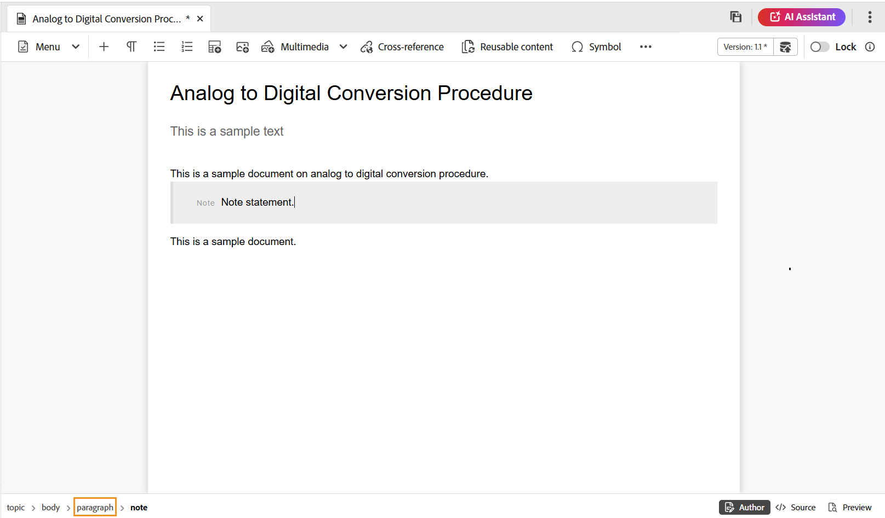{align="left"}

如果您在註記元素中按Enter鍵，會在註記元素本身中建立新段落。 若要在附註外插入新元素，請在元素階層連結中選取p元素\（在熒幕擷取畫面中反白顯示\），然後選取「元素」圖示，或按&#x200B;***Alt***+***Enter***&#x200B;開啟「插入元素」對話方塊。 然後，選取想要的元素並按Enter鍵將選取的元素插入註記元素之後。

當閃爍的區塊游標出現時，您也可以在兩個元素之間新增元素。


{width="300" align="left"}

例如，如果您正在處理DITA主題，而區塊游標在簡短說明與內文之間閃爍，您可以新增`prolog`元素，然後新增版權、作者和其他詳細資料。

輸入新元素的另一種方法是使用快顯選單。 在檔案中的任何位置按一下滑鼠右鍵，以叫用前後關聯功能表。 從此功能表選擇&#x200B;**插入元素**&#x200B;以顯示&#x200B;**插入元素**&#x200B;對話方塊，並選擇您要插入的元素。

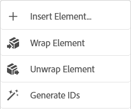{width="300" align="left"}

**段落** - 

在目前或下一個有效位置插入段落元素。

**專案符號清單** - 

在目前或下一個有效位置建立專案符號清單。 如果您在專案符號清單中並選取此圖示，專案會轉換為一般段落。

**編號清單** - 

在目前或下一個有效位置建立編號清單。 如果您在編號清單中並選取此圖示，專案會轉換為一般段落。

>[!NOTE]
>
>您也可以從清單專案的內容功能表中選取&#x200B;**分割清單**&#x200B;選項，以分割目前清單並在相同層級開始新的清單。

**資料表** - 

在目前或下一個有效位置插入表格。 選取「表格」圖示以開啟「插入簡單表格」對話方塊。

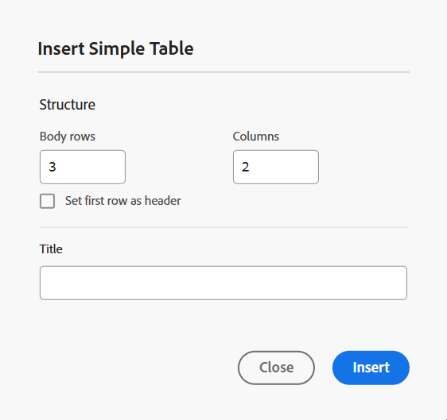{width="550" align="left"}

>[!NOTE]
>
> 您也可以從MS Word或Excel複製表格，並將其貼到Experience Manager Guides主題檔案中。 根據XML編輯器組態中設定的設定，複製的資料表將貼上為`<simpletable>`或`<tgroup>`。 如需詳細資訊，請檢視[設定貼上表格的顯示](../cs-install-guide/conf-pasted-tables.md)。

您可以指定表格中所需的列數和欄數。 如果要保留第一列作為表格標題，請選取&#x200B;**將第一列設定為標題**&#x200B;選項。 若要為表格新增標題，請在「標題」欄位中輸入標題。

插入表格之後，您可以使用前後關聯功能表來修改表格。

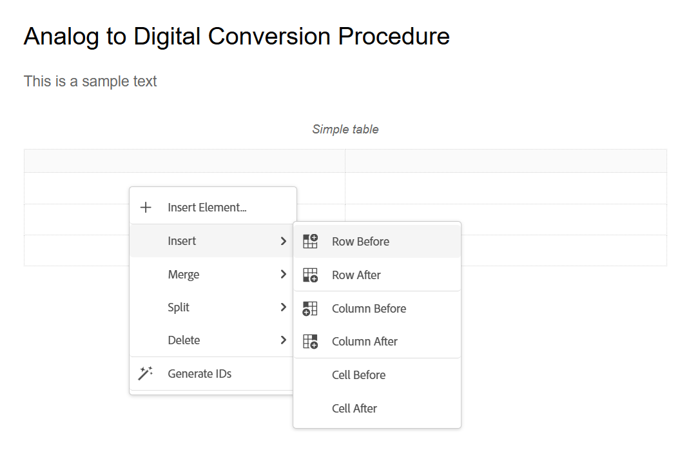{width="550" align="left"}


使用表格的內容功能表，您可以：

- 插入儲存格、列或欄

- 合併向右和向下方向的儲存格

- 水平或垂直分割儲存格

- 刪除儲存格、列或欄

- 產生ID


您也可以在表格的多個儲存格、整列或欄上定義屬性。 例如，若要對齊表格儲存格，請拖曳並選取所需的儲存格。 在「內容屬性」面板（右側）中，屬性&#x200B;**Type**&#x200B;變更為&#x200B;**entry**。

1. 在&#x200B;**屬性**&#x200B;區段中，選取&#x200B;**+新增**。
1. 從&#x200B;**屬性**&#x200B;下拉式清單中選取`@valign`屬性。
1. 從值下拉式清單中，選取您想要套用至所選表格儲存格的文字對齊方式。
1. 選取&#x200B;**新增。**

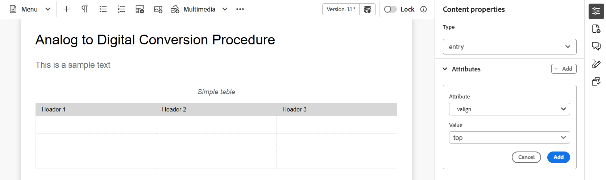{align="left"}

**影像** - 

在目前或下一個有效位置插入影像。 選取「影像」圖示以開啟「插入影像」對話方塊，然後搜尋並選取您要插入的影像。

>[!NOTE]
>
> 您也可以將影像從本機系統拖放到文章上，以新增影像。 在此情況下，會使用&#x200B;**上傳Assets**&#x200B;工作流程新增影像檔案。  如需詳細資訊，請在[左側面板](#left-panel)區段中檢視&#x200B;**上傳Assets**&#x200B;工作流程。


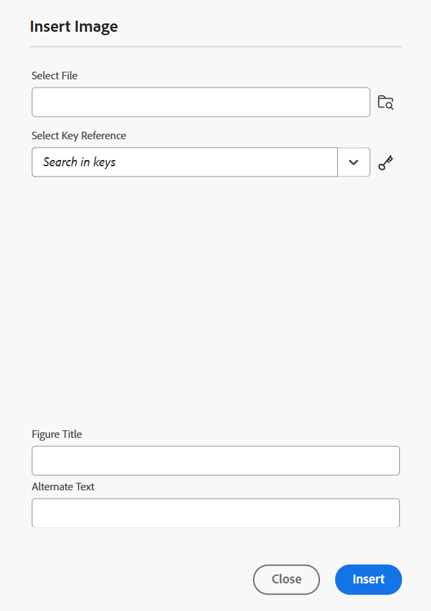{width="650" align="left"}

您可以在「插入影像」對話方塊中為影像新增影像/插圖示題和替代文字。

>
>
> 當您插入影像並為其指定替代文字時，會根據最新的DITA標準將其新增到`<alt>`元素中。 不建議將`@alt`屬性用於替代文字，但在舊版DITA中仍支援此功能。

使用&#x200B;**選取檔案**&#x200B;選項，您可以依檔案名稱搜尋所需的影像檔案。 您也可以依路徑\（以搜尋\）、集合、檔案型別和標籤來篩選搜尋結果。 找到必要的影像檔之後，請選取檔案並選擇&#x200B;**選取**&#x200B;將影像插入檔案中。 您可以插入各種格式的影像檔案，例如`.png`、`.svg`、`.gif`、`.jpg`、`.eps`、`.ai`、`.psd`等。

插入影像後，您可以從「內容屬性」面板變更高度、寬度、位置和屬性。 選取影像檔案，然後在右側面板的「內容屬性」面板中進行變更。

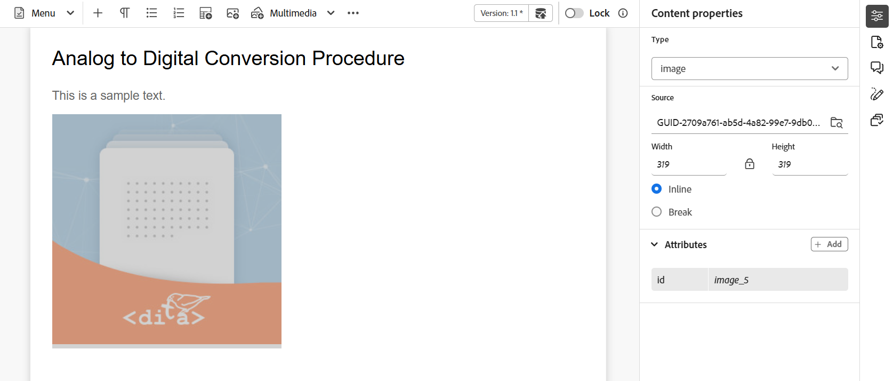{align="left"}

Source欄位會顯示所插入影像檔案的UUID。 您可以將滑鼠指標停留在Source欄位上，以找到所插入影像檔案的完整路徑。 路徑會顯示在工具提示中。

您可以提供影像檔案的「高度」或「寬度」值來調整影像大小。 影像的外觀比例會自動維持不變。 如果需要，您也可以選取鎖定圖示\(屬於「維持外觀比例」(Maintain Aspect Ratio\)，並提供「高度」(Height)和「寬度」(Width)值，來選擇不維持影像檔案的外觀比例。

您也可以將影像的「位置」設定指定為「內嵌」或「破斷」。 如果您選擇使用「破斷位置」(Break placement)選項，則可以選擇對齊影像的位置(「左」(Left)、「中」(Center)或「右」(Right))。

您也可以選取&#x200B;**屬性**&#x200B;欄位中的必要屬性，為影像檔案新增其他屬性。

>[!NOTE]
>
>您也可以在影像中定義可點按區域\（影像地圖\）。 如需詳細資訊，請在[左側面板](web-editor-features.md#left-panel)區段中檢視&#x200B;**插入/編輯影像地圖**&#x200B;功能說明。

影像或媒體檔案的&#x200B;**內容功能表**

您也可以使用快顯選單執行影像和媒體檔案的一些常見操作。 在影像上的任何位置按一下滑鼠右鍵，以叫用快顯選單。

快顯選單提供剪下、複製或貼上影像或媒體的選項。 您可以在選取的元素之前或之後插入元素。 您也可以選擇重新命名或取消繞排元素。 您可以在存放庫中找出選取的影像或媒體，或在Assets UI中檢視檔案預覽。

快顯選單中的其他選項可讓您複製路徑、編輯影像地圖、重新命名元素、建立程式碼片段，或產生所選元素的ID。

**插入/編輯影像地圖**

在選取的影像上插入影像地圖。 含有連結至主題或網頁之可點按區域的影像稱為影像地圖。

在目前主題中選取影像，並選取「插入/編輯影像地圖」圖示以開啟「插入影像地圖」對話方塊。

{width="650" align="left"}

選擇偏好的形狀「矩形」、「圓形」或「多邊形」，在影像上定義要做為連結的區域。 定義區域後，會出現「參照」對話方塊，您必須在其中指定內部或外部內容的連結：

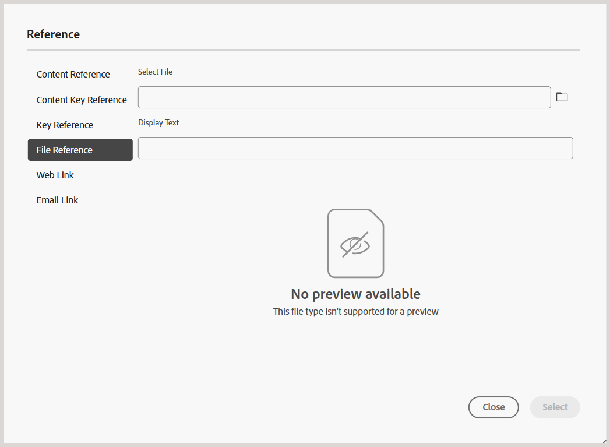{width="650" align="left"}

如果區域重疊，您可以按一下工具列中的個別圖示，將形狀向前或向後傳送。 您也可以選取區域並按一下「刪除」圖示來移除區域。 連按兩下區域會開啟「參照」對話方塊，您可以在此變更目的地連結。 在影像上標示必要的區域後，選取&#x200B;**完成**&#x200B;以儲存變更。


**多媒體**

插入不同型別的多媒體檔案。 選取「多媒體」下拉式圖示，然後選擇要插入的檔案型別。 支援的多媒體格式包括：

- 音訊檔案
- 視訊檔案
- YouTube
- Vimeo

選取「音訊或視訊檔案」選項時，系統會顯示儲存庫檢視，供您瀏覽並選取所要的檔案。 如果您選擇YouTube或Vimeo，則會出現「插入多媒體」對話方塊。 在網頁連結欄位中貼上視訊檔案的連結，然後選取「插入」，在檔案中目前或下一個有效位置新增視訊。

>[!NOTE]
>
> 新增YouTube視訊連結時，您需要在URL中將字串`watch?v=`取代為`embed`。 例如，若要新增YouTube視訊連結： `https://www.youtube.com/**watch?v**=WlIKQOrmZcs`，您必須將它新增為： `https://www.youtube.com/**embed/**WlIKQOrmZcs`。 這項變更可確保影片嵌入到AEM網站和PDF輸出中。

您也可以從「插入多媒體」對話方塊新增音訊或視訊檔案。 選取「音訊/視訊檔案」選項，然後選取瀏覽圖示以啟動存放庫檢視。 從儲存庫選取音訊或視訊檔案，然後選取&#x200B;**選取**，在[音訊/視訊檔案]欄位中新增檔案的連結。 如果您選擇視訊檔案，則該檔案的預覽也會顯示在「預覽」區域中。 您可以播放視訊檔案以檢視其預覽。

{width="650" align="left"}

**交叉引用**

插入參照 — 內容參照、內容索引鍵參照、索引鍵參照、檔案參照、網頁連結或電子郵件連結。

選取&#x200B;**選取檔案**&#x200B;圖示\（適用於「內容參考」和「檔案參考」\）或&#x200B;**選取根對應**&#x200B;圖示\（適用於「內容索引鍵參考」和「索引鍵參考」\），並選取要連結到的所需檔案或內容。

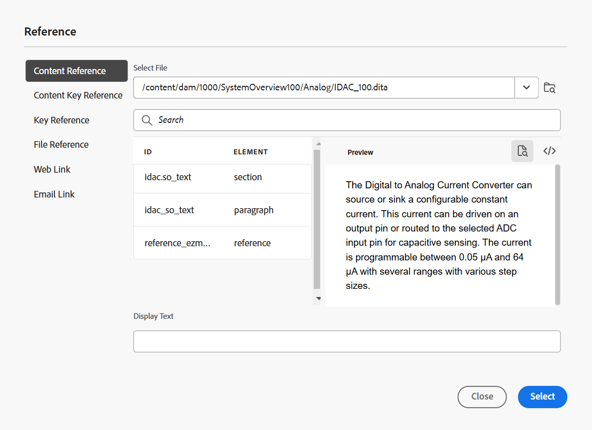{width="650" align="left"}

所選參照的連結會加入檔案中。 連結上的內容功能表提供下列選項：

- **插入元素**：顯示可在指定內容插入的有效元素清單。
- **複製UUID**：複製插入參考的UUID。
- **複製路徑**：複製插入參照的完整路徑。
- **產生ID**：為插入的參考產生唯一ID。

您也可以使用要參照之檔案的UUID來搜尋。 在「內容」和「鍵參照」連結中，輸入要連結之檔案的UUID，檔案會自動搜尋並顯示在「預覽」區段中。 當您指定檔案的UUID時，您不需要明確提及.xml檔案的副檔名。 .xml副檔名會自動附加至UUID。

{width="650" align="left"}

如果您的管理員已啟用&#x200B;*XMLEditorConfig*&#x200B;中的UUID選項，則您將會在&#x200B;**Link**&#x200B;屬性中檢視參考內容的UUID。

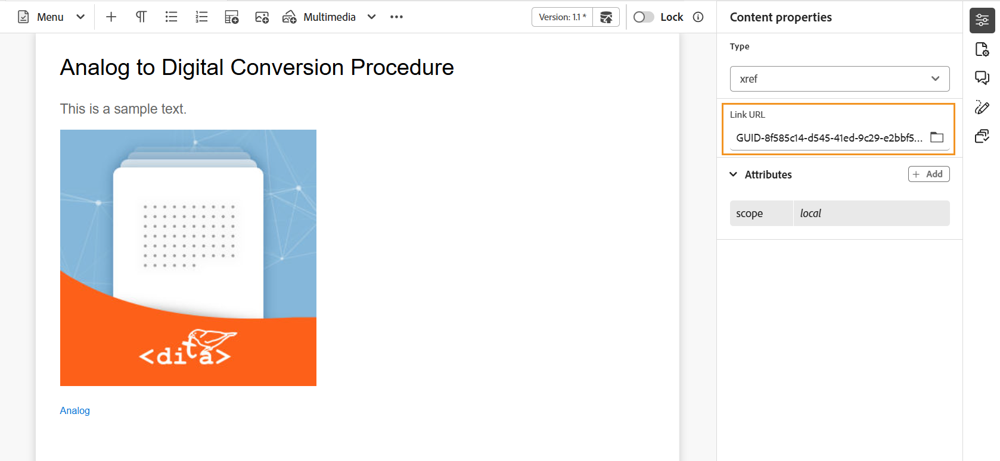{align="left"}

>[!NOTE]
>
> 如果未啟用&#x200B;**啟用UUID**&#x200B;選項，則會顯示參考內容的相對路徑。

>[!IMPORTANT]
>
> 即使參考內容的相對路徑顯示在&#x200B;**Link**&#x200B;屬性中，內部仍會使用參考內容的UUID建立連結。

>[!TIP]
>
> 檢視最佳實務指南中的參照區段，瞭解參照內容的最佳實務。

**篩選搜尋**

您可以在AEM存放庫所選路徑上的檔案中搜尋某些文字。 例如，「general」會在下列熒幕擷取畫面中搜尋。 您也可以使用增強型篩選器來縮小搜尋範圍。 您可以尋找所有DITA檔案，例如存在於所選路徑上的DITA主題和DITA Map。

您可以在選取的路徑中搜尋非DITA檔案，例如影像檔案、多媒體和檔案。 您也可以搜尋DITA元素屬性中的特定值。 您也可以尋找由指定使用者出庫的檔案。

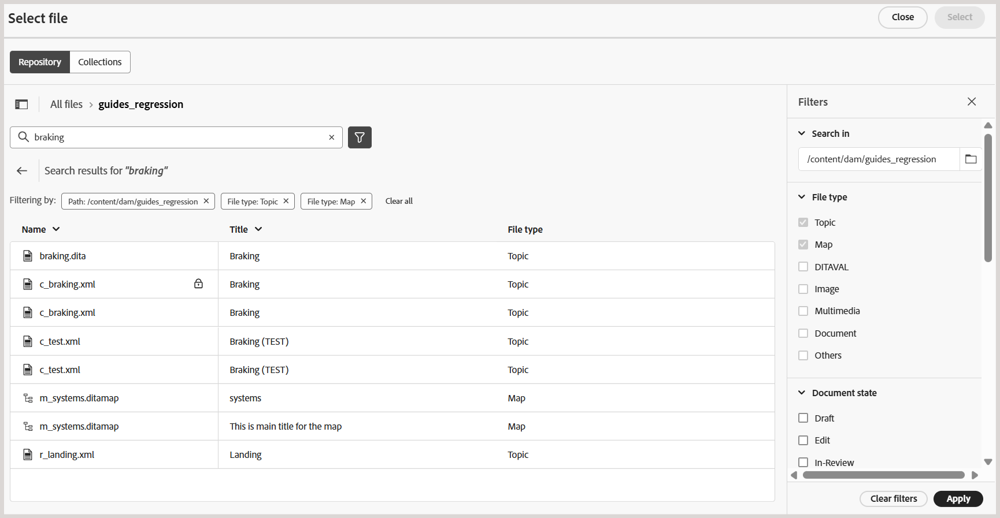{width="650" align="left"}

>[!NOTE]
>
> 您的系統管理員也可以設定文字篩選器，並顯示或隱藏其他篩選器。 如需詳細資訊，請檢視「安裝與設定Adobe Experience Manager Guides as a Cloud Service」中的&#x200B;*設定文字篩選器*&#x200B;區段。

將顯示包含搜尋文字的篩選檔案清單。 例如，在上面的熒幕擷圖中，會列出包含「一般」文字的檔案。 您也可以預覽檔案的內容。


**可重複使用的內容** - 

重複使用專案中任何其他檔案內存在的內容。 您可以直接連結到檔案中的內容，或使用金鑰參照來插入內容，檢視[解析金鑰參照](map-editor-other-features.md#id176GD01H05Z)。 當您選取「可重複使用的內容」圖示時，您會看到「重複使用內容」對話方塊：

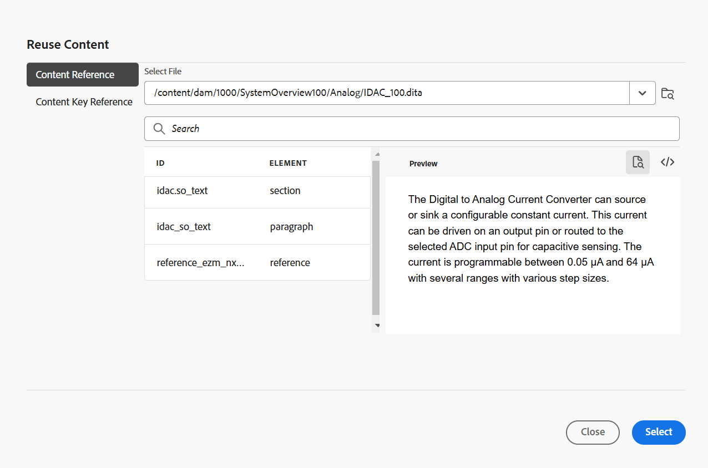{width="650" align="left"}

在「重複使用內容」對話方塊中，選取檔案參照的DITA檔案或包含關鍵參照的DITA map檔案。 選取後，對話方塊中會顯示主題或關鍵參照。 您可以選取要插入之主題的ID/索引鍵，並選取&#x200B;**完成**&#x200B;以插入主題中的內容。

若要插入「內容參照」，您也可以輸入檔案的UUID，且該檔案中的可重複使用內容會列在「預覽」區段中。

根據插入連結的設定，您可以在「屬性」面板或Source程式碼檢視中檢視插入內容的UUID或相對路徑。 連結一律會使用參照內容的UUID來建立。 檢視「安裝」中的&#x200B;*設定UUID型連結*，並設定Adobe Experience Manager Guides as a Cloud Service。

>[!NOTE]
>
> 若要在參照的內容之前或之後新增內容，請使用&#x200B;*Alt*+*Left*&#x200B;方向鍵或Alt+*Right*&#x200B;方向鍵將游標移至所要的位置。

您也可以在主題中內嵌參照的內容，方法是以滑鼠右鍵按一下參照的內容，然後從內容功能表中選擇&#x200B;**以內容取代參照**。

**符號** - 

在主題中插入特殊字元。 選取「符號」圖示以開啟「插入特殊字元」對話方塊。

>[!NOTE]
>
> Experience Manager Guides提供可移動和可調整大小的對話方塊。 在右下角有兩個橫線的對話方塊可以調整大小。 「特殊字元」對話方塊中的十字線顯示如下。

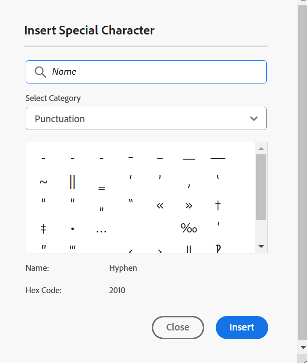{width="550" align="left"}

在「插入特殊字元」對話方塊中，您可以使用特殊字元的名稱來搜尋特殊字元。 所有特殊字元都儲存在各種類別下。 使用選取類別下拉式清單並選取類別。 會顯示所選類別中可用的特殊字元。 您可以使用方向鍵瀏覽特殊字元的清單，或選取想要插入的字元。 所選特殊字元的「名稱」和「十六進位代碼」會顯示在清單下方。 選取&#x200B;**插入**&#x200B;以在檔案中插入選取的字元。

**關鍵字** - 

插入在DITA map中定義的關鍵字。 選取「關鍵字」選項以開啟「鍵參照」對話方塊。

{width="550" align="left"}

關鍵字會依字母順序列出，您也可以在「搜尋」方塊中輸入搜尋字串來搜尋關鍵字。 搜尋結果會傳回包含ID或值字串的關鍵字。 DITA map中定義的關鍵字會列在此對話方塊中。 選擇要插入的關鍵字並選取&#x200B;**插入**。

您也可以在關鍵字上按一下滑鼠右鍵並選取「屬性」選項，以變更插入關鍵字的屬性。 **關鍵字的屬性」對話方塊開啟：

{width="550" align="left"}

您可以變更關鍵字的屬性或新增屬性至關鍵字。

**代碼片段** - 

在目前或下一個有效位置插入程式碼片段。 若要讓此功能運作，您必須在系統中定義程式碼片段。 如需新增程式碼片段的詳細資訊，請檢視[左側面板](web-editor-features.md#left-panel)區段中的&#x200B;**程式碼片段**&#x200B;功能說明。

選取「程式碼片段」選項時，您會看到「插入程式碼片段」目錄。 目錄是內容感應式的，這表示只有在目前位置允許程式碼片段時，才會顯示程式碼片段。

下列範例顯示兩個預先設定的程式碼片段 — 「警告」和「錯誤」，可插入檔案中的目前位置。

{width="300" align="left"}

當您從清單中選擇程式碼片段時，它會插入檔案中目前或下一個有效位置。 下列熒幕擷圖顯示插入檔案中的錯誤程式碼片段：

{width="400" align="left"}

**引文** - 

建立引文並將其新增至您的內容。 瞭解如何[新增和管理內容中的引文](./web-editor-apply-citations.md)。

**查詢資料** - 

與您的資料來源連線，並使用資料建立內容。 了解如何 [使用資料來源中的資料](./web-editor-content-snippet.md)。

### 版本資訊和另存為新版本

**版本資訊和另存為新版本**&#x200B;功能將版本追蹤和內容儲存結合為單一功能。

- 版本資訊會顯示目前版本的主題或地圖。 版本編號旁會出現星號(*)，表示未儲存的變更。

  版本編號會隨著為主題或對應檔案建立的每個新版本而變更。 如果您正在處理新建立的檔案，則版本資訊會顯示為&#x200B;**none**。

  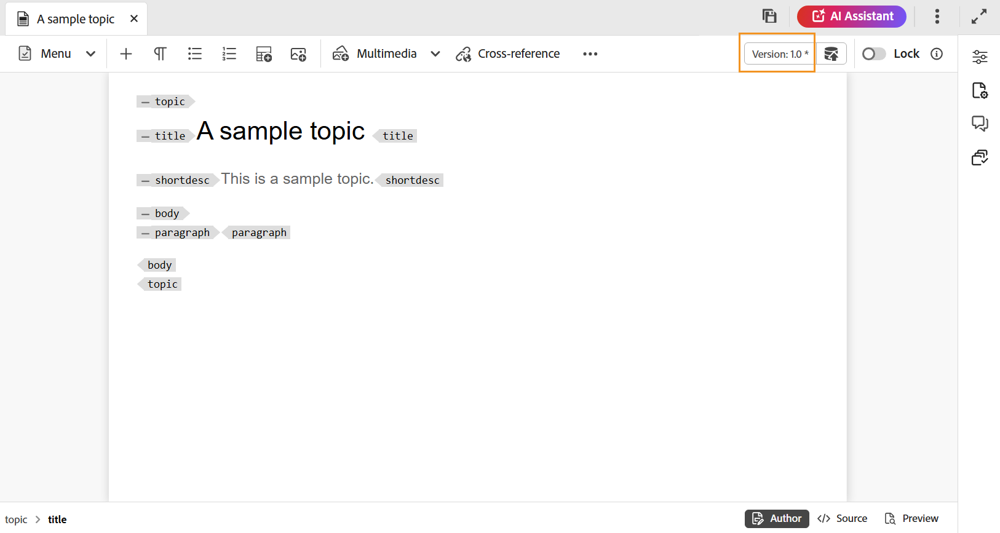{align="left"}


- **另存為新版本**&#x200B;按鈕可儲存您在主題中所做的變更，並建立主題的新版本。

  {align="left"}


當您選擇使用&#x200B;**另存為新版本**&#x200B;來儲存主題或地圖時，會出現下列對話方塊：

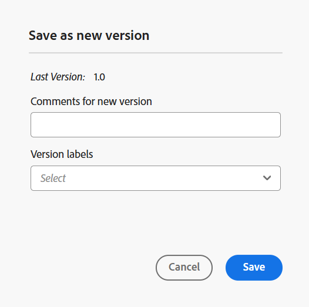{width="300" align="left"}

輸入註釋和版本標籤以識別變更，並選取&#x200B;**儲存**&#x200B;以建立檔案的新版本。

當您選擇&#x200B;**另存為新版本**&#x200B;選項時，主題的第一版本會在DAM中建立，這也會成為您主題的目前使用中版本。 稍後，如果您回覆成舊版主題，該版本就會成為您目前使用中的主題版本。

如果您的管理員有預先設定的版本標籤，您將在下拉式清單中檢視這些標籤。 您可以從可用標籤清單中選擇標籤，並儲存檔案。

{width="300" align="left"}

儲存主題時，您可以新增註解，指定您在主題中所做的變更。 此註解會顯示在主題的「版本記錄」中。

如果您的主題正在稽核中，您的稽核者將收到通知，指出有較新版本的主題可用。 他們可以輕鬆存取您檔案的最新修訂版本，並繼續檢閱您主題的最新版本。

當您將指標停留在主題標題上時，會顯示檔案標題、檔案路徑和版本號碼。

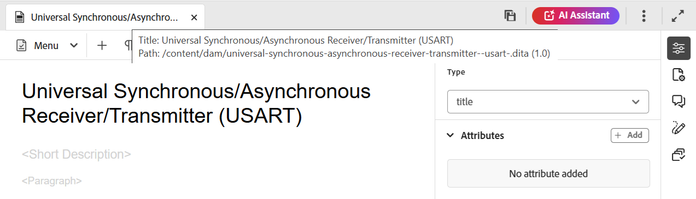{align="left"}

>[!NOTE]
>
> 主題版本可用後，您也可以在主題中新增標籤。 然後，您可以使用這些標籤來建立基準線，以發佈檔案的特定版本。 如需有關在主題中使用標籤的詳細資訊，請檢視[使用標籤](web-editor-use-label.md#)。

### 鎖定/解鎖

鎖定或解除鎖定目前的檔案。 鎖定檔案可讓您以獨佔方式寫入檔案。 這會限制其他使用者編輯檔案。 如果您希望其他人有編輯存取權，請解除鎖定檔案。 解除鎖定檔案時，變更會儲存在檔案的目前版本中。

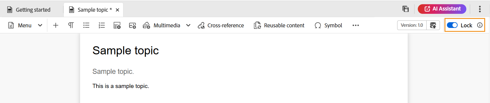{align="left"}

如果您在「對映檢視」中，並展開父對映，只要按一下即可鎖定對映中的所有檔案。 只要展開父對映檔案並選取父檔案，就會選取對映中的所有檔案。 然後，您可以選取&#x200B;**鎖定** 以取得對應中所有檔案的鎖定。

在「存放庫」面板中，鎖定的檔案會顯示一個鎖定圖示。 當您將滑鼠懸停在此鎖定圖示上時，「由您鎖定/使用者名稱」會顯示為工具提示。

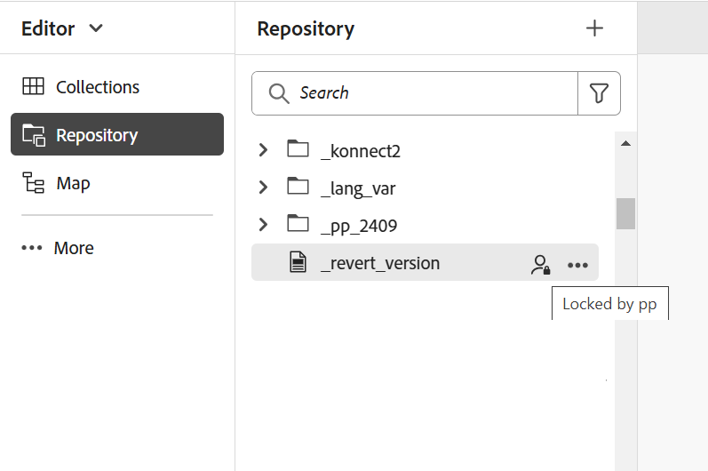{width="350" align="left"}

如果檔案已由其他使用者鎖定，將游標暫留在存放庫中的鎖定圖示上會顯示鎖定該檔案的使用者名稱。 在此情況下，檔案會以唯讀模式開啟，版本資訊旁邊會顯示&#x200B;**唯讀存取權**。

身為管理員，您還能存取&#x200B;**強制解除鎖定**&#x200B;功能，讓您解除鎖定其他使用者鎖定的檔案。 使用此功能可存取其他使用者鎖定的檔案的編輯許可權。

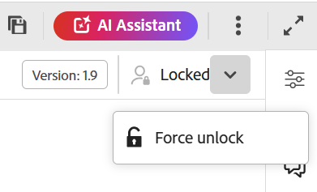{width="350" align="left"}

## 左側面板

左側面板可讓您快速存取「集合」、「存放庫檢視」、「地圖」檢視及更多功能。 您可以選取位於介面左下角的&#x200B;**展開**&#x200B;圖示來展開面板。 展開後，請使用&#x200B;**摺疊**&#x200B;圖示來摺疊面板。 在展開的檢視中，它會顯示圖示的名稱，這些圖示會在收合的檢視中顯示為工具提示。

>[!NOTE]
>
> 左側面板可調整大小。 若要調整面板大小，請將游標置於面板邊界上，游標會變成雙向箭頭，然後選取並拖曳即可調整面板寬度。

左側面板可讓您存取以下功能：

- [集合](#collections)
- [存放庫](#repository)
- [地圖](#map)
- [可重複使用的內容](#reusable-content)
- [大綱](#outline)

左側面板中的某些功能可在&#x200B;**更多**&#x200B;區段下使用。 選取「更多」圖示以存取下列功能：

- [字彙表](#glossary)
- [條件](#conditions)
- [主旨配置](#subject-scheme)
- [程式碼片段](#snippets)
- [範本](#templates)
- [引文](#citations)
- [語言變數](#language-variables)
- [變數](#variables)
- [尋找並取代](#find-and-replace)
- [PDF範本](#pdf-templates)
- [檢閱](#review)


如果已設定Adobe Workfront，則左側面板中也會顯示一個標示為&#x200B;**Workfront**&#x200B;的其他選項。

如需詳細資訊，請檢視[Workfront整合](./workfront-integration.md)。

>[!NOTE]
>
> 左側面板中可用的功能由您的管理員管理，可讓他們啟用或停用左側面板中顯示的個別功能。 只有已啟用的功能才會顯示在左側面板中。 如需詳細資訊，請檢視[索引標籤列](#tab-bar)的&#x200B;**面板**&#x200B;區段。

左面板功能的詳細說明如下：

### 集合

如果您使用一組檔案或資料夾，您可以將它們新增至您最愛的清單，以便快速存取。 **集合**&#x200B;顯示您已新增的檔案清單，以及其他使用者可公開存取的其他檔案清單。

依預設，您可以依標題檢視檔案。 當您將滑鼠停留在檔案上時，您可以檢視檔案標題和檔案路徑作為工具提示。

>[!NOTE]
>
> 作為管理員，您也可以選擇在編輯器中依檔案名稱來檢視檔案清單。 選取&#x200B;**使用者偏好設定**&#x200B;中&#x200B;**編輯器檔案顯示設定**&#x200B;區段的&#x200B;**檔案名稱**&#x200B;選項。

若要建立新集合，請選取「集合」面板旁的+圖示，以顯示&#x200B;**新增集合**&#x200B;對話方塊：

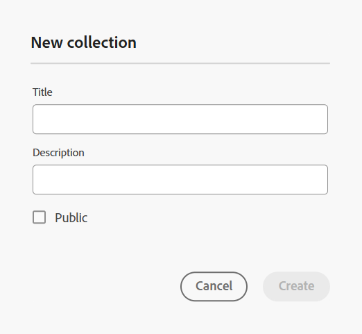{width="300" align="left"}

輸入您要建立之集合的標題和說明。 如果您選取&#x200B;**公用**，其他使用者也會看到此我的最愛。

>[!NOTE]
>
> 您也可以從Experience Manager Guides首頁建立集合。 開啟首頁，瀏覽至[概觀區段](./intro-home-page.md#overview)中的&#x200B;**集合** Widget，然後選取&#x200B;**新增集合**。

若要將檔案新增至集合，請使用下列任一方法：

- 瀏覽至[存放庫]檢視中必要的檔案或資料夾，選取&#x200B;*選項*&#x200B;圖示以開啟內容功能表，然後選擇&#x200B;**新增至** > **集合**。 在&#x200B;**新增至集合**&#x200B;對話方塊中，您可以選擇將檔案/資料夾新增至現有的我的最愛，或建立新的我的最愛。

  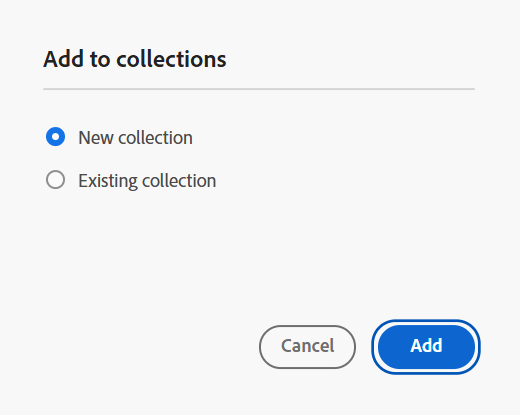{width="300" align="left"}

- 在編輯器中的檔案索引標籤上按一下滑鼠右鍵，開啟快顯功能表。 選擇&#x200B;**新增至** > **集合**&#x200B;以將檔案新增至您的最愛清單。

  {align="left"}


>[!NOTE]
>
> - 若要從我的最愛清單移除專案，請選取[我的最愛]集合中專案旁的[選項]圖示，然後選擇[從集合移除]****。
> - 若要預覽檔案而不開啟檔案，請選取檔案，然後從[選項]功能表選取[預覽]。****

集合的&#x200B;**選項功能表**

您也可以使用可用於「集合」的「選項」功能表來執行許多動作：

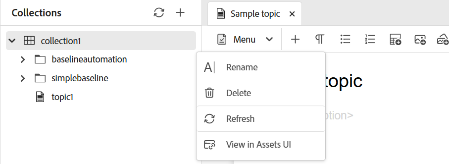{width="650" align="left"}

- **重新命名**：重新命名選取的集合。
- **刪除**：刪除選取的集合。
- **重新整理**：從存放庫取得新的檔案和資料夾清單。
- **在Assets UI中檢視**：在Assets UI中顯示檔案或資料夾內容。

>[!NOTE]
>
> 您也可以使用頂端的「重新整理」圖示來重新整理清單。


### 存放庫

當您選取「存放庫」圖示時，您會取得DAM中可用的檔案和資料夾清單。 依預設，您可以依標題檢視檔案。 當您將滑鼠停留在檔案上時，您可以檢視檔案標題和檔案名稱做為工具提示。

>[!NOTE]
>
> 作為管理員，您也可以選擇在編輯器中依檔案名稱來檢視檔案清單。 選取&#x200B;**使用者偏好設定**&#x200B;中&#x200B;**編輯器檔案顯示設定**&#x200B;區段的&#x200B;**檔案名稱**&#x200B;選項。

一次載入75個檔案。 每次您選取&#x200B;**載入更多**...會載入75個檔案，而且當所有檔案都已列出時，按鈕就會停止顯示。 批次載入相當有效率，而且相較於載入資料夾中的所有檔案，您可以更快存取檔案。

您可以輕鬆導覽至DAM內的必要檔案，並在編輯器中開啟它。 如果您擁有編輯檔案所需的存取權，則可以進行編輯。

您也可以在編輯器中選取並播放音訊或視訊檔案。 您可以變更磁碟區或
視訊的檢視畫面。 在捷徑功能表中，您也有下載、變更播放的選項
速度，或檢視子母畫面。

選取地圖並按Enter鍵，或按兩下以在&#x200B;**地圖檢視**&#x200B;中開啟地圖。 如需詳細資訊，請在[左側面板](#left-panel)區段中檢視&#x200B;**地圖檢視**&#x200B;功能說明。 選取主題並按Enter鍵或按兩下以在[內容編輯區域](#content-editing-area)中開啟該主題。 能夠直接從編輯器導覽和開啟檔案，可節省時間並提高生產力。

**在存放庫中篩選搜尋**

編輯器為搜尋文字提供了增強的篩選器。 您可以在Adobe Experience Manager存放庫所選路徑上存在的檔案中搜尋和篩選文字。 它會搜尋檔案中的標題、檔案名稱和內容。


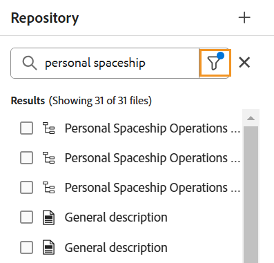{width="300" align="left"}

*套用篩選器以搜尋包含文字`personal spaceship.`*&#x200B;的檔案

選取&#x200B;**篩選搜尋** \（\）圖示以開啟篩選快顯視窗。

>[!NOTE]
>
> 當您搜尋任何文字或篩選任何檔案時，**篩選搜尋** \（\）圖示上會出現一個藍點，表示我們位在搜尋面板上，且已套用部分篩選。


您有以下選項可篩選檔案，並在Adobe Experience Manager存放庫中縮小搜尋範圍：

- **DITA檔案**：您可以尋找位於所選路徑上的所有&#x200B;**DITA主題**&#x200B;和&#x200B;**DITA Map**。 預設會選取這些專案。
- **非DITA檔案**：您可以在選取的路徑中搜尋&#x200B;**Ditaval檔案**、**影像檔案**、**多媒體**、**檔案**&#x200B;和&#x200B;**JSON**。

  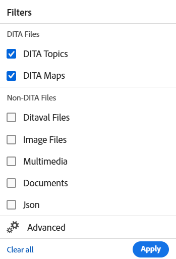 {width="300" align="left"}

  *使用快速篩選器搜尋 DITA 和非 DITA 檔案。*

**進階篩選**

選取&#x200B;**進階篩選** 圖示以檢視&#x200B;**進階篩選**&#x200B;對話方塊。

您可以在&#x200B;**一般**&#x200B;和&#x200B;**進階**&#x200B;標籤下檢視下列選項。

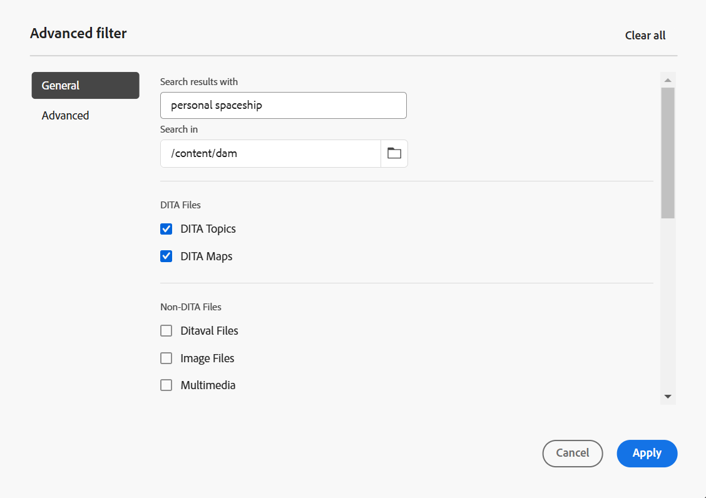 {width="650" align="left"}


**一般**

- **搜尋結果包含**：搜尋Adobe Experience Manager存放庫所選路徑上檔案中的一些文字。 會在檔案的標題、檔案名稱和內容中搜尋文字。

這與存放庫視窗中的搜尋方塊同步。 例如，如果您在存放庫面板的搜尋方塊中輸入`general purpose`，它也會出現在&#x200B;**進階篩選器**&#x200B;對話方塊中，反之亦然。

- **搜尋**：選取您要搜尋Adobe Experience Manager存放庫中檔案的路徑。

**進階**

- **DITA元素**：您也可以在指定的DITA元素的屬性中搜尋特定值。
   - 選取&#x200B;**新增元素**&#x200B;以新增元素、屬性和值。
   - 套用您選取的篩選器。

- 選取&#x200B;**全部清除**&#x200B;以清除所有套用的篩選器。


- 選取&#x200B;**關閉篩選器** 圖示以關閉篩選器並返回存放庫的樹狀檢視。

  >[!NOTE]
  >
  >您的系統管理員也可以設定文字篩選器，並顯示或隱藏其他篩選器。 如需詳細資訊，請檢視「安裝與設定Adobe Experience Manager Guides as a Cloud Service」中的&#x200B;*設定文字篩選器*&#x200B;區段。
  >
  >會顯示包含搜尋文字的已篩選檔案清單。 例如，包含文字`personal spaceship`的檔案會列在前一個熒幕擷圖中。 您可以從篩選的清單中選取多個檔案，將其拖放到開啟以進行編輯的對映中。

**選項功能表**

除了從左側面板開啟檔案外，您還可以使用「存放庫」檢視中的「選項」選單執行許多動作。 視您選擇資料夾、主題檔案或媒體檔案而定，您將會檢視不同的選項。

資料夾&#x200B;**的**&#x200B;選項

您可以使用[存放庫]檢視中&#x200B;*資料夾*&#x200B;的[選項]功能表執行下列動作：

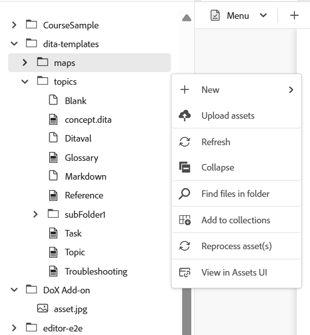{width="550" align="left"}


- **新增**：建立新的DITA主題、DITA map或資料夾。

  建立新主題的步驟：
   1. 選取&#x200B;**新增** > **主題**。
   2. 顯示&#x200B;**新主題**&#x200B;對話方塊。

      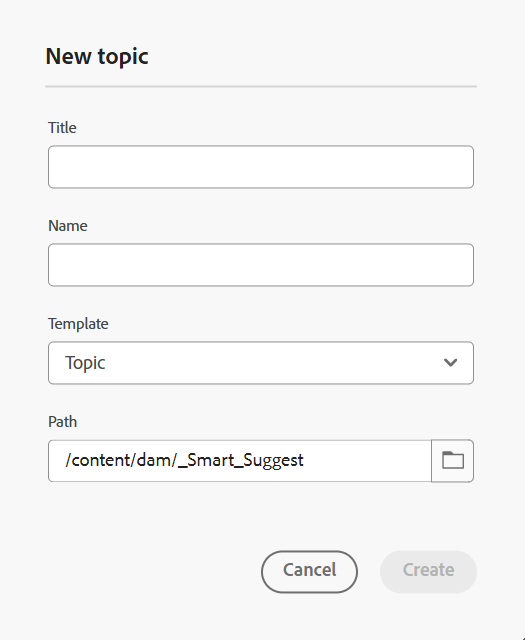{width="300" align="left"}

   3. 在&#x200B;**新主題**&#x200B;對話方塊中，提供下列詳細資料：
      - 主題的標題。
      - \(Optional\)*主題的檔案名稱。 會根據主題「標題」自動建議檔案名稱。 如果您的管理員已根據UUID設定啟用自動檔案名稱，則您將不會檢視「名稱」欄位。
      - 主題將依據的範本。 例如，對於現成可用的設定，您可以從「空白」、「概念」、「DITAVAL」、「參考」、「任務」、「主題」、「Markdown」、「字彙表」和「疑難排解」範本中選擇。 如果您的資料夾上設定了「資料夾設定檔」，則您將只會檢視在「資料夾設定檔」上設定的主題範本。

      - 您要儲存主題檔案的路徑。 依預設，存放庫中目前所選資料夾的路徑會顯示在「路徑」欄位中。

   4. 選擇 **建立**。主題是在指定的路徑中建立。 此外，主題也會在編輯器中開啟以進行編輯。

  建立新DITA map的步驟：

   1. 選取&#x200B;**新增** > **DITA對應**。
   2. 顯示&#x200B;**新地圖**&#x200B;對話方塊。

      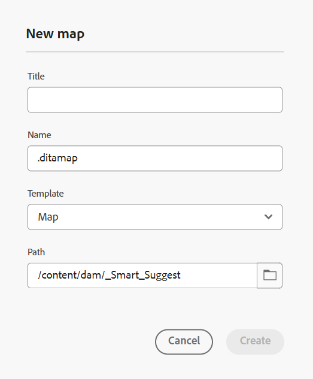{width="300" align="left"}

   3. 在&#x200B;**新對應**&#x200B;對話方塊中，提供下列詳細資料：
      - 地圖的標題。
      - *\(Optional\)*&#x200B;對應的檔案名稱。 會根據地圖示題自動建議檔案名稱。 如果您的管理員已根據UUID設定啟用自動檔案名稱，則您將不會檢視「名稱」欄位。
      - 作為地圖基礎的範本。 例如，對於現成可用的設定，您可以從Bookmap或DITA map範本中選擇。
      - 您要儲存地圖檔案的路徑。 依預設，存放庫中目前所選資料夾的路徑會顯示在「路徑」欄位中。
   4. 選擇 **建立**。會在路徑欄位中指定的資料夾中建立並新增對應。 此外，對應會在「對應」檢視中開啟。 您可以在地圖編輯器中開啟地圖檔案，並在其中新增主題。 如需新增主題至地圖檔案的詳細資訊，請檢視[建立地圖](map-editor-create-map.md#)。 或者，選取&#x200B;**在地圖主控台中開啟**，在地圖主控台中開啟地圖。

  建立新資料夾的步驟：

   1. 選取&#x200B;**新增** > **資料夾**。
   2. 顯示&#x200B;**新資料夾**&#x200B;對話方塊。

      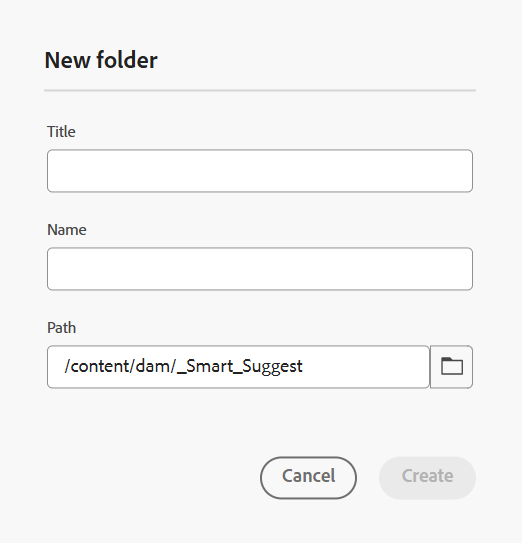{width="300" align="left"}

   3. 在&#x200B;**新資料夾**&#x200B;對話方塊中，提供下列詳細資料：
      - 資料夾的標題，會自動轉換為資料夾名稱。
      - 您要儲存資料夾的路徑。 依預設，存放庫中目前所選資料夾的路徑會顯示在「路徑」欄位中。
   4. 選擇 **建立**。會在執行「建立資料夾」選項的資料夾中建立並新增資料夾。

- **上傳Assets**：將檔案從您的本機系統上傳至Adobe Experience Manager存放庫中選取的資料夾。 您也可以將檔案從本機系統拖放至目前的工作主題上。 如果您想要將本機系統中的影像插入主題中，這會非常有用。

  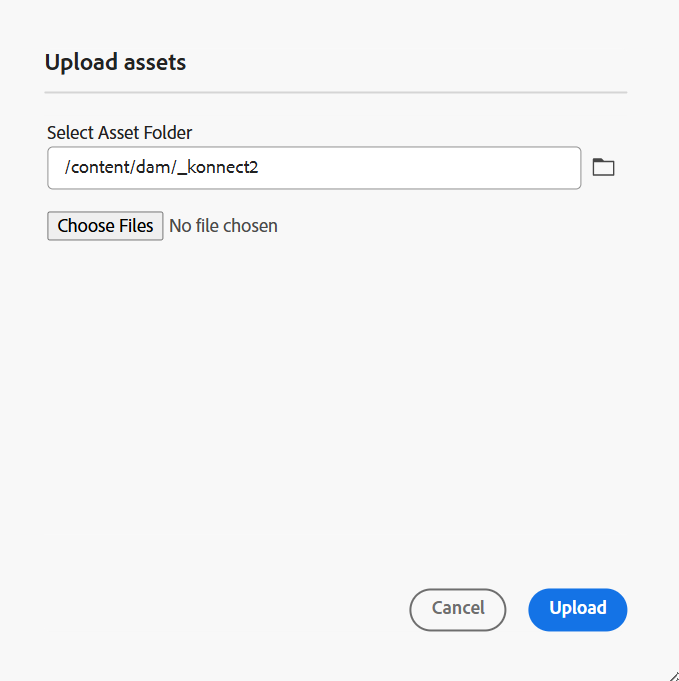{width="300" align="left"}

  您可以選取要上傳檔案的資料夾，系統也會顯示影像預覽。 如果要重新命名檔案，可在「檔案名稱」文字方塊中重新命名。 選取&#x200B;**上傳**&#x200B;以完成檔案上傳程式。 如果您在主題上拖放了影像檔案，則影像檔案會新增到文章中，並且也會上傳。

  如果您的管理員已在&#x200B;*XMLEditorConfig*&#x200B;中啟用UUID選項，則您將會在&#x200B;**Source**&#x200B;屬性中檢視已上傳影像的UUID。

  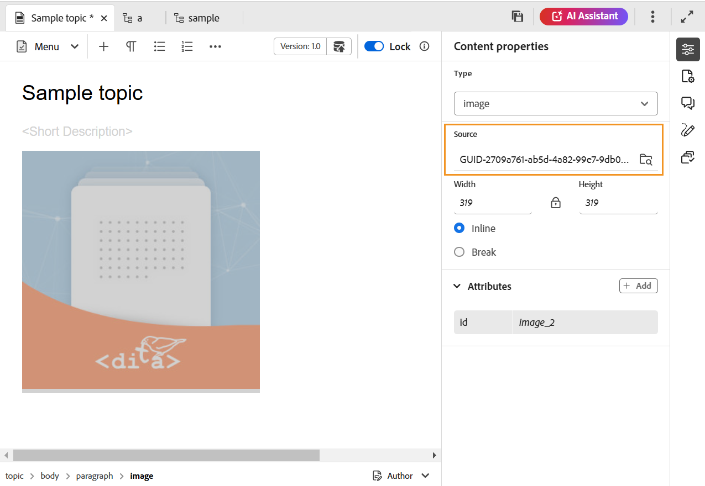{align="left"}

- **尋找資料夾**&#x200B;中的檔案：將焦點移至存放庫搜尋，您可以在其中輸入搜尋字詞。 搜尋會在存放庫中選取的資料夾下執行。 您也可以套用濾鏡以傳回DITA檔案、影像檔案或兩者。

  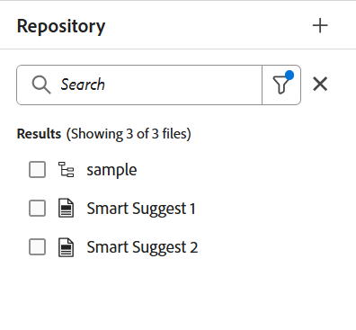{width="300" align="left"}

  您也可以使用檔案的UUID進行搜尋。 在此情況下，搜尋結果會顯示DITA/XML檔案的標題，而如果檔案是影像檔案，則會顯示檔案的UUID。 在下列搜尋範例中，會搜尋影像檔案的UUID，搜尋結果會顯示原始影像檔案的UUID和參照該影像之檔案的主題標題。

  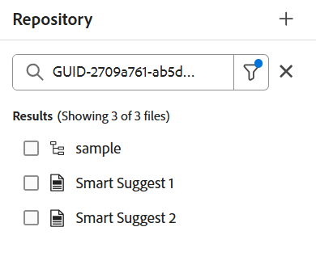{width="300" align="left"}

- **收合**：收合存放庫中選取的資料夾。

  >[!NOTE]
  >
  > 使用資料夾旁的&#x200B;**\>**&#x200B;圖示來展開資料夾。

- **新增至集合**：將選取的資料夾新增至我的最愛。 您可以選擇將其新增至現有或新的集合。

- **重新整理**：從存放庫取得新的檔案和資料夾清單。
- **在Assets UI中檢視**：在Assets UI中顯示資料夾內容。

檔案的&#x200B;**選項**

根據您選取的是媒體檔案還是DITA檔案，可以存取「選項」選單中的不同選項。 媒體和DITA檔案可用的常見選項有：

- 編輯
- 在FrameMaker中開啟
- 重複項目
- 鎖定/解鎖
- 預覽
- 移至
- 重新命名
- 刪除
- 產生
- 下載為PDF
- 新增至
- 複製
- 在Assets UI中檢視
- 屬性


存放庫檢視中檔案的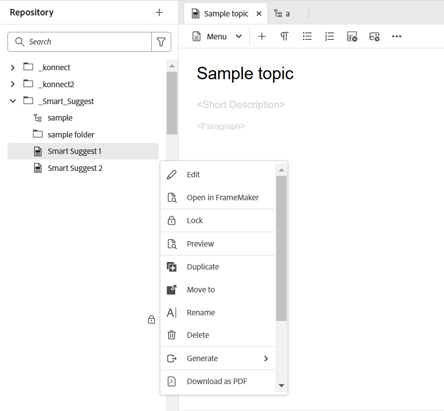{width="550" align="left"}

「選項」選單中的各種選項說明如下：

- **編輯**：開啟檔案以進行編輯。 如果是.ditamap/.bookmap檔案，則會在[地圖編輯器](map-editor-advanced-map-editor.md#)中開啟該檔案以進行編輯。

- **複製**：使用此選項建立所選檔案的複製或復本。 您也可以選擇在重複資產提示中重新命名重複檔案。 依預設，檔案會以尾碼\（如filename\_1.extension\）建立。 檔案的標題與來源檔案相同，新檔案從1.0版開始。複製所有參照、標籤和中繼資料時，基線不會複製到重複的檔案中。
- **鎖定**：鎖定選取的檔案以進行編輯。 如果檔案已鎖定，將滑鼠指標停留在鎖定圖示上會顯示您&#x200B;**已鎖定（若您已鎖定）**，或是&#x200B;**已鎖定（若有其他使用者已鎖定）[使用者名稱]**。

- **預覽**：取得檔案（.dita、.xml、音訊、視訊或影像）的快速預覽，而不需要開啟它。 您可以調整預覽窗格的大小。 如果內容包含任何`<xref>`或`<conref>`，您可以選取它以在新的索引標籤中開啟。 檔案的標題會顯示在視窗中。 如果沒有任何標題，則會顯示檔案名稱。 若要關閉&#x200B;**預覽**&#x200B;面板，您可以選取關閉圖示或選取窗格之外的任何位置。

  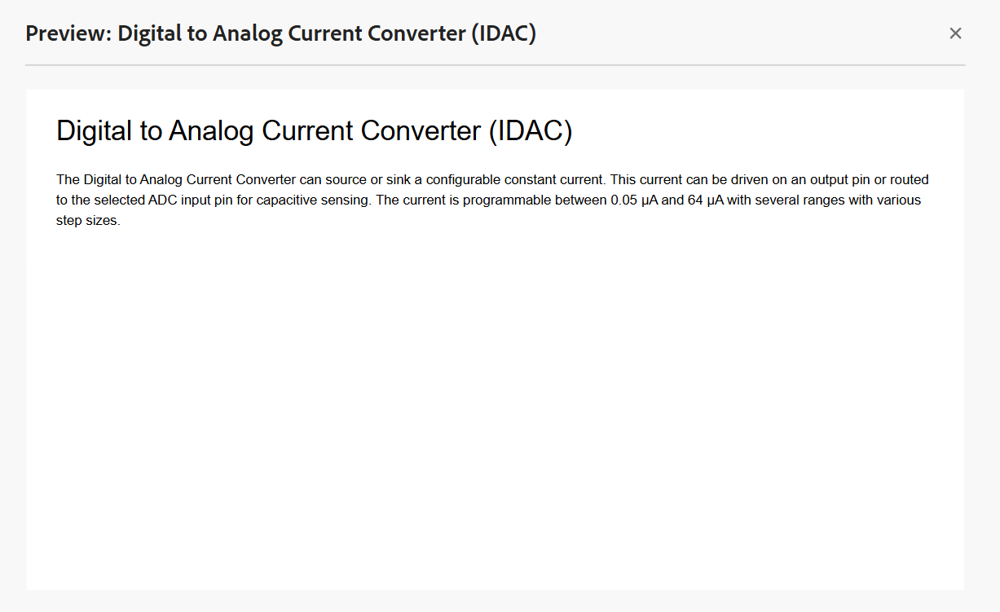{align="left"}

- **重新命名**：使用此選項來重新命名選取的檔案。 在&#x200B;**重新命名資產**&#x200B;對話方塊中輸入新檔案的名稱。
   - 您可以重新命名任何型別的檔案。
   - 您無法變更檔案的副檔名。
   - 兩個檔案不能有相同的名稱。 因此，您無法將檔案重新命名為已存在的名稱。 顯示錯誤。

- **移至**：使用此選項將選取的檔案移至其他資料夾。
   - 您可以輸入目的地資料夾的名稱，或選擇&#x200B;**選取路徑**&#x200B;來選取目的地資料夾。
   - 您可以將任何型別的檔案移動到「內容」資料夾內的任何目的地。
   - 兩個檔案不能有相同的名稱。 因此，您無法將檔案移至相同名稱的檔案已經存在的資料夾。

  如果您嘗試將檔案移動到某個資料夾，而該資料夾中存在名稱相同但標題不同的檔案，則會顯示「重新命名並移動檔案」對話方塊，而且您需要在移動檔案之前重新命名檔案。 目的地資料夾中移動的檔案具有新檔案名稱。

  {width="550" align="left"}

  >[!NOTE]
  >
  > 您也可以將檔案拖放至另一個目的地資料夾。

  **排除情況**

  在下列情況下，Experience Manager Guides不允許您重新命名或移動檔案：

   - 如果檔案是稽核或翻譯工作流程的一部分，則無法移動或重新命名檔案。

   - 如果有任何其他使用者鎖定檔案，您無法重新命名或移動它，則不會檢視檔案的「重新命名」或「移至」選項。

  >[!NOTE]
  >
  > 如果您的管理員已授予您資料夾的許可權，則只會顯示&#x200B;**重新命名**&#x200B;或&#x200B;**移至**&#x200B;選項。

  <details>
    <summary> 雲端服務 </summary>

  重新命名或移動任何檔案並不會中斷來自或到檔案的任何現有參照，因為每個檔案都有唯一的UUID。
  </details>

- **刪除**：使用此選項刪除選取的檔案。 刪除檔案前會顯示確認提示。

   - 刪除檔案前會顯示確認提示。
   - 如果檔案未從任何其他檔案參照，則會刪除檔案並顯示成功訊息。
   - 如果檔案已鎖定，您就無法將其刪除，且會顯示錯誤訊息。

     >[!NOTE]
     >
     > 如果您的管理員已阻止刪除鎖定的檔案，則只會顯示錯誤訊息。 如需詳細資訊，請檢視「安裝與設定Adobe Experience Manager Guides as a Cloud Service」中的&#x200B;*防止刪除取出檔案*&#x200B;區段。

   - 如果檔案已新增至集合，則會顯示&#x200B;**強制刪除**&#x200B;對話方塊，您可以強制刪除它。
   - 如果從任何其他檔案參照檔案，則會顯示包含確認訊息的&#x200B;**強制刪除**&#x200B;對話方塊，您可以強制刪除檔案：

     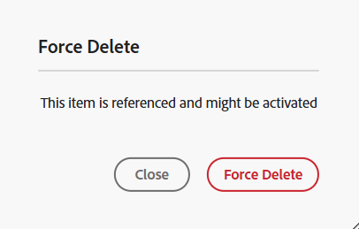{width="300" align="left"}

     >[!NOTE]
     >
     > 如果您的管理員已授予檔案刪除許可權，則會啟用&#x200B;**強制刪除**。 否則，**強制刪除**&#x200B;已停用，且會顯示一則訊息，指出您沒有許可權刪除參考的檔案。 如需詳細資訊，請檢視「安裝與設定Adobe Experience Manager Guides as a Cloud Service」中的&#x200B;*防止刪除參考的檔案*&#x200B;區段。

   - 如果刪除參照主題並開啟包含要編輯參照的檔案，將會顯示參照檔案的斷開連結。

  >[!NOTE]
  >
  > 您也可以使用鍵盤的Delete鍵，以類似方式刪除選取的檔案。

- **複製**：您可以選擇下列選項：

   - **複製UUID**：將所選檔案的UUID複製到剪貼簿。

   - **複製路徑**：將所選檔案的完整路徑複製到剪貼簿。

- **新增至**：您可以選擇下列選項：
   - **集合**：將選取的檔案新增至集合。 您可以選擇將其新增至現有或新的集合。

   - **可重複使用的內容**：將選取的檔案新增至左側面板中的[可重複使用的內容]清單。

- **屬性**：使用此開啟所選檔案的屬性頁面。 也可以從Assets UI存取此屬性頁面，方法是選取檔案，然後選取工具列中的「屬性」圖示。

- **在地圖儀表板中開啟**：如果選取的檔案是DITA map，則此選項會開啟地圖儀表板。

- **在對應主控台中開啟**：如果選取的檔案是DITA map，則此選項會開啟對應主控台。

- **在氧氣中編輯**：選取此選項可編輯氧氣聯結器外掛程式中選取的檔案。 已開啟檔案進行編輯。

  >[!NOTE]
  >
  >請聯絡您的客戶成功團隊，讓此功能在環境中啟用。 這不會當作現成支援的一部分啟用。 如需更多詳細資訊，請檢視《安裝與組態指南》中的[設定選項以在Oxyo ](../cs-install-guide/conf-edit-in-oxygen.md)中編輯。


- **在Assets UI中檢視**：使用此專案來顯示Assets UI中.dita/.xml檔案的預覽。 若是.ditamap/.bookmap檔案，對應中的所有主題檔案都會以單一統一的逐頁檢視顯示。

- **下載為PDF**：使用選項來產生PDF輸出並下載。

- **產生**：使用選項將地圖或地圖內的主題發佈到網站頁面、內容片段或體驗片段。

### 地圖

當您選取「對映」檢檢視示時，會顯示「對映」檢視，其中會顯示對映檔案中的主題清單。 如果您尚未開啟任何對應檔案，則「對應」檢視會顯示為空白。 連按兩下任何對應檔案會在此檢視中開啟對應檔案。 您可以在地圖中的任何檔案上連按兩下，以在編輯器中開啟該檔案。

依預設，您可以依標題檢視檔案。 當您將滑鼠停留在檔案上時，您可以檢視檔案標題和檔案路徑作為工具提示。

>[!NOTE]
>
>作為管理員，您也可以選擇檢視目前開啟於對映檢視中的父對映檔案名稱。 選取&#x200B;**使用者偏好設定**&#x200B;中&#x200B;**編輯器檔案顯示設定**&#x200B;區段的&#x200B;**檔案名稱**&#x200B;選項。


當您在地圖檢視中開啟地圖時，目前地圖的標題會顯示在Tab列的中心。 如果標題太長，則會顯示省略符號，您也可以將游標停留在標題上以檢視工具提示中的完整標題。

定義主題或地圖參照的鍵屬性時，您可以在左側面板中檢視標題、對應圖示和鍵。 金鑰顯示為`keys=<key-name>`。

地圖檢視中的{width="300" align="left"}

如果您擁有對映檔案的編輯許可權，您也能夠編輯檔案。 如需透過DITA map開啟及編輯主題的詳細資訊，請檢視[透過DITA map編輯主題](map-editor-advanced-map-editor.md#id17ACJ0F0FHS)。

下列選項適用於「對映」檢視中的對映檔案：

- **在地圖主控台中開啟**：在地圖主控台中開啟地圖檔案。
- **編輯**：開啟對應檔進行編輯。
- **選項**：開啟所選地圖檔案的內容功能表。

您可以使用對映檔案的「選項」選單執行下列動作：

地圖檢視中的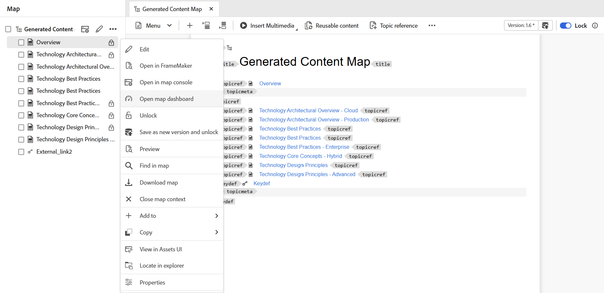{align="left"}

- **編輯**：開啟對應檔案以在對應編輯器中編輯。

- **全選**：選取地圖中的所有檔案。

- **清除選取專案**：取消選取地圖中選取的檔案。

- **鎖定**：鎖定地圖中選取的檔案。

- **解除鎖定**：解除鎖定對應檔案，並使其可供編輯。 它不會將變更還原到先前的版本。

- **另存為新版本並解除鎖定**：建立較新的版本，並解除對地圖中選取檔案的鎖定。

- **預覽**：開啟地圖檔案的預覽。 在此檢視中，地圖中的所有主題檔案都會以單一統一的逐頁檢視顯示。

- **複製**：您可以選擇下列選項：
   - **複製UUID**：將地圖檔案的UUID複製到剪貼簿。
   - **複製路徑**：將對應檔案的完整路徑複製到剪貼簿。

- **在存放庫中尋找**：顯示對應檔案在存放庫中的位置\（或DAM\）。

- **新增至**：您可以選擇下列選項：
   - **集合**：將對應檔案新增至集合。 您可以選擇將其新增至現有或新的集合。

   - **可重複使用的內容**：將對應檔新增至左側面板中的[可重複使用的內容]清單。

- **屬性**：使用此項開啟對應檔的屬性頁。 也可以從Assets UI存取此屬性頁面，方法是選取檔案並選取工具列中的「屬性」圖示。

- **開啟地圖控制面板**：開啟地圖控制面板。

- **在Assets UI中檢視**：使用此專案在Assets UI中顯示地圖檔案的預覽。 在此檢視中，地圖中的所有主題檔案都會以單一統一的逐頁檢視顯示。
- **下載地圖**：選取此選項以開啟&#x200B;**下載地圖**&#x200B;對話方塊。

  在&#x200B;**下載地圖**&#x200B;對話方塊中，您可以選擇下列選項：

  **使用基準線**：選取此選項可取得為DITA map建立的基準線清單。 如果您要根據特定的「基準線」下載對映檔案及其內容，請從下拉式清單中選取「基準線」。 如需使用基準線的詳細資訊，請檢視[使用基準線](./generate-output-use-baseline-for-publishing.md)。

  **平面化檔案階層**：選取此選項可將所有參考的主題和媒體檔案儲存在單一資料夾中。

  您也可以在不選取任何選項的情況下下載地圖檔案。 在這種情況下，會下載參照的主題和媒體檔案的最後儲存版本。

  選取&#x200B;**下載**&#x200B;按鈕後，對應匯出封裝要求會排入佇列。 如果成功建立封裝，則會顯示&#x200B;**Success**&#x200B;對話方塊。  您可以從&#x200B;**成功**&#x200B;對話方塊中選取&#x200B;**下載**&#x200B;按鈕。

  如果地圖可供下載，您會收到地圖下載就緒通知。 如果下載失敗，您會收到地圖下載失敗的通知。

  您可以從Adobe Experience Manager通知收件匣存取下載連結。 在「收件匣」中選取產生的地圖通知，以.zip格式下載地圖。

  >[!NOTE]
  >
  >  依預設，下載的地圖會在Adobe Experience Manager通知收件匣中保留五天。

- **關閉地圖內容**：關閉地圖檔案。

下列熒幕擷圖顯示對應檢視中檔案的「選項」功能表：

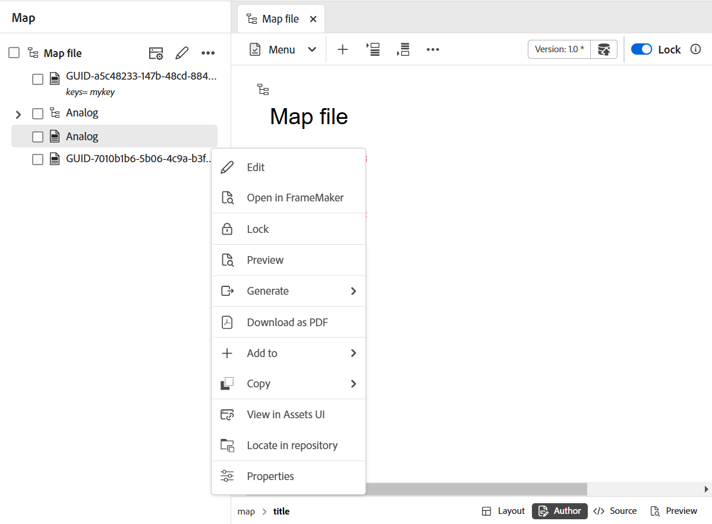{align="left"}

您可以使用「選項」功能表執行下列動作：

- **編輯**：開啟檔案以進行編輯。 如果是.ditamap/.bookmap檔案，則會在[地圖編輯器](map-editor-advanced-map-editor.md#)中開啟該檔案以進行編輯。

- **鎖定**：鎖定選取的檔案。 針對鎖定的檔案，此選項會變更為&#x200B;**解除鎖定**。


  >[!NOTE]
  >
  > - 如果檔案已由使用者鎖定，將滑鼠指標停留在鎖定圖示上會顯示已鎖定檔案的使用者\(name\)。
  > - 入庫檔案時，系統會提示您儲存變更。 如果您不儲存變更，則它只會入庫檔案。

- **預覽**：取得檔案（.dita、.xml、音訊、視訊或影像）的快速預覽，而不需要開啟它。 您可以調整預覽窗格的大小。 如果內容包含任何`<xref>`或`<conref>`，您可以選取它以在新的索引標籤中開啟。  檔案的標題會顯示在視窗中。 如果沒有任何標題，則會顯示檔案名稱。 若要關閉&#x200B;**預覽**&#x200B;窗格，您可以選取關閉圖示或選取窗格之外的任何位置。
- **複製**：您可以選擇下列選項：
   - **複製UUID**：將所選檔案的UUID複製到剪貼簿。
   - **複製路徑**：將所選檔案的完整路徑複製到剪貼簿。


- **在存放庫中尋找**：顯示選取的檔案在存放庫中的位置\（或DAM\）。
- **全部展開**：展開地圖檔案中的所有主題。

- **全部收合**：收合屬於目前地圖檔案的所有主題。

- **新增至**：您可以選擇下列選項：
   - **集合**：將選取的檔案新增至集合。 您可以選擇將其新增至現有或新的集合。

   - **可重複使用的內容**：將選取的檔案新增至左側面板中的[可重複使用的內容]清單。

- **屬性**：使用此開啟所選檔案的屬性頁面。 也可以從Assets UI存取此屬性頁面，方法是選取檔案並選取工具列中的「屬性」圖示。

- **在Assets UI中檢視**：使用此專案來顯示Assets UI中.dita/.xml檔案的預覽。 若是.ditamap/.bookmap檔案，對應中的所有主題檔案都會以單一統一的逐頁檢視顯示。

- **產生**：為網站頁面、內容片段或體驗片段中選取的檔案產生輸出。

>[!NOTE]
>
> 您也可以從「參照」下的&#x200B;**更多選項**&#x200B;功能表，開啟並編輯DITA map中選取主題的屬性。

### 可重複使用的內容

DITA的主要功能之一是重複使用內容的能力。 **可重複使用的內容**&#x200B;面板可以儲存您的DITA檔案，您通常可以從其中插入可重複使用的內容。 新增後，DITA檔案會保留在跨工作階段的可重複使用內容面板中。 這表示您不需要再次新增DITA檔案來稍後存取它們。

您只需從面板將可重複使用的內容拖放至目前的主題上，便可輕鬆快速地插入主題。 您也可以先取得內容的預覽，然後再將其插入檔案中。

依預設，您可以依標題檢視檔案。 當您將滑鼠停留在檔案上時，您可以檢視檔案標題和檔案路徑作為工具提示。

>[!NOTE]
>
> 作為管理員，您也可以選擇在編輯器中依檔案名稱來檢視檔案清單。 選取&#x200B;**使用者偏好設定**&#x200B;中&#x200B;**編輯器檔案顯示設定**&#x200B;區段的&#x200B;**檔案名稱**&#x200B;選項。

若要將DITA檔案新增至可重複使用的內容面板，請使用下列任一方法：

- 選取「可重複使用的內容」旁的&#x200B;**+**&#x200B;圖示，以開啟瀏覽檔案對話方塊。 選取您要新增的檔案，然後選取&#x200B;**新增**&#x200B;以完成程式。

- 在「存放庫」檢視中，選取所需檔案的&#x200B;**選項**&#x200B;圖示，然後從內容功能表中選擇&#x200B;**新增至** > **可重複使用的內容**。

- 在編輯器的檔案索引標籤上按一下滑鼠右鍵以開啟內容功能表，然後選擇&#x200B;**新增至** > **可重複使用的內容**。


新增檔案後，您可以在「可重複使用的內容」面板中檢視檔案中的所有可重複使用的內容元素。 可重複使用的內容會與其ID和元素名稱一起顯示。

將檔案新增至可重複使用的內容清單時，會顯示檔案的標題，而非檔案的UUID。 若要檢查檔案的UUID，將滑鼠停留在檔案標題上，檔案的UUID會顯示在工具提示中。

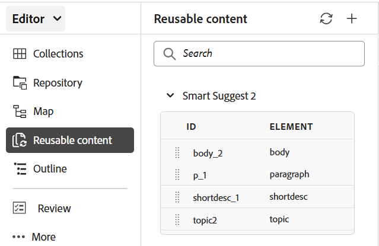{width="400" align="left"}

>[!NOTE]
>
> 您可以將多個檔案新增至可重複使用的內容清單。 然後，您可以從「可重複使用的內容」面板將所需的內容插入檔案中。

**重新整理**：重新檢查所有可重複使用的內容，並顯示可重複使用內容的新清單。

若要從「可重複使用的內容」面板插入內容，請使用下列任一方法：

- 將滑鼠指標停留在您要插入的元素上，選取&#x200B;**選項**&#x200B;圖示，然後從下拉式清單中選擇&#x200B;**插入可重複使用的內容**。

  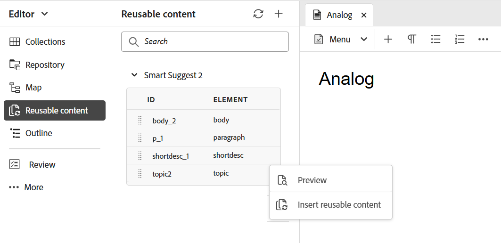{width="400" align="left"}

  >[!NOTE]
  >
  > 選取檔案，然後從&#x200B;**選項**&#x200B;功能表選取&#x200B;**預覽**，預覽檔案而不開啟它。 您也可以預覽出現在主題中的參照。 參照ID會出現在視窗中。
  >
  > 元素的&#x200B;**選項**&#x200B;功能表中也提供&#x200B;**預覽**&#x200B;選項，可讓您在插入元素之前快速預覽該元素。

- 從面板將可重複使用的內容專案拖放至檔案中的所需位置。

### 大綱

選取&#x200B;**大綱**&#x200B;圖示時，您會取得檔案中使用的元素階層檢視。

{width="300" align="left"}

「大綱」檢視提供下列功能：

- 檔案中使用的所有元素的樹狀檢視。

- 如果元素有ID、屬性和文字，您可以連同元素一起檢視。

- 在「作者」和「Source」檢視中存取「大綱」檢視。

- 使用篩選器下拉式清單來顯示所有元素或僅顯示損壞的參照：

- 在「大綱」檢視中選擇元素，會在「作者」或「Source」檢視中選取元素的內容。 「大綱」檢視會與「作者」檢視和「Source」檢視保持同步。 如果您在任何檢視中進行任何變更，可以在「輪廓」檢視中進行檢視。 例如，如果您在「作者」檢視中新增段落或更新元素，它會顯示在「大綱」檢視中。

  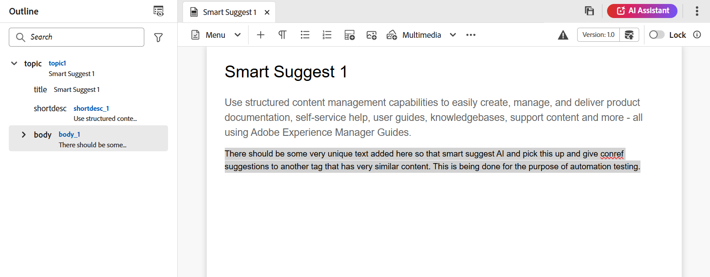{width="650" align="left"}

- 拖放元素。 您可以將另一個元素拖放到元素上，即可輕鬆取代元素。 如果您將元素拖放到另一個元素上，並檢視元素周圍的虛線矩形方塊，則表示元素會被取代。 它會取代元素被捨棄時所處的元素。

  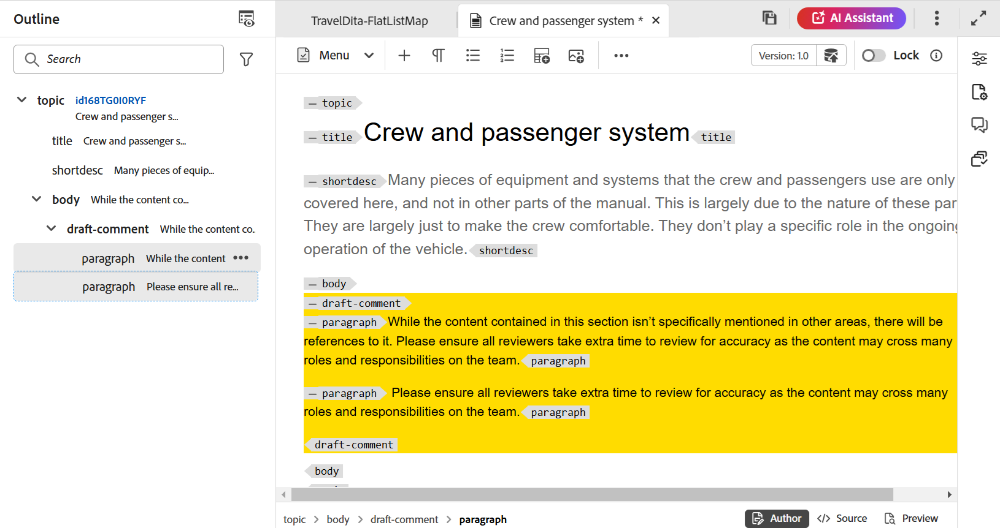{align="left"}

  如果拖放元素，虛線矩形表示元素可以放置在目前位置。 如果拖放無效，則會顯示錯誤訊息，指出不允許此操作。

  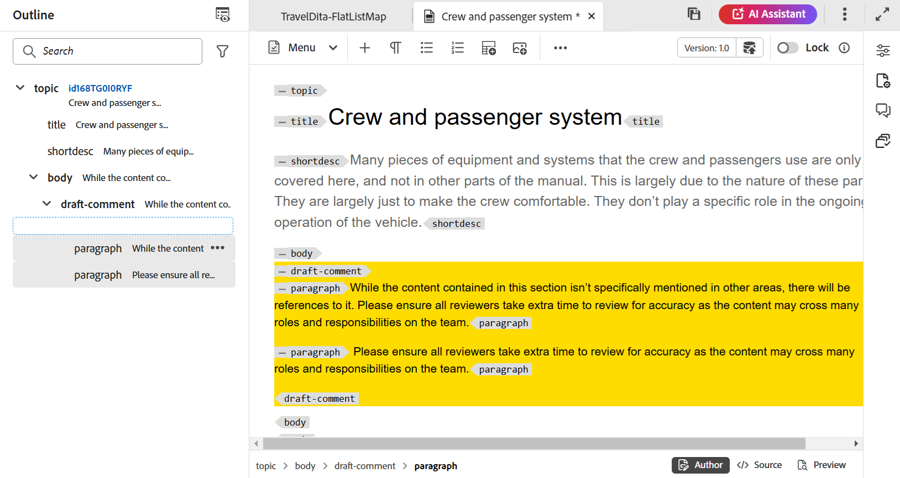{align="left"}

- *大綱*&#x200B;檢視中的&#x200B;**選項**&#x200B;功能表可讓您執行一般作業，例如剪下、複製、刪除、產生ID、在目前元素之前或之後插入元素、重新命名或取代元素、繞排元素、解除元素包裝，以及從選取的元素建立程式碼片段。

>[!NOTE]
>
>如需有關產生ID、在目前元素之前或之後插入元素以及解除元素包裝的詳細資訊，請在編輯器中檢視[其他功能](web-editor-other-features.md#)。

**檢視設定**

使用&#x200B;**檢視設定**&#x200B;選項，您可以選擇檢視下列專案：

- **顯示識別碼**：顯示專案的識別碼。
- **顯示屬性**：顯示屬性及其值。
- **顯示文字**：顯示文字。 如果文字超過20個字元，則會顯示省略符號。

如果區塊元素有自己的文字，則會與該區塊元素一起顯示。 如果它沒有自己的文字，則第一個子元素的文字會與該區塊元素一起顯示。

{width="550" align="left"}

如果您的管理員已建立屬性的設定檔，則您將會取得這些屬性及其設定的值。 您也可以在&#x200B;**設定**&#x200B;的&#x200B;**顯示屬性**&#x200B;標籤下，指派管理員設定的顯示屬性。 為元素定義的屬性會顯示在「配置圖」和「大綱」檢視中。


如需詳細資訊，請在[左側面板](#left-panel)區段的&#x200B;*設定*&#x200B;功能說明中檢視&#x200B;*顯示屬性*。

**搜尋功能**

您可以使用搜尋功能，依名稱、ID、文字或屬性值來搜尋元素。

搜尋不區分大小寫，且完全符合字串。 搜尋結果會根據元素在檔案中的位置排序。

如果字串顯示在&#x200B;**大綱**&#x200B;檢視中，您可以搜尋元素中的字串。 例如，如果字串「Adobe」出現在元素的文字中，並顯示在「大綱檢視」面板中（因為您已從「檢視選項」下拉式清單中選取&#x200B;**顯示文字**），則會篩選包含的元素。 但是，如果文字未顯示在「大綱檢視」面板中（因為您尚未從「檢視選項」下拉式清單中選取&#x200B;**顯示文字**），則不會篩選包含的專案。 同樣地，如果您已選取ID或屬性，您將會在ID或屬性中找到字串。

### 字彙表

Experience Manager Guides可讓您輕鬆建立和使用字彙表型別的檔案。 您可以建立字彙表主題檔案，然後將其納入通用字彙表地圖。 一旦將此對應新增為根對應，字彙表專案就會顯示在「字彙表」面板中。

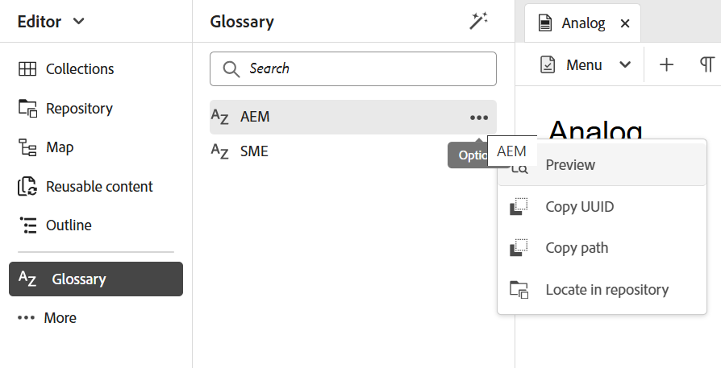{width="650" align="left"}

若要從字彙表插入詞語，只要將面板中的專案拖放至主題中所需的位置即可。 字彙辭彙的[選項]功能表可讓您快速取得專案辭彙的&#x200B;**預覽**、專案辭彙檔案的&#x200B;**複製路徑**，或找出存放庫中的專案辭彙檔案。

執行以下步驟來搜尋文字辭彙，並將它們取代為辭彙縮寫：

1. 開啟DITA主題或地圖，您要在其中搜尋及轉換文字或字詞。
1. 選取字彙表面板以檢視根對映中顯示的字彙表辭彙。 您可以拖放這些辭彙，將其新增至開啟的主題。
1. 在「字彙表」面板中選取&#x200B;**熱點**&#x200B;工具\( \)，以搜尋特定文字辭彙，並將其轉換成連結的字彙表縮寫。 此外，反之亦然，您可以使用它來搜尋字彙縮寫，並將它們轉換為文字辭彙。


您可以設定「熱點」工具的下列設定：

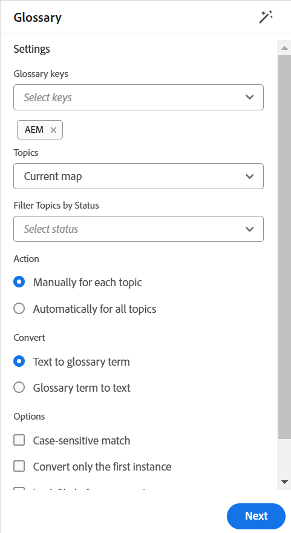{width="300" align="left"}


- **字彙表索引鍵**：從您要在所選主題中用於搜尋的DITA map中選取字彙表索引鍵。 選取的鍵將顯示在底下。 您可以選取&#x200B;**移除**&#x200B;圖示來移除選取的金鑰。

- **主題**：選擇在編輯器中開啟的&#x200B;**目前主題**、在目前地圖中開啟的所有&#x200B;**主題**，或在地圖編輯器中編輯的&#x200B;**目前地圖**&#x200B;以搜尋字詞。
- **依狀態篩選主題**：您可以選擇將搜尋限制在具有所選檔案狀態的主題。 主題可以處於「草稿」、「編輯」、「稽核中」、「已核准」、「已稽核」、「完成」狀態，或處於組織設定的任何一種狀態。
- **動作**：您可以選擇手動搜尋每個主題的字彙表索引鍵&#x200B;**或**&#x200B;自動搜尋所有主題&#x200B;**。**&#x200B;如果您為每個主題選擇&#x200B;**手動**，它會提示您先確認，然後再轉換每個主題中的每個詞語。 如果您為所有主題選擇&#x200B;**自動**，它會自動轉換所有主題中的所有字詞。
- **轉換**：您可以將搜尋的&#x200B;**文字轉換為字彙字詞**&#x200B;或&#x200B;**字彙字詞轉換為文字。**
- **選項**：您可以從下列選項中選取：
   - **區分大小寫的相符專案**：搜尋辭彙以尋找大小寫相同的相符專案。 例如，「USB」與「usb」不相符。
   - **只轉換第一個執行個體**：如果搜尋字詞的多個執行個體出現在主題中，則只會轉換第一個執行個體。
   - **在轉換前鎖定檔案**：搜尋的檔案在轉換字詞之前被鎖定。
   - **在轉換之後建立新版本**：在字詞轉換完成之後建立主題的新版本。
- 如果您為每個主題選取&#x200B;**手動**&#x200B;選項，**下一步**&#x200B;按鈕就會顯示。 選取&#x200B;**下一步**，根據選取的設定轉換每個主題的辭彙。 它會提示您轉換每個主題中的詞語，並移至下一個檔案。 您可以選擇轉換字詞或略過該字詞並移至下一個字詞。

  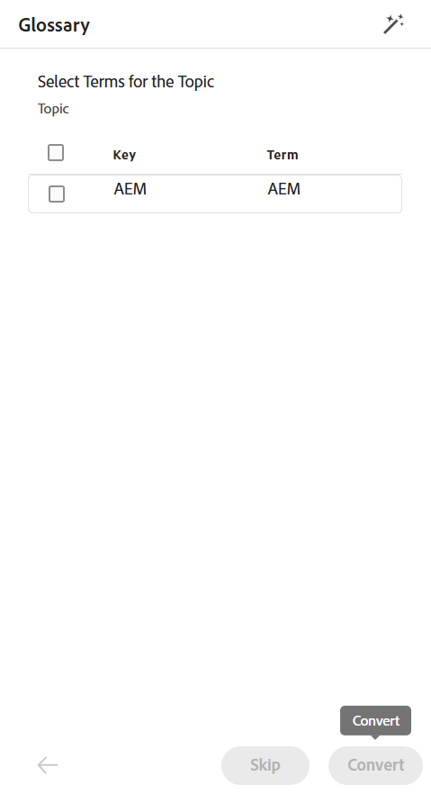{width="300" align="left"}

- 如果您選取&#x200B;**所有主題**&#x200B;選項，就會顯示&#x200B;**轉換**&#x200B;按鈕。 選取&#x200B;**轉換**，將檔案中找到的所有辭彙轉換成連結的辭彙表縮寫。

顯示已更新的&#x200B;**主題**&#x200B;清單（包含轉換的字詞）和&#x200B;**主題（包含錯誤）**。 將滑鼠懸停在「發生錯誤的主題」附近的資訊圖示上，即可檢視錯誤的詳細資訊。

>[!NOTE]
>
> 重新整理主題以檢視轉換的字詞。

### 條件

「條件」面板會顯示管理員在全域或資料夾層級的設定檔中定義的條件屬性。 只需將所需的條件拖放至內容上，即可將條件新增至內容。 條件內容會使用為條件定義的顏色反白顯示，以方便識別。

您也可以在元素上拖放多個條件，以在元素上套用多個條件。 對元素套用多個條件時，「屬性」面板會顯示以逗號分隔的套用條件。

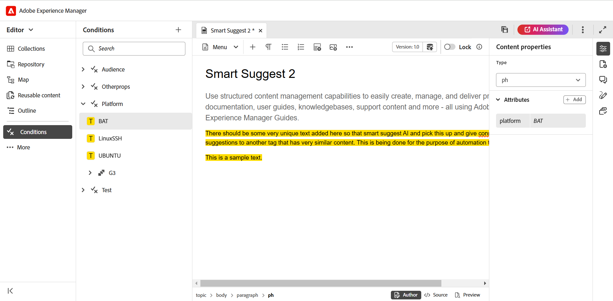{align="left"}

不過，在程式碼檢視中，條件會使用空格分隔符號分隔。 在程式碼檢視中新增或編輯條件時，請務必使用空格分隔多個條件。

>[!IMPORTANT]
>
> 下列熒幕擷圖為具有管理許可權的使用者。 作為具有管理許可權的使用者，您可以新增、編輯和刪除條件。 否則，身為一般作者，您只會獲得套用條件的選項。

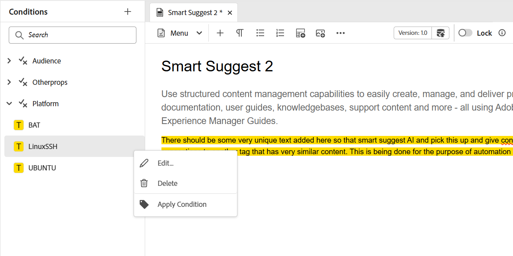{align="left"}

若要新增或定義條件，請選取「條件」面板旁的+圖示，以顯示「定義條件」對話方塊：

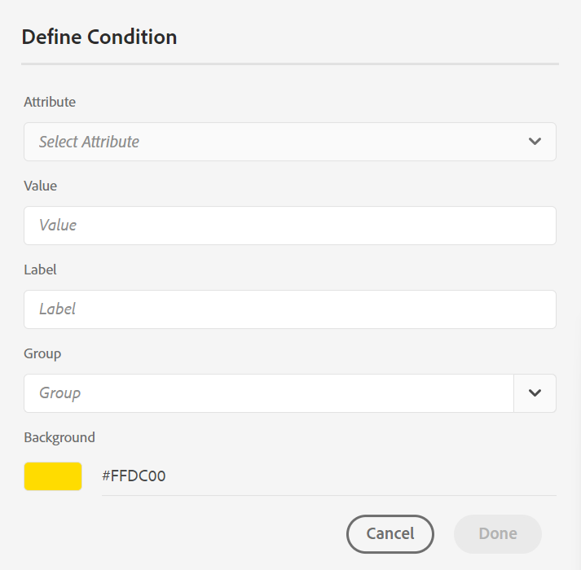{width="400" align="left"}

從「屬性」清單中，選取您要定義的條件屬性，輸入條件的值，然後指定顯示在「條件」面板中的標籤。 定義條件的群組。 您可以將多個條件新增至群組。 您也可以定義條件的顏色。 此顏色會設定為套用條件的內容背景顏色。

您可以將條件分組，並在巢狀資料夾中加以建構。 群組可協助您在多個層級建立條件，並更好地組織這些條件以用於內容。

例如，您可以建立&#x200B;*Acrobat*&#x200B;和&#x200B;*AEM Guides*&#x200B;等產品的條件群組。 您可以選取兩個群組的條件屬性。 在每個群組下，您都可以有特定的值，例如&#x200B;*使用者*、*管理員*、*檢閱者*&#x200B;和&#x200B;*作者*。

>[!NOTE]
>
> 鍵入以建立新群組或為特定屬性選取現有群組。

您可以使用`/`並定義子群組，例如`AEM Guides/Cloud Service`。


以巢狀階層方式組織的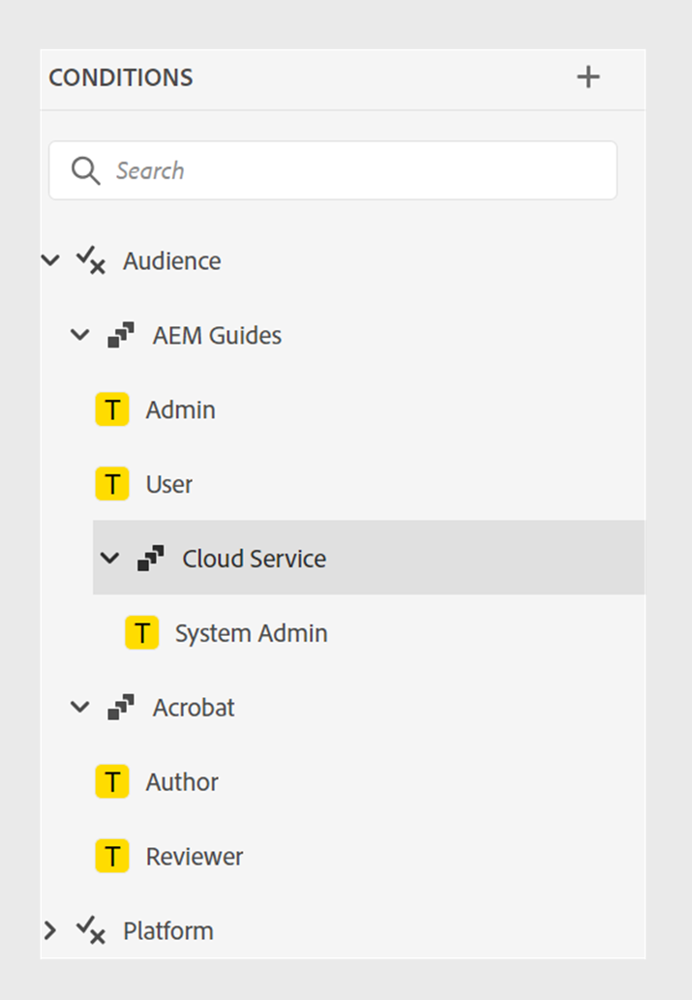{width="300" align="left"}


若要編輯條件，請從[選項]功能表選擇[編輯]。**** 此時會顯示「編輯條件」對話方塊：

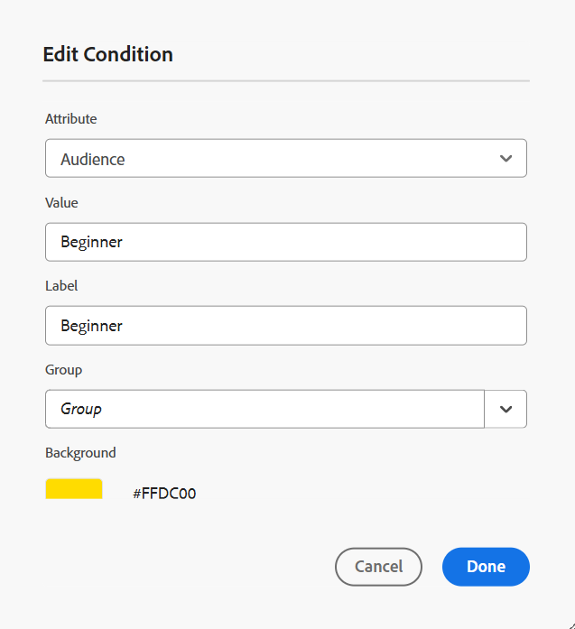{width="400" align="left"}

以定義新條件時設定的相同方式指定詳細資訊。

### 主旨配置

主旨配置對映是DITA對映的專門形式，用於定義分類主旨和控制值。 根據您的需求，您可以建立主旨配置對應，並在根對映檔案中參照它。 Experience Manager Guides可讓您定義主旨配置中主旨定義的巢狀層級階層。

您可以輕鬆地建立主旨配置對應，然後在主旨配置對應中使用主旨配置。 一旦將此對映新增為根對映後，主旨配置便會顯示在「主旨配置」面板中。 主旨配置面板會以巢狀或階層方式顯示可用的主旨配置。

Experience Manager Guides也支援巢狀層級主旨配置對應，您可以在根主旨配置對應下定義多個主旨配置。

下列範例說明如何在Experience Manager Guides中使用主題配置。

1. 在您選擇的工具中建立主旨配置檔案。 下列XML程式碼會建立繫結`platform`屬性的主旨配置。

```XML
<?xml version="1.0" encoding="UTF-8"?>
    <!DOCTYPE subjectScheme PUBLIC "-//OASIS//DTD DITA Subject Scheme Map//EN" "subjectScheme.dtd">
    <subjectScheme id="GUID-4f942f63-9a20-4355-999f-eab7c6273270">
        <title>rw</title>
        <!-- Define new OS values that are merged with those in the unixOS scheme -->
        <subjectdef keys="os">
            <subjectdef keys="linux">    </subjectdef>
            <subjectdef keys="mswin">    </subjectdef>
            <subjectdef keys="zos">    </subjectdef>
        </subjectdef>
        <!-- Define application values -->
        <subjectdef keys="app" navtitle="Applications">
            <subjectdef keys="apacheserv">    </subjectdef>
            <subjectdef keys="mysql">    </subjectdef>
        </subjectdef>
        <!-- Define an enumeration of the platform attribute, equal to       each value in the OS subject. This makes the following values       valid for the platform attribute: linux, mswin, zos -->
        <enumerationdef>
            <attributedef name="platform">    </attributedef>
            <subjectdef keyref="os">    </subjectdef>
        </enumerationdef>
        <!-- Define an enumeration of the otherprops attribute, equal to       each value in the application subjects.       This makes the following values valid for the otherprops attribute:       apacheserv, mysql -->
        <enumerationdef>
            <attributedef name="otherprops">    </attributedef>
            <subjectdef keyref="app">    </subjectdef>
        </enumerationdef>
    </subjectScheme>
```

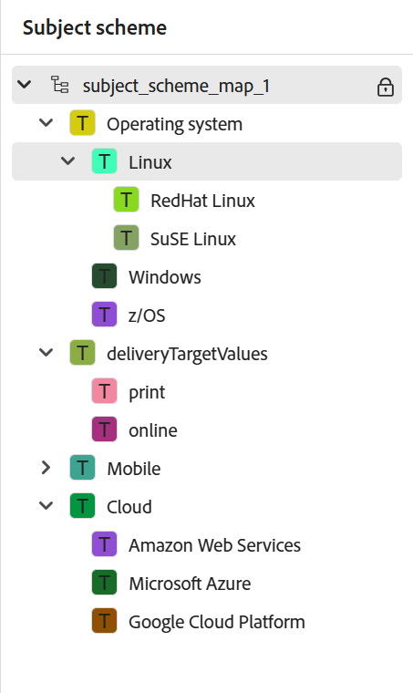{width="300" align="left"}

1. 儲存副檔名為a.ditamap的檔案，並將其上傳至DAM中的任何資料夾。

   >[!NOTE]
   >
   > 您可以在父DITA map中新增主旨配置檔案的參照。

   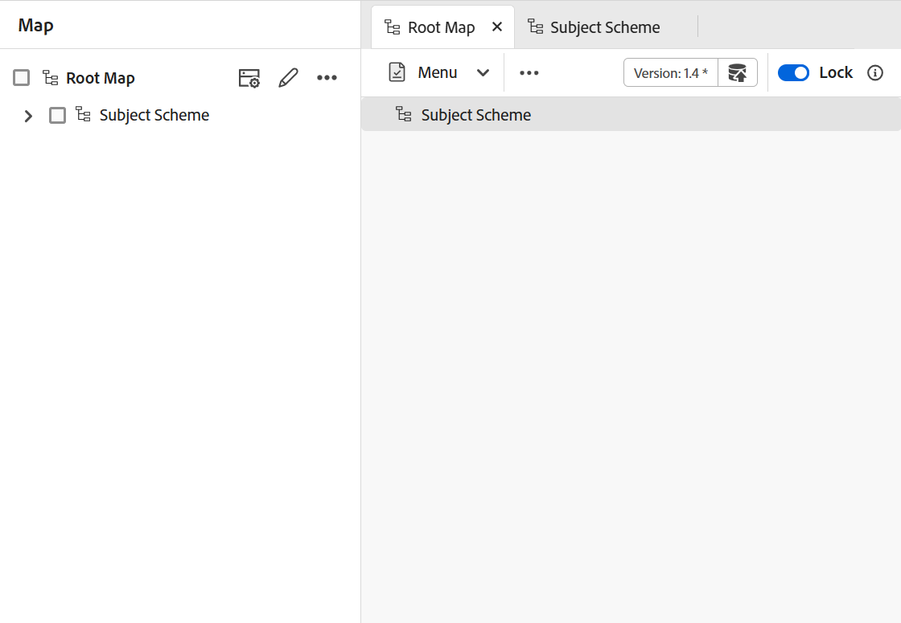{width="550" align="left"}

1. 在&#x200B;**使用者偏好設定**&#x200B;中將父對映設定為根對映。 一旦將此對映新增為根對映後，主旨配置便會顯示在「主旨配置」面板中。

   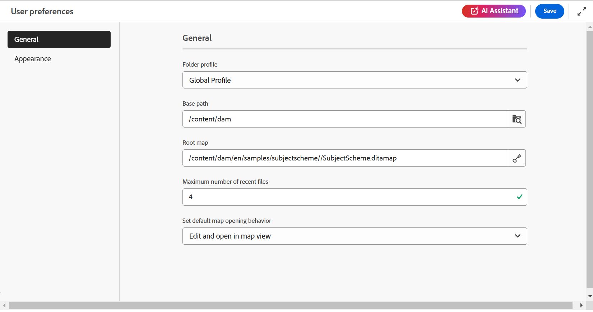{width="650" align="left"}


1. 在編輯器中，開啟您要使用主旨配置定義的檔案。
1. 只要將想要的主旨配置拖放至您的內容，即可將主旨配置套用至您的內容。 內容接著會以定義的顏色反白。


**處理主旨定義和分項清單的階層定義**

除了處理相同地圖中存在的分項清單和主旨定義外，Experience Manager Guides還提供可在兩個獨立地圖中定義分項清單和主旨定義的功能。 您可以在對應中定義一或多個主旨定義，在另一個對應中定義列舉定義，然後新增對應參照。 例如，下列XML程式碼會在兩個不同的對應中建立主旨定義和列舉定義。

已在`subject_scheme_map_1.ditamap`中定義主旨定義


```XML
<?xml version="1.0" encoding="UTF-8"?> 
    <!DOCTYPE subjectScheme PUBLIC "-//OASIS//DTD DITA Subject Scheme Map//EN" "../dtd/libs/fmdita/dita_resources/DITA-1.3/dtd/subjectScheme/dtd/subjectScheme.dtd"> 
    <subjectScheme id="subject-scheme.ditamap_f0bfda58-377b-446f-bf49-e31bc87792b3"> 

    <title>subject_scheme_map_1</title> 
    
    <subjectdef keys="os" navtitle="Operating system">
        <subjectdef keys="linux" navtitle="Linux">
        <subjectdef keys="redhat" navtitle="RedHat Linux">
        </subjectdef>
        <subjectdef keys="suse" navtitle="SuSE Linux">
        </subjectdef>
        </subjectdef>
        <subjectdef keys="windows" navtitle="Windows">
        </subjectdef>
        <subjectdef keys="zos" navtitle="z/OS">
        </subjectdef>
        </subjectdef>
        <subjectdef keys="deliveryTargetValues">
        <subjectdef keys="print">
        </subjectdef>
        <subjectdef keys="online">
        </subjectdef>
    </subjectdef>
    <subjectdef keys="mobile" navtitle="Mobile">
        <subjectdef keys="android" navtitle="Android">
        </subjectdef>
        <subjectdef keys="ios" navtitle="iOS">
    </subjectdef>
    </subjectdef>
    <subjectdef keys="cloud" navtitle="Cloud">
        <subjectdef keys="aws" navtitle="Amazon Web Services">
        </subjectdef>
        <subjectdef keys="azure" navtitle="Microsoft Azure">
        </subjectdef>
        <subjectdef keys="gcp" navtitle="Google Cloud Platform">
        </subjectdef>
    </subjectdef>
    </subjectScheme>
```

列舉定義存在於中    subject_scheme_map_2.ditamap。

```XML
<?xml version="1.0" encoding="UTF-8"?> 
        <!DOCTYPE subjectScheme PUBLIC "-//OASIS//DTD DITA Subject Scheme Map//EN" "../dtd/libs/fmdita/dita_resources/DITA-1.3/dtd/subjectScheme/dtd/subjectScheme.dtd"> 
        <subjectScheme id="subject-scheme.ditamap_17c433d9-0558-44d4-826e-3a3373a4c5ae"> 
        <title>subject_scheme_map_2</title> 
        <mapref format="ditamap" href="subject_scheme_map_1.ditamap" type="subjectScheme"> 
        </mapref> 
        <enumerationdef>
        <attributedef name="platform">
        </attributedef>
        <subjectdef keyref="mobile">
        </subjectdef>
        <subjectdef keyref="cloud">
        </subjectdef>
        </enumerationdef>
        </subjectScheme>
```

這裡的主體定義定義定義是在`subject_scheme_map_1.ditamap`中定義，而列舉定義則存在於`subject_scheme_map_2.ditamap`中。 `subject_scheme_map_1.ditamap`的參考也新增到`subject_scheme_map_2.ditamap`中。

>[!NOTE]
>
> 由於`subject_scheme_map_1.ditamap`與`subject_scheme_map_2.ditamap`相互參照，因此主旨配置已解析。

主旨列舉參考會依照下列優先順序來解析：

1. 相同地圖
1. 引用的地圖


如果在相同的對應和參照的對應中找不到分項清單，則不會解析參照。

**將值限製為特定專案**

您也可以將條件限製為主題中的某些元素。 使用`<elementdef>`標籤來定義元素，並使用`<attributedef>`標籤來定義可套用至元素的條件。  如果您不新增`<elementdef>`標籤，可以將條件套用至所有元素。
例如，使用以下列舉將`@platform`屬性限製為`<shortdesc>`專案。  其他條件對於所有元素都是可見的。

```XML
<enumerationdef>
    <elementdef name="shortdesc">
    </elementdef>
    <attributedef name="platform">
    </attributedef>
    <subjectdef keyref="deliveryTargetValues">
    </subjectdef>
    <subjectdef keyref="os">
    </subjectdef>
  </enumerationdef>
```


**屬性**&#x200B;下拉式清單

您也可以使用&#x200B;**作者**&#x200B;檢視中&#x200B;**內容屬性**&#x200B;面板的&#x200B;**屬性**&#x200B;下拉式清單，變更主旨配置值。

執行以下步驟來變更值：

1. 從&#x200B;**屬性**&#x200B;下拉式清單中選取屬性。
1. 選取&#x200B;**編輯**。
1. 從&#x200B;**值**&#x200B;下拉式清單中選取所需的值。
1. 選取「**更新**」。

您也可以從下拉式選單中選取多個值，以套用屬性的值。

**Source檢視**

您也可以從Source檢視中的屬性下拉式清單變更值。 Source檢視也會防止您新增任何不正確的值。

{width="550" align="left"}

**從條件面板檢視並套用主旨配置**

您也可以從「條件」面板檢視並套用主旨配置。

若要從「條件」面板檢視主旨配置，您的系統管理員必須在「設定」的「一般」標籤下，選取&#x200B;**「在條件面板中顯示主旨配置」**&#x200B;選項。 如需詳細資訊，請檢視[索引標籤列](#tab-bar)中的&#x200B;**設定**&#x200B;區段。

「條件」面板會顯示主旨配置中主旨定義的平面垂直結構。

您可以將所需的條件拖放至內容上，藉此將條件新增至內容。 條件內容會使用為條件定義的顏色反白顯示。

### 程式碼片段

程式碼片段是小型內容片段，可在說明檔案專案的各種主題中重複使用。 「代碼片段」面板會顯示您已建立的內容代碼片段集合。 若要插入程式碼片段，請從面板將程式碼片段拖放至主題中所需的位置。 「程式碼片段」面板可讓您新增、編輯、刪除、預覽和插入程式碼片段。

>[!IMPORTANT]
>
> 下列熒幕擷圖為具有管理許可權的使用者。 身為具有管理許可權的使用者，您可以新增、編輯和刪除程式碼片段。 否則，身為一般作者，您只會取得預覽和插入程式碼片段的選項。

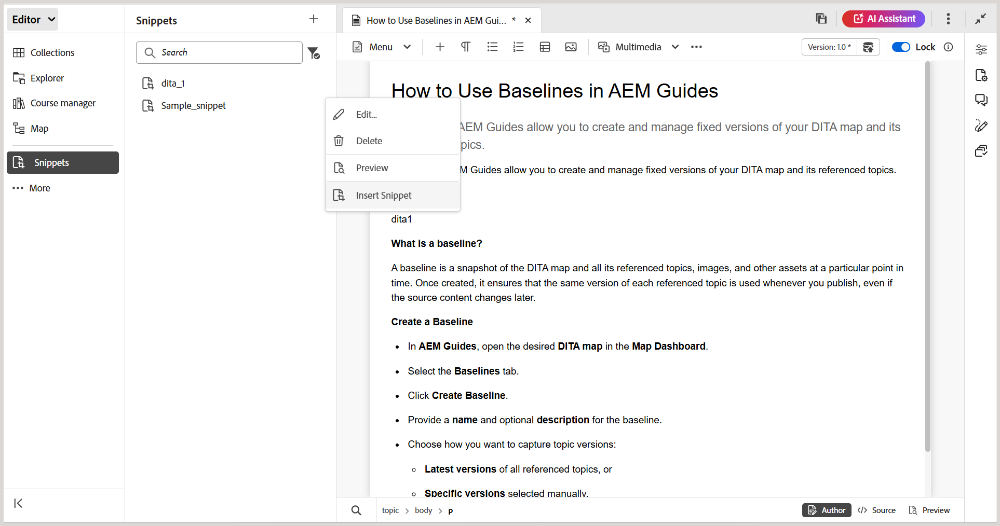{align="left"}

若要新增程式碼片段，請使用下列任一方法：

- 選取「程式碼片段」旁的&#x200B;**+**&#x200B;圖示，以開啟&#x200B;**新增程式碼片段**&#x200B;對話方塊。

  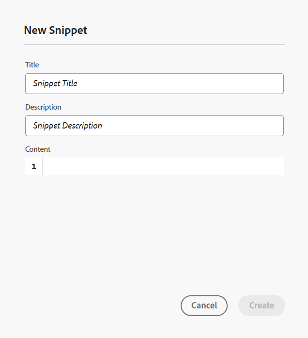{width="300" align="left"}

  在「新增程式碼片段」對話方塊中，提供出現在「程式碼片段」面板中的標題、說明以及要建立的程式碼片段內容的XML程式碼。 選取&#x200B;**建立**&#x200B;以儲存並建立程式碼片段。

- 在內容編輯區域中，以滑鼠右鍵按一下要當作程式碼片段使用的元素階層連結，然後從內容功能表中選擇&#x200B;**建立程式碼片段**。 「新程式碼片段」對話方塊會出現，並在&#x200B;**Content**&#x200B;欄位中填入所選專案的XML程式碼。 輸入程式碼片段的&#x200B;**標題**&#x200B;和&#x200B;**描述**，並選取&#x200B;**建立**&#x200B;以儲存程式碼片段。

- 在內容編輯區域中，以滑鼠右鍵按一下要當作程式碼片段使用的內容上任何位置，然後從內容功能表中選擇&#x200B;**建立程式碼片段**。 「新程式碼片段」對話方塊出現，並在&#x200B;**Content**&#x200B;欄位中填入所選專案的XML程式碼。 輸入程式碼片段的&#x200B;**標題**&#x200B;和&#x200B;**描述**，並選取&#x200B;**建立**&#x200B;以儲存程式碼片段。

  下列熒幕擷圖會醒目顯示階層連結和內容區域，您可從中叫用內容功能表。

  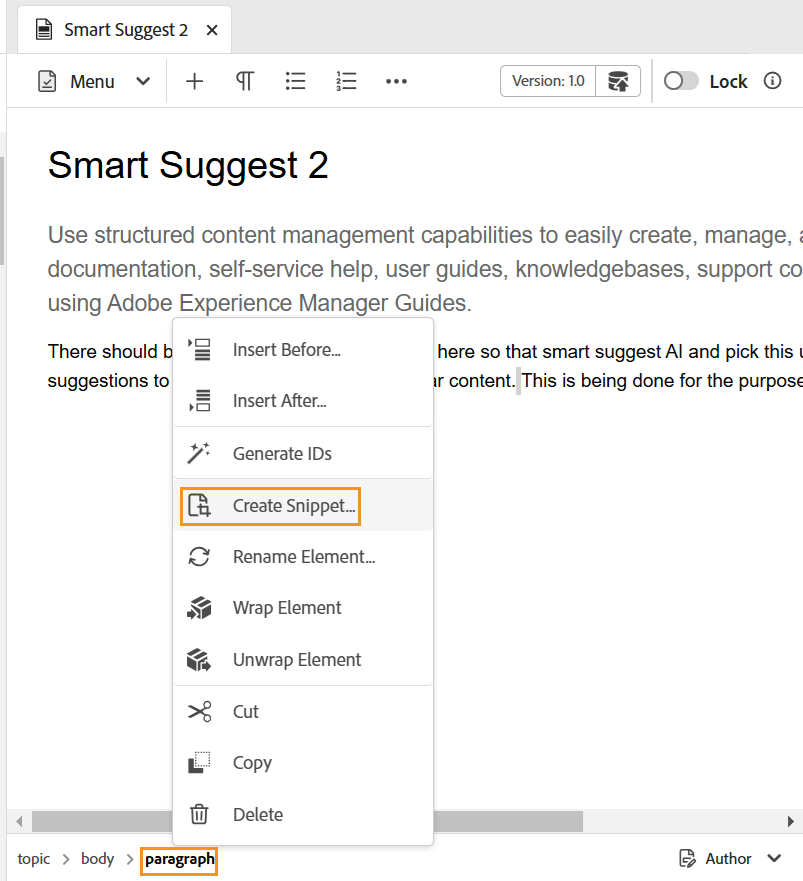{width="350" align="left"}


若要插入程式碼片段，請使用下列任一種方法：

- 從「程式碼片段」面板中選取程式碼片段，並將其拖放至主題中所需的位置。

- 從所需程式碼片段的「選項」選單中，選擇插入程式碼片段，將插入點放置在要插入程式碼片段的位置。


>[!NOTE]
>
> 從程式碼片段專案的內容功能表中，您也可以選擇編輯、刪除、取得預覽或插入程式碼片段。

### 範本

「範本」面板僅供管理員使用。 使用此面板，管理員可輕鬆建立和管理範本，然後供作者使用。 依照預設，範本分類在&#x200B;*對應*&#x200B;和&#x200B;*主題*&#x200B;型別範本下。

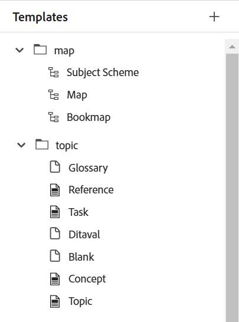{width="300" align="left"}

依預設，您可以依標題檢視檔案。 當您將滑鼠停留在範本上時，您可以檢視檔案標題和檔案名稱作為工具提示。

>[!NOTE]
>
> 作為管理員，您還可以選擇在編輯器中檢視檔案清單。 選取&#x200B;**使用者偏好設定**&#x200B;中&#x200B;**編輯器檔案顯示設定**&#x200B;區段的&#x200B;**檔案名稱**&#x200B;選項。

若要瞭解如何建立自訂範本，請檢視[根據自訂範本建立地圖](./create-maps-customized-templates.md)。

### 引文

在Experience Manager Guides中，您可以新增和匯入引文，並將其套用至您的內容。 您可以從任何書籍、網站和分錄來源新增這些引文。

如需詳細資訊，請檢視[新增和管理內容中的引文](./web-editor-apply-citations.md)。

### 語言變數

Experience Manager Guides提供可在原生PDF輸出中使用語言變數的功能。 您可以使用語言變數來定義PDF輸出中的當地語系化字串，或將輸出範本中的任何靜態文字當地語系化。 您可以使用CSS樣式將來自CSS的字串當地語系化。

如需詳細資訊，請檢視[語言變數的支援](../native-pdf/native-pdf-language-variables.md)。

### 變數

Experience Manager Guides可讓您建立和管理原生PDF發佈的變數。 如需詳細資訊，請檢視PDF輸出中的[變數](../native-pdf/native-pdf-variables.md)。


### 尋找並取代

尋找和取代圖示位於左側面板底部。 「尋找和取代」面板可讓您搜尋和取代地圖或存放庫內資料夾中檔案間的文字。 您可以尋找和取代地圖的所有主題，以及地圖內子地圖中的主題。

{align="left"}

依預設，您可以依標題檢視檔案。 當您將滑鼠停留在檔案上時，您可以檢視檔案標題和檔案路徑作為工具提示。

>[!NOTE]
>
> 身為管理員，您也可以選擇在編輯器中檢視檔案名稱清單。 選取&#x200B;**使用者偏好設定**&#x200B;中&#x200B;**編輯器檔案顯示設定**&#x200B;區段的&#x200B;**檔案名稱**&#x200B;選項。

若要執行全域搜尋和取代，請執行下列步驟：

1. 開啟全域&#x200B;**尋找及取代**&#x200B;面板。
1. 選取&#x200B;**檢視**&#x200B;下拉式清單，並選取下列其中一個選項來執行搜尋。

   - **目前對應**：若要搜尋目前開啟的對應

     >[!NOTE]
     >
     > 如果您已開啟地圖進行編輯，就會出現此選項。

   - **路徑**：若要搜尋選取的路徑
   - **選取地圖**：若要在選取的地圖中進行搜尋

1. 您可以使用&#x200B;**選項**&#x200B;下拉式清單，並從下列選項中選擇：

   - **在取代之前鎖定檔案**：如果您要在取代搜尋字詞之前自動鎖定檔案，請選取此選項。 如果您的管理員已啟用設定，以在編輯前鎖定檔案，此設定會更相關。 啟用後端設定後，您應選取此選項。 這會防止檔案鎖定對話方塊提示您在進行任何變更之前鎖定每個檔案。 如果您未選取此選項，則在開啟檔案進行編輯之前，將會出現提示。
   - **僅限全字**：如果您要搜尋整個搜尋字串，請選取此選項。 例如，如果您在搜尋字串中輸入over，則搜尋結果會傳回所有包含單字（如over和overview）的檔案。 如果您要限制搜尋以傳回輸入的確切字詞，請選取此選項。
   - **取代後建立新版本**：如果您要建立新版本的主題，並選擇取代文字，請選取此選項。 您也可以提供版本註解，這些註解將與每個更新的檔案一起新增。

     如果未選取此選項，則變更會儲存在主題的目前版本中，不會建立新版本。

   - **包含間接參照**：如果您想要搜尋間接參照（也在DITA map中）中的字串，請選取此選項。 依預設，這會停用，所以僅對直接參照執行搜尋。

1. 輸入您要尋找的搜尋字詞或文字。
1. 輸入要取代搜尋字詞的文字。
1. 按Enter或選取&#x200B;**搜尋**&#x200B;圖示\( \)以執行搜尋。
1. 從搜尋結果清單中選取檔案。 檔案會在內容編輯區域中開啟，搜尋字詞會在內容中反白顯示。

1. 選取[取代]單一出現位置&#x200B;**\( \)以取代主題中目前反白顯示的搜尋字詞，或選取[下一個相符專案]或[上一個相符專案]以移動到文字的下一個或上一個出現位置。**
1. 選取&#x200B;**全部取代** \( \)以按一下即可使用取代字詞取代單一檔案中搜尋字詞的所有例項。 取代所選檔案中的所有相符項後，您將會看到通知。

若要啟用「**全部取代**」圖示，您的系統管理員必須在「**設定**」的「**一般**」標籤下選取「**啟用全部取代**」選項。

>[!NOTE]
>
> 將滑鼠懸停在搜尋結果清單中的檔案上，即可在其右側檢視「在檔案中取代全部」圖示。 您也可以取得「忽略檔案」圖示，從搜尋結果中移除檔案。 您略過的檔案會從清單中移除，而且搜尋字詞不會在其中被取代。

在整個系統中，一次只能執行一個取代所有操作，並且在執行操作之前，您將會檢視「取代所有進行中」狀態。 您也可以中止之間的取代所有操作，或檢視記錄報告。 如果中止操作，您會在收件匣中收到有關該操作的通知。 取代所選檔案中的所有相符專案後，您將會看到成功通知。

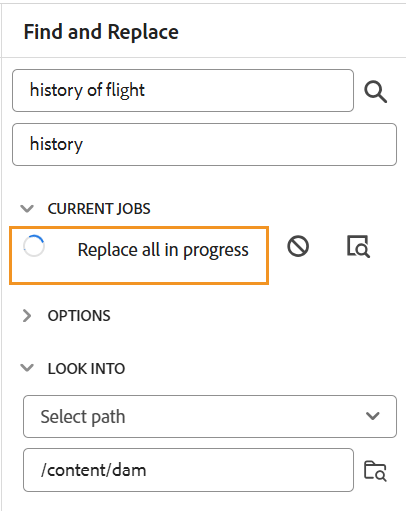{width="300" align="left"}

您也可以使用地圖&#x200B;**選項**&#x200B;功能表中的&#x200B;**在地圖中尋找**&#x200B;選項，在地圖中尋找和取代文字。 此選項會顯示在存放庫面板或地圖檢視中開啟的地圖上。

{width="550" align="left"}

### PDF範本

可讓您使用各種PDF範本。 如需詳細資訊，請檢視[PDF範本](../native-pdf/pdf-template.md)。

### 檢閱

Experience Manager Guides提供可在您的專案中顯示所有稽核任務的功能。 您可以從&#x200B;**檢閱**&#x200B;面板檢視您所屬的檢閱專案中的所有檢閱專案和作用中檢閱任務。  然後，您可以開啟稽核任務以檢視各種稽核者的註釋。

稽核面板會顯示稽核任務。 依預設，您可以依標題檢視檔案。 當您將滑鼠停留在檔案上時，您可以檢視檔案標題和檔案路徑作為工具提示。

>[!NOTE]
>
> 作為管理員，您也可以選擇在編輯器中依檔案名稱來檢視檔案清單。 選取&#x200B;**使用者偏好設定**&#x200B;中&#x200B;**編輯器檔案顯示設定**&#x200B;區段的&#x200B;**檔案名稱**&#x200B;選項。

身為作者，您可以使用編輯器在主題中處理註解。

若要檢視專案中現有之使用中複查作業中的複查註解，請執行下列步驟：

1. 選取左側面板中的檢閱。 **檢閱**&#x200B;面板隨即開啟。  系統會顯示您所屬之審閱專案中的所有審閱專案與作用中審閱任務。

   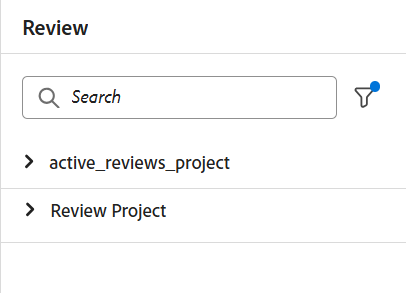{width="300" align="left"}
1. 選取稽核專案，然後從清單中選取稽核任務以開啟它。
1. 您也可以以下列方式篩選專案：

   - 輸入要在專案標題中尋找的搜尋字詞或文字。 然後按下Enter以執行搜尋。 例如，您可以搜尋標題中包含「空格」字詞的所有專案。

   - 選取以開啟&#x200B;**篩選器**&#x200B;對話方塊。 您可以選取所有專案或僅選取特定專案。 選取的專案會列在&#x200B;**檢閱**&#x200B;面板中。

     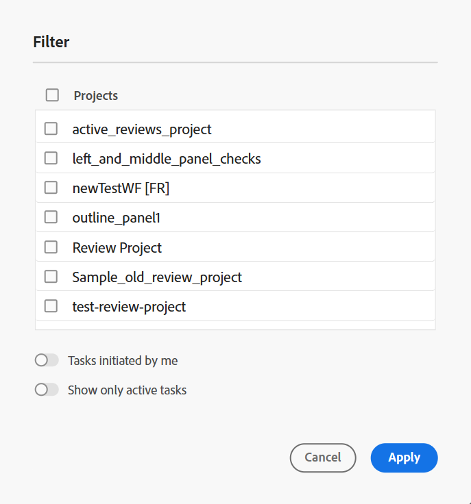{width="300" align="left"}

     啟用&#x200B;**由我起始的任務**&#x200B;選項，以僅檢視您已起始的任務。 即使在重新整理頁面後，也會維持此選項的切換狀態。 啟用&#x200B;**僅顯示作用中的任務**&#x200B;選項以篩選專案清單以顯示目前作用中的任務。

1. 依預設，在您的稽核專案中，您將檢視含有與其相關之註解的主題平面清單。 從左側邊欄套用所需的篩選器，以根據主題中存在的稽核評論來篩選主題：

   - **檢視所有主題**：列出專案中存在的所有主題。
   - **檢視含有評論的主題**：僅列出包含評論的主題。
1. 您也可以輸入要在主題標題或檔案路徑中尋找的搜尋字詞或文字。 會列出標題或檔案路徑中包含辭彙的主題。
1. 連按兩下任何主題，以在作者檢視中開啟。 您可以在&#x200B;**註解**&#x200B;面板中檢視註解。

   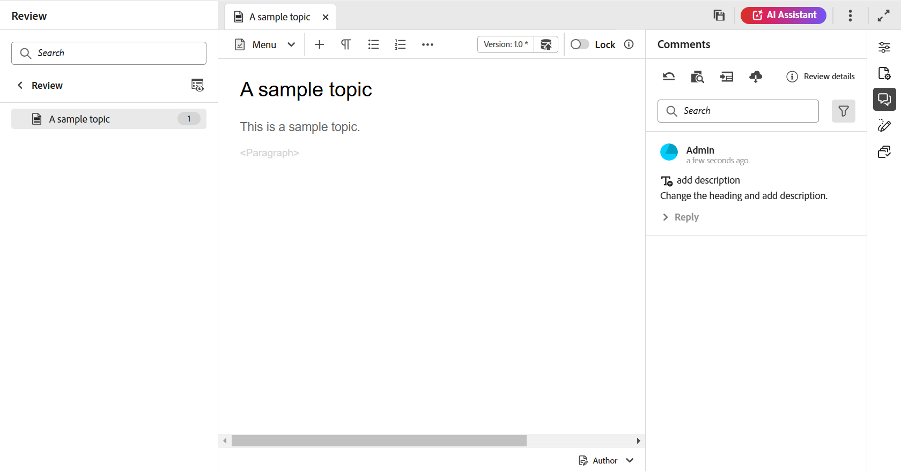{align="left"}

   >[!NOTE]
   > 
   > **檢閱**&#x200B;面板與&#x200B;**註解**面板始終同步。 在「註解」面板中，註解會根據「審閱」面板中載入的稽核任務載入。
   >您可以在檢閱面板的左側邊欄中檢視已關閉的檢閱任務，以及作用中的檢閱任務。
   >此外，對於已關閉的稽核任務，您可以在右側的「註解」面板中檢視稽核註解，但&#x200B;**匯入註解**&#x200B;和&#x200B;**回覆版本**按鈕已停用。
   >如需如何處理評論的詳細資訊，請檢視[處理評論評論](review-address-review-comments.md#)。


## 內容編輯區域

內容編輯區域是顯示主題或地圖內容的地方。 您會在此區域中編輯所有內容。 其會提供您正在編輯內容的WYSIWYG檢視。

在內容編輯區域的左下方，您有目前游標位置處的元素階層連結。 可用的編輯器檢視會顯示在右下角。

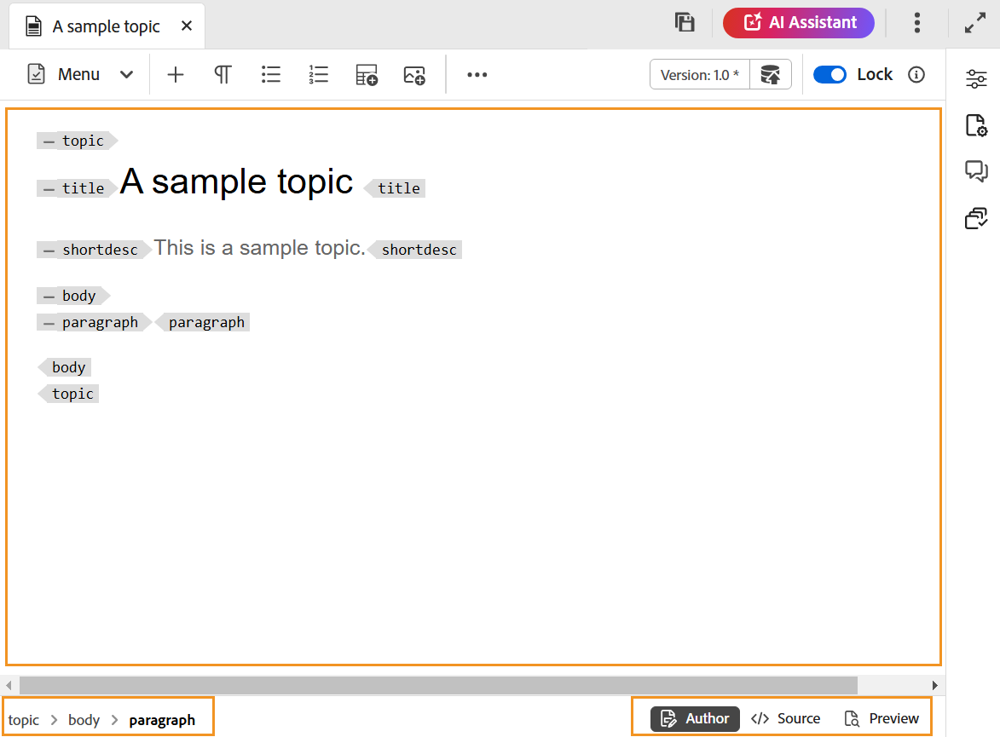{align="left"}

若要進一步瞭解內容編輯區域中主題檔案可用的編輯器檢視，請檢視[編輯器檢視](./web-editor-views.md)。

>[!NOTE]
>
> 如果您正在處理對應檔案，則內容編輯區域中會顯示不同的選項或檢視，包括對應檔案的&#x200B;**配置**&#x200B;檢視。 如需詳細資訊，請檢視[對應編輯器功能](./map-editor-advanced-map-editor.md)。

## 右側面板

右側面板包含目前所選檔案的相關資訊。

>[!NOTE]
>
> 右側面板可調整大小。 若要調整面板大小，請將游標置於面板邊界上，游標會變成雙向箭頭，然後選取並拖曳即可調整面板寬度。

右側面板可讓您存取以下功能：

- [內容屬性](#content-properties)
- [檔案屬性](#file-properties)
- [檢閱](#review-1)
- [追蹤變更](#track-changes)
- [結構描述](#schematron)

### 內容屬性

選取右側面板中的&#x200B;**內容屬性**&#x200B;圖示，即可存取&#x200B;**內容屬性**&#x200B;功能。 **Content屬性**&#x200B;面板包含檔案中目前選取的元素型別及其屬性的相關資訊。

**型別**：您可以從下拉式清單中檢視並選取目前標籤的完整階層標籤。

**Attributes**： **Attributes**&#x200B;下拉式面板在「配置」、「作者」和「Source」檢視中可用。 您可以輕鬆地新增、編輯或刪除屬性。

1. 選取「**新增**」。

   內容屬性中的{width="300" align="left"}

1. 在&#x200B;**屬性**&#x200B;下拉式面板中，從下拉式清單中選取屬性並指定屬性的值。  然後選取&#x200B;**新增**。

   具有多個屬性的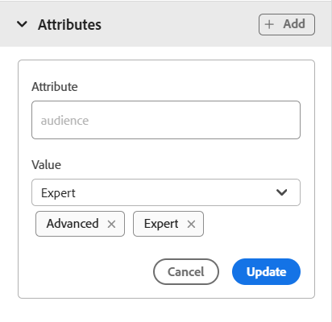{width="300" align="left"}

1. 若要編輯屬性，請將滑鼠停留在它上並選取&#x200B;**編輯** 。

1. 若要刪除屬性，請將滑鼠停留在它上並選取&#x200B;**刪除** 。


>[!NOTE]
>
> 即使您的主題包含參考的內容，您仍可以使用屬性面板在其上新增屬性。

如果管理員已建立屬性的設定檔，您將會取得這些屬性及其設定的值。 使用內容屬性面板，您可以選擇這些屬性，並將其指派給主題中的相關內容。 如此一來，您也可以建立條件式內容，然後將其用於建立條件式輸出。 如需使用條件預設集產生輸出的詳細資訊，請檢視[使用條件預設集](generate-output-use-condition-presets.md#)。

### 檔案屬性

選取右側面板中的「檔案屬性」圖示，以檢視所選檔案的屬性。 「檔案屬性」功能適用於所有四種模式或檢視：「配置」、「作者」、「Source」和「預覽」。

「檔案」屬性包含下列兩個區段：

**一般**

「一般」段落可讓您存取下列功能：

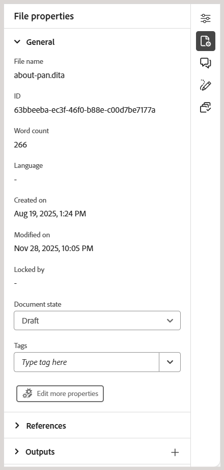{width="300" align="left"}

- **檔案名稱**：顯示所選主題的檔案名稱。 檔案名稱會以超連結方式連結至選取檔案的屬性頁面。
- **ID**：顯示所選主題的識別碼。
- **標籤**：這些是主題的中繼資料標籤。 從屬性頁面的標籤欄位中設定。 您可以輸入或從下拉式清單中選取。  標籤會顯示在下拉式清單下方。 若要刪除標籤，請選取標籤旁的十字圖示。
- **編輯更多屬性**：您可以從檔案屬性頁面編輯更多屬性。
- **語言**：顯示主題的語言。 這是從屬性頁面中的語言欄位設定。
- **建立於**：顯示建立主題的日期和時間。
- **修改日期**：顯示修改主題的日期和時間。
- **鎖定者**：顯示鎖定主題的使用者。
- **檔案狀態**：您可以選取並更新目前開啟之主題的檔案狀態。 如需詳細資訊，請檢視[檔案狀態](web-editor-document-states.md#)。

>[!NOTE]
>
> 您可以將「檔案」屬性中各個欄位的屬性值複製到剪貼簿。

**個參考**

「參照」區段可讓您存取下列功能：

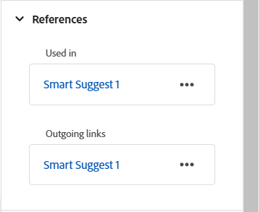{width="300" align="left"}

- **用於**： Used in references列出參照或使用目前檔案的檔案。
- **傳出連結：**&#x200B;傳出連結列出目前檔案中參照的檔案。

依預設，您可以依標題檢視檔案。 當您將滑鼠停留在檔案上時，您可以檢視檔案標題和檔案路徑作為工具提示。

>[!NOTE]
>
> 作為管理員，您也可以選擇在編輯器中依檔案名稱來檢視檔案清單。 選取&#x200B;**使用者偏好設定**&#x200B;中&#x200B;**編輯器檔案顯示設定**&#x200B;區段的&#x200B;**檔案名稱**&#x200B;選項。

>[!NOTE]
>
> 所有「使用中」和「傳出」參照都會超連結至檔案。 您可以輕鬆開啟及編輯連結的檔案。

除了開啟檔案之外，您也可以使用[參考]區段中的&#x200B;**選項**&#x200B;功能表執行許多動作。 您可以執行的部分動作包括編輯、預覽、複製UUID、複製路徑、新增至集合、屬性。

### 檢閱

選取「稽核」圖示會開啟稽核面板，您可以在其中為目前開啟的檔案選取稽核任務並檢視註解。

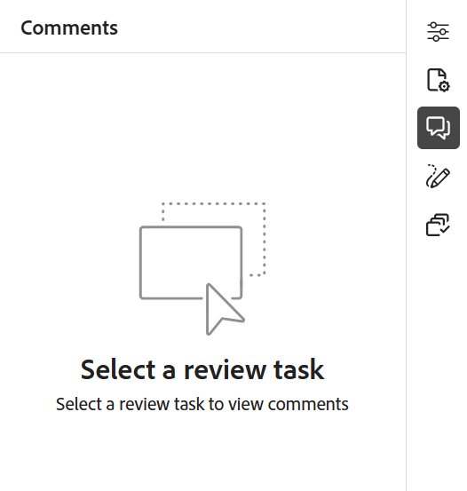{width="300" align="left"}

如果您已建立多個「檢閱」專案，您可以從下拉式清單中選取一個專案，並存取檢閱註解。

使用稽核面板，您可以檢視並張貼主題上註解的回覆。 您可以逐一接受或拒絕註解。

>[!NOTE]
>
> 註解方塊和回複方塊支援多行專案，可讓使用者視需要將其展開，以提供完整的註解以及註解的詳細回覆。 您可以在撰寫評論或回覆時使用&#x200B;**Shift** + **Enter**&#x200B;移至下一行。

如需詳細資訊，請檢視[地址檢閱註解](review-address-review-comments.md#)。

### 追蹤變更

使用右側面板的「追蹤的變更」功能，您可以檢視檔案中所有更新的資訊。 您也可以搜尋對檔案所做的任何特定更新。

>[!NOTE]
>
> 追蹤的變更功能會顯示已使用[索引標籤列](#tab-bar)的啟用/停用追蹤變更功能追蹤的所有更新。

### 結構描述

「Schematron」是指用於定義XML檔案測試的規則型驗證語言。 編輯器支援Schematron檔案。 您可以匯入Schematron檔案，也可以在編輯器中編輯它們。 使用Schematron檔案，您可以定義某些規則，然後針對DITA主題或地圖驗證這些規則。

瞭解如何在Experience Manager Guides中使用Schematron檔案，請參閱[支援Schematron檔案](./support-schematron-file.md)。


**父級主題**： [編輯器簡介](web-editor.md)
