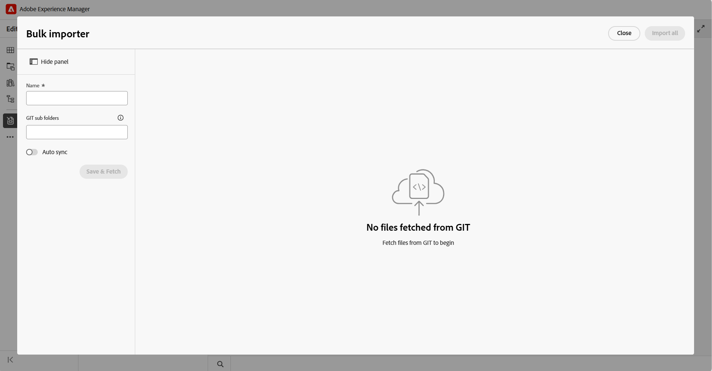

# 使用Git聯結器(Beta)匯入內容

>[!IMPORTANT]
>
> Git聯結器目前是Beta功能，預設為停用。 若要啟用此功能，請聯絡客戶成功團隊。

Git Connector可讓您將內容從已連線的Git存放庫匯入至Experience Manager Guides。 匯入內容後，您可以使用Experience Manager Guides的編寫、審閱、翻譯和發佈功能來開發和提供檔案。

當來源存放庫中的內容變更時，您可以重新擷取更新、審查衝突，並與Experience Manager Guides同步最新變更。

## 先決條件

開始使用此功能之前，請確定：

- 必須為您的環境啟用Git聯結器功能。
- （*若已啟用*）您的管理員已在您的環境中設定Git聯結器。 如需詳細資訊，請檢視[從使用者介面](../install-conf-guide/conf-git-connector.md)建立和設定Git聯結器。
- 您對包含您要匯入之內容的Git存放庫具有&#x200B;*讀取*&#x200B;存取權。
- 您知道要匯入的存放庫分支和來源資料夾。
- 您知道Experience Manager Guides中儲存匯入內容的目標資料夾。

## 從連線的Git存放庫匯入內容

管理員設定Git聯結器後，您可以從編輯器使用聯結器，開始從Git存放庫匯入內容。  執行以下步驟，從Git存放庫匯入內容：

1. 在編輯器中，開啟左側面板。
1. 選取&#x200B;**資料來源**。

   隨即顯示已連線的資料來源。

1. 選取&#x200B;**Git Connector**&#x200B;圖磚。

1. 選取+圖示，然後選取&#x200B;**大量匯入工具**。

   顯示&#x200B;**大量匯入工具**&#x200B;對話方塊。

   

1. 在&#x200B;**大量匯入工具**&#x200B;對話方塊中，提供匯入的名稱，從已設定的Git存放庫中選取子資料夾，然後選取&#x200B;**儲存並擷取**。  可匯入的檔案清單會顯示在對話方塊中。 繼續之前，請先檢閱清單並驗證內容。

   

1. 檢閱檔案後，選取&#x200B;**全部匯入**&#x200B;以將內容匯入Experience Manager Guides。

   >[!NOTE]
   >
   > 您可以啟用&#x200B;**自動同步**，以自動同步和匯入Git存放庫中的內容至Experience Manager Guides。 如果偵測到任何錯誤，則不會觸發自動同步處理，而且作者必須選取&#x200B;**全部匯入**，以手動方式匯入內容。 啟用後，匯入工具將無法停用自動同步處理。

匯入內容後，在設定Git聯結器時，內容會儲存在已設定的&#x200B;**目標AEM根路徑**&#x200B;下。

## 管理Git匯入的內容

將內容匯入Experience Manager Guides後，您可以使用可用的動作來管理內容，並將其與來源存放庫中的變更保持同步。

{width="600"}

- **預覽**：預覽匯入的內容。 如果來源存放庫包含更新，請檢閱差異並使用&#x200B;**重新擷取**&#x200B;選項匯入最新變更。
- **刪除**：移除已不需要的匯入內容。
- **重新命名**：重新命名匯入的內容以方便識別。
- **檢視記錄**：檢視匯入記錄檔以檢視匯入作業的詳細資料。
- **檢視報告**：檢視並下載&#x200B;**大量匯入報告**，其中包含下列詳細資料：

   - 匯入檔案總數
   - 成功匯入的次數
   - 匯入失敗的次數

  {width="600"}

  您也可以下載詳細報表。 如果某些檔案無法匯入，請使用&#x200B;**重試失敗的匯入**，以嘗試再次匯入這些檔案。

## 檢閱和解決內容衝突

當您從Git存放庫重新擷取內容時，存放庫版本與Experience Manager Guides中可用的對應內容之間的內容差異會顯示為衝突。 您必須解決並合併這類衝突，才能將資料匯入Experience Manager Guides。

執行以下步驟來解決和合併衝突：

1. 開啟「大量匯入工具」對話方塊並選取&#x200B;**重新擷取**。
1. 如果偵測到衝突，**需要合併**&#x200B;索引標籤會出現，並列出包含衝突的檔案。 選取「**需要合併**」標籤，然後從清單中選取檔案以檢閱並解決衝突。
1. 請檢閱下列章節中的內容：

   {width="600"}

   - 在&#x200B;**AEM**&#x200B;區段中，會顯示Experience Manager Guides中目前的內容版本。
   - 在&#x200B;**Git**&#x200B;區段中，會顯示存放庫內容的最新版本。
   - 在&#x200B;**合併**&#x200B;區段中，會顯示合併的內容。

1. 檢閱編輯器中反白的差異，並使用合併控制項解決衝突：

   - 如果您想要使用Git存放庫中的最新變更，請確定已選取&#x200B;**Git**&#x200B;區段中衝突的核取方塊，然後選取對應的`<<<`控制項。 選取的Git內容會取代&#x200B;**合併**&#x200B;區段中的衝突內容。

     {width="600"}

   - 如果要保留兩個版本的內容，請清除衝突的核取方塊，然後使用`<<<`控制項將所需內容新增到&#x200B;**合併**&#x200B;區段，而不取代現有內容。

     {width="600"}

   - 同樣地，您可以使用AEM區段中的`>>>`控制項，保留Experience Manager Guides中目前的可用版本。

     {width="600"}

1. 檢閱合併內容後，請執行下列其中一項動作：

   - 當存放庫版本應該取代衝突的內容時，使用&#x200B;**接受來自Git**&#x200B;的變更。
   - 檢閱並更新合併的版本後，使用&#x200B;**標示為已合併**，以確保該版本包含您要保留的內容。
   - 使用&#x200B;**重設**&#x200B;捨棄所有合併的更新，並將內容還原成原始狀態。

將包含衝突的所有檔案標示為合併後，**全部匯入**&#x200B;按鈕就會啟用。 選取&#x200B;**全部匯入**&#x200B;以完成解決衝突的程式。

如果存放庫包含全新的內容，例如與現有內容不衝突的新主題、段落或行，則會顯示在&#x200B;**清除更新**&#x200B;下。 這些更新不需要衝突解決，可以直接匯入。

{width="600"}

