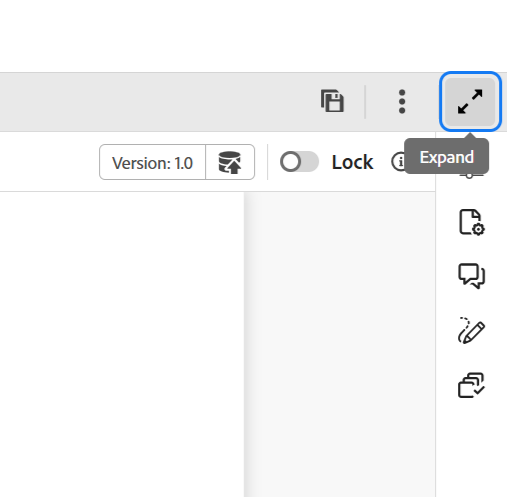

# 編輯器中的標題列

標題列是顯示Adobe Experience Manager標誌的編輯器頂端列(如果您使用Unified Shell做為Experience Manager Guides UI，則為Unified Shell)。 當您選取標誌時，它會將您導向Experience Manager導覽頁面。

{width="800" align="left"}

使用工具列中的&#x200B;**展開**&#x200B;圖示來隱藏標題列並最大化內容區域。

{width="550" align="left"}

若要還原標準檢視，請選取&#x200B;**結束擴充的檢視**。

**父級主題：**[&#x200B;編輯器簡介](web-editor.md)
