# 啟動編輯器 {#id2056B0140HS}

您可以從下列位置啟動編輯器：

- [Adobe Experience Manager導覽頁面](#adobe-experience-manager-navigation-page)
- [ADOBE EXPERIENCE MANAGER ASSETS UI](#adobe-experience-manager-assets-ui)
- [地圖主控台](#map-console)

以下小節涵蓋如何從不同位置存取和啟動編輯器的詳細資訊。

## Adobe Experience Manager導覽頁面

登入Experience Manager時，畫面會顯示導覽頁面：

{width="800" align="left"}

選取&#x200B;**指南**&#x200B;連結會帶您前往[Adobe Experience Manager Guides首頁](./intro-home-page.md)。

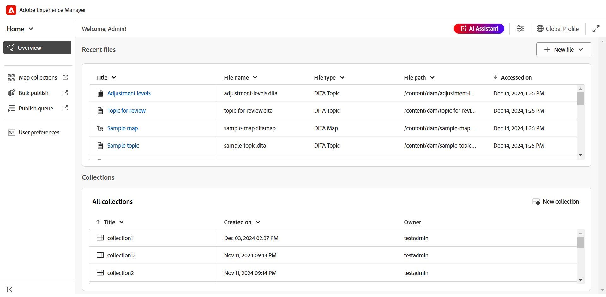{width="800" align="left"}

若要啟動編輯器，請移至導覽列，然後從下拉式清單中選取&#x200B;**編輯器**。 預設會選取「首頁」。

{width="350" align="left"}

當您未選取任何檔案即啟動編輯器時，畫面會顯示空白的編輯器畫面。 您可以從Experience Manager **存放庫**&#x200B;或您的&#x200B;**集合**&#x200B;開啟檔案以進行編輯。

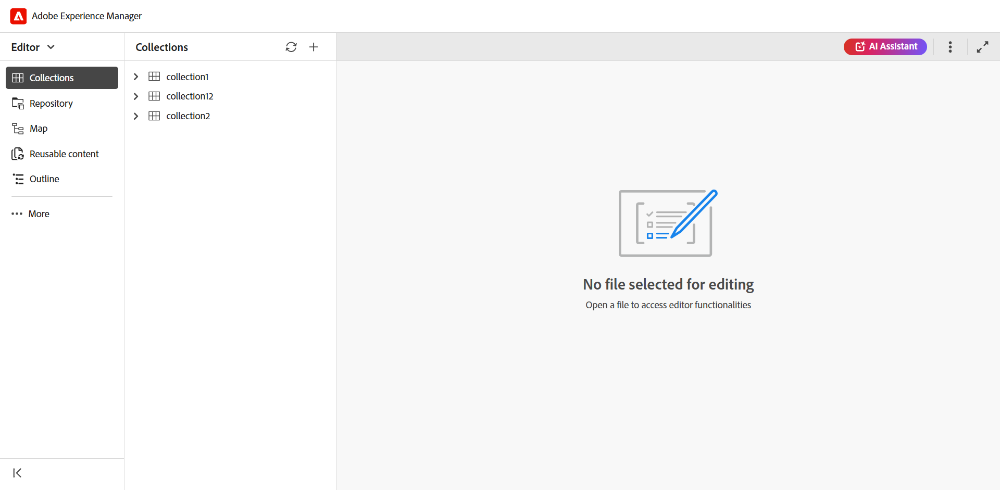{width="800" align="left"}

或者，您也可以開啟[Adobe Experience Manager Guides首頁體驗](./intro-home-page.md)的&#x200B;**最近使用的檔案** Widget和&#x200B;**集合** Widget中現有的檔案，以啟動編輯器。

若要返回Experience Manager導覽頁面，請選取位於上頁首左上角的Adobe Experience Manager標誌。

## ADOBE EXPERIENCE MANAGER ASSETS UI

您可以從中啟動編輯器的另一個位置是來自Experience Manager Assets UI。 您可以選取一或多個主題，並直接在編輯器中開啟主題。

若要在編輯器中開啟主題，請執行下列步驟：

1. 在Assets UI中，導覽至您要編輯的主題。

   >[!NOTE]
   >
   > 您也可以檢視主題的UUID。

   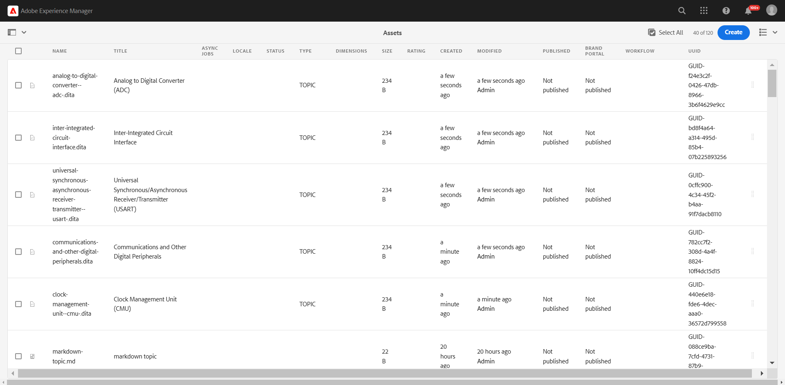{width="800" align="left"}

   >[!IMPORTANT]
   >
   > 確保您對包含要編輯之主題的資料夾具有讀取和寫入許可權。

1. 若要取得主題的獨佔鎖定，請選取主題，然後選取&#x200B;**簽出**。

   >[!IMPORTANT]
   >
   > 如果您的管理員已設定&#x200B;**停用編輯而不鎖定檔案**&#x200B;選項，則您必須先簽出檔案才能進行編輯。 如果您未出庫檔案，將無法檢視編輯選項。

1. 關閉資產選擇模式，並選取您要編輯的主題。

   主題預覽隨即顯示。

   您可以從「清單」檢視、「卡片」檢視和「預覽」模式中開啟「編輯器」。

   >[!IMPORTANT]
   >
   > 如果您想要開啟多個主題進行編輯，請從資產UI中選取所需的主題，然後選取&#x200B;**編輯**。 請確認您的瀏覽器未啟用快顯封鎖程式，否則只會開啟所選清單中的第一個主題進行編輯。

   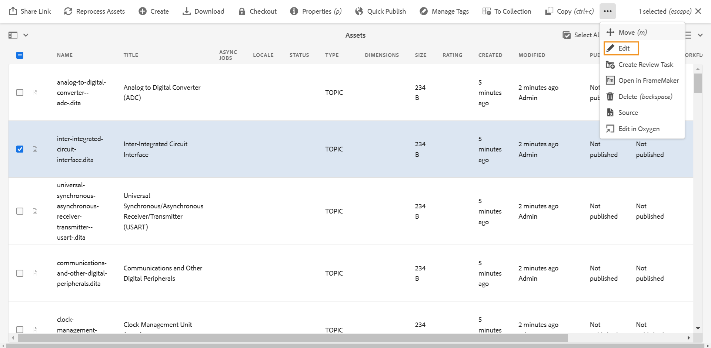{width="800" align="left"}

   如果您不想預覽主題，並想直接在編輯器中開啟主題，請從卡片檢視選取快速動作功能表中的&#x200B;**編輯**&#x200B;圖示：

   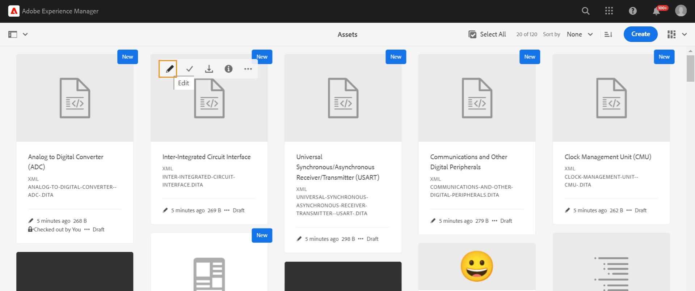{width="800" align="left"}

   主題會在編輯器中開啟。

   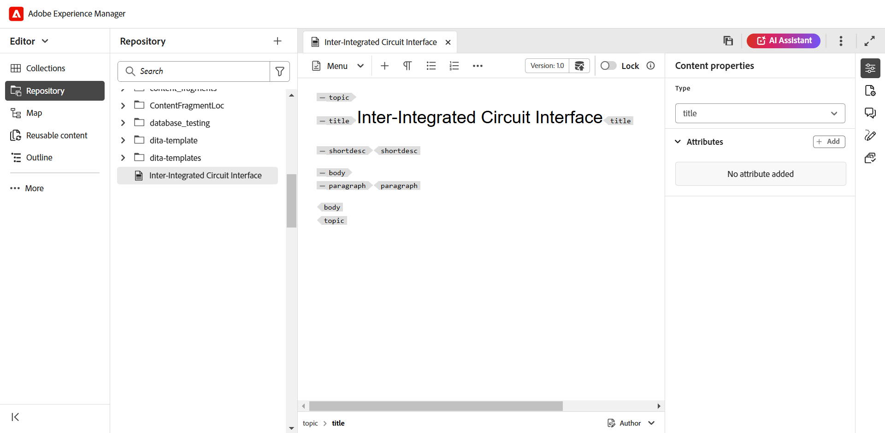{width="800" align="left"}

您也可以在Assets UI中開啟對應檔案，並啟動編輯器以編輯對應檔案中的主題。

若要在編輯器中開啟對應，請遵循下列步驟：

1. 在Assets UI中，導覽至並選取包含您要編輯之主題的對應檔案。
1. 在DITA map主控台中，導覽至&#x200B;**主題**&#x200B;索引標籤。 隨即顯示地圖檔案中的主題清單。
1. 選取要編輯的主題檔案。
1. 選取&#x200B;**編輯主題**。

   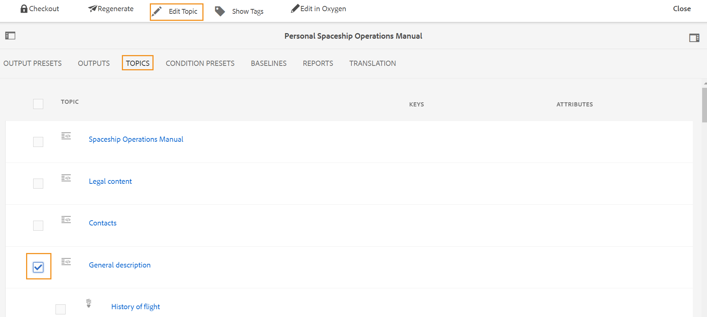{width="800" align="left"}

1. 主題會在編輯器中開啟。

   >[!IMPORTANT]
   >
   > 如果您的管理員已設定&#x200B;**停用編輯而不鎖定檔案**&#x200B;選項，則您必須先簽出檔案才能進行編輯。 如果未出庫檔案，則檔案會在編輯器中以唯讀模式開啟。

## 地圖主控台

若要從Map主控台開啟Editor，請執行下列步驟：

1. 開啟「首頁」，然後啟動「地圖」主控台。

   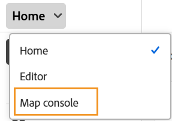{width="350" align="left"}

   當您未選取任何對應檔案就啟動對應主控台時，畫面會顯示空白的對應主控台畫面。 您也可以從Experience Manager **存放庫**&#x200B;或您的&#x200B;**集合**&#x200B;開啟對應檔案。

   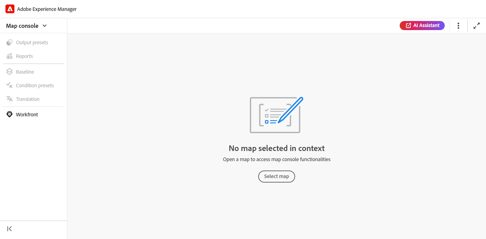{width="500" align="left"}

1. 選擇&#x200B;**選取對應**&#x200B;以開啟包含您要在編輯器中編輯之主題的對應檔案。
1. 選取地圖檔案所在的路徑。 選取的對映檔案會新增至「對映」主控台。
1. 導覽至地圖檔案，並從下拉式清單中選取&#x200B;**在編輯器中開啟**。

   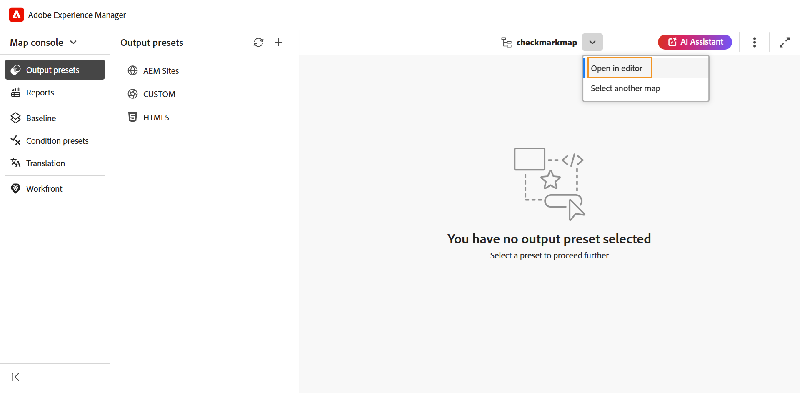{width="800" align="left"}

   包含主題的對應檔案會在編輯器中開啟以進行編輯。

   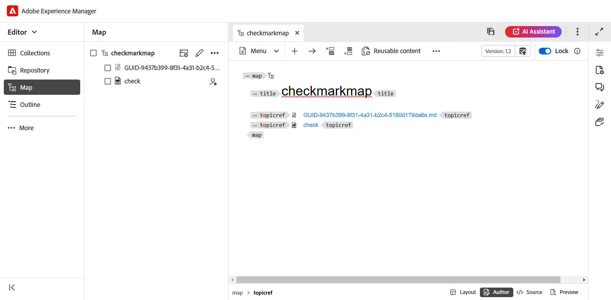{width="800" align="left"}

**父級主題**： [編輯器簡介](web-editor.md)
