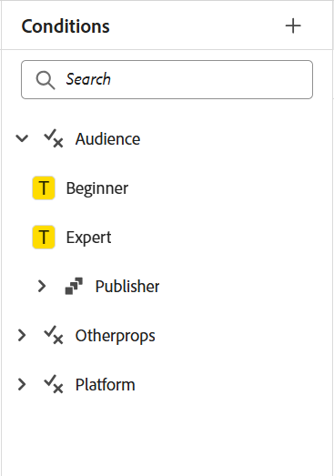
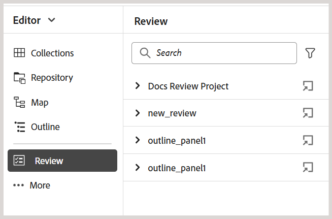

# 編輯器中的左側面板

左側面板可讓您快速存取「集合」、「存放庫檢視」、「地圖」檢視及更多功能。 您可以選取位於介面左下角的&#x200B;**展開**&#x200B;圖示來展開面板。 展開後，請使用&#x200B;**摺疊**&#x200B;圖示來摺疊面板。 在展開的檢視中，它會顯示圖示的名稱，這些圖示會在收合的檢視中顯示為工具提示。

>[!NOTE]
>
> 左側面板可調整大小。 若要調整面板大小，請將游標置於面板邊界上，游標會變成雙向箭頭，然後選取並拖曳即可調整面板寬度。

左側面板可讓您存取以下功能：

- [集合](#collections)
- [存放庫](#repository)
- [地圖](#map)
- [可重複使用的內容](#reusable-content)
- [大綱](#outline)

左側面板中的某些功能可在&#x200B;**更多**&#x200B;區段下使用。 選取「更多」圖示以存取下列功能：

- [字彙表](#glossary)
- [條件](#conditions)
- [主旨配置](#subject-scheme)
- [程式碼片段](#snippets)
- [範本](#templates)
- [引文](#citations)
- [語言變數](#language-variables)
- [變數](#variables)
- [尋找並取代](#find-and-replace)
- [PDF範本](#pdf-templates)
- [檢閱](#review)


如果已設定Adobe Workfront，則左側面板中也會顯示一個標示為&#x200B;**Workfront**&#x200B;的其他選項。

如需詳細資訊，請檢視[Workfront整合](./workfront-integration.md)。

>[!NOTE]
>
> 左側面板中可用的功能由您的管理員管理，可讓他們啟用或停用左側面板中顯示的個別功能。 只有已啟用的功能才會顯示在左側面板中。 如需詳細資訊，請檢視&#x200B;**索引標籤列**&#x200B;的[面板](./web-editor-tab-bar.md)區段。

左面板功能的詳細說明如下：

## 集合

如果您使用一組檔案或資料夾，您可以將它們新增至您最愛的清單，以便快速存取。 **集合**&#x200B;顯示您已新增的檔案清單，以及其他使用者可公開存取的其他檔案清單。

依預設，您可以依標題檢視檔案。 當您將滑鼠停留在檔案上時，您可以檢視檔案標題和檔案路徑作為工具提示。

>[!NOTE]
>
> 作為管理員，您也可以選擇在編輯器中依檔案名稱來檢視檔案清單。 選取&#x200B;**使用者偏好設定**&#x200B;中&#x200B;**編輯器檔案顯示設定**&#x200B;區段的&#x200B;**檔案名稱**&#x200B;選項。

<details>
    <summary> 建立新的集合 </summary>


若要建立新集合，請選取「集合」面板旁的+圖示，以顯示&#x200B;**新增集合**&#x200B;對話方塊：

{width="300" align="left"}

輸入您要建立之集合的標題和說明。 如果您選取&#x200B;**公用**，其他使用者也會看到此我的最愛。

>[!NOTE]
>
> 您也可以從Experience Manager Guides首頁建立集合。 開啟首頁，瀏覽至&#x200B;**概觀區段**&#x200B;中的[集合](./intro-home-page.md#overview) Widget，然後選取&#x200B;**新增集合**。

</details>

<details>
    <summary> 新增檔案至集合 </summary>


若要將檔案新增至集合，請使用下列任一方法：

- 瀏覽至[存放庫]檢視中必要的檔案或資料夾，選取&#x200B;*選項*&#x200B;圖示以開啟內容功能表，然後選擇&#x200B;**新增至** > **集合**。 在&#x200B;**新增至集合**&#x200B;對話方塊中，您可以選擇將檔案/資料夾新增至現有的我的最愛，或建立新的我的最愛。

  {width="300" align="left"}

- 在編輯器中的檔案索引標籤上按一下滑鼠右鍵，開啟快顯功能表。 選擇&#x200B;**新增至** > **集合**&#x200B;以將檔案新增至您的最愛清單。

  {align="left"}


>[!NOTE]
>
> - 若要從我的最愛清單移除專案，請選取[我的最愛]集合中專案旁的[選項]圖示，然後選擇[從集合移除]&#x200B;**&#x200B;**。
> - 若要預覽檔案而不開啟檔案，請選取檔案，然後從[選項]功能表選取[預覽]。**&#x200B;**

</details>

集合的&#x200B;**選項功能表**

您也可以使用可用於「集合」的「選項」功能表來執行許多動作：

{width="650" align="left"}

- **重新命名**：重新命名選取的集合。
- **刪除**：刪除選取的集合。
- **重新整理**：從存放庫取得新的檔案和資料夾清單。
- **在Assets UI中檢視**：在Assets UI中顯示檔案或資料夾內容。

>[!NOTE]
>
> 您可以使用頂端的&#x200B;**重新整理**&#x200B;圖示來重新整理清單。 此外，重新整理清單會重新載入集合，因此，面板中任何展開的集合都會摺疊。


## 存放庫

當您選取「存放庫」圖示時，您會取得DAM中可用的檔案和資料夾清單。 依預設，您可以依標題檢視檔案。 當您將滑鼠停留在檔案上時，您可以檢視檔案標題和檔案名稱做為工具提示。

>[!NOTE]
>
> 作為管理員，您也可以選擇在編輯器中依檔案名稱來檢視檔案清單。 選取&#x200B;**使用者偏好設定**&#x200B;中&#x200B;**編輯器檔案顯示設定**&#x200B;區段的&#x200B;**檔案名稱**&#x200B;選項。

一次載入75個檔案。 每次您選取&#x200B;**載入更多**...會載入75個檔案，而且當所有檔案都已列出時，按鈕就會停止顯示。 批次載入相當有效率，而且相較於載入資料夾中的所有檔案，您可以更快存取檔案。

您可以輕鬆導覽至DAM內的必要檔案，並在編輯器中開啟它。 如果您擁有編輯檔案所需的存取權，則可以進行編輯。

您也可以在編輯器中選取並播放音訊或視訊檔案。 您可以變更磁碟區或
視訊的檢視畫面。 在捷徑功能表中，您也有下載、變更播放的選項
速度，或檢視子母畫面。

選取地圖並按Enter鍵，或按兩下以在&#x200B;**地圖檢視**&#x200B;中開啟地圖。 如需詳細資訊，請在左側面板中檢視&#x200B;**地圖檢視**&#x200B;功能說明。 選取主題並按Enter鍵或按兩下以在[內容編輯區域](./web-editor-content-editing-area.md)中開啟該主題。 能夠直接從編輯器導覽和開啟檔案，可節省時間並提高生產力。

**在存放庫中篩選搜尋**

編輯器為搜尋文字提供了增強的篩選器。 您可以在Adobe Experience Manager存放庫所選路徑上存在的檔案中搜尋和篩選文字。 它會搜尋檔案中的標題、檔案名稱和內容。


{width="300" align="left"}

*套用篩選器以搜尋包含文字`personal spaceship.`*&#x200B;的檔案

選取&#x200B;**篩選搜尋** \（\）圖示以開啟篩選快顯視窗。

>[!NOTE]
>
> 當您搜尋任何文字或篩選任何檔案時，**篩選搜尋** \（\）圖示上會出現一個藍點，表示我們位在搜尋面板上，且已套用部分篩選。


您有以下選項可篩選檔案，並在Adobe Experience Manager存放庫中縮小搜尋範圍：

- **DITA檔案**：您可以尋找位於所選路徑上的所有&#x200B;**DITA主題**&#x200B;和&#x200B;**DITA對應**。 預設會選取這些專案。
- **非DITA檔案**：您可以在選取的路徑中搜尋&#x200B;**Ditaval檔案**、**影像檔案**、**多媒體**、**檔案**&#x200B;和&#x200B;**JSON**。

   {width="300" align="left"}

  *使用快速篩選器搜尋 DITA 和非 DITA 檔案。*

>[!NOTE]
>
> 您也可以使用&#x200B;**DITA主題**&#x200B;篩選器來搜尋存放庫中Markdown檔案的特定內容，包括標題、主題內容和屬性。 此功能目前僅適用於新建立的Markdown檔案。

**進階篩選**

選取&#x200B;**進階篩選** 圖示以檢視&#x200B;**進階篩選**&#x200B;對話方塊。

您可以在&#x200B;**一般**&#x200B;和&#x200B;**進階**&#x200B;標籤下檢視下列選項。

 {width="650" align="left"}


**一般**

- **搜尋結果包含**：搜尋Adobe Experience Manager存放庫所選路徑上檔案中的一些文字。 會在檔案的標題、檔案名稱和內容中搜尋文字。

這與存放庫視窗中的搜尋方塊同步。 例如，如果您在存放庫面板的搜尋方塊中輸入`general purpose`，它也會出現在&#x200B;**進階篩選器**&#x200B;對話方塊中，反之亦然。

- **搜尋**：選取您要搜尋Adobe Experience Manager存放庫中檔案的路徑。
- **DITA檔案**：您可以尋找位於所選路徑上的所有&#x200B;**DITA主題**&#x200B;和&#x200B;**DITA對應**。 預設會選取這些專案。
- **非DITA檔案**：您可以在選取的路徑中搜尋&#x200B;**Ditaval檔案**、**影像檔案**、**多媒體**、**檔案**&#x200B;和&#x200B;**JSON**。
- **鎖定者**：顯示使用者清單。 清單會以非同步方式分頁並載入，一次顯示一組有限的使用者，並在捲動或導覽時擷取更多內容。 這可改善載入速度和整體效能，尤其是在處理大量使用者時。
- **修改於** / **修改於**&#x200B;之前：根據修改日期篩選內容。 從行事曆選取日期範圍，或選擇下列其中一個時間範圍選項：
   - 在過去兩小時內
   - 在上週
   - 在上個月
   - 在去年
- **標籤**：根據標籤篩選內容。

**進階**

- **DITA元素**：您也可以在指定的DITA元素的屬性中搜尋特定值。
   - 選取&#x200B;**新增元素**&#x200B;以新增元素、屬性和值。
   - 套用您選取的篩選器。

- 選取&#x200B;**全部清除**&#x200B;以清除所有套用的篩選器。


- 選取&#x200B;**關閉篩選器** 圖示以關閉篩選器並返回存放庫的樹狀檢視。

  >[!NOTE]
  >
  >您的系統管理員也可以設定文字篩選器，並顯示或隱藏其他篩選器。 如需詳細資訊，請檢視「安裝與設定Adobe Experience Manager Guides as a Cloud Service」中的&#x200B;*設定文字篩選器*&#x200B;區段。
  >
  >會顯示包含搜尋文字的已篩選檔案清單。 例如，包含文字`personal spaceship`的檔案會列在前一個熒幕擷圖中。 您可以從篩選的清單中選取多個檔案，將其拖放到開啟以進行編輯的對映中。

**選項功能表**

除了從左側面板開啟檔案外，您還可以使用「存放庫」檢視中的「選項」選單執行許多動作。 視您選擇資料夾、主題檔案或媒體檔案而定，您將會檢視不同的選項。

資料夾&#x200B;**的**&#x200B;選項

您可以使用[存放庫]檢視中&#x200B;*資料夾*&#x200B;的[選項]功能表執行下列動作：

{width="550" align="left"}


- **新增**：建立新的DITA主題、DITA map或資料夾。

<details>
    <summary> 建立新主題的步驟 </summary>

建立新主題的步驟：
1. 選取&#x200B;**新增** > **主題**。
2. 顯示&#x200B;**新主題**&#x200B;對話方塊。

   {width="300" align="left"}

3. 在&#x200B;**新主題**&#x200B;對話方塊中，提供下列詳細資料：
   - 主題的標題。
   - \(Optional\)*主題的檔案名稱。 會根據主題「標題」自動建議檔案名稱。 如果您的管理員已根據UUID設定啟用自動檔案名稱，則您將不會檢視「名稱」欄位。
   - 主題將依據的範本。 例如，對於現成可用的設定，您可以從「空白」、「概念」、「DITAVAL」、「參考」、「任務」、「主題」、「Markdown」、「字彙表」和「疑難排解」範本中選擇。 如果您的資料夾上設定了「資料夾設定檔」，則您將只會檢視在「資料夾設定檔」上設定的主題範本。

   - 您要儲存主題檔案的路徑。 依預設，存放庫中目前所選資料夾的路徑會顯示在「路徑」欄位中。
4. 選擇 **建立**。主題是在指定的路徑中建立。 此外，主題也會在編輯器中開啟以進行編輯。

</details>

<details>
<summary> 建立新DITA map的步驟 </summary>


建立新DITA map的步驟：

1. 選取&#x200B;**新增** > **DITA對應**。
2. 顯示&#x200B;**新地圖**&#x200B;對話方塊。

   {width="300" align="left"}

3. 在&#x200B;**新對應**&#x200B;對話方塊中，提供下列詳細資料：
   - 地圖的標題。
   - *\(Optional\)*&#x200B;對應的檔案名稱。 會根據地圖示題自動建議檔案名稱。 如果您的管理員已根據UUID設定啟用自動檔案名稱，則您將不會檢視「名稱」欄位。
   - 作為地圖基礎的範本。 例如，對於現成可用的設定，您可以從Bookmap或DITA map範本中選擇。
   - 您要儲存地圖檔案的路徑。 依預設，存放庫中目前所選資料夾的路徑會顯示在「路徑」欄位中。
4. 選擇 **建立**。會在路徑欄位中指定的資料夾中建立並新增對應。 此外，對應會在「對應」檢視中開啟。 您可以在地圖編輯器中開啟地圖檔案，並在其中新增主題。 如需新增主題至地圖檔案的詳細資訊，請檢視[建立地圖](map-editor-create-map.md#)。 或者，選取&#x200B;**在地圖主控台中開啟**，在地圖主控台中開啟地圖。
</details>

<details>
<summary> 建立新資料夾的步驟 </summary>

建立新資料夾的步驟：

1. 選取&#x200B;**新增** > **資料夾**。
2. 顯示&#x200B;**新資料夾**&#x200B;對話方塊。

   {width="300" align="left"}

3. 在&#x200B;**新資料夾**&#x200B;對話方塊中，提供下列詳細資料：
   - 資料夾的標題，會自動轉換為資料夾名稱。
   - 您要儲存資料夾的路徑。 依預設，存放庫中目前所選資料夾的路徑會顯示在「路徑」欄位中。
4. 選擇 **建立**。會在執行「建立資料夾」選項的資料夾中建立並新增資料夾。

</details>

- **上傳Assets**：將檔案從您的本機系統上傳至Adobe Experience Manager存放庫中選取的資料夾。 您也可以將檔案從本機系統拖放至目前的工作主題上。 如果您想要將本機系統中的影像插入主題中，這會非常有用。

  {width="300" align="left"}

  您可以選取要上傳檔案的資料夾，系統也會顯示影像預覽。 如果要重新命名檔案，可在「檔案名稱」文字方塊中重新命名。 選取&#x200B;**上傳**&#x200B;以完成檔案上傳程式。 如果您在主題上拖放了影像檔案，則影像檔案會新增到文章中，並且也會上傳。

  如果您的管理員已在&#x200B;*XMLEditorConfig*&#x200B;中啟用UUID選項，則您將會在&#x200B;**Source**&#x200B;屬性中檢視已上傳影像的UUID。

  {align="left"}

- **尋找資料夾**&#x200B;中的檔案：將焦點移至存放庫搜尋，您可以在其中輸入搜尋字詞。 搜尋會在存放庫中選取的資料夾下執行。 您也可以套用濾鏡以傳回DITA檔案、影像檔案或兩者。

  {width="300" align="left"}

  您也可以使用檔案的UUID進行搜尋。 在此情況下，搜尋結果會顯示DITA/XML檔案的標題，而如果檔案是影像檔案，則會顯示檔案的UUID。 在下列搜尋範例中，會搜尋影像檔案的UUID，搜尋結果會顯示原始影像檔案的UUID和參照該影像之檔案的主題標題。

  {width="300" align="left"}

- **收合**：收合存放庫中選取的資料夾。

  >[!NOTE]
  >
  > 使用資料夾旁的&#x200B;**\>**&#x200B;圖示來展開資料夾。

- **新增至集合**：將選取的資料夾新增至我的最愛。 您可以選擇將其新增至現有或新的集合。

- **重新整理**：從存放庫取得新的檔案和資料夾清單。
- **在Assets UI中檢視**：在Assets UI中顯示資料夾內容。

檔案的&#x200B;**選項**

根據您選取的是媒體檔案還是DITA檔案，可以存取「選項」選單中的不同選項。 媒體和DITA檔案可用的常見選項有：

- 編輯
- 在FrameMaker中開啟
- 重複項目
- 鎖定/解鎖
- 預覽
- 移至
- 重新命名
- 刪除
- 產生
- 下載為PDF
- 新增至
- 複製
- 在Assets UI中檢視
- 屬性


存放庫檢視中檔案的{width="550" align="left"}

「選項」選單中的各種選項說明如下：

- **編輯**：開啟檔案以進行編輯。 如果是.ditamap/.bookmap檔案，則會在[地圖編輯器](map-editor-advanced-map-editor.md#)中開啟該檔案以進行編輯。

- **複製**：使用此選項建立所選檔案的複製或復本。 您也可以選擇在重複資產提示中重新命名重複檔案。 依預設，檔案會以尾碼\（如filename\_1.extension\）建立。 檔案的標題與來源檔案相同，新檔案從1.0版開始。複製所有參照、標籤和中繼資料時，基線不會複製到重複的檔案中。
- **鎖定**：鎖定選取的檔案以進行編輯。 如果檔案已鎖定，將滑鼠指標停留在鎖定圖示上會顯示您&#x200B;**已鎖定（若您已鎖定）**，或是&#x200B;**已鎖定（若有其他使用者已鎖定）[使用者名稱]**。

- **預覽**：取得檔案（.dita、.xml、音訊、視訊或影像）的快速預覽，而不需要開啟它。 您可以調整預覽窗格的大小。 如果內容包含任何`<xref>`或`<conref>`，您可以選取它以在新的索引標籤中開啟。 檔案的標題會顯示在視窗中。 如果沒有任何標題，則會顯示檔案名稱。 若要關閉&#x200B;**預覽**&#x200B;面板，您可以選取關閉圖示或選取窗格之外的任何位置。

  {align="left"}

- **重新命名**：使用此選項來重新命名選取的檔案。 在&#x200B;**重新命名資產**&#x200B;對話方塊中輸入新檔案的名稱。
   - 您可以重新命名任何型別的檔案。
   - 您無法變更檔案的副檔名。
   - 兩個檔案不能有相同的名稱。 因此，您無法將檔案重新命名為已存在的名稱。 顯示錯誤。

- **移至**：使用此選項將選取的檔案移至其他資料夾。
   - 您可以輸入目的地資料夾的名稱，或選擇&#x200B;**選取路徑**&#x200B;來選取目的地資料夾。
   - 您可以將任何型別的檔案移動到「內容」資料夾內的任何目的地。
   - 兩個檔案不能有相同的名稱。 因此，您無法將檔案移至相同名稱的檔案已經存在的資料夾。

  如果您嘗試將檔案移動到某個資料夾，而該資料夾中存在名稱相同但標題不同的檔案，則會顯示「重新命名並移動檔案」對話方塊，而且您需要在移動檔案之前重新命名檔案。 目的地資料夾中移動的檔案具有新檔案名稱。

  {width="550" align="left"}

  >[!NOTE]
  >
  > 您也可以將檔案拖放至另一個目的地資料夾。

  **排除情況**

  在下列情況下，Experience Manager Guides不允許您重新命名或移動檔案：

   - 如果檔案是稽核或翻譯工作流程的一部分，則無法移動或重新命名檔案。

   - 如果有任何其他使用者鎖定檔案，您無法重新命名或移動它，則不會檢視檔案的「重新命名」或「移至」選項。

  >[!NOTE]
  >
  > 如果您的管理員已授予您資料夾的許可權，則只會顯示&#x200B;**重新命名**&#x200B;或&#x200B;**移至**&#x200B;選項。

  <details>
    <summary> 雲端服務 </summary>

  重新命名或移動任何檔案並不會中斷來自或到檔案的任何現有參照，因為每個檔案都有唯一的UUID。
  </details>

- **刪除**：使用此選項刪除選取的檔案。 刪除檔案前會顯示確認提示。

   - 刪除檔案前會顯示確認提示。
   - 如果檔案未從任何其他檔案參照，則會刪除檔案並顯示成功訊息。
   - 如果檔案已鎖定，您就無法將其刪除，且會顯示錯誤訊息。

     >[!NOTE]
     >
     > 如果您的管理員已阻止刪除鎖定的檔案，則只會顯示錯誤訊息。 如需詳細資訊，請檢視「安裝與設定Adobe Experience Manager Guides as a Cloud Service」中的&#x200B;*防止刪除取出檔案*&#x200B;區段。

   - 如果檔案已新增至集合，則會顯示&#x200B;**強制刪除**&#x200B;對話方塊，您可以強制刪除它。
   - 如果從任何其他檔案參照檔案，則會顯示包含確認訊息的&#x200B;**強制刪除**&#x200B;對話方塊，您可以強制刪除檔案：

     {width="300" align="left"}

     >[!NOTE]
     >
     > 如果您的管理員已授予檔案刪除許可權，則會啟用&#x200B;**強制刪除**。 否則，**強制刪除**&#x200B;已停用，且會顯示一則訊息，指出您沒有許可權刪除參考的檔案。 如需詳細資訊，請檢視「安裝與設定Adobe Experience Manager Guides as a Cloud Service」中的&#x200B;*防止刪除參考的檔案*&#x200B;區段。

   - 如果刪除參照主題並開啟包含要編輯參照的檔案，將會顯示參照檔案的斷開連結。

  >[!NOTE]
  >
  > 您也可以使用鍵盤的Delete鍵，以類似方式刪除選取的檔案。

- **複製**：您可以選擇下列選項：

   - **複製UUID**：將所選檔案的UUID複製到剪貼簿。

   - **複製路徑**：將所選檔案的完整路徑複製到剪貼簿。

- **新增至**：您可以選擇下列選項：
   - **集合**：將選取的檔案新增至集合。 您可以選擇將其新增至現有或新的集合。

   - **可重複使用的內容**：將選取的檔案新增至左側面板中的[可重複使用的內容]清單。

- **屬性**：使用此開啟所選檔案的屬性頁面。 也可以從Assets UI存取此屬性頁面，方法是選取檔案，然後選取工具列中的「屬性」圖示。

- **在地圖儀表板中開啟**：如果選取的檔案是DITA map，則此選項會開啟地圖儀表板。

- **在對應主控台中開啟**：如果選取的檔案是DITA map，則此選項會開啟對應主控台。

- **在氧氣中編輯**：選取此選項可編輯氧氣聯結器外掛程式中選取的檔案。 已開啟檔案進行編輯。

  >[!NOTE]
  >
  >請聯絡您的客戶成功團隊，讓此功能在環境中啟用。 這不會當作現成支援的一部分啟用。 如需更多詳細資訊，請檢視《安裝與組態指南》中的[設定選項以在Oxyo &#x200B;](../cs-install-guide/conf-edit-in-oxygen.md)中編輯。


- **在Assets UI中檢視**：使用此專案來顯示Assets UI中.dita/.xml檔案的預覽。 若是.ditamap/.bookmap檔案，對應中的所有主題檔案都會以單一統一的逐頁檢視顯示。

- **下載為PDF**：使用選項來產生PDF輸出並下載。

- **產生**：使用選項將地圖或地圖內的主題發佈到網站頁面、內容片段或體驗片段。

## 地圖

當您選取「對映」檢檢視示時，會顯示「對映」檢視，其中會顯示對映檔案中的主題清單。 如果您尚未開啟任何對應檔案，則「對應」檢視會顯示為空白。 連按兩下任何對應檔案會在此檢視中開啟對應檔案。 您可以在地圖中的任何檔案上連按兩下，以在編輯器中開啟該檔案。

依預設，您可以依標題檢視檔案。 當您將滑鼠停留在檔案上時，您可以檢視檔案標題和檔案路徑作為工具提示。

>[!NOTE]
>
>作為管理員，您也可以選擇檢視目前開啟於對映檢視中的父對映檔案名稱。 選取&#x200B;**使用者偏好設定**&#x200B;中&#x200B;**編輯器檔案顯示設定**&#x200B;區段的&#x200B;**檔案名稱**&#x200B;選項。


當您在地圖檢視中開啟地圖時，目前地圖的標題會顯示在Tab列的中心。 如果標題太長，則會顯示省略符號，您也可以將游標停留在標題上以檢視工具提示中的完整標題。

定義主題或地圖參照的鍵屬性時，您可以在左側面板中檢視標題、對應圖示和鍵。 金鑰顯示為`keys=<key-name>`。

地圖檢視中的{width="300" align="left"}

如果您擁有對映檔案的編輯許可權，您也能夠編輯檔案。 如需透過DITA map開啟及編輯主題的詳細資訊，請檢視[透過DITA map編輯主題](map-editor-advanced-map-editor.md#id17ACJ0F0FHS)。

下列選項適用於「對映」檢視中的對映檔案：

- **在地圖主控台中開啟**：在地圖主控台中開啟地圖檔案。
- **編輯**：開啟對應檔進行編輯。
- **選項**：開啟所選地圖檔案的內容功能表。

您可以使用對映檔案的「選項」選單執行下列動作：

{align="left"}

- **編輯**：開啟對應檔案以在對應編輯器中編輯。

- **全選**：選取地圖中的所有檔案。

- **清除選取專案**：取消選取地圖中選取的檔案。

- **鎖定**：鎖定地圖中選取的檔案。

- **解除鎖定**：解除鎖定對應檔案，並使其可供編輯。 它不會將變更還原到先前的版本。

- **另存為新版本並解除鎖定**：建立較新的版本，並解除對地圖中選取檔案的鎖定。

- **預覽**：開啟地圖檔案的預覽。 在此檢視中，地圖中的所有主題檔案都會以單一統一的逐頁檢視顯示。

- **複製**：您可以選擇下列選項：
   - **複製UUID**：將地圖檔案的UUID複製到剪貼簿。
   - **複製路徑**：將對應檔案的完整路徑複製到剪貼簿。

- **在存放庫中尋找**：顯示對應檔案在存放庫中的位置\（或DAM\）。

- **新增至**：您可以選擇下列選項：
   - **集合**：將對應檔案新增至集合。 您可以選擇將其新增至現有或新的集合。

   - **可重複使用的內容**：將對應檔新增至左側面板中的[可重複使用的內容]清單。

- **屬性**：使用此項開啟對應檔的屬性頁。 也可以從Assets UI存取此屬性頁面，方法是選取檔案並選取工具列中的「屬性」圖示。

- **開啟地圖控制面板**：開啟地圖控制面板。

- **在Assets UI中檢視**：使用此專案在Assets UI中顯示地圖檔案的預覽。 在此檢視中，地圖中的所有主題檔案都會以單一統一的逐頁檢視顯示。
- **下載地圖**：選取此選項以開啟&#x200B;**下載地圖**&#x200B;對話方塊。

  在&#x200B;**下載地圖**&#x200B;對話方塊中，您可以選擇下列選項：

  **使用基準線**：選取此選項可取得為DITA map建立的基準線清單。 如果您要根據特定的「基準線」下載對映檔案及其內容，請從下拉式清單中選取「基準線」。 如需使用基準線的詳細資訊，請檢視[使用基準線](./generate-output-use-baseline-for-publishing.md)。

  **平面化檔案階層**：選取此選項可將所有參考的主題和媒體檔案儲存在單一資料夾中。

  您也可以在不選取任何選項的情況下下載地圖檔案。 在這種情況下，會下載參照的主題和媒體檔案的最後儲存版本。

  選取&#x200B;**下載**&#x200B;按鈕後，對應匯出封裝要求會排入佇列。 如果成功建立封裝，則會顯示&#x200B;**Success**&#x200B;對話方塊。  您可以從&#x200B;**成功**&#x200B;對話方塊中選取&#x200B;**下載**&#x200B;按鈕。

  如果地圖可供下載，您會收到地圖下載就緒通知。 如果下載失敗，您會收到地圖下載失敗的通知。

  您可以從Adobe Experience Manager通知收件匣存取下載連結。 在「收件匣」中選取產生的地圖通知，以.zip格式下載地圖。

  >[!NOTE]
  >
  >  依預設，下載的地圖會在Adobe Experience Manager通知收件匣中保留五天。

- **關閉地圖內容**：關閉地圖檔案。

下列熒幕擷圖顯示對應檢視中檔案的「選項」功能表：

{align="left"}

您可以使用「選項」功能表執行下列動作：

- **編輯**：開啟檔案以進行編輯。 如果是.ditamap/.bookmap檔案，則會在[地圖編輯器](map-editor-advanced-map-editor.md#)中開啟該檔案以進行編輯。

- **鎖定**：鎖定選取的檔案。 針對鎖定的檔案，此選項會變更為&#x200B;**解除鎖定**。


  >[!NOTE]
  >
  > - 如果檔案已由使用者鎖定，將滑鼠指標停留在鎖定圖示上會顯示已鎖定檔案的使用者\(name\)。
  > - 入庫檔案時，系統會提示您儲存變更。 如果您不儲存變更，則它只會入庫檔案。

- **預覽**：取得檔案（.dita、.xml、音訊、視訊或影像）的快速預覽，而不需要開啟它。 您可以調整預覽窗格的大小。 如果內容包含任何`<xref>`或`<conref>`，您可以選取它以在新的索引標籤中開啟。  檔案的標題會顯示在視窗中。 如果沒有任何標題，則會顯示檔案名稱。 若要關閉&#x200B;**預覽**&#x200B;窗格，您可以選取關閉圖示或選取窗格之外的任何位置。
- **複製**：您可以選擇下列選項：
   - **複製UUID**：將所選檔案的UUID複製到剪貼簿。
   - **複製路徑**：將所選檔案的完整路徑複製到剪貼簿。


- **在存放庫中尋找**：顯示選取的檔案在存放庫中的位置\（或DAM\）。
- **全部展開**：展開地圖檔案中的所有主題。

- **全部收合**：收合屬於目前地圖檔案的所有主題。

- **新增至**：您可以選擇下列選項：
   - **集合**：將選取的檔案新增至集合。 您可以選擇將其新增至現有或新的集合。

   - **可重複使用的內容**：將選取的檔案新增至左側面板中的[可重複使用的內容]清單。

- **屬性**：使用此開啟所選檔案的屬性頁面。 也可以從Assets UI存取此屬性頁面，方法是選取檔案並選取工具列中的「屬性」圖示。

- **在Assets UI中檢視**：使用此專案來顯示Assets UI中.dita/.xml檔案的預覽。 若是.ditamap/.bookmap檔案，對應中的所有主題檔案都會以單一統一的逐頁檢視顯示。

- **產生**：為網站頁面、內容片段或體驗片段中選取的檔案產生輸出。

>[!NOTE]
>
> 您也可以從「參照」下的&#x200B;**更多選項**&#x200B;功能表，開啟並編輯DITA map中選取主題的屬性。

## 可重複使用的內容

DITA的主要功能之一是重複使用內容的能力。 **可重複使用的內容**&#x200B;面板可以儲存您的DITA檔案，您通常可以從其中插入可重複使用的內容。 新增後，DITA檔案會保留在跨工作階段的可重複使用內容面板中。 這表示您不需要再次新增DITA檔案來稍後存取它們。

您只需從面板將可重複使用的內容拖放至目前的主題上，便可輕鬆快速地插入主題。 您也可以先取得內容的預覽，然後再將其插入檔案中。

依預設，您可以依標題檢視檔案。 當您將滑鼠停留在檔案上時，您可以檢視檔案標題和檔案路徑作為工具提示。

>[!NOTE]
>
> 作為管理員，您也可以選擇在編輯器中依檔案名稱來檢視檔案清單。 選取&#x200B;**使用者偏好設定**&#x200B;中&#x200B;**編輯器檔案顯示設定**&#x200B;區段的&#x200B;**檔案名稱**&#x200B;選項。

若要將DITA檔案新增至可重複使用的內容面板，請使用下列任一方法：

- 選取「可重複使用的內容」旁的&#x200B;**+**&#x200B;圖示，以開啟瀏覽檔案對話方塊。 選取您要新增的檔案，然後選取&#x200B;**新增**&#x200B;以完成程式。

- 在「存放庫」檢視中，選取所需檔案的&#x200B;**選項**&#x200B;圖示，然後從內容功能表中選擇&#x200B;**新增至** > **可重複使用的內容**。

- 在編輯器的檔案索引標籤上按一下滑鼠右鍵以開啟內容功能表，然後選擇&#x200B;**新增至** > **可重複使用的內容**。


新增檔案後，您可以在「可重複使用的內容」面板中檢視檔案中的所有可重複使用的內容元素。 可重複使用的內容會與其ID和元素名稱一起顯示。

將檔案新增至可重複使用的內容清單時，會顯示檔案的標題，而非檔案的UUID。 若要檢查檔案的UUID，將滑鼠停留在檔案標題上，檔案的UUID會顯示在工具提示中。

{width="400" align="left"}

>[!NOTE]
>
> 您可以將多個檔案新增至可重複使用的內容清單。 然後，您可以從「可重複使用的內容」面板將所需的內容插入檔案中。

**重新整理**：重新檢查所有可重複使用的內容，並顯示可重複使用內容的新清單。

若要從「可重複使用的內容」面板插入內容，請使用下列任一方法：

- 將滑鼠指標停留在您要插入的元素上，選取&#x200B;**選項**&#x200B;圖示，然後從下拉式清單中選擇&#x200B;**插入可重複使用的內容**。

  {width="400" align="left"}

  >[!NOTE]
  >
  > 選取檔案，然後從&#x200B;**選項**&#x200B;功能表選取&#x200B;**預覽**，預覽檔案而不開啟它。 您也可以預覽出現在主題中的參照。 參照ID會出現在視窗中。
  >
  > 元素的&#x200B;**選項**&#x200B;功能表中也提供&#x200B;**預覽**&#x200B;選項，可讓您在插入元素之前快速預覽該元素。

- 從面板將可重複使用的內容專案拖放至檔案中的所需位置。

## 大綱

選取&#x200B;**大綱**&#x200B;圖示時，您會取得檔案中使用的元素階層檢視。

{width="300" align="left"}

「大綱」檢視提供下列功能：

- 檔案中使用的所有元素的樹狀檢視。

- 如果元素有ID、屬性和文字，您可以連同元素一起檢視。

- 在「作者」和「Source」檢視中存取「大綱」檢視。

- 使用篩選器下拉式清單來顯示所有元素或僅顯示損壞的參照：

- 在「大綱」檢視中選擇元素，會在「作者」或「Source」檢視中選取元素的內容。 「大綱」檢視會與「作者」檢視和「Source」檢視保持同步。 如果您在任何檢視中進行任何變更，可以在「輪廓」檢視中進行檢視。 例如，如果您在「作者」檢視中新增段落或更新元素，它會顯示在「大綱」檢視中。

  {width="650" align="left"}

- 拖放元素。 您可以將另一個元素拖放到元素上，即可輕鬆取代元素。 如果您將元素拖放到另一個元素上，並檢視元素周圍的虛線矩形方塊，則表示元素會被取代。 它會取代元素被捨棄時所處的元素。

  {align="left"}

  如果拖放元素，虛線矩形表示元素可以放置在目前位置。 如果拖放無效，則會顯示錯誤訊息，指出不允許此操作。

  {align="left"}

- **大綱**&#x200B;檢視中的&#x200B;*選項*&#x200B;功能表可讓您執行一般作業，例如剪下、複製、刪除、產生ID、在目前元素之前或之後插入元素、重新命名或取代元素、繞排元素、解除元素包裝，以及從選取的元素建立程式碼片段。

>[!NOTE]
>
>如需有關產生ID、在目前元素之前或之後插入元素以及解除元素包裝的詳細資訊，請在編輯器中檢視[其他功能](web-editor-other-features.md#)。

**檢視設定**

使用&#x200B;**檢視設定**&#x200B;選項，您可以選擇檢視下列專案：

- **顯示識別碼**：顯示專案的識別碼。
- **顯示屬性**：顯示屬性及其值。
- **顯示文字**：顯示文字。 如果文字超過20個字元，則會顯示省略符號。

如果區塊元素有自己的文字，則會與該區塊元素一起顯示。 如果它沒有自己的文字，則第一個子元素的文字會與該區塊元素一起顯示。

{width="550" align="left"}

如果您的管理員已建立屬性的設定檔，則您將會取得這些屬性及其設定的值。 您也可以在&#x200B;**Workspace設定** （針對&#x200B;**內部部署**&#x200B;顯示為&#x200B;**設定**）的&#x200B;**顯示屬性**&#x200B;標籤下，指派系統管理員設定的顯示屬性。 為元素定義的屬性會顯示在「配置圖」和「大綱」檢視中。


**搜尋功能**

您可以使用搜尋功能，依名稱、ID、文字或屬性值來搜尋元素。

搜尋不區分大小寫，且完全符合字串。 搜尋結果會根據元素在檔案中的位置排序。

如果字串顯示在&#x200B;**大綱**&#x200B;檢視中，您可以搜尋元素中的字串。 例如，如果字串「Adobe」出現在元素的文字中，並顯示在「大綱檢視」面板中（因為您已從「檢視選項」下拉式清單中選取&#x200B;**顯示文字**），則會篩選包含的元素。 但是，如果文字未顯示在「大綱檢視」面板中（因為您尚未從「檢視選項」下拉式清單中選取&#x200B;**顯示文字**），則不會篩選包含的專案。 同樣地，如果您已選取ID或屬性，您將會在ID或屬性中找到字串。

## 字彙表

Experience Manager Guides可讓您輕鬆建立和使用字彙表型別的檔案。 您可以建立字彙表主題檔案，然後將其納入通用字彙表地圖。 一旦將此對應新增為根對應，字彙表專案就會顯示在「字彙表」面板中。

{width="650" align="left"}

若要從字彙表插入詞語，只要將面板中的專案拖放至主題中所需的位置即可。 字彙辭彙的[選項]功能表可讓您快速取得專案辭彙的&#x200B;**預覽**、專案辭彙檔案的&#x200B;**複製路徑**，或找出存放庫中的專案辭彙檔案。

<details>
    <summary> 搜尋和取代辭彙縮寫中文字的步驟 </summary>

執行以下步驟來搜尋文字辭彙，並將它們取代為辭彙縮寫：

1. 開啟DITA主題或地圖，您要在其中搜尋及轉換文字或字詞。
1. 選取字彙表面板以檢視根對映中顯示的字彙表辭彙。 您可以拖放這些辭彙，將其新增至開啟的主題。
1. 在「字彙表」面板中選取&#x200B;**熱點**&#x200B;工具\( \)，以搜尋特定文字辭彙，並將其轉換成連結的字彙表縮寫。 此外，反之亦然，您可以使用它來搜尋字彙縮寫，並將它們轉換為文字辭彙。

</details>


您可以設定「熱點」工具的下列設定：

{width="300" align="left"}


- **字彙表索引鍵**：從您要在所選主題中用於搜尋的DITA map中選取字彙表索引鍵。 選取的鍵將顯示在底下。 您可以選取&#x200B;**移除**&#x200B;圖示來移除選取的金鑰。

- **主題**：選擇在編輯器中開啟的&#x200B;**目前主題**、在目前地圖中開啟的所有&#x200B;**主題**，或在地圖編輯器中編輯的&#x200B;**目前地圖**&#x200B;以搜尋字詞。
- **依狀態篩選主題**：您可以選擇將搜尋限制在具有所選檔案狀態的主題。 主題可以處於「草稿」、「編輯」、「稽核中」、「已核准」、「已稽核」、「完成」狀態，或處於組織設定的任何一種狀態。
- **動作**：您可以選擇手動搜尋每個主題的字彙表索引鍵&#x200B;**或**&#x200B;自動搜尋所有主題&#x200B;**。**&#x200B;如果您為每個主題選擇&#x200B;**手動**，它會提示您先確認，然後再轉換每個主題中的每個詞語。 如果您為所有主題選擇&#x200B;**自動**，它會自動轉換所有主題中的所有字詞。
- **轉換**：您可以將搜尋的&#x200B;**文字轉換為字彙字詞**&#x200B;或&#x200B;**字彙字詞轉換為文字。**
- **選項**：您可以從下列選項中選取：
   - **區分大小寫的相符專案**：搜尋辭彙以尋找大小寫相同的相符專案。 例如，「USB」與「usb」不相符。
   - **只轉換第一個執行個體**：如果搜尋字詞的多個執行個體出現在主題中，則只會轉換第一個執行個體。
   - **在轉換前鎖定檔案**：搜尋的檔案在轉換字詞之前被鎖定。
   - **在轉換之後建立新版本**：在字詞轉換完成之後建立主題的新版本。
- 如果您為每個主題選取&#x200B;**手動**&#x200B;選項，**下一步**&#x200B;按鈕就會顯示。 選取&#x200B;**下一步**，根據選取的設定轉換每個主題的辭彙。 它會提示您轉換每個主題中的詞語，並移至下一個檔案。 您可以選擇轉換字詞或略過該字詞並移至下一個字詞。

  {width="300" align="left"}

- 如果您選取&#x200B;**所有主題**&#x200B;選項，就會顯示&#x200B;**轉換**&#x200B;按鈕。 選取&#x200B;**轉換**，將檔案中找到的所有辭彙轉換成連結的辭彙表縮寫。

顯示已更新的&#x200B;**主題**&#x200B;清單（包含轉換的字詞）和&#x200B;**主題（包含錯誤）**。 將滑鼠懸停在「發生錯誤的主題」附近的資訊圖示上，即可檢視錯誤的詳細資訊。

>[!NOTE]
>
> 重新整理主題以檢視轉換的字詞。

## 條件

「條件」面板會顯示管理員在全域或資料夾層級的設定檔中定義的條件屬性。 只需將所需的條件拖放至內容上，即可將條件新增至內容。 條件內容會使用為條件定義的顏色反白顯示，以方便識別。

您也可以在元素上拖放多個條件，以在元素上套用多個條件。 對元素套用多個條件時，「屬性」面板會顯示以逗號分隔的套用條件。

{align="left"}

不過，在程式碼檢視中，條件會使用空格分隔符號分隔。 在程式碼檢視中新增或編輯條件時，請務必使用空格分隔多個條件。

>[!IMPORTANT]
>
> 下列熒幕擷圖為具有管理許可權的使用者。 作為具有管理許可權的使用者，您可以新增、編輯和刪除條件。 否則，身為一般作者，您只會獲得套用條件的選項。

{align="left"}

若要新增或定義條件，請選取「條件」面板旁的+圖示，以顯示「定義條件」對話方塊：

{width="400" align="left"}

從「屬性」清單中，選取您要定義的條件屬性，輸入條件的值，然後指定顯示在「條件」面板中的標籤。 定義條件的群組。 您可以將多個條件新增至群組。 您也可以定義條件的顏色。 此顏色會設定為套用條件的內容背景顏色。

您可以將條件分組，並在巢狀資料夾中加以建構。 群組可協助您在多個層級建立條件，並更好地組織這些條件以用於內容。

例如，您可以建立&#x200B;*Acrobat*&#x200B;和&#x200B;*AEM Guides*&#x200B;等產品的條件群組。 您可以選取兩個群組的條件屬性。 在每個群組下，您都可以有特定的值，例如&#x200B;*使用者*、*管理員*、*檢閱者*&#x200B;和&#x200B;*作者*。

>[!NOTE]
>
> 鍵入以建立新群組或為特定屬性選取現有群組。

您可以使用`/`並定義子群組，例如`AEM Guides/Cloud Service`。


以巢狀階層方式組織的{width="300" align="left"}


若要編輯條件，請從[選項]功能表選擇[編輯]。**&#x200B;** 此時會顯示「編輯條件」對話方塊：

{width="400" align="left"}

以定義新條件時設定的相同方式指定詳細資訊。

## 主旨配置

主旨配置對映是DITA對映的專門形式，用於定義分類主旨和控制值。 根據您的需求，您可以建立主旨配置對應，並在根對映檔案中參照它。 Experience Manager Guides可讓您定義主旨配置中主旨定義的巢狀層級階層。

您可以輕鬆地建立主旨配置對應，然後在主旨配置對應中使用主旨配置。 一旦將此對映新增為根對映後，主旨配置便會顯示在「主旨配置」面板中。 主旨配置面板會以巢狀或階層方式顯示可用的主旨配置。

Experience Manager Guides也支援巢狀層級主旨配置對應，您可以在根主旨配置對應下定義多個主旨配置。

<details>
    <summary> 如何在Experience Manager Guides中使用主題配置 </summary>
下列範例說明如何在Experience Manager Guides中使用主題配置。

1. 在您選擇的工具中建立主旨配置檔案。 下列XML程式碼會建立繫結`platform`屬性的主旨配置。

   ```XML
   <?xml version="1.0" encoding="UTF-8"?>
   <!DOCTYPE subjectScheme PUBLIC "-//OASIS//DTD DITA Subject Scheme Map//EN" "subjectScheme.dtd">
   <subjectScheme id="GUID-4f942f63-9a20-4355-999f-eab7c6273270">
       <title>rw</title>
       <!-- Define new OS values that are merged with those in the unixOS scheme -->
       <subjectdef keys="os">
           <subjectdef keys="linux">    </subjectdef>
           <subjectdef keys="mswin">    </subjectdef>
           <subjectdef keys="zos">    </subjectdef>
       </subjectdef>
       <!-- Define application values -->
       <subjectdef keys="app" navtitle="Applications">
           <subjectdef keys="apacheserv">    </subjectdef>
           <subjectdef keys="mysql">    </subjectdef>
       </subjectdef>
       <!-- Define an enumeration of the platform attribute, equal to       each value in the OS subject. This makes the following values       valid for the platform attribute: linux, mswin, zos -->
       <enumerationdef>
           <attributedef name="platform">    </attributedef>
           <subjectdef keyref="os">    </subjectdef>
       </enumerationdef>
       <!-- Define an enumeration of the otherprops attribute, equal to       each value in the application subjects.       This makes the following values valid for the otherprops attribute:       apacheserv, mysql -->
       <enumerationdef>
           <attributedef name="otherprops">    </attributedef>
           <subjectdef keyref="app">    </subjectdef>
       </enumerationdef>
   </subjectScheme>
   ```

   {width="300" align="left"}

1. 儲存副檔名為a.ditamap的檔案，並將其上傳至DAM中的任何資料夾。

   >[!NOTE]
   >
   > 您可以在父DITA map中新增主旨配置檔案的參照。

   {width="550" align="left"}

1. 在&#x200B;**使用者偏好設定**&#x200B;中將父對映設定為根對映。 一旦將此對映新增為根對映後，主旨配置便會顯示在「主旨配置」面板中。

   {width="650" align="left"}


1. 在編輯器中，開啟您要使用主旨配置定義的檔案。
1. 只要將想要的主旨配置拖放至您的內容，即可將主旨配置套用至您的內容。 內容接著會以定義的顏色反白。
</details>

<details>
    <summary> 處理主旨定義和分項清單的階層定義 </summary>

除了處理相同地圖中存在的分項清單和主旨定義外，Experience Manager Guides還提供可在兩個獨立地圖中定義分項清單和主旨定義的功能。 您可以在對應中定義一或多個主旨定義，在另一個對應中定義列舉定義，然後新增對應參照。 例如，下列XML程式碼會在兩個不同的對應中建立主旨定義和列舉定義。

已在`subject_scheme_map_1.ditamap`中定義主旨定義


```XML
  <?xml version="1.0" encoding="UTF-8"?> 
    <!DOCTYPE subjectScheme PUBLIC "-//OASIS//DTD DITA Subject Scheme Map//EN" "../dtd/libs/fmdita/dita_resources/DITA-1.3/dtd/subjectScheme/dtd/subjectScheme.dtd"> 
    <subjectScheme id="subject-scheme.ditamap_f0bfda58-377b-446f-bf49-e31bc87792b3"> 

    <title>subject_scheme_map_1</title> 
    
    <subjectdef keys="os" navtitle="Operating system">
        <subjectdef keys="linux" navtitle="Linux">
        <subjectdef keys="redhat" navtitle="RedHat Linux">
        </subjectdef>
        <subjectdef keys="suse" navtitle="SuSE Linux">
        </subjectdef>
        </subjectdef>
        <subjectdef keys="windows" navtitle="Windows">
        </subjectdef>
        <subjectdef keys="zos" navtitle="z/OS">
        </subjectdef>
        </subjectdef>
        <subjectdef keys="deliveryTargetValues">
        <subjectdef keys="print">
        </subjectdef>
        <subjectdef keys="online">
        </subjectdef>
    </subjectdef>
    <subjectdef keys="mobile" navtitle="Mobile">
        <subjectdef keys="android" navtitle="Android">
        </subjectdef>
        <subjectdef keys="ios" navtitle="iOS">
    </subjectdef>
    </subjectdef>
    <subjectdef keys="cloud" navtitle="Cloud">
        <subjectdef keys="aws" navtitle="Amazon Web Services">
        </subjectdef>
        <subjectdef keys="azure" navtitle="Microsoft Azure">
        </subjectdef>
        <subjectdef keys="gcp" navtitle="Google Cloud Platform">
        </subjectdef>
    </subjectdef>
    </subjectScheme>
```

列舉定義存在於中    subject_scheme_map_2.ditamap。

```XML
    ?xml version="1.0" encoding="UTF-8"?> 
        <!DOCTYPE subjectScheme PUBLIC "-//OASIS//DTD DITA Subject Scheme Map//EN" "../dtd/libs/fmdita/dita_resources/DITA-1.3/dtd/subjectScheme/dtd/subjectScheme.dtd"> 
        <subjectScheme id="subject-scheme.ditamap_17c433d9-0558-44d4-826e-3a3373a4c5ae"> 
        <title>subject_scheme_map_2</title> 
        <mapref format="ditamap" href="subject_scheme_map_1.ditamap" type="subjectScheme"> 
        </mapref> 
        <enumerationdef>
        <attributedef name="platform">
        </attributedef>
        <subjectdef keyref="mobile">
        </subjectdef>
        <subjectdef keyref="cloud">
        </subjectdef>
        </enumerationdef>
        </subjectScheme>
```

這裡的主體定義定義定義是在`subject_scheme_map_1.ditamap`中定義，而列舉定義則存在於`subject_scheme_map_2.ditamap`中。 `subject_scheme_map_1.ditamap`的參考也新增到`subject_scheme_map_2.ditamap`中。

>[!NOTE]
>
> 由於`subject_scheme_map_1.ditamap`與`subject_scheme_map_2.ditamap`相互參照，因此主旨配置已解析。

主旨列舉參考會依照下列優先順序來解析：

1. 相同地圖
1. 引用的地圖


如果在相同的對應和參照的對應中找不到分項清單，則不會解析參照。

</details>

<details>
    <summary> 將值限製為特定元素 </summary>


您也可以將條件限製為主題中的某些元素。 使用`<elementdef>`標籤來定義元素，並使用`<attributedef>`標籤來定義可套用至元素的條件。  如果您不新增`<elementdef>`標籤，可以將條件套用至所有元素。
例如，使用以下列舉將`@platform`屬性限製為`<shortdesc>`專案。  其他條件對於所有元素都是可見的。

```XML
<enumerationdef>
    <elementdef name="shortdesc">
    </elementdef>
    <attributedef name="platform">
    </attributedef>
    <subjectdef keyref="deliveryTargetValues">
    </subjectdef>
    <subjectdef keyref="os">
    </subjectdef>
  </enumerationdef>
```

</details>


**屬性**&#x200B;下拉式清單

您也可以使用&#x200B;**作者**&#x200B;檢視中&#x200B;**內容屬性**&#x200B;面板的&#x200B;**屬性**&#x200B;下拉式清單，變更主旨配置值。

執行以下步驟來變更值：

1. 從&#x200B;**屬性**&#x200B;下拉式清單中選取屬性。
1. 選取&#x200B;**編輯**。
1. 從&#x200B;**值**&#x200B;下拉式清單中選取所需的值。
1. 選取「**更新**」。

您也可以從下拉式選單中選取多個值，以套用屬性的值。

**Source檢視**

您也可以從Source檢視中的屬性下拉式清單變更值。 Source檢視也會防止您新增任何不正確的值。

{width="550" align="left"}

**從條件面板檢視並套用主旨配置**

您也可以從「條件」面板檢視並套用主旨配置。

若要從「條件」面板檢視主旨配置，您的系統管理員必須在&#x200B;**Workspace設定** （針對&#x200B;**內部部署**&#x200B;顯示為&#x200B;**設定**）的「一般」標籤下，選取&#x200B;**「在條件面板中顯示主旨配置」**&#x200B;選項。 如需詳細資訊，請檢視[索引標籤列](./web-editor-tab-bar.md)。

「條件」面板會顯示主旨配置中主旨定義的平面垂直結構。

您可以將所需的條件拖放至內容上，藉此將條件新增至內容。 條件內容會使用為條件定義的顏色反白顯示。

## 程式碼片段

程式碼片段是小型內容片段，可在說明檔案專案的各種主題中重複使用。 「代碼片段」面板會顯示您已建立的內容代碼片段集合。 若要插入程式碼片段，請從面板將程式碼片段拖放至主題中所需的位置。 「程式碼片段」面板可讓您新增、編輯、刪除、預覽和插入程式碼片段。

>[!IMPORTANT]
>
> 下列熒幕擷圖為具有管理許可權的使用者。 身為具有管理許可權的使用者，您可以新增、編輯和刪除程式碼片段。 否則，身為一般作者，您只會取得預覽和插入程式碼片段的選項。

{align="left"}

若要新增程式碼片段，請使用下列任一方法：

- 選取「程式碼片段」旁的&#x200B;**+**&#x200B;圖示，以開啟&#x200B;**新增程式碼片段**&#x200B;對話方塊。

  {width="300" align="left"}

  在「新增程式碼片段」對話方塊中，提供出現在「程式碼片段」面板中的標題、說明以及要建立的程式碼片段內容的XML程式碼。 選取&#x200B;**建立**&#x200B;以儲存並建立程式碼片段。

- 在內容編輯區域中，以滑鼠右鍵按一下要當作程式碼片段使用的元素階層連結，然後從內容功能表中選擇&#x200B;**建立程式碼片段**。 「新程式碼片段」對話方塊會出現，並在&#x200B;**Content**&#x200B;欄位中填入所選專案的XML程式碼。 輸入程式碼片段的&#x200B;**標題**&#x200B;和&#x200B;**描述**，並選取&#x200B;**建立**&#x200B;以儲存程式碼片段。

- 在內容編輯區域中，以滑鼠右鍵按一下要當作程式碼片段使用的內容上任何位置，然後從內容功能表中選擇&#x200B;**建立程式碼片段**。 「新程式碼片段」對話方塊出現，並在&#x200B;**Content**&#x200B;欄位中填入所選專案的XML程式碼。 輸入程式碼片段的&#x200B;**標題**&#x200B;和&#x200B;**描述**，並選取&#x200B;**建立**&#x200B;以儲存程式碼片段。

  下列熒幕擷圖會醒目顯示階層連結和內容區域，您可從中叫用內容功能表。

  {width="350" align="left"}


若要插入程式碼片段，請使用下列任一種方法：

- 從「程式碼片段」面板中選取程式碼片段，並將其拖放至主題中所需的位置。

- 從所需程式碼片段的「選項」選單中，選擇插入程式碼片段，將插入點放置在要插入程式碼片段的位置。


>[!NOTE]
>
> 從程式碼片段專案的內容功能表中，您也可以選擇編輯、刪除、取得預覽或插入程式碼片段。

## 範本

「範本」面板僅供管理員使用。 使用此面板，管理員可輕鬆建立和管理範本，然後供作者使用。 依照預設，範本分類在&#x200B;*對應*&#x200B;和&#x200B;*主題*&#x200B;型別範本下。

{width="300" align="left"}

依預設，您可以依標題檢視檔案。 當您將滑鼠停留在範本上時，您可以檢視檔案標題和檔案名稱作為工具提示。

>[!NOTE]
>
> 作為管理員，您還可以選擇在編輯器中檢視檔案清單。 選取&#x200B;**使用者偏好設定**&#x200B;中&#x200B;**編輯器檔案顯示設定**&#x200B;區段的&#x200B;**檔案名稱**&#x200B;選項。

若要瞭解如何建立自訂範本，請檢視[根據自訂範本建立地圖](./create-maps-customized-templates.md)。

## 引文

在Experience Manager Guides中，您可以新增和匯入引文，並將其套用至您的內容。 您可以從任何書籍、網站和分錄來源新增這些引文。

如需詳細資訊，請檢視[新增和管理內容中的引文](./web-editor-apply-citations.md)。

## 語言變數

Experience Manager Guides提供可在原生PDF輸出中使用語言變數的功能。 您可以使用語言變數來定義PDF輸出中的當地語系化字串，或將輸出範本中的任何靜態文字當地語系化。 您可以使用CSS樣式將來自CSS的字串當地語系化。

如需詳細資訊，請檢視[語言變數的支援](../native-pdf/native-pdf-language-variables.md)。

## 變數

Experience Manager Guides可讓您建立和管理原生PDF發佈的變數。 如需詳細資訊，請檢視PDF輸出中的[變數](../native-pdf/native-pdf-variables.md)。


## 尋找並取代

尋找和取代圖示位於左側面板底部。 「尋找和取代」面板可讓您搜尋和取代地圖或存放庫內資料夾中檔案間的文字。 您可以對地圖中的所有主題執行尋找和取代操作，包括子地圖和Markdown檔案中的主題。

{align="left"}

依預設，您可以依標題檢視檔案。 當您將滑鼠停留在檔案上時，您可以檢視檔案標題和檔案路徑作為工具提示。

>[!NOTE]
>
> 身為管理員，您也可以選擇在編輯器中檢視檔案名稱清單。 選取&#x200B;**使用者偏好設定**&#x200B;中&#x200B;**編輯器檔案顯示設定**&#x200B;區段的&#x200B;**檔案名稱**&#x200B;選項。

<details>
    <summary> 執行全域搜尋並取代 </summary>


若要執行全域搜尋和取代，請執行下列步驟：

1. 開啟全域&#x200B;**尋找及取代**&#x200B;面板。
1. 選取&#x200B;**檢視**&#x200B;下拉式清單，並選取下列其中一個選項來執行搜尋。

   - **目前對應**：若要搜尋目前開啟的對應

     >[!NOTE]
     >
     > 如果您已開啟地圖進行編輯，就會出現此選項。

   - **路徑**：若要搜尋選取的路徑
   - **選取地圖**：若要在選取的地圖中進行搜尋

1. 您可以使用&#x200B;**選項**&#x200B;下拉式清單，並從下列選項中選擇：

   - **在取代之前鎖定檔案**：如果您要在取代搜尋字詞之前自動鎖定檔案，請選取此選項。 如果您的管理員已啟用設定，以在編輯前鎖定檔案，此設定會更相關。 啟用後端設定後，您應選取此選項。 這會防止檔案鎖定對話方塊提示您在進行任何變更之前鎖定每個檔案。 如果您未選取此選項，則在開啟檔案進行編輯之前，將會出現提示。
   - **僅限全字**：如果您要搜尋整個搜尋字串，請選取此選項。 例如，如果您在搜尋字串中輸入over，則搜尋結果會傳回所有包含單字（如over和overview）的檔案。 如果您要限制搜尋以傳回輸入的確切字詞，請選取此選項。
   - **取代後建立新版本**：如果您要建立新版本的主題，並選擇取代文字，請選取此選項。 您也可以提供版本註解，這些註解將與每個更新的檔案一起新增。

     如果未選取此選項，則變更會儲存在主題的目前版本中，不會建立新版本。

   - **包含間接參照**：如果您想要搜尋間接參照（也在DITA map中）中的字串，請選取此選項。 依預設，這會停用，所以僅對直接參照執行搜尋。

1. 輸入您要尋找的搜尋字詞或文字。
1. 輸入要取代搜尋字詞的文字。
1. 按Enter或選取&#x200B;**搜尋**&#x200B;圖示\( \)以執行搜尋。
1. 從搜尋結果清單中選取檔案。 檔案會在內容編輯區域中開啟，搜尋字詞會在內容中反白顯示。

1. 選取[取代]單一出現位置&#x200B;**\(**\)以取代主題中目前反白顯示的搜尋字詞，或選取[下一個相符專案]或[上一個相符專案]以移動到文字的下一個或上一個出現位置。
1. 選取&#x200B;**全部取代** \( \)以按一下即可使用取代字詞取代單一檔案中搜尋字詞的所有例項。 取代所選檔案中的所有相符項後，您將會看到通知。

若要啟用「**全部取代**」圖示，您的系統管理員必須在&#x200B;**Workspace設定** （針對&#x200B;**內部部署**&#x200B;顯示為&#x200B;**設定**）的&#x200B;**一般**&#x200B;標籤下，選取「**啟用全部取代**」選項。

    >[！NOTE]
    >
    >將滑鼠移至搜尋結果清單中的檔案上方，檢視其右邊的「以檔案取代全部」圖示。 您也可以取得「忽略檔案」圖示，從搜尋結果中移除檔案。 您略過的檔案會從清單中移除，而且搜尋字詞不會取代其中。

在整個系統中，一次只能執行一個取代所有操作，並且在執行操作之前，您將會檢視「取代所有進行中」狀態。 您也可以中止之間的取代所有操作，或檢視記錄報告。 如果中止操作，您會在收件匣中收到有關該操作的通知。 取代所選檔案中的所有相符專案後，您將會看到成功通知。

{width="300" align="left"}

您也可以使用地圖&#x200B;**選項**&#x200B;功能表中的&#x200B;**在地圖中尋找**&#x200B;選項，在地圖中尋找和取代文字。 此選項會顯示在存放庫面板或地圖檢視中開啟的地圖上。

{width="550" align="left"}

</details>

## PDF範本

可讓您使用各種PDF範本。 如需詳細資訊，請檢視[PDF範本](../native-pdf/pdf-template.md)。

## 檢閱

Experience Manager Guides提供可在您的專案中顯示所有稽核任務的功能。 您可以從&#x200B;**檢閱**&#x200B;面板檢視您所屬的檢閱專案中的所有檢閱專案和作用中檢閱任務。  然後，您可以開啟稽核任務以檢視各種稽核者的註釋。

稽核面板會顯示稽核任務。 依預設，您可以依標題檢視檔案。 當您將滑鼠停留在檔案上時，您可以檢視檔案標題和檔案路徑作為工具提示。

>[!NOTE]
>
> 作為管理員，您也可以選擇在編輯器中依檔案名稱來檢視檔案清單。 選取&#x200B;**使用者偏好設定**&#x200B;中&#x200B;**編輯器檔案顯示設定**&#x200B;區段的&#x200B;**檔案名稱**&#x200B;選項。

身為作者，您可以使用編輯器在主題中處理註解。

<details>
    <summary> 檢閱評論的步驟 </summary>


若要檢視專案中現有之使用中複查作業中的複查註解，請執行下列步驟：

1. 選取左側面板中的檢閱。 **檢閱**&#x200B;面板隨即開啟。  系統會顯示您所屬之審閱專案中的所有審閱專案與作用中審閱任務。

   {width="300" align="left"}
1. 選取稽核專案，然後從清單中選取稽核任務以開啟它。
1. 您可以選取「**開啟專案儀表板**」圖示以在「**專案主控台**」中開啟專案。

   {width="300" align="left"}

1. 您也可以以下列方式篩選專案：

   - 輸入要在專案標題中尋找的搜尋字詞或文字。 然後按下Enter以執行搜尋。 例如，您可以搜尋標題中包含「空格」字詞的所有專案。

   - 選取以開啟&#x200B;**篩選器**&#x200B;對話方塊。 您可以選取所有專案或僅選取特定專案。 選取的專案會列在&#x200B;**檢閱**&#x200B;面板中。

     {width="300" align="left"}

     **篩選器**&#x200B;對話方塊也包含下列可用切換功能啟用或停用的選項：

      - **由我起始的任務**：啟用時，只會顯示您已起始的任務。
      - **僅顯示作用中的任務**：啟用時，篩選專案清單以僅顯示目前作用中的任務。

     依預設，這兩個選項都會停用。 此外，即使重新整理頁面，也會維持選取的切換狀態。

1. 依預設，在您的稽核專案中，您將檢視含有與其相關之註解的主題平面清單。 從左側邊欄套用所需的篩選器，以根據主題中存在的稽核評論來篩選主題：

   - **檢視所有主題**：列出專案中存在的所有主題。
   - **檢視含有評論的主題**：僅列出包含評論的主題。
1. 您也可以輸入要在主題標題或檔案路徑中尋找的搜尋字詞或文字。 會列出標題或檔案路徑中包含辭彙的主題。
1. 連按兩下任何主題，以在作者檢視中開啟。 您可以在&#x200B;**註解**&#x200B;面板中檢視註解。

   {align="left"}

   >[!NOTE]
   > 
   > **檢閱**&#x200B;面板與&#x200B;**註解**&#x200B;面板始終同步。 在「註解」面板中，註解會根據「審閱」面板中載入的稽核任務載入。
   >您可以在檢閱面板的左側邊欄中檢視已關閉的檢閱任務，以及作用中的檢閱任務。
   >此外，對於已關閉的稽核任務，您可以在右側的「註解」面板中檢視稽核註解，但&#x200B;**匯入註解**&#x200B;和&#x200B;**回覆版本**&#x200B;按鈕已停用。
   >如需如何處理評論的詳細資訊，請檢視[處理評論評論](review-address-review-comments.md#)。

</details>

**父級主題：**&#x200B;[&#x200B;編輯器簡介](web-editor.md)
