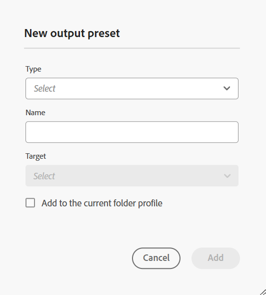

# 管理全域和資料夾設定檔輸出預設集 {#id22BLJ0D0V1U}

全域和資料夾設定檔預設集僅適用於資料夾層級的管理使用者。

身為管理員，Adobe Experience Manager Guides可讓您建立並管理全域和資料夾設定檔的輸出預設集。 然後，您就可以輕鬆地使用這些輸出預設集，為與該全域或資料夾設定檔相關的所有地圖產生輸出。

執行以下步驟，為「全域設定檔」和「資料夾設定檔」建立輸出預設集：

1. 選取要為其建立輸出預設集的DITA map。
1. 從對應檔的&#x200B;**選項**&#x200B;功能表選取&#x200B;**編輯主題**&#x200B;選項。 將在編輯器中開啟對應檔案以進行編輯。
1. 選取&#x200B;**在地圖主控台中開啟**&#x200B;圖示，以在地圖主控台中開啟地圖檔案。
1. 在Map主控台中，導覽至&#x200B;**輸出預設集**&#x200B;標籤，然後選取+圖示以建立DITA map的輸出預設集。

   {width="350" align="left"}

1. 在&#x200B;**新增預設集**&#x200B;對話方塊中輸入下列詳細資料：
   - 類型
   - 名稱
   - Target \（適用於知識庫預設集\）
1. 選取&#x200B;**新增至資料夾設定檔**&#x200B;核取方塊以建立相關資料夾設定檔的輸出預設集，然後選取&#x200B;**新增**。 預設集已建立，並顯示在所有相關地圖的&#x200B;**輸出預設集**&#x200B;標籤下。 \( \)圖示表示資料夾設定檔層級預設集。
1. 輸入組態詳細資訊。 如需輸出預設集的詳細資訊，請檢視[瞭解輸出預設集](./generate-output-understand-presets.md)。

   >[!NOTE]
   >
   > 這些新增至資料夾描述檔的預設集與地圖無關，因此這些預設集的地圖特定設定不存在。

1. 您可以選取右上角的&#x200B;**產生輸出**&#x200B;圖示，以產生與已建立輸出預設集相關的對映輸出。 您可以檢視輸出產生程式的狀態。 若要檢視輸出，請在&#x200B;**成功**&#x200B;對話方塊中選取&#x200B;**檢視輸出**。

>[!NOTE]
>
> Experience Manager Guides也提供現成的PDF輸出預設集，用於產生DITA map的輸出。

**選項功能表的其他作業**

您也可以從「選項」選單對預設集執行下列操作：

- **產生輸出**：可讓您產生現有預設集的輸出。
- **檢視輸出**&#x200B;和&#x200B;**檢視記錄**：檢視所產生輸出和記錄的快速連結。
- 從&#x200B;**選項**&#x200B;功能表&#x200B;**重新命名**、**複製**，或&#x200B;**刪除**&#x200B;現有的輸出預設集。
- **預設PDF**：可讓您選取現有的PDF預設集作為預設pdf預設集。 所選取的預設集會是，然後作為預設預設集，使用地圖的&#x200B;**下載為PDF**&#x200B;選項來產生PDF輸出。

>[!NOTE]
>
> 刪除全域和資料夾設定檔中的輸出預設集時，該預設集將反映在所有相關對映中，且不會顯示在&#x200B;**輸出預設集**&#x200B;標籤下。

**上層主題：**[&#x200B;使用網頁編輯器](web-editor.md)
