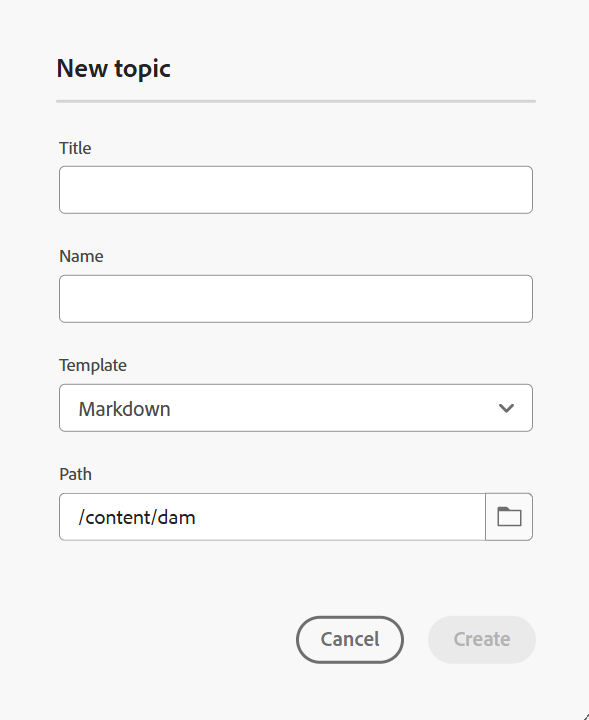
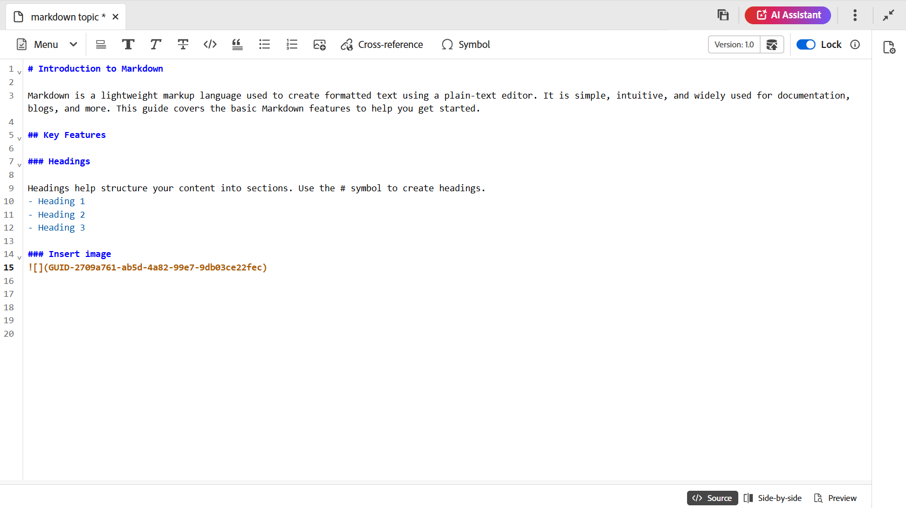
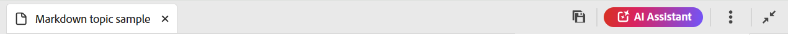
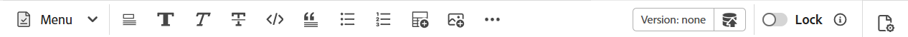

# 從編輯器編寫Markdown檔案 {#id223MIE0B079}

Markdown是一種輕量型的標籤語言，可以協助您將格式元素新增至純文字檔案。 Adobe Experience Manager Guides提供從編輯器建立、編寫和預覽Markdown \(.md\)主題的功能。 您也可以上傳現有的Markdown檔案，並在編輯器中加以編輯。

## 建立Markdown主題

執行以下步驟，從編輯器建立Markdown主題：

1. 在「存放庫」面板中，選取，然後從下拉式清單中選取&#x200B;**主題**。
1. 在&#x200B;**新主題**&#x200B;對話方塊中，提供下列詳細資料：

   {width="300" align="left"}

   * **標題**：提供主題的標題。
   * **名稱**：檔案名稱是根據主題「標題」自動建議的。 如果您的管理員已根據UUID設定啟用自動檔案名稱，則不會顯示「名稱」欄位。
   * **範本**：從下拉式清單中選取&#x200B;**Markdown**。 預設會選取範本&#x200B;**主題**。
   * **路徑**：瀏覽您要儲存主題檔案的路徑。 依預設，存放庫中目前所選資料夾的路徑會顯示在「路徑」欄位中。

   >[!NOTE]
   >
   > 若進行升級，您需要將Markdown範本新增至目前使用的資料夾設定檔中。 您可以[從編輯器](./web-editor-features.md#templates)建立新的Markdown範本，或使用現有的Markdown範本進行編寫。 如需有關如何在Experience Manager Guides中新增編寫範本的詳細資訊，請檢視[設定全域或資料夾層級的設定檔](../cs-install-guide/conf-folder-level.md)。
1. 選取「**建立**」。

   Markdown主題會在選取的路徑中建立，並開啟以進行編輯。

   {width="650" align="left"}

>[!NOTE]
>
> 您也可以在存放庫面板中為資料夾建立Markdown主題。 選取您要建立Markdown主題的資料夾，並選取&#x200B;**新增**，然後從[選項]功能表選取&#x200B;**主題**。 您現在可以在&#x200B;**建立主題**&#x200B;對話方塊中提供主題詳細資訊，以建立Markdown主題。

## 瞭解Markdown主題的編輯器功能

本節將逐步說明編輯器中可用於Markdown主題撰寫的各種功能。 製作介面分為下列區段或區域：

* [工具列](#toolbar)
* [內容編輯區域](#content-editing-area)
* [Source、並排和預覽模式](#source-side-by-side-and-preview-modes)
* [右側面板](#right-panel)

<!--
### Tab bar 

The tab bar features the file tabs of the topics or maps that are currently opened in the Editor along with other file-level options. 

Features available in the tab bar are explained as follows:

 {width="550" align="left"}

* **Topic tab**: Displays the currently opened topics in a tab. By default, you can view the file titles in the tab. As you hover over a file, you can view the file title and the file path as a tooltip.

    >![NOTE]
    >
    > As an administrator, you can also choose to view the list of files by filenames in the tabs. View [User preferences](./intro-home-page.md#user-preferences) for details.
* **Save all**: Saves the changes you have made in all opened topics. If you have multiple topics opened in the Editor, selecting **Save all** or pressing `Crtl+S` shortcut keys saves all documents in one click. You do not have to individually save each document.
* **AI Assistant**: [AI-powered Smart Help](./ai-based-smart-help.md) feature that helps you find relevant content from the Adobe Experience Manager Guides Documentation.
* **More actions**: Allows you to navigate to the **Assets UI**. As an administrator, you also get an option to navigate to the **Settings** page. Learn how to work with [settings](./web-editor-features.md#main-toolbar) or editor settings. 
* **Expand view**: Allows you to expand the page view using the **Expand** icon. In this view, the header bar is hidden, maximizing the content space. To return to the standard view, use the **Exit the expanded view** icon.

-->

### 工具列

工具列位於標籤列的正下方。 工具列中的可用功能說明如下：

{align="left"}

| 功能 | 說明 |
|----------------|----------------|
| 編輯動作 | 提供各種檔案編輯功能的存取權，包括&#x200B;**剪下**  ，**復原**  ，**取消復原**  ，**副本**  ，**刪除**  和&#x200B;**尋找和取代**  。 您可以從&#x200B;**功能表**&#x200B;下拉式清單存取可用的選項。 |
| 文字格式選項 | 提供各種文字格式選項的存取權，包括&#x200B;**標題**  ，**粗體**  ，**斜體**  ，**刪除線**  ，**代碼**  和&#x200B;**封鎖報價**  。 |
| 內容插入選項 | 提供插入&#x200B;**編號清單**&#x200B;的選項  ，**排序清單**  ，**資料表**  ，**影像** ，**交叉參考**  和&#x200B;**符號**  放入檔案。   **注意**：您也可以將影像和其他檔案拖放到Markdown編輯器中。 檔案會新增為互動參照連結，而影像會顯示為標準影像元素。 |
| 版本歷史記錄 | 可讓您建立Markdown檔案的版本，並檢視變更記錄。 您可以比較不同的版本，並視需要還原成先前的版本。 版本記錄選項存在於&#x200B;**功能表**&#x200B;下拉式清單中。 |
| 另存為新版本 | 儲存主題中所做的變更，並建立主題的新版本。 如果您處理的是新建立的主題，版本資訊會顯示為「無」。 |
| 鎖定/解鎖 | 鎖定或解除鎖定目前的檔案。 鎖定檔案可讓您以獨佔方式寫入檔案。 這會限制其他使用者編輯檔案。 如果您希望其他人有編輯存取權，請解除鎖定檔案。 作為管理員，您還能存取&#x200B;**強制解除鎖定**&#x200B;功能，該功能可讓您解除鎖定被其他人鎖定的檔案。 |

>[!NOTE]
>
> 您可以從Markdown主題的&#x200B;**Source**&#x200B;和&#x200B;**並排**&#x200B;檢視中，存取&#x200B;**版本記錄**&#x200B;功能以及編輯動作、文字格式及內容插入中提及的功能。

### 內容編輯區域

內容編輯區域會顯示您主題的Markdown來源，讓您在其中編輯所有內容。 在並排檢視中，此區域會分成兩個區段：左側為Markdown來源檢視，右側為「預覽」。 您可以同時開啟多個主題，這些主題會顯示在各自的標籤中。

### Source、並排和預覽模式

對於Markdown製作，編輯器支援三種不同的檢視模式，以輔助內容建立和格式化：

{align="left"}

* 來源
* 並排
* 預覽

**Source**

這是編輯器的Markdown程式碼檢視。 您可以像在任何一般Markdown編輯器中一樣編輯Markdown主題。 在Source檢視中，您可以選擇儲存檔案的修訂版本、插入標題、插入表格、插入影像等。

如果您只想專注於撰寫和編輯原始Markdown，而不想檢視轉譯的輸出，請使用此檢視。

**並排**

此模式會將編輯器分割成兩個面板：

* 顯示您所編輯Markdown主題的Source面板。
* 此預覽面板會即時顯示Markdown主題的演算輸出。

{width="550" align="left"}

如果您想要在編輯Markdown主題時即時檢視演算後的輸出，請使用此檢視。

**預覽**

在預覽模式中開啟Markdown主題會顯示使用者在瀏覽器中檢視主題時主題的顯示方式。 在此檢視中，所有編輯功能都會從工具列移除。 不過，您仍然可以存取工具列中的&#x200B;**另存為新版本**、**鎖定/解鎖**&#x200B;功能，以及右側面板中的&#x200B;**檔案屬性**&#x200B;功能。

### 右側面板

右側面板可讓您存取**檔案屬性面板。

「檔案屬性」包含以下兩個區段：

**一般**

「一般」段落可讓您存取下列功能：

* **檔案名稱**：顯示所選主題的檔案名稱。
* **ID**：顯示所選主題的識別碼。
* **語言**：顯示主題的語言。 這是從屬性頁面中的語言欄位設定。
* **建立於**：顯示建立主題的日期和時間。
* **修改日期**：顯示修改主題的日期和時間。
* **鎖定者**：顯示取出主題的使用者。
* **檔案狀態**：您可以選取並更新目前開啟之主題的檔案狀態。 如需詳細資訊，請檢視[檔案狀態](./web-editor-document-states.md)。
* **標籤**：這些是主題的中繼資料標籤。 從屬性頁面的標籤欄位中設定。 您可以輸入或從下拉式清單中選取。 標籤會顯示在下拉式清單下方。 若要刪除標籤，請選取標籤旁的十字圖示。
* **編輯更多屬性**：您可以從檔案屬性頁面編輯更多屬性。

**參照**

「參照」區段可讓您存取下列功能：

* **用於**： Used in references列出參照或使用目前檔案的檔案。
* **傳出連結**：傳出連結列出目前檔案中參照的檔案。

>[!NOTE]
>
> 所有「使用於」和「輸出」連結參照都會以超連結方式連結至檔案。 您可以輕鬆開啟及編輯連結的檔案。

## 功能限制

下列Experience Manager Guides功能目前不適用於Markdown編寫：

1. 檢閱
2. 合併
3. AI 助理
4. 追蹤變更

**父級主題：**[&#x200B;編輯器簡介](web-editor.md)
