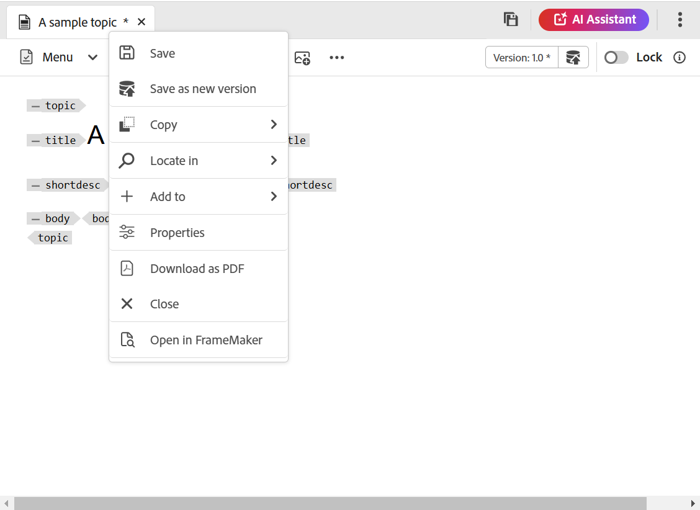
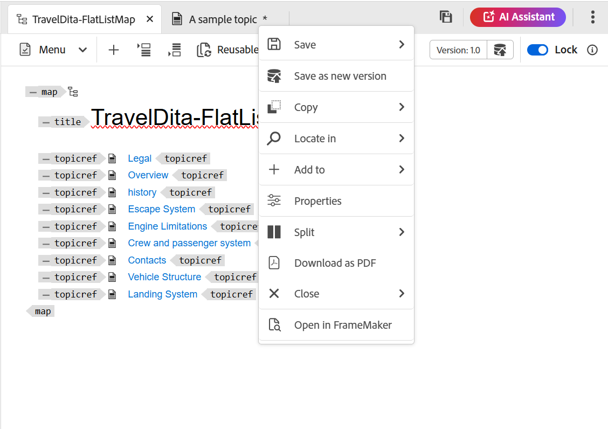
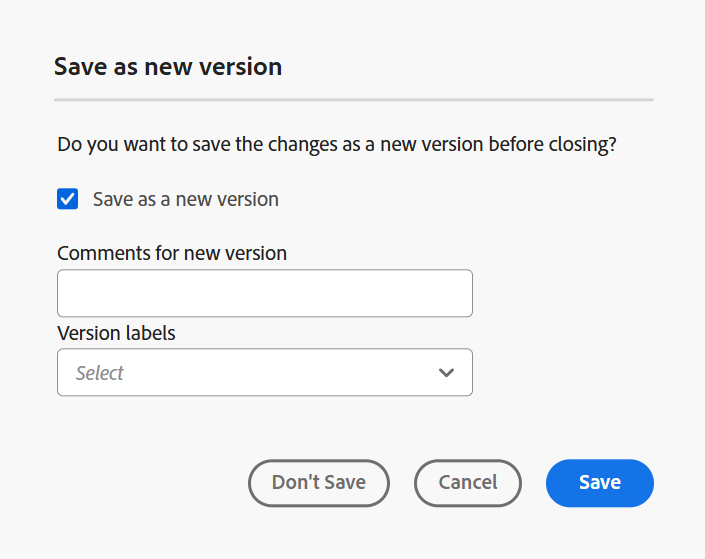
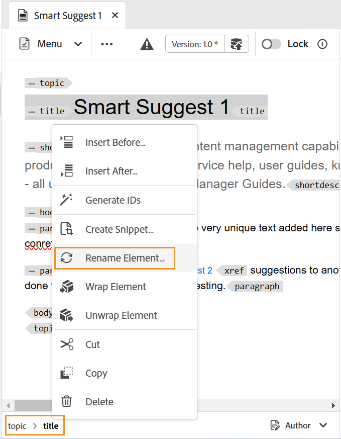
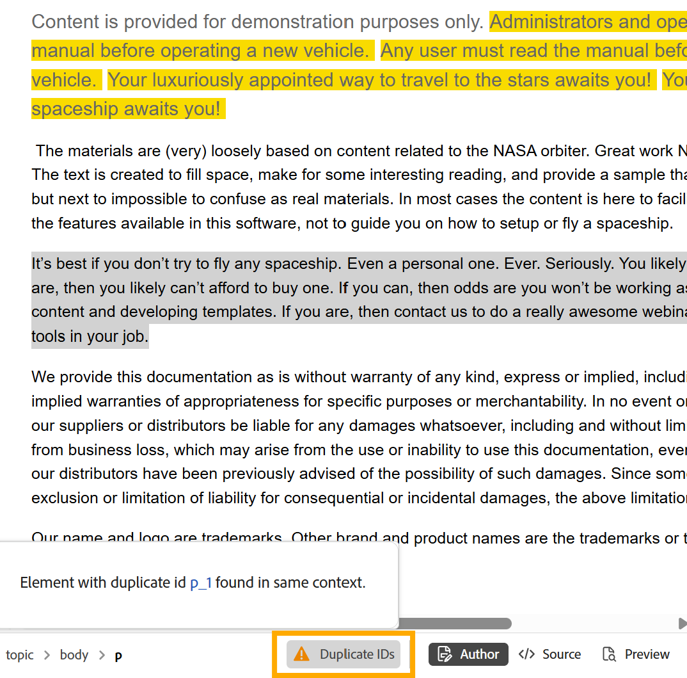
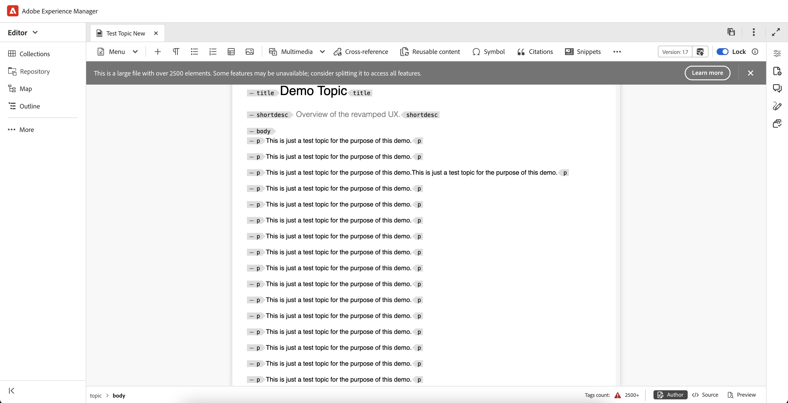

# 編輯器中的其他功能 {#id2056B0B0YPF}

編輯器中有其他幾個實用的功能可供您使用：

## 檔案索引標籤上的內容功能表功能

當您在編輯器中開啟檔案時，可以從內容功能表執行各種動作。 視您開啟媒體檔案、單一DITA檔案還是多個檔案而定，可能會檢視不同的選項。

**媒體檔案**

在開啟的媒體檔案索引標籤的內容功能表中，您會取得下列功能：

{width="300" align="left"}

**單一DITA檔案**

在已開啟檔案之索引標籤的內容功能表中，您會取得下列功能：

{width="400" align="left"}

**多個檔案**

當您開啟多個檔案時，您會在快顯功能表中取得更多選項：

{width="550" align="left"}

內容選單中的各種選項說明如下：

***儲存***：您可以選擇下列選項：

- **儲存**：若要儲存檔案而不建立新版本，請選取&#x200B;**儲存**。 每當您建立新主題時，都會在DAM中建立主題的無版本工作復本。 儲存檔案會更新您在DAM中的檔案工作復本。 在此版本上執行簡單儲存不會建立主題的新版本。 如果您的主題正在稽核中，儲存主題不會讓稽核者存取您變更的主題內容。

- **儲存全部**：如果在編輯器中開啟了多個檔案，您也會收到&#x200B;**儲存全部**&#x200B;開啟檔案的選項。

***另存為新版本***

若要建立檔案的新版本，請選取&#x200B;**另存為新版本**。 如需&#x200B;**儲存**&#x200B;和&#x200B;**另存為新版本**&#x200B;的詳細資訊，請在編輯器中檢視[工具列](web-editor-toolbar.md)。

***複製***：您可以選擇下列選項：

- **複製UUID**：若要將目前作用中檔案的UUID複製到剪貼簿，請選取&#x200B;**複製\>複製UUID**。
- **複製路徑**：若要將目前作用中檔案的完整路徑複製到剪貼簿，請選取&#x200B;**複製\>複製路徑**。

***在***&#x200B;中尋找：您可以從下列選項中選擇：

- **對應**：如果您已開啟大型DITA對應，而且想要在對應中找到檔案的確切位置，請選取&#x200B;**在\>對應**&#x200B;中尋找。 當您選取「在對應中尋找」選項時，檔案\（從叫用選項的位置\）會定位並在對應階層中反白顯示。 若要能夠使用此功能，您必須在編輯器中開啟對應檔案。 如果「對映檢視」是隱藏的，則叫用此功能會顯示「對映檢視」，且檔案會在對映階層中反白顯示。

- **檔案總管**：類似於「在地圖中尋找」，**在\>檔案總管**&#x200B;中顯示檔案在檔案總管\（或DAM\）中的位置。 Explorer檢視隨即開啟，選取的檔案會在Explorer中反白。 如果檔案位於資料夾內，則該資料夾會展開以顯示選取檔案在檔案總管中的位置。

  >[!NOTE]
  >
  >從2025.11.0版開始，**存放庫**&#x200B;已重新命名為&#x200B;**總管**。 對於內部部署設定，在Experience Manager Guides 5.1版發行前，它將持續作為存放庫提供。

***新增至***：您可以選擇下列選項：

- **集合**：若要將選取的檔案新增至集合，請選取&#x200B;**新增至\>集合**。 如需詳細資訊，請在&#x200B;**左側面板**&#x200B;區段中檢視[集合](web-editor-left-panel.md)功能說明。

- **可重複使用的內容**：若要將選取的檔案複製到可重複使用的內容清單，請選取&#x200B;**新增到\>可重複使用的內容**。 如需更多詳細資料，請在&#x200B;**左側面板**&#x200B;區段中檢視[可重複使用的內容](web-editor-left-panel.md)功能說明。

***屬性***

若要檢視所選檔案的AEM屬性頁面，請選取&#x200B;**屬性**。

***分割***：您可以選擇下列選項：

**上、下、左或右**

依預設，編輯器可讓您一次檢視一個主題。 可能有您想要同時檢視兩個或多個主題的例項。 分割編輯器的畫面可讓您同時檢視多個主題。 例如，如果您在編輯器中開啟了兩個主題 — A和B。 在主題B上按一下滑鼠右鍵並選擇&#x200B;**分割\>向上**&#x200B;會將編輯器視窗分成兩個部分。 主題B顯示在上半部分，主題A顯示在下半部分。 同樣地，您也可以選取&#x200B;**分割\>左側**&#x200B;或&#x200B;**分割\>右側**&#x200B;來水準分割熒幕。 您可以將檔案從某個熒幕移至另一個熒幕，方法是拖曳檔案標籤並放置到您要放置它的熒幕上。 同樣地，您也可以根據您的偏好拖曳及移動檔案標籤，以重新排序檔案標籤。

<!--------------------------------------------

***Quick Generate***

Generate the output for the selected file. Output can be generated only for files that are a part of an output preset. For more details, view [Article-based publishing from the Web Editor](web-editor-article-publishing.md#id218CK0U019I).

--->

***關閉***：您可以選擇下列選項：

**關閉**、**關閉其他**，或&#x200B;**全部關閉**

如果要關閉啟動內容功能表的檔案，請選取&#x200B;**關閉\>關閉**。 使用&#x200B;**關閉\>關閉其他**&#x200B;來關閉目前使用中檔案以外其他所有開啟的檔案。 若要關閉所有開啟的檔案，請從內容功能表選取&#x200B;**關閉\>全部關閉**&#x200B;選項，或者您也可以選擇關閉編輯器。 如果您的作業階段中有任何未儲存的檔案，系統會提示您儲存這些檔案。

**檔案關閉並儲存案例**

當您嘗試使用檔案索引標籤上的&#x200B;**關閉**&#x200B;按鈕或「選項」功能表中的&#x200B;**關閉**&#x200B;選項來關閉在編輯器中開啟的檔案時，Experience Manager Guides會提示您儲存編輯並解除鎖定檔案。

提示會根據管理員選取的下列設定：

- **關閉時要求解除鎖定：**&#x200B;當您關閉編輯器時，您可以選擇解除鎖定檔案\（您已鎖定\）。
- **關閉時詢問新版本**：關閉編輯器時，您可以選擇將檔案\（您已編輯\）儲存為新版本。

您的檔案儲存體驗將取決於以下三種情況，其中您有：

- 未對內容進行任何變更。
- 編輯內容並儲存變更。
- 已編輯內容但未儲存變更。

您可以檢視下列選項，視檔案是否已鎖定/解除鎖定，以及是否已儲存或未儲存變更而定：

- **解除鎖定並關閉**：檔案的鎖定已解除，且檔案已關閉。
- **另存為新版本**：這將儲存您在內容中所做的變更，並建立檔案的新版本。 您也可以為新儲存的版本新增標籤和註解。 如需有關儲存新版本的詳細資訊，請檢視[另存為新版本](web-editor-toolbar.md#version-information-and-save-as-new-version)。

- **解除鎖定檔案**：如果您選擇解除鎖定檔案，檔案將會解除鎖定，且變更會儲存在檔案的目前版本中。

  >[!NOTE]
  >
  > 如果您取消選取解除鎖定檔案的選項，您也會取得關閉檔案而不儲存變更的選項。

  例如，下列熒幕擷取畫面會顯示其中一項提示：

  {width="400" align="left"}

已損毀參考的&#x200B;**視覺提示**

如果您的主題包含中斷的互動參照或內容參照，則會以紅色文字顯示。

**智慧型複製貼上**

您可以輕鬆複製主題內和主題間的貼上內容。 來源元素結構會維持在目的地上。 此外，如果複製的內容包含內容參照，即使這些參照也會複製。

**記住上次瀏覽的位置**

編輯器提供智慧型檔案瀏覽對話方塊。 編輯器會記住插入參照或內容時最後使用的位置。 第一次叫用檔案瀏覽對話方塊\（透過「插入參照」或「插入重複使用內容」\）時，您就會被帶往目前檔案的儲存位置。 在同一作業階段中，如果您嘗試插入另一個參照，檔案瀏覽對話方塊會自動導覽至您插入最後一個參照的位置。

>[!NOTE]
>
> 如果是影像、音訊或視訊檔案，檔案瀏覽對話方塊會預設為檔案的位置，而不是最後使用的位置。

## 支援文章式發佈

從編輯器中，您可以產生一或多個主題或整個DITA map的輸出。 您需要為DITA map建立輸出預設集，然後可以輕鬆產生一或多個主題的輸出。 如果您更新了地圖中的幾個主題，也可以僅從編輯器為這些主題產生輸出。 如需詳細資訊，請檢視[以文章為基礎的發佈](web-editor-article-publishing.md#id218CK0U019I)。

## 支援Markdown檔案

編輯器可讓您使用Markdown檔案\(.md\)以及DITA檔案。 您可以在編輯器中輕鬆編寫及預覽Markdown檔案，也可以透過DITA map編輯器將其新增至地圖檔案中。 如需更多詳細資料，請從編輯器檢視[作者Markdown檔案](web-editor-markdown-topic.md#)。

## 支援DITA字彙術語主題

編輯器支援您可以新增`term`或`abbreviated-form`元素來插入的DITA字彙表辭彙。

## 使用MathML方程式

### 插入MathML方程式

Experience Manager Guides提供開箱即用的支援，可讓您透過與[MathType Web](https://docs.wiris.com/en/mathtype/mathtype_web/intro)應用程式的整合，插入MathML方程式。 若要插入MathML方程式，請選取&#x200B;**元素**&#x200B;圖示並輸入mathml。 當您從清單中選取mathml元素時，會顯示&#x200B;**插入MathML**&#x200B;對話方塊：

{width="550" align="left"}

使用MathML方程式工具，建立您的方程式，並選取&#x200B;**插入**&#x200B;以將其加入您的檔案。 方程式會以淺灰色背景插入。

您可以隨時更新方程式，方法是以滑鼠右鍵按一下現有方程式，然後從內容功能表選取&#x200B;**編輯MathML**。

### 在MathML編輯器中驗證方程式

當您儲存包含方程式的主題時，Experience Manager Guides會驗證MathML方程式。
使用MathML編輯器插入方程式時，如果有任何語法問題，Experience Manager Guides會以紅色反白顯示方程式。 您可以在插入之前進行修正。 如果您未進行任何變更，但選取&#x200B;**插入**，則會顯示警告。

{width="400" align="left"}

如果您插入包含語法錯誤的MathML方程式，則在嘗試儲存主題時會發生驗證錯誤。

## 插入註腳

使用`fn`元素在內容中插入註腳。 在製作模式中，註腳值與內容內嵌顯示。 但是，當您切換「預覽」模式或發佈檔案時，註腳會出現在主題末尾。

## 重新命名或取代元素

編輯器會在主題左下角顯示元素的階層連結。 如果要使用另一個元素交換或取代某個元素，則可以從階層連結的內容選單中進行此操作。 例如，您可以將`p`元素與內容中的`note`或任何其他有效元素交換。

{width="400" align="left"}

在階層連結上，以滑鼠右鍵按一下要取代的元素名稱，然後從快顯選單中選取「重新命名元素」。 「重新命名元素」對話方塊會顯示目前位置允許的所有有效元素。 在「重新命名元素」對話方塊中，選取您要使用的元素。 原始元素會以新元素取代。

除了階層連結的內容功能表之外，您也可以從其他位置存取「重新命名元素」對話方塊：

- 在階層連結上選取元素名稱以選取元素內容，然後在選取的內容上按一下滑鼠右鍵，以顯示內容功能表。

- 啟用「標籤」檢視，選取任何元素的開始標籤，然後在選取的內容上按一下滑鼠右鍵，以顯示內容功能表。

- 您可以呼叫「大綱」面板中元素的「選項」功能表，來存取「重新命名元素」對話方塊。

## 包裝和展開元素

### 繞排元素

- 繞排元素可讓您將元素標籤新增至選取的文字。 您可以依照DITA標準將文字繞排為任何子元素。 例如，如果您在`note`元素下有文字，則可以將文字繞排為`p`元素。

- 在主題階層連結的內容功能表中可以使用&#x200B;**換行元素**&#x200B;選項。 若要繞排元素，請在元素上按一下滑鼠右鍵，然後開啟內容選單。 從&#x200B;**換行專案**&#x200B;對話方塊中選取專案。 文字會出現在新元素中。

- 您也可以選取內容中的文字或元素，然後從內容功能表中選取&#x200B;**繞排元素**&#x200B;選項。

### 解除元素包裝

展開元素可讓您從選取的文字中移除元素標籤，並將其與其父元素合併。 例如，如果您在`p`元素中有一個`note`元素，您可以解除`p`元素的包裝，直接在`note`元素中合併文字。 在主題階層連結的內容功能表中可以使用&#x200B;**Unwrap Element**&#x200B;選項。 若要解除專案包裝，請在專案上按一下滑鼠右鍵以開啟內容功能表，最後選取&#x200B;**解除專案包裝**&#x200B;以移除專案，並將專案的文字與其父專案合併。

## DITA元素的空白處理

在XML中，空白字元包括空格、定位字元、歸位字元和空白行。 Experience Manager Guides會將多個後續空格轉換為一個空格。 這可協助您保留編輯器的WYSIWYG檢視。

>[!NOTE]
>
> 在某些需要根據DITA規則保留空白的元素中，會保留多個後續空格。 例如，`<pre>`和`<codeblock>`個元素。

## 保留分行和縮排

根據在「作者」、「Source」或「預覽」模式中的定義，以及在最終發佈的輸出中的定義，支援並轉譯包含分行符號和空格的DITA元素。 下列熒幕擷圖顯示`msgblock`元素中的內容，其中分行符號和空格\(indentation\)已保留：

{align="left"}

## 在編輯器中處理不斷行空格

- 您可以使用&#x200B;**Symobol** 圖示或&#x200B;**Alt** + **Space**&#x200B;捷徑鍵，在檔案中插入不間斷的空格。  在編輯器中編輯主題時，這些不斷行空格會顯示為指示器。 您可以從&#x200B;**使用者偏好設定**&#x200B;的&#x200B;**外觀**&#x200B;索引標籤中，使用[在作者模式](./intro-home-page.md#user-preferences)中顯示不斷行空格指示器選項關閉不斷行空格的顯示。

- 如果您將任何外部來源中含不斷行間距的內容複製並貼到&#x200B;**作者**&#x200B;檢視中，則不斷行間距會轉換為間距。
不過，如果您從&#x200B;**作者**&#x200B;檢視複製並貼上含有不斷行空格的內容，內容會保留。

## 自動生成元素ID

您可以為DITA主題中的元素自動產生ID。 這些ID在DITA主題中是唯一的。 例如，如果您產生段落元素的ID，ID將為p\_1、p2、p\_3等。 您可以選取多個元素，並為每個選取的元素產生ID。

請執行以下動作以自動產生一或多個元素的ID：

1. 在編輯器中開啟主題。
1. 選取您要指派ID的內容。
1. 按一下滑鼠右鍵，然後從內容功能表中選取&#x200B;**產生ID**。

或者，您可以在階層連結中按一下滑鼠右鍵，然後選取&#x200B;**產生ID**。

## 為地圖中的元素或作者檢視內的主題識別重複ID

如果指定的主題或地圖包含具有重複ID的元素，則&#x200B;**重複ID**&#x200B;按鈕會出現在編輯器檢視旁邊的「內容」編輯區域的右下角。

{width="350" align="left"}

選取&#x200B;**重複識別碼**&#x200B;會開啟一個彈出視窗，其中列出所有重複識別碼。 您可以從彈出視窗中選取顯示的ID，以導覽至對應的元素，並使用唯一ID加以更新。

>[!NOTE]
>
> **重複ID**&#x200B;按鈕僅在&#x200B;**作者**&#x200B;檢視中可用，並且不同的巢狀主題允許類似的元素ID。

## 在編輯器中處理大型檔案

旨在改善大型檔案處理方式的主要功能如下：

- 為了增強效能，某些功能（如還原、重做、大綱面板和已變更的標籤）會停用。 建議將主題分成較小的主題，以獲得最佳體驗。

- 大型檔案的頂端會顯示警示訊息，如下面的程式碼片段所示。 此警報會根據uiconfig.json檔案的&#x200B;**largeFileTagCount**&#x200B;引數中指定的值，反白標示元素數目。 根據預設，**largeFileTagCount**&#x200B;設為2500。

{width="600" align="left"}

- 此外，標籤計數會顯示在介面的底端列。 當您將滑鼠懸停在此標籤計數值上時，畫面會顯示工具提示。 選取&#x200B;**深入瞭解**&#x200B;索引標籤可提供處理大型檔案的詳細資訊。

{width="600" align="left"}

- 警報訊息僅適用於DITA檔案，且在所有檢視中皆可見：作者、Source和版面。

**父級主題：**&#x200B;[&#x200B;編輯器簡介](web-editor.md)
