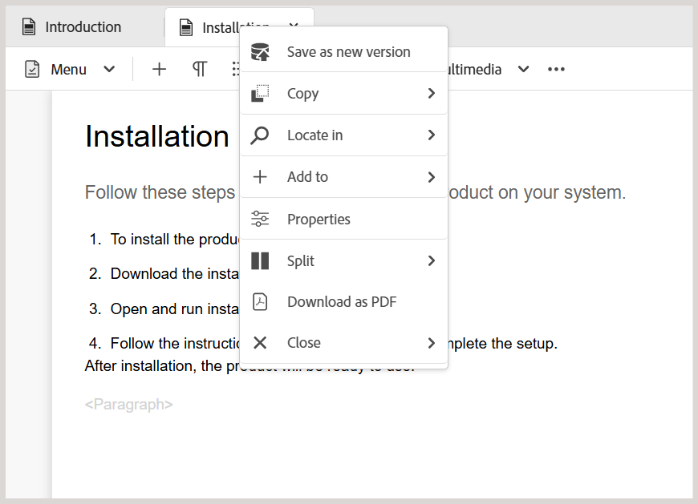
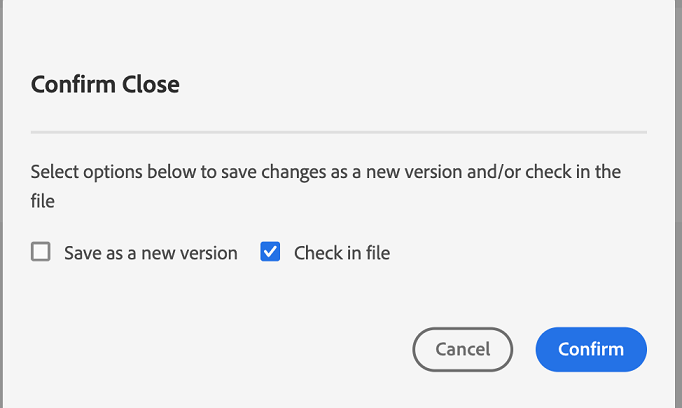

# 編輯器中的其他功能 {#id2056B0B0YPF}

編輯器中有其他幾個實用的功能可供您使用：

## 檔案索引標籤上的內容功能表功能

當您在編輯器中開啟檔案時，可以從內容功能表執行各種動作。 視您開啟媒體檔案、單一DITA檔案還是多個檔案而定，可能會檢視不同的選項。

**媒體檔案**

在開啟的媒體檔案索引標籤的內容功能表中，您會取得下列功能：

{width="300"}

**單一DITA檔案**

在已開啟檔案之索引標籤的內容功能表中，您會取得下列功能：

>[!BEGINTABS]

>[!TAB 新編輯器]

{width="400"}

>[!TAB 舊編輯器]

{width="400"}

>[!ENDTABS]

**多個檔案**

當您開啟多個檔案時，您會在快顯功能表中取得更多選項：

>[!BEGINTABS]

>[!TAB 新編輯器]

{width="550"}

>[!TAB 舊編輯器]

{width="550"}

>[!ENDTABS]

內容選單中的各種選項說明如下：

***儲存***：您可以選擇下列選項：

- **儲存**：若要儲存檔案而不建立新版本，請選取&#x200B;**儲存**。 每當您建立新主題時，都會在DAM中建立主題的無版本工作復本。 儲存檔案會更新您在DAM中的檔案工作復本。 在此版本上執行簡單儲存不會建立主題的新版本。 如果您的主題正在稽核中，儲存主題不會讓稽核者存取您變更的主題內容。

- **儲存全部**：如果在編輯器中開啟了多個檔案，您也會收到&#x200B;**儲存全部**&#x200B;開啟檔案的選項。

***另存為新版本***

若要建立檔案的新版本，請選取&#x200B;**另存為新版本**。 如需&#x200B;**儲存**&#x200B;和&#x200B;**另存為新版本**&#x200B;的詳細資訊，請在編輯器中檢視[工具列](web-editor-toolbar.md)。

***複製***：您可以選擇下列選項：

- **複製UUID**：若要將目前作用中檔案的UUID複製到剪貼簿，請選取&#x200B;**複製\>複製UUID**。
- **複製路徑**：若要將目前作用中檔案的完整路徑複製到剪貼簿，請選取&#x200B;**複製\>複製路徑**。

***在***&#x200B;中尋找：您可以從下列選項中選擇：

- **對應**：如果您已開啟大型DITA對應，而且想要在對應中找到檔案的確切位置，請選取&#x200B;**在\>對應**&#x200B;中尋找。 當您選取「在對應中尋找」選項時，檔案\（從叫用選項的位置\）會定位並在對應階層中反白顯示。 若要能夠使用此功能，您必須在編輯器中開啟對應檔案。 如果「對映檢視」是隱藏的，則叫用此功能會顯示「對映檢視」，且檔案會在對映階層中反白顯示。

- **檔案總管**：類似於「在地圖中尋找」，**在\>檔案總管**&#x200B;中顯示檔案在檔案總管\（或DAM\）中的位置。 Explorer檢視隨即開啟，選取的檔案會在Explorer中反白。 如果檔案位於資料夾內，則該資料夾會展開以顯示選取檔案在檔案總管中的位置。

  >[!NOTE]
  >
  >從2025.11.0版的Cloud Service和從5.2版的On-Premise，**存放庫**&#x200B;重新命名為&#x200B;**Explorer**。 若為5.2版之前的內部部署設定，則仍會作為存放庫提供。

***新增至***：您可以選擇下列選項：

- **集合**：若要將選取的檔案新增至集合，請選取&#x200B;**新增至\>集合**。 如需詳細資訊，請在[左側面板](web-editor-left-panel.md)區段中檢視&#x200B;**集合**&#x200B;功能說明。

- **可重複使用的內容**：若要將選取的檔案複製到可重複使用的內容清單，請選取&#x200B;**新增到\>可重複使用的內容**。 如需更多詳細資料，請在[左側面板](web-editor-left-panel.md)區段中檢視&#x200B;**可重複使用的內容**&#x200B;功能說明。

***屬性***

若要檢視所選檔案的AEM屬性頁面，請選取&#x200B;**屬性**。

***分割***：您可以選擇下列選項：

**上、下、左或右**

依預設，編輯器可讓您一次檢視一個主題。 可能有您想要同時檢視兩個或多個主題的例項。 分割編輯器的畫面可讓您同時檢視多個主題。 例如，如果您在編輯器中開啟了兩個主題 — A和B。 在主題B上按一下滑鼠右鍵並選擇&#x200B;**分割\>向上**&#x200B;會將編輯器視窗分成兩個部分。 主題B顯示在上半部分，主題A顯示在下半部分。 同樣地，您也可以選取&#x200B;**分割\>左側**&#x200B;或&#x200B;**分割\>右側**&#x200B;來水準分割熒幕。 您可以將檔案從某個熒幕移至另一個熒幕，方法是拖曳檔案標籤並放置到您要放置它的熒幕上。 同樣地，您也可以根據您的偏好拖曳及移動檔案標籤，以重新排序檔案標籤。

<!--

***Quick Generate***

Generate the output for the selected file. Output can be generated only for files that are a part of an output preset. For more details, view [Article-based publishing from the Web Editor](web-editor-article-publishing.md#id218CK0U019I).

-->

***關閉***：您可以選擇下列選項：

**關閉**、**關閉其他**，或&#x200B;**全部關閉**

如果要關閉啟動內容功能表的檔案，請選取&#x200B;**關閉\>關閉**。 使用&#x200B;**關閉\>關閉其他**&#x200B;來關閉目前使用中檔案以外其他所有開啟的檔案。 若要關閉所有開啟的檔案，請從內容功能表選取&#x200B;**關閉\>全部關閉**&#x200B;選項，或者您也可以選擇關閉編輯器。 如果您的作業階段中有任何未儲存的檔案，系統會提示您儲存這些檔案。

**檔案關閉並儲存案例**

當您嘗試使用檔案索引標籤上的&#x200B;**關閉**&#x200B;按鈕或「選項」功能表中的&#x200B;**關閉**&#x200B;選項來關閉在編輯器中開啟的檔案時，Experience Manager Guides會提示您儲存編輯並解除鎖定檔案。

提示會根據管理員選取的下列設定：

- **關閉時要求解除鎖定：**&#x200B;當您關閉編輯器時，您可以選擇解除鎖定檔案\（您已鎖定\）。
- **關閉時詢問新版本**：關閉編輯器時，您可以選擇將檔案\（您已編輯\）儲存為新版本。

您的檔案儲存體驗將取決於以下三種情況，其中您有：

- 未對內容進行任何變更。
- 編輯內容並儲存變更。
- 已編輯內容但未儲存變更。

您可以檢視下列選項，視檔案是否已鎖定/解除鎖定，以及是否已儲存或未儲存變更而定：

- **解除鎖定並關閉**：檔案的鎖定已解除，且檔案已關閉。
- **另存為新版本**：這將儲存您在內容中所做的變更，並建立檔案的新版本。 您也可以為新儲存的版本新增標籤和註解。 如需有關儲存新版本的詳細資訊，請檢視[另存為新版本](web-editor-toolbar.md#version-information-and-save-as-new-version)。

- **解除鎖定檔案**：如果您選擇解除鎖定檔案，檔案將會解除鎖定，且變更會儲存在檔案的目前版本中。

  >[!NOTE]
  >
  > 如果您取消選取解除鎖定檔案的選項，您也會取得關閉檔案而不儲存變更的選項。

  例如，下列熒幕擷取畫面會顯示其中一項提示：

  {width="400"}

已損毀參考的&#x200B;**視覺提示**

如果您的主題包含中斷的互動參照或內容參照，則會以紅色文字顯示。

**智慧型複製貼上**

您可以輕鬆複製主題內和主題間的貼上內容。 來源元素結構會維持在目的地上。 此外，如果複製的內容包含內容參照，即使這些參照也會複製。

**記住上次瀏覽的位置**

編輯器提供智慧型檔案瀏覽對話方塊。 編輯器會記住插入參照或內容時最後使用的位置。 第一次叫用檔案瀏覽對話方塊\（透過「插入參照」或「插入重複使用內容」\）時，您就會被帶往目前檔案的儲存位置。 在同一作業階段中，如果您嘗試插入另一個參照，檔案瀏覽對話方塊會自動導覽至您插入最後一個參照的位置。

>[!NOTE]
>
> 如果是影像、音訊或視訊檔案，檔案瀏覽對話方塊會預設為檔案的位置，而不是最後使用的位置。

## 在新編輯器中處理表格

「新編輯器」可讓您使用各種關聯式動作，直接在內容中建立、格式化及組織表格。 以下是有關如何使用新編輯器中提供的各種表格編輯功能的簡短影片。

>[!VIDEO](https://video.tv.adobe.com/v/3491344)

下表為「新增編輯器」中的可用編輯功能：

**使用內容功能表修改資料表**

當您在表格儲存格內按一下滑鼠右鍵時，會顯示前後關聯功能表。 根據您使用的表格型別，可使用下列選項。

{width="550"}

- 插入列、欄或儲存格

- 水平或垂直分割儲存格（不適用於簡單表格）

- 向右或向下合併儲存格（不適用於簡單表格）

- 刪除列或欄

**使用內容工具列設定文字格式和對齊方式**

當您選取表格內的內容或儲存格時，內容工具列會顯示出來。 工具列提供與您的選取專案相關的選項。

- 選取儲存格內容以存取下列格式選項：

  {width="550"}

  使用「粗體」、「斜體」或「底線」選項來格式化文字。
- 若要存取單一儲存格的內容工具列，請使用Windows的`Ctrl+click`和macOS的`Command+click`。

  {width="550"}

- 同樣地，您也可以選取多個儲存格，並使用內容工具列來一次套用文字格式和對齊。

  單列或多列選取的可用選項：

  {width="550"}

   - 水準文字對齊方式（不適用於簡單表格）
   - 垂直文字對齊方式（不適用於簡單表格）
   - 在上方插入列
   - 在下方插入列
   - 移除列
   - 合併儲存格（不適用於簡單表格）

  單一或多重欄選取的可用選項：

  {width="550"}

   - 水準文字對齊方式（不適用於簡單表格）
   - 垂直文字對齊方式（不適用於簡單表格）
   - 在上方插入列
   - 在下方插入列
   - 移除列
   - 在上方插入欄
   - 在下方插入欄
   - 移除欄
   - 合併儲存格（不適用於簡單表格）

- 選取要套用文字格式和對齊整個表格的表格。

  {width="550"}

- 使用互動加號按鈕新增列或欄

  若要在表格結尾新增一列，請將滑鼠指標停留在最後一列，並選取&#x200B;**+**&#x200B;按鈕。 表格底部會新增一列。

  {width="550"}

  同樣地，將滑鼠停留在最後一欄，並選取&#x200B;**+**&#x200B;按鈕，在表格的最右邊加入新的一欄。

  {width="550"}

- 使用「插入」(Insert)選項將多個列或欄新增至表格（不適用於簡單表格）

  若要新增多個列或欄至表格，請先選取要新增的列或欄數，然後選取「插入列」（上方或下方）或「插入欄」（左側或右側）選項。 會根據您的選取專案將相同數量的列或欄新增至表格。

- 拖放列和欄（不適用於簡單表格）

  使用拖放功能，輕鬆移動表格內的列和欄。 當您拖曳列或欄時，它會顯示為半透明背景，以表示它正在移動。 藍線會反白在發行時將會放置列或欄的目標位置。

  {width="550"}

## 在Experience Manager Guides中瀏覽檔案和資料夾

Experience Manager Guides提供直覺式對話方塊 — **選取檔案**&#x200B;和&#x200B;**選取路徑** — 協助您有效瀏覽及選擇內容存放庫中的檔案或資料夾。

>[!NOTE]
>
> 檔案和資料夾路徑瀏覽器在Experience Manager Guides as a Cloud Service 2601年發行版本中透過改版的UI引入。 新介面預設為啟用。 如果您偏好在不進行這些更新的情況下繼續使用現有UI，請聯絡您的客戶成功團隊，以停用此新增強功能。

### 在Experience Manager Guides中瀏覽檔案

檔案路徑瀏覽器可讓您快速找到並選取內容存放庫中的特定檔案。 此功能可用於將主題新增至地圖、連結影像或交叉參照、建立可重複使用的內容等工作。

{width="350"}

當您啟動檔案瀏覽器時，**選取檔案**&#x200B;對話方塊會開啟。 此對話方塊包含兩個標籤： **存放庫**&#x200B;和&#x200B;**集合**。 依預設，會選取「存放庫」標籤。

{width="650"}

**存放庫索引標籤中可供檔案瀏覽的功能**

**檔案和資料夾的表格檢視**

「存放庫」標籤為您提供內容存放庫中的檔案和資料夾的表格檢視，讓您更容易找到正確的檔案路徑。 您也可以使用頂部的階層連結和左側的資料夾導覽面板，在資料夾中移動。

{width="650"}

**單一和多重檔案選擇**

若要使用檔案，只要選取檔案並選擇&#x200B;**選取**&#x200B;即可。

{width="650"}

在某些情況下，您還可以從此路徑瀏覽器對話方塊中選取多個檔案。 例如，在瀏覽可重複使用內容的檔案時，您可以選取多個檔案，並將其設為可重複使用內容的一部分。

{width="650"}

目前可重複使用的內容、主題參照、結構描述、輸出預設集（使用DITAVAL）和Workfront可使用多個檔案選取範圍。

>[!NOTE]
>
> 從路徑瀏覽器對話方塊中選取檔案時，某些資料夾可能會顯示為停用。 此行為會限制特定檔案型別的存取權，以確保選取有效。 例如，在建立可重複使用的內容時，只能使用主題和地圖檔案。 為了避免使用無效的檔案型別（例如影像），路徑瀏覽器中的對應檔案將不會顯示或維持停用選取狀態。

**預覽選取的檔案**

您可以使用&#x200B;**預覽**&#x200B;按鈕預覽您選取的檔案，如下所示：

{width="650"}

所選檔案的預覽會顯示在右側。

{width="650"}

對於多個選項，所有選取檔案的預覽會顯示在「預覽」面板中，以方便檢閱。

{width="650"}

您也可以使用&#x200B;**移除**&#x200B;圖示，取消選取預覽中的部分檔案。

{width="650"}

**搜尋和篩選體驗**

瀏覽存放庫中的檔案時，您可以依名稱、標題或所選路徑中的內容來搜尋檔案。 您可以在搜尋中使用任何一個、兩個或全部三個條件。 如果未選取任何條件，則結果將包含所有這三個條件的共同部分。

{width="650"}

選取&#x200B;**篩選搜尋** \（\）圖示以開啟右側的「篩選」面板。

您有以下選項可篩選檔案並縮小搜尋範圍：

- **搜尋**：選取您要搜尋存放庫中檔案的路徑。

- **檔案型別**：根據特定檔案型別篩選您的搜尋。 可用的選項包括：**Topic**、**Map**、**DITAVAL**、**Image**、**Multimedia**、**Document**&#x200B;和&#x200B;**Others**。

  >[!NOTE]
  >
  > 在某些情況下，**檔案型別**&#x200B;篩選器會根據工作預先套用至特定檔案型別，且無法變更。 例如，在瀏覽影像時，濾鏡設定為只顯示影像檔案，而在建立可重複使用的內容時，則設定為只顯示主題和地圖檔案。 您仍然可以調整其他篩選器，例如檔案狀態、標籤或上次修改日期，以縮小您的搜尋結果。

- **檔案狀態**：您可以根據檔案的目前檔案狀態來篩選搜尋。 可用的篩選值定義在`ui_config.json file`的`repositoryFilters`欄位中，且與您目前使用的資料夾設定檔相關聯。

  這表示：

   - 如果您使用「全域設定檔」，則會套用在「全域設定檔」中設定的篩選值。
   - 如果您選取特定資料夾設定檔，則會擷取該設定檔中定義的篩選值。

  檔案狀態可用的預設篩選值為：「草稿」、「編輯」、「稽核中」、「已核准」、「已稽核」和「完成」。 如需自訂檔案狀態篩選值的詳細資訊，請檢視[設定檔案狀態篩選](../cs-install-guide/config-doc-state-filters.md)。

- **鎖定者**：顯示使用者清單。 清單會以非同步方式分頁並載入，一次顯示一組有限的使用者，並在捲動或導覽時擷取更多內容。 這可改善載入速度和整體效能，尤其是在處理大量使用者時。

- **上次修改時間**：根據修改日期篩選內容。 從行事曆選取日期範圍，或選擇下列其中一個時間範圍選項：
   - 在上週
   - 在上個月
   - 在去年

- **標籤**：根據標籤篩選內容。

- **DITA元素**：根據各種DITA元素篩選內容。

套用所有必要的篩選器後，從「篩選器」面板的右下角選取&#x200B;**套用**。

**在[集合]索引標籤中可用的檔案瀏覽功能**

**集合**&#x200B;索引標籤提供集合中可用的檔案組織檢視，以供快速存取和重複使用。 與顯示完整資料夾階層的「存放庫」標籤不同，「系列」可讓您選取常用的主題、地圖和影像，而不需導覽多個資料夾。

在「系列」標籤中，您可以：

- 使用頂部的階層連結和右側的資料夾導覽面板，可輕鬆導覽您的集合。

  
- 選取特定集合路徑中存在的檔案，並在右側面板中預覽。

  

### 存放庫中的瀏覽器資料夾

使用&#x200B;**選取資料夾**&#x200B;對話方塊瀏覽資料夾，著重於在存放庫中選取正確的資料夾路徑以進行工作，例如建立新主題或指定已發佈內容的輸出位置。 它提供清晰、樹狀結構的資料夾檢視，讓導覽更直覺化，並確保內容放置在正確的位置。

{width="300"}

## 支援文章式發佈

從編輯器中，您可以產生一或多個主題或整個DITA map的輸出。 您需要為DITA map建立輸出預設集，然後可以輕鬆產生一或多個主題的輸出。 如果您更新了地圖中的幾個主題，也可以僅從編輯器為這些主題產生輸出。 如需詳細資訊，請檢視[以文章為基礎的發佈](web-editor-article-publishing.md#id218CK0U019I)。

## 支援Markdown檔案

編輯器可讓您使用Markdown檔案\(.md\)以及DITA檔案。 您可以在編輯器中輕鬆編寫及預覽Markdown檔案，也可以透過DITA map編輯器將其新增至地圖檔案中。 如需更多詳細資料，請從編輯器檢視[作者Markdown檔案](web-editor-markdown-topic.md#)。

## 支援DITA字彙術語主題

編輯器支援您可以新增`term`或`abbreviated-form`元素來插入的DITA字彙表辭彙。

## 使用MathML方程式

### 插入MathML方程式

Experience Manager Guides提供開箱即用的支援，可讓您透過與[MathType Web](https://docs.wiris.com/en/mathtype/mathtype_web/intro)應用程式的整合，插入MathML方程式。 若要插入MathML方程式，請選取&#x200B;**元素**&#x200B;圖示並輸入mathml。 當您從清單中選取mathml元素時，會顯示&#x200B;**插入MathML**&#x200B;對話方塊：

{width="550"}

使用MathML方程式工具，建立您的方程式，並選取&#x200B;**插入**&#x200B;以將其加入您的檔案。 方程式會以淺灰色背景插入。

您可以隨時更新方程式，方法是以滑鼠右鍵按一下現有方程式，然後從內容功能表選取&#x200B;**編輯MathML**。

### 在MathML編輯器中驗證方程式

當您儲存包含方程式的主題時，Experience Manager Guides會驗證MathML方程式。
使用MathML編輯器插入方程式時，如果有任何語法問題，Experience Manager Guides會以紅色反白顯示方程式。您可以在插入之前進行修正。如果您未進行任何變更，但選取&#x200B;**插入**，則會顯示警告。

{width="400"}

如果您插入包含語法錯誤的MathML方程式，則在嘗試儲存主題時會發生驗證錯誤。

## 插入註腳

使用`fn`元素在內容中插入註腳。 在製作模式中，註腳值與內容內嵌顯示。 但是，當您切換「預覽」模式或發佈檔案時，註腳會出現在主題末尾。

## 重新命名或取代元素

編輯器會在主題左下角顯示元素的階層連結。 如果要使用另一個元素交換或取代某個元素，則可以從階層連結的內容選單中進行此操作。 例如，您可以將`p`元素與內容中的`note`或任何其他有效元素交換。

>[!BEGINTABS]

>[!TAB 新編輯器]

{width="400"}

>[!TAB 舊編輯器]

{width="400"}

>[!ENDTABS]

在階層連結上，以滑鼠右鍵按一下要取代的元素名稱，然後從快顯選單中選取「重新命名元素」。 「重新命名元素」對話方塊會顯示目前位置允許的所有有效元素。 在「重新命名元素」對話方塊中，選取您要使用的元素。 原始元素會以新元素取代。

除了階層連結的內容功能表之外，您也可以從其他位置存取「重新命名元素」對話方塊：

- 在階層連結上選取元素名稱以選取元素內容，然後在選取的內容上按一下滑鼠右鍵，以顯示內容功能表。

- 啟用「標籤」檢視，選取任何元素的開始標籤，然後在選取的內容上按一下滑鼠右鍵，以顯示內容功能表。

- 您可以呼叫「大綱」面板中元素的「選項」功能表，來存取「重新命名元素」對話方塊。

## 包裝和展開元素

### 繞排元素

- 繞排元素可讓您將元素標籤新增至選取的文字。 您可以依照DITA標準將文字繞排為任何子元素。 例如，如果您在`note`元素下有文字，則可以將文字繞排為`p`元素。

- 在主題階層連結的內容功能表中可以使用&#x200B;**換行元素**&#x200B;選項。 若要繞排元素，請在元素上按一下滑鼠右鍵，然後開啟內容選單。 從&#x200B;**換行專案**&#x200B;對話方塊中選取專案。 文字會出現在新元素中。

- 您也可以選取內容中的文字或元素，然後從內容功能表中選取&#x200B;**繞排元素**&#x200B;選項。

### 解除元素包裝

展開元素可讓您從選取的文字中移除元素標籤，並將其與其父元素合併。 例如，如果您在`note`元素中有一個`p`元素，您可以解除`p`元素的包裝，直接在`note`元素中合併文字。 在主題階層連結的內容功能表中可以使用&#x200B;**Unwrap Element**&#x200B;選項。 若要解除專案包裝，請在專案上按一下滑鼠右鍵以開啟內容功能表，最後選取&#x200B;**解除專案包裝**&#x200B;以移除專案，並將專案的文字與其父專案合併。

## DITA元素的空白處理

在XML中，空白字元包括空格、定位字元、歸位字元和空白行。 Experience Manager Guides會將多個後續空格轉換為一個空格。 這可協助您保留編輯器的WYSIWYG檢視。

>[!NOTE]
>
> 在某些需要根據DITA規則保留空白的元素中，會保留多個後續空格。 例如，`<pre>`和`<codeblock>`個元素。

## 保留分行和縮排

根據在「作者」、「Source」或「預覽」模式中的定義，以及在最終發佈的輸出中的定義，支援並轉譯包含分行符號和空格的DITA元素。 下列熒幕擷圖顯示`msgblock`元素中的內容，其中分行符號和空格\(indentation\)已保留：

## 在編輯器中處理不斷行空格

- 您可以使用&#x200B;**Symobol** 圖示或&#x200B;**Alt** + **Space**&#x200B;捷徑鍵，在檔案中插入不間斷的空格。  在編輯器中編輯主題時，這些不斷行空格會顯示為指示器。 您可以從[使用者偏好設定](./intro-home-page.md#user-preferences)的&#x200B;**外觀**&#x200B;索引標籤中，使用&#x200B;**在作者模式**&#x200B;中顯示不斷行空格指示器選項關閉不斷行空格的顯示。

- 如果您將任何外部來源中含不斷行間距的內容複製並貼到&#x200B;**作者**&#x200B;檢視中，則不斷行間距會轉換為間距。
不過，如果您從&#x200B;**作者**&#x200B;檢視複製並貼上含有不斷行空格的內容，內容會保留。

## 自動生成元素ID

您可以為DITA主題中的元素自動產生ID。 這些ID在DITA主題中是唯一的。 例如，如果您產生段落元素的ID，ID將為p\_1、p2、p\_3等。 您可以選取多個元素，並為每個選取的元素產生ID。

請執行以下動作以自動產生一或多個元素的ID：

1. 在編輯器中開啟主題。
1. 選取您要指派ID的內容。
1. 按一下滑鼠右鍵，然後從內容功能表中選取&#x200B;**產生ID**。

或者，您可以在階層連結中按一下滑鼠右鍵，然後選取&#x200B;**產生ID**。

## 為地圖中的元素或作者檢視內的主題識別重複ID

如果指定的主題或地圖包含具有重複ID的元素，則&#x200B;**重複ID**&#x200B;按鈕會出現在編輯器檢視旁邊的「內容」編輯區域的右下角。

{width="350"}

選取&#x200B;**重複識別碼**&#x200B;會開啟一個彈出視窗，其中列出所有重複識別碼。 您可以從彈出視窗中選取顯示的ID，以導覽至對應的元素，並使用唯一ID加以更新。

>[!NOTE]
>
> **重複ID**&#x200B;按鈕僅在&#x200B;**作者**&#x200B;檢視中可用，並且不同的巢狀主題允許類似的元素ID。

## 在編輯器中處理大型檔案

>[!NOTE]
>
> 本節僅適用於舊編輯器。 有了新編輯器，透過更快速的載入和更多回應式互動，以及支援復原/重做支援和已變更的標籤，大型和複雜主題的編輯體驗得以改善。

旨在改善大型檔案處理方式的主要功能如下：

- 為了增強效能，某些功能（如還原、重做、大綱面板和已變更的標籤）會停用。 建議將主題分成較小的主題，以獲得最佳體驗。

- 大型檔案的頂端會顯示警示訊息，如下面的程式碼片段所示。 此警報會根據uiconfig.json檔案的&#x200B;**largeFileTagCount**&#x200B;引數中指定的值，反白標示元素數目。 根據預設，**largeFileTagCount**&#x200B;設為2500。

  >[!NOTE]
  >
  > 此警示訊息僅適用於舊編輯器，該訊息會根據設定的`largeFileTagCount`引數顯示。 在新編輯器中，大型檔案會順暢地載入，而不會觸發任何警報。 此外，無法在舊編輯器中使用的相關功能，通常會在新編輯器中運作。

{width="600"}

- 此外，標籤計數會顯示在介面的底端列。 當您將滑鼠懸停在此標籤計數值上時，畫面會顯示工具提示。 選取&#x200B;**深入瞭解**&#x200B;索引標籤可提供處理大型檔案的詳細資訊。

{width="600"}

- 警報訊息僅適用於DITA檔案，且在所有檢視中皆可見：作者、Source和版面。

**父級主題：**&#x200B;[&#x200B;編輯器簡介](web-editor.md)
