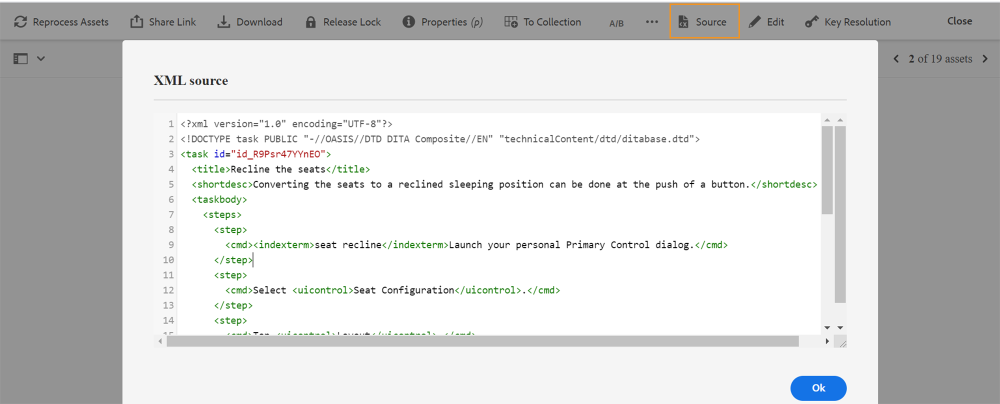

# 預覽主題 {#id1696II000QR}

建立主題後，AEM Guides會產生主題的預覽。 「預覽」模式提供您可用來處理檔案的各種功能。

執行以下步驟來預覽主題：

1. 在Assets UI中，導覽至您要檢視的主題。
1. 按一下您要檢視的主題。

   主題預覽會顯示在Assets UI中。

   >[!NOTE]
   >
   > 您可以在主題之檔案標籤的右上角，看到使用中主題或DITA map的版本。

   >[!IMPORTANT]
   >
   > 下列功能在預覽工具列中的位置可能會因AEM伺服器的設定而異。 主工具列中可能會提供某些功能，而「更多」功能表下可能會提供其他功能。

## 預覽模式中可用的功能

{width="800" align="left"}

您可以在預覽模式中從工具列執行下列操作：

**屬性**

檢視所選主題的內容。 根據您的AEM版本，您可以看到屬性，例如中繼資料、排程\(de\)啟用、參考、檔案狀態等。

>[!NOTE]
>
> 主題的標題屬性是從DITA主題或地圖的`title`標籤中自動填入。 如果您使用屬性視窗在標題中進行任何變更，則變更會遺失。 如果您想要更新標題屬性，應使用網頁編輯器進行更新。

「屬性」頁面包含有關參照的有用資訊，例如使用地圖或主題的位置，或檔案中包含哪些參照。 屬性頁面列出檔案的兩種參考 — **用於**&#x200B;和&#x200B;**傳出參考**。

**Used In**&#x200B;參考列出參照或使用目前檔案的檔案。 **傳出參考**&#x200B;列出目前檔案中參考的檔案。

**用於**&#x200B;參考區段中的\(+\)圖示可讓您進一步向上導覽，以尋找該主題正在使用或參考的位置。

{width="800" align="left"}

按一下檔案旁的圖示，會顯示該檔案被進一步參照的地圖或主題檔案。

**條件式篩選\(A/B\)**

如果您的主題有條件式內容，您會在工具列上看到A/B圖示。 按一下此圖示會開啟快顯視窗，可讓您根據主題中的可用條件篩選內容。

>[!NOTE]
>
> 在Web編輯器中使用淺色背景顏色來反白顯示條件內容。

{width="300" align="left"}

**編輯**

- 開啟主題以在網頁編輯器中編輯。 如果您的管理員已啟用&#x200B;**停用編輯而不簽出**&#x200B;選項，將無法使用&#x200B;**編輯**&#x200B;選項。 啟用此選項後，您只有在取出主題檔案後才會看到&#x200B;**編輯**&#x200B;選項。

**金鑰解析度**

- 如果您想要將金鑰空間檔案用於主題，請按一下「金鑰解析度」圖示。 然後您可以從「關鍵解析度」彈出式視窗中選擇關鍵空間。

**Source**

- 開啟檔案的XML原始碼。 您可以在「預覽」模式中開啟檔案，然後按一下Source圖示，以檢視地圖、主題或DITAVAL檔案的基礎XML程式碼。 XML Source快顯視窗會顯示XML原始碼。 您可以從檔案中選取特定程式碼，或按`Ctrl`+`a`以選取整個內容。

  >[!NOTE]
  >
  > 若要取得DITA map檔案的原始碼檢視，請在Assets UI中選取該檔案，然後按一下Source。

  {width="800" align="left"}

**共用UUID連結**

- AEM Guides可讓您從下列位置共用DITA map、主題和影像檔案的UUID型連結：

   - ASSETS UI
   - DITA map的主控台
   - 主題或影像的預覽

新選項&#x200B;**共用UUID連結**&#x200B;會顯示在上述區域的工具列中。 下列熒幕擷圖顯示主題預覽模式中的&#x200B;**共用UUID連結**&#x200B;選項：

{width="800" align="left"}

在資產UI中，選取檔案時可看見此選項。 在「預覽」模式中，此選項預設可在主工具列中使用。 在DITA map主控台中，此選項會顯示在「輸出預設集」區段中。

複製URL後，可與其他使用者共用，讓他們直接存取檔案。 即使檔案移至存放庫中的其他位置，此連結仍有效。 唯有從存放庫中刪除檔案時，連結才會失敗。

如果您從DITA map主控台或檔案的預覽模式共用連結，則使用者會進入檔案的相同檢視。 不過，當您從Assets UI共用對應檔案的連結時，系統會將使用者帶往對應的主控台。 同樣地，對於主題或影像檔案，會顯示檔案的預覽。

>[!IMPORTANT]
>
> 此連結無法當作其他主題的參考連結使用，它只會提供對存放庫中檔案的直接存取。 此外，只要該檔案位於存放庫中，該連結仍有效。 即使檔案移至存放庫中的其他位置，連結仍有效。 只有當從存放庫中刪除檔案時，連結才會失敗。

**簽出/簽入**

- 切換「出庫」和「入庫」功能。 當檔案出庫時，目前的使用者會取得該檔案的獨佔寫入許可權。 出庫的檔案可在Web編輯器中開啟以進行編輯。 進行必要的變更後，按一下「入庫」圖示，將檔案儲存在DAM中。

當您出庫主題時，檔案的狀態會在卡片檢視和清單檢視中顯示為已出庫。

在卡片檢視中取出檔案：

{width="300" align="left"}

在清單檢視中取出檔案：

{width="550" align="left"}

如果[簽出]資料行不顯示，請在&#x200B;**清單檢視**&#x200B;下選取&#x200B;**檢視設定**，並在&#x200B;**設定資料行**&#x200B;對話方塊中選取&#x200B;**簽出**&#x200B;狀態。

{width="800" align="left"}

>[!TIP]
>
> 如需有關使用檔案取出和存回的最佳實務，請參閱最佳實作指南中的「內容版本設定」區段。

**網頁型版本差異**

- 如果您的主題已經過一些變更，您可以輕鬆地找到該主題不同版本中所做的變更。 若要找出不同版本主題中的變更：

  >[!IMPORTANT]
  >
  > 下列程式中所描述的方法僅適用於DITA檔案。 對於非DITA檔案，請使用「時間軸」檢視來建立檔案的版本或還原檔案的現有版本。

   1. 在預覽模式中開啟主題。

   1. 在左側邊欄中，按一下&#x200B;**版本記錄**&#x200B;並選取版本。

      {width="800" align="left"}

   1. 從列出的版本中，選取要做為基礎版本的版本，然後按一下&#x200B;**預覽版本**。 所選版本的預覽會顯示在「版本預覽」視窗中。

   1. 從&#x200B;**顯示差異**&#x200B;清單中，選取您要與基本版本比較的版本。

      {width="800" align="left"}

      變更的內容會在主題預覽中反白顯示。 以綠色反白顯示的內容表示新新增的內容，而以紅色顯示的內容則是刪除的內容。

      {width="800" align="left"}

### 分支、還原和後續版本設定 {#id193PG0Y051X}

- 在典型的撰寫環境中，您需要建立主題的新分支以符合特定版本。 就像任何其他版本管理系統一樣，AEM Guides可讓您從現有的主題版本建立分支，或回覆成舊版的主題。 使用AEM Guides提供的版本管理功能，您可以執行下列工作：

   - 從現有版本的主題建立分支
   - 在新分支中建立後續版本
   - 還原至主題的特定版本

  下圖顯示典型的分支和後續版本化系統：

  {width="550" align="center"}

  對於任何新主題，第一個版本編號為1.0。此後，主題的每個新版本都會以增量數字（例如1.1、1.2等）儲存。 建立主題的分支後，會建立新分支，其版本編號來自建立分支的位置，並在版本結尾新增。0。 如圖所示，新分支是從主題的1.1版建立的。 新分支的版本設定為1.1.0。此後，每次您在此分支中儲存新版主題時，都會得到一個累加版本號碼，例如1.1.1、1.1.2等。

  與分支類似，您也可以將作業中或目前版本還原為存放庫中存在的任何版本。 若要還原為版本，只要選取想要的主題版本，然後按一下&#x200B;**版本記錄**&#x200B;面板中的&#x200B;**還原為此版本**。

  執行以下步驟來建立分支、恢復為版本並維護主題的後續版本：

  >[!IMPORTANT]
  >
  > 下列程式中所描述的方法僅適用於DITA檔案。 對於非DITA檔案，請使用「時間軸」檢視來建立檔案的版本或還原檔案的現有版本。

   1. 存取Assets UI中的主題。

      >[!NOTE]
      >
      > 您也可以在「預覽」模式中開啟主題，並繼續步驟3。

   1. 選取您要建立分支的主題。

   1. 在左側邊欄中，按一下&#x200B;**版本記錄**。

      >[!NOTE]
      >
      > 此時會顯示所選主題可用的版本清單。 每個版本都包含時間戳記、使用者名稱、版本註解和[標籤](web-editor-use-label.md#)資訊。

   1. 選取您要建立分支的版本。 在下列熒幕擷圖中，已選取1.2版來建立分支。

      {width="300" align="left"}

      >[!NOTE]
      >
      > 目前版本的主題包含版本編號旁邊提到的&#x200B;*\（目前\）*。

   1. 按一下&#x200B;**還原為此版本**。

      系統會顯示訊息，要求您確認建立新分支。

   1. *\(Optional\)*&#x200B;在訊息提示中，您會取得選擇&#x200B;**將目前的工作復本另存為新版本**&#x200B;的選項。 根據此選項的選取，可以執行下列兩個動作：

      - 如果選取此選項，則會從1.1版建立分支。此外，也會從主題目前的工作復本建立新版本的主題，並儲存為下一個版本 — 1.4。

        {width="300" align="left"}

        版本1.2會成為您目前主題的工作副本。 在此之後儲存的任何版本都會建立在1.1的新分支下。例如，此分支中新主題的後續版本將儲存為1.2.0。

        {width="300" align="left"}

      - 如果未選取此選項，則不會從主題目前的工作副本建立新版本。 新分支是從主題的1.2版建立的。 主題的任何後續版本都會儲存在1.2分支下，如1.2.0、1.2.1等等。

        {width="300" align="left"}

   1. 按一下&#x200B;**「確定」**。

  會從選取的主題版本建立新分支。 上述程式也適用於回覆至特定版本的主題。 技術上，回覆至特定版本表示您從選取的版本建立新分支，並將該版本設為主題的最新工作復本。 您也可以在「版本還原歷史記錄」報表中檢視已還原的檔案歷史記錄。 如需有關此報告的詳細資訊，請參閱[還原檔案版本記錄報告](reports-reverted-file-version-history.md#)。

**父級主題：**[&#x200B;建立和預覽主題](create-preview-topics.md)
