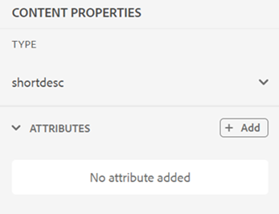

# 編輯器中的右側面板

右側面板包含目前所選檔案的相關資訊。

>[!NOTE]
>
> 右側面板可調整大小。 若要調整面板大小，請將游標置於面板邊界上，游標會變成雙向箭頭，然後選取並拖曳即可調整面板寬度。

右側面板可讓您存取以下功能：

- [內容屬性](#content-properties)
- [檔案屬性](#file-properties)
- [檢閱](#review)
- [追蹤變更](#track-changes)
- [結構描述](#schematron)

## 內容屬性

選取右側面板中的&#x200B;**內容屬性**&#x200B;圖示，即可存取&#x200B;**內容屬性**&#x200B;功能。 **Content屬性**&#x200B;面板包含檔案中目前選取的元素型別及其屬性的相關資訊。

針對參考的內容，面板也會顯示&#x200B;**連結路徑**&#x200B;和&#x200B;**連結UUID**&#x200B;選項，這些選項可協助您識別並複製選取的參考。

>[!NOTE]
>
> 若為HTML檔案，連結路徑和連結UUID選項無法使用。 這些檔案繼續使用現有的&#x200B;**連結URL**&#x200B;行為。

**型別**：從下拉式清單中檢視並選取目前標籤的完整階層標籤。

**連結路徑**：顯示所選參照的相對路徑。 使用&#x200B;**複製路徑**&#x200B;來複製絕對路徑。

**連結UUID**：顯示所選參考的UUID。 使用&#x200B;**複製UUID**&#x200B;來複製UUID。

如果您將有效的UUID直接貼入連結路徑欄位，系統會自動將其解析為絕對檔案路徑，而對應的UUID會顯示於連結UUID欄位中。 這樣可讓您更容易識別和複製資產路徑及其UUID型參照。

**Attributes**： **Attributes**&#x200B;下拉式面板在「配置」、「作者」和「Source」檢視中可用。 您可以輕鬆地新增、編輯或刪除屬性。

    
 新增屬性的步驟 

1. 選取「**新增**」。

   內容屬性中的{width="300"}

1. 在&#x200B;**屬性**&#x200B;下拉式面板中，從下拉式清單中選取屬性並指定屬性的值。  然後選取&#x200B;**新增**。

   具有多個屬性的{width="300"}

1. 若要編輯屬性，請將滑鼠停留在它上並選取&#x200B;**編輯** 。

1. 若要刪除屬性，請將滑鼠停留在它上並選取&#x200B;**刪除** 。

>[!NOTE]
>
> 即使您的主題包含參考的內容，您仍可以使用屬性面板在其上新增屬性。

如果管理員已建立屬性的設定檔，您將會取得這些屬性及其設定的值。 使用內容屬性面板，您可以選擇這些屬性，並將其指派給主題中的相關內容。 如此一來，您也可以建立條件式內容，然後將其用於建立條件式輸出。 如需使用條件預設集產生輸出的詳細資訊，請檢視[使用條件預設集](generate-output-use-condition-presets.md#)。

## 檔案屬性

選取右側面板中的「檔案屬性」圖示，以檢視所選檔案的屬性。 「檔案屬性」功能適用於所有四種模式或檢視：「配置」、「作者」、「Source」和「預覽」。

>[!NOTE]
>
> 「檔案屬性」面板提供檢視和修改與檔案相關聯的各種中繼資料屬性的選項。 但是，當檔案處於唯讀模式時，無法修改這些中繼資料屬性。 此限制僅適用於DITA和Markdown檔案。 對於非DITA資產（例如影像和多媒體），即使是在唯讀模式下，中繼資料屬性仍可編輯。

「檔案」屬性包含下列兩個區段：

**一般**

「一般」段落可讓您存取下列功能：

{width="300"}

- **檔案名稱**：顯示所選主題的檔案名稱。 檔案名稱會以超連結方式連結至選取檔案的屬性頁面。
- **ID**：顯示所選主題的識別碼。
- **字數**：顯示對應DITA主題中的字總數。 以空格分隔的字詞會計為個別字詞。 每次儲存主題變更時，計數都會重新整理。 如果是互動參照，計數中只會包含顯示文字，但會排除索引鍵。

  >[!NOTE]
  >
  > **字數**&#x200B;功能已在2026.01.0版的Experience Manager Guides as a Cloud Service中推出。 升級至此發行版本後，您建立的任何新DITA主題都會在「右側」面板中自動顯示計算的字數。 現有主題需要[重新處理資產](./asset-processor.md)。

- **標籤**：這些是主題的中繼資料標籤。 從屬性頁面的標籤欄位中設定。 您可以輸入或從下拉式清單中選取。  標籤會顯示在下拉式清單下方。 若要刪除標籤，請選取標籤旁的十字圖示。
- **編輯更多屬性**：可讓您檢視及編輯目前開啟檔案的其他屬性。

  >[!NOTE]
  >
  > 任何新增、刪除或修改中繼資料屬性（無論是預設或自訂）都會觸發檔案版本上的[工作復本指標](./web-editor-edit-topics.md#working-copy-indicator)。

- **語言**：顯示主題的語言。 這是從屬性頁面中的語言欄位設定。
- **建立於**：顯示建立主題的日期和時間。
- **修改日期**：顯示修改主題的日期和時間。
- **鎖定者**：顯示鎖定主題的使用者。
- **檔案狀態**：您可以選取並更新目前開啟之主題的檔案狀態。 如需詳細資訊，請檢視[檔案狀態](web-editor-document-states.md#)。

>[!NOTE]
>
> 您可以將「檔案」屬性中各個欄位的屬性值複製到剪貼簿。

**參照**

「參照」區段可讓您存取下列功能：

{width="300"}

- **用於**： Used in references列出參照或使用目前檔案的檔案。
- **傳出連結：**&#x200B;傳出連結列出目前檔案中參照的檔案。

依預設，您可以依標題檢視檔案。 當您將滑鼠停留在檔案上時，您可以檢視檔案標題和檔案路徑作為工具提示。

>[!NOTE]
>
> 作為管理員，您也可以選擇在編輯器中依檔案名稱來檢視檔案清單。 選取&#x200B;**使用者偏好設定**&#x200B;中&#x200B;**編輯器檔案顯示設定**&#x200B;區段的&#x200B;**檔案名稱**&#x200B;選項。

>[!NOTE]
>
> 所有「使用中」和「傳出」參照都會超連結至檔案。 您可以輕鬆開啟及編輯連結的檔案。

除了開啟檔案之外，您也可以使用[參考]區段中的&#x200B;**選項**&#x200B;功能表執行許多動作。 您可以執行的部分動作包括編輯、預覽、複製UUID、複製路徑、新增至集合和屬性。

**翻譯**

本節依字母順序列出編輯器中目前開啟之資產的所有可用語言副本。 資訊以表格檢視顯示，顯示每個語言程式碼以及對應的&#x200B;*檔案標題* （或是&#x200B;*檔案名稱*，若沒有&#x200B;*檔案標題*）。

>[!INFO]
>
> 在傳送資產以供翻譯時建立語言副本。 英文(`en`)做為來源語言，而且翻譯的復本會在各自的目標語言資料夾中產生（例如，`de`代表德文，`fr`代表法文）。 如果資產僅存在於`en`資料夾中，則在開始翻譯並完成目標語言的翻譯之前，不會顯示其他語言副本。 如果資產不存在任何語言資料夾中，則顯示&#x200B;**沒有可用的翻譯**。 如需詳細資訊，請檢視[內容翻譯的最佳實務](./translation-first-time.md)。

{width="300"}

對於每個語言副本，您可以將滑鼠停留在檔案上以找出其在存放庫中的路徑，或直接選取它以在編輯器中開啟。 除了開啟檔案之外，您也可以使用翻譯區段中的&#x200B;**選項**&#x200B;功能表執行許多動作。 您可以執行的部分動作包括編輯、預覽、複製UUID、複製路徑、新增至集合和屬性。

{width="300"}

## 檢閱

選取「稽核」圖示會開啟稽核面板，您可以在其中為目前開啟的檔案選取稽核任務並檢視註解。

{width="300"}

如果您已建立多個「檢閱」專案，您可以從下拉式清單中選取一個專案，並存取檢閱註解。

使用稽核面板，您可以檢視並張貼主題上註解的回覆。 您可以逐一接受或拒絕註解。

>[!NOTE]
>
> 註解方塊和回複方塊支援多行專案，可讓使用者視需要將其展開，以提供完整的註解以及註解的詳細回覆。 您可以在撰寫評論或回覆時使用&#x200B;**Shift** + **Enter**&#x200B;移至下一行。

如需詳細資訊，請檢視[地址檢閱註解](review-address-review-comments.md#)。

## 追蹤變更

使用右側面板的「追蹤的變更」功能，您可以檢視檔案中所有更新的資訊。 您也可以搜尋對檔案所做的任何特定更新。

>[!NOTE]
>
> 追蹤的變更功能會顯示已使用[索引標籤列](./web-editor-tab-bar.md)的啟用/停用追蹤變更功能追蹤的所有更新。

## 結構描述

「Schematron」是指用於定義XML檔案測試的規則型驗證語言。 編輯器支援Schematron檔案。 您可以匯入Schematron檔案，也可以在編輯器中編輯它們。 使用Schematron檔案，您可以定義某些規則，然後針對DITA主題或地圖驗證這些規則。

瞭解如何在Experience Manager Guides中使用Schematron檔案，請參閱[支援Schematron檔案](./support-schematron-file.md)。

**父級主題：**[&#x200B;編輯器簡介](web-editor.md)
