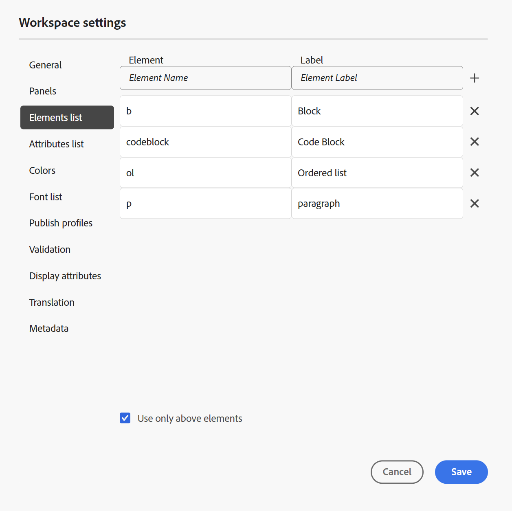

# 編輯器設定

編輯器[索引標籤列]中的&#x200B;**設定**&#x200B;選項僅供管理員和資料夾設定檔管理員使用，並允許設定下列設定：

- [一般](#general)
- [面板](#panels)
- [元素清單](#elements-list)
- [屬性清單](#attributes-list)
- [顏色](#colors)
- [發佈設定檔](#publish-profiles)
- [驗證 ](#validation)
- [顯示屬性](#display-attributes)
- [翻譯](#translation)
- [中繼資料](#metadata)

>[!NOTE]
>
> 如果您要更新任何預設設定，則應重新開啟檔案以使變更生效。

## 一般

一般設定可讓您設定要與編輯器搭配使用的字典。 此索引標籤包含四個區段： **拼字檢查**、**條件**、**製作**&#x200B;以及&#x200B;**引文**。

{width="650" align="left"}

- **拼字檢查**：有兩個選項 — **AEM拼字檢查**&#x200B;和&#x200B;**瀏覽器拼字檢查**。 依預設，編輯器會使用瀏覽器拼字檢查功能，其中拼字檢查是使用瀏覽器的內建字典執行。 您可以切換至AEM拼字檢查，以使用Adobe Experience Manager的字典，也可以自訂字典以新增自訂字詞清單。 如需自訂AEM字典的詳細資訊，請檢視安裝與設定AEM as a Cloud Service中的[自訂Adobe Experience Manager Guides的預設字典](../cs-install-guide/customize-aem-custom-dictionary.md)區段。

- **狀況**

   - **在作者檢視中反白條件文字**：選取此選項以在作者檢視中反白條件文字。 條件內容會使用為條件定義的顏色反白顯示。

   - **使用條件屬性進行驗證**：選取此選項可允許驗證為屬性定義的值。 這可防止您新增任何不正確的值。

   - **在主旨配置面板中顯示具有標題的金鑰**：選取此專案可顯示主旨配置中的金鑰與標題。 如果您未選取此選項，則只會顯示標題。 例如，這裡的索引鍵「os」、「audience」和「other」也會與標題一起顯示。

     {width="550" align="left"}

   - **在[條件]面板中顯示主旨配置**：選取此專案，在條件面板中檢視主旨配置。 如果取消選取此專案，定義的條件會顯示在「條件」面板中。

- **製作**

   - **啟用「全部取代」**：選取此項以檢視「**尋找和取代**」面板中的「**全部取代**」圖示。

- **引文**

  變更引文樣式。 從您要在專案中使用的下拉式清單中選擇引文樣式。 如需詳細資訊，請檢視[變更引文樣式](./web-editor-apply-citations.md#change-citation-style)。

- **AI小幫手**
選取此項以啟用Experience Manager Guides中的[AI小幫手](./ai-assistant.md)功能。 取消選取以停用該功能。

## 面板

此設定會控制「編輯器」和「地圖」主控台左右面板中顯示的面板。 您可以切換按鈕，以顯示或隱藏所需的面板。

{width="650" align="left"}

您也可以定義面板中特徵的顯示順序。 若要變更面板中可用功能的預設順序，請選取虛線以將功能標籤拖放到所需位置。 功能也可以從&#x200B;**更多**&#x200B;區段移至面板的主要區段，反之亦然。 重新排序後，功能會以相同的順序顯示在個別的右側和左側面板中。

{width="650" align="left"}

一次最多可以顯示8個面板。 對面板設定所做的任何變更都會立即套用。

>[!NOTE]
>
> 如果自訂面板已設定，則會顯示在面板清單中。 您可以切換開關，以顯示或隱藏自訂面板。

## 元素清單

作為管理員，您可以控制作者可以插入檔案的元素清單，也可以定義元素的顯示名稱。 「元素」清單設定可讓您根據DITA規格來指定元素名稱，並指定您要使用的標籤，而不是DITA定義的元素名稱：

{width="650" align="left"}

在上述熒幕擷圖中，`p`元素已被指定為Paragraph的標籤，而`codeblock`則被指定為Code Block的標籤以及其他一些元素。 如果您選取&#x200B;**僅使用以上元素**&#x200B;選項，則只有此清單中的有效元素\（在目前的插入點\）會顯示在&#x200B;**插入元素**&#x200B;對話方塊中。

在下列熒幕擷圖中，先前熒幕擷圖的4個已設定元素中只有3個會顯示在目前內容中：

{width="300" align="left"}

## 屬性清單

與元素清單類似，您可以控制要在元素的屬性清單中顯示的屬性清單及其顯示名稱。 在下列熒幕擷圖中，只有3個屬性已設定為顯示在元素的屬性清單中：

{width="650" align="left"}

透過此設定，當您嘗試將屬性新增至元素時，您只會檢視在清單中設定的屬性清單。

{width="300" align="left"}

## 顏色

顯示&#x200B;**條件**&#x200B;的預先設定背景顏色清單。 使用者可在將條件套用至主題時選取背景顏色。 作為管理員，您還可以建立自訂背景顏色並將其新增到清單中。 若要新增顏色，請在&#x200B;**顏色名稱**&#x200B;欄位中輸入所要的名稱，選擇自訂顏色，然後選取&#x200B;**+**&#x200B;圖示。 自訂顏色會顯示在顏色清單的末尾。

## 發佈設定檔

這包含可用來發佈&#x200B;**知識庫**&#x200B;輸出的設定檔。 您可以為目標知識庫建立新的設定檔。 例如，Salesforce或ServiceNow。

**建立Salesforce設定檔**

**必備條件**

- 為Salesforce建立連線應用程式。 如需詳細資訊，請參閱[啟用API整合的OAuth設定](https://help.salesforce.com/s/articleView?id=sf.connected_app_create_api_integration.htm&amp;type=5)。

- 設定連線應用程式時，請確定下列事項：

   - 指定回呼。

     `URL: http://<server name>:<port>/bin/dxml/thirdparty/callback/salesforce`

   - 選取下列OAuth範圍：
      - 完整存取權（完整）
      - 選取「透過API管理使用者資料(API)」

     設定應用程式後，Salesforce會提供&#x200B;**消費者金鑰**&#x200B;和&#x200B;**消費者機密**。 這些可用來建立Salesforce設定檔。

   - 若要建立Salesforce設定檔，請從&#x200B;**伺服器型別**&#x200B;下拉式清單中選取&#x200B;**Salesforce**&#x200B;知識庫。 輸入設定檔名稱。 在&#x200B;**網站URL**&#x200B;中，輸入您要用來發佈輸出的消費者網站，然後新增Salesforce消費者網站提供的&#x200B;**消費者金鑰**&#x200B;和&#x200B;**消費者機密**。 然後，**驗證**&#x200B;並&#x200B;**儲存**&#x200B;新建立的設定檔。

     在編輯器設定中{width="550" align="left"}

     >[!NOTE]
     >
     >若要在Experience Manager Guides中設定Salesforce的Proxy，請使用AEM中的Apache HTTP元件Proxy設定。 瞭解如何[設定AEM連結檢查器的Proxy](https://helpx.adobe.com/experience-manager/kb/How-to-configure-proxy-for-the-AEM-Link-Checker-AEM.html)。

**建立ServiceNow設定檔**

**必備條件**

設定ServiceNow伺服器以上傳資產。

- 連線到&#x200B;**ServiceNow**&#x200B;伺服器。
- 瀏覽至&#x200B;**系統屬性** > **安全性**。
- 取消核取下列選項：

  **此屬性必須設定為啟動用於上傳的MIME型別檢查（所有版本Eureka及以上）。 啟用(true)或停用(false)檔案附件的mime型別驗證。 上傳期間將檢查透過glide.attachment.extensions設定的副檔名是否為MIME型別。**

- 選取「**儲存**」。

  設定應用程式之後，請建立&#x200B;**ServiceNow**&#x200B;設定檔。

- 若要建立設定檔，請從&#x200B;**伺服器型別**&#x200B;下拉式清單中選取ServiceNow知識庫。 輸入設定檔&#x200B;**名稱**。 在&#x200B;**ServiceNow URL**&#x200B;中，輸入您要用來發佈輸出的消費者網站，然後新增ServiceNow消費者網站所提供的&#x200B;**使用者名稱**&#x200B;和&#x200B;**密碼**。 然後，**驗證**&#x200B;並&#x200B;**儲存**&#x200B;新建立的設定檔。

  {width="550" align="left"}

  驗證之後，您可以在DITA Map的輸出預設集中選取發佈設定檔，並使用它產生輸出至您選擇的&#x200B;**Salesforce**&#x200B;或&#x200B;**ServiceNow**&#x200B;伺服器。

  深入瞭解[知識庫](../user-guide/generate-output-knowledge-base.md)輸出預設集。

## 驗證 

此索引標籤包含在編輯器中設定Schematron驗證的選項。 您可以啟用下列功能：

- **在儲存檔案之前執行驗證檢查**：選取此項以在任何儲存作業之前使用選取的Schematron檔案執行Schematron驗證。 您可以選取+圖示來新增Schematron檔案。 隨即列出選取的Schematron檔案。

  >[!NOTE]
  >
  > 選取的結構描述檔案將會在選取的資料夾設定檔中持續存在。

  在編輯器設定中進行{width="550" align="left"}

  這可防止使用者儲存任何破壞所選Schematron檔案中定義規則的檔案。 如果未選取此專案，在儲存變更之前，將不會驗證檔案。

- **允許所有使用者在驗證面板中新增Schematron檔案**：選取此選項可允許使用者在編輯器的驗證面板中新增任何Schematron檔案。 這可讓使用者新增Schematron檔案，然後針對Schematron檔案驗證主題。 如果未選取此專案，則編輯器&#x200B;**驗證面板**&#x200B;的使用者無法使用新增結構描述檔案&#x200B;**新增結構描述檔案**&#x200B;按鈕的選項。

## 顯示屬性

與「屬性」清單一樣，您可以控制要在元素的屬性清單中顯示的屬性清單。 依照預設，有四個&#x200B;**顯示屬性** — 對象、平台、產品和prop已設定為顯示在元素的屬性清單中。 您也可以使用上方的&#x200B;**新增**&#x200B;圖示來新增顯示屬性。 您也可以使用&#x200B;**刪除**&#x200B;圖示來刪除任何顯示屬性。

為元素定義的屬性會顯示在「配置圖」和「大綱」檢視中。

{width="550" align="left"}

## 翻譯

此索引標籤包含建立語言群組、將來源標籤傳播至目標版本，以及清除翻譯專案的選項。

{width="550" align="left"}

- **語言群組**：身為管理員，您可以建立語言群組，並將它們當做一組來翻譯內容。

  執行以下步驟來建立新的語言群組：

   1. 選取「**新增**」。
   1. 輸入語言群組名稱。 每種語言都應該有唯一的名稱。 如果名稱欄位空白或名稱不是唯一的，您可以檢視錯誤。
   1. 從下拉式清單中選取語言。 您可以選取多種語言。

      輸入語言的前幾個字元，或輸入語言代碼以篩選所需的語言。 例如，輸入&#39;en&#39;以篩選名稱或程式碼開頭包含&#39;en&#39;的所有語言。

   1. 選取「完成」圖示，將選取的語言新增至群組。 隨即顯示語言。 新增三種或更多語言時，會顯示&#x200B;**顯示更多**&#x200B;選項。 您可以選取&#x200B;**顯示更多**&#x200B;來檢視群組中存在的所有語言。

      >[!TIP]
      >
      > 將&#x200B;**顯示更多**&#x200B;切換為&#x200B;**顯示更少**&#x200B;並只檢視幾種語言。

   1. 將滑鼠停留在群組中的語言上以編輯或刪除語言群組。
   1. 儲存&#x200B;**設定**。

      >[!NOTE]
      >
      >身為使用者，您可以檢視設定至資料夾設定檔的語言群組。

- **將來源版本標籤傳播到目標版本**：選取此選項可將來源檔案版本的標籤傳遞到轉譯的檔案。 預設為停用。
- **翻譯專案完成後的清理**：選取此選項可設定在翻譯後自動停用或刪除翻譯專案。 依預設，會選取&#x200B;**無**，這樣專案在翻譯後就會存在。

  如果您想稍後再使用翻譯專案，可以停用這些專案。 刪除專案會永久刪除專案中存在的所有檔案和資料夾。

## 中繼資料

您可以控制主題的版本中繼資料及其值顯示在&#x200B;**版本記錄**&#x200B;對話方塊中。  在中繼資料路徑中，指定您要從中挑選中繼資料的節點位置。 您也可以為中繼資料定義自訂名稱作為標籤。 預設屬性為「標題」、「檔案狀態」和「標籤」。

中繼資料可從資產的`/jcr:content`節點下的任何屬性中擷取，因此您可以將屬性的路徑新增為中繼資料路徑。

如果中繼資料路徑為空白，則會顯示錯誤。 如果您將標籤保留為空白，則會挑選最後一個元素作為標籤。

編輯器設定中的{width="550" align="left"}

*設定&#x200B;**版本記錄**對話方塊的中繼資料。*

您也可以定義這些中繼資料標籤的顯示順序。 若要變更這些標籤的預設順序，請選取虛線以將標籤拖放到所需位置。
中繼資料標籤會以相同的順序顯示在編輯器的**版本記錄**&#x200B;對話方塊中。

**父級主題：**[&#x200B;編輯器簡介](web-editor.md)
