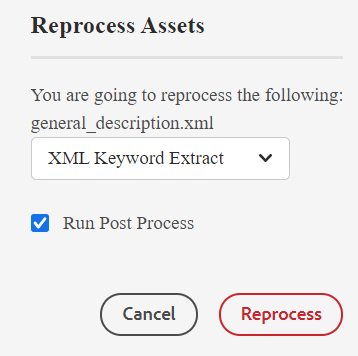

# 智慧標籤 {#id216KH0ID0Y8}

>[!IMPORTANT]
>
> 智慧型標籤功能並非現成可用，其需要自訂實作，而您需要就此諮詢系統管理員。

Adobe Experience Manager Guides隨附新增智慧標籤的功能。 您可以使用XML關鍵字擷取工具來擷取智慧標籤。 此工具使用人工智慧來瞭解內容並提供相關關鍵字。 您可以使用智慧標籤來改善搜尋引擎最佳化\(SEO\)，並幫助使用者尋找您的相關內容。

執行以下步驟來建立智慧標籤：

1. 在Assets UI中，導覽至您要建立智慧標籤的主題。
1. 在預覽模式中開啟主題，並從主工具列選取&#x200B;**重新處理Assets**&#x200B;圖示。
1. 選取「XML關鍵字擷取」以擷取相關關鍵字。

   {width="300"}

1. 選取「執行後續處理」選項。 成功初始化工具時會顯示訊息。
1. 系統會自動擷取標籤，並可在所選主題的「屬性」頁面上看到標籤。

   

   >[!NOTE]
   >
   > 除了透過「XML關鍵字擷取」工具擷取關鍵字之外，您還可以新增、刪除或自訂屬性頁面中的智慧標籤。

*請聯絡您的客戶成功團隊，讓此功能在環境中啟用。 這並非是現成支援的一部分。*

**父級主題：**&#x200B;[&#x200B;管理中繼資料](manage-metadata.md)
