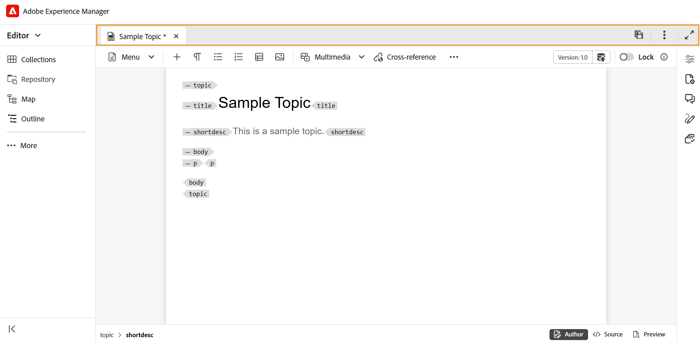

# 編輯器中的索引標籤列

標籤列位於編輯器介面的頂端，可讓您存取下列功能：

**索引標籤**

將編輯器中目前開啟的主題顯示為檔案標籤。 您可以同時開啟多個主題，這些主題會顯示在標籤列的個別標籤中。 依預設，您可以在標籤中檢視檔案標題。 當您將滑鼠停留在檔案上時，您可以檢視檔案標題和檔案路徑作為工具提示。

>[!NOTE]
>
> 身為管理員，您也可以選擇在索引標籤中依檔案名稱檢視檔案清單。 選取[使用者偏好設定](./intro-home-page.md#user-preferences)中&#x200B;**編輯器檔案顯示設定**&#x200B;區段的&#x200B;**檔案名稱**&#x200B;選項。

選取檔案索引標籤會開啟內容功能表，其中包含「另存為新版本」、「複製」、「尋找位置」、「新增至」、「屬性」、「分割」、「下載為PDF」和「關閉」選項。

**儲存全部**

儲存您在所有開啟的主題中所做的變更。 如果您在編輯器中開啟了多個主題，選取&#x200B;**全部儲存**&#x200B;或使用&#x200B;**Ctrl**+**S**&#x200B;快速鍵只要按一下即可儲存所有檔案。 您不必個別儲存每個檔案。

>[!NOTE]
>
> 「**儲存全部**」作業不會建立您主題的新版本。 若要建立新版本，請使用&#x200B;**另存為新版本**&#x200B;選項。

**AI小幫手**

強大的AI驅動工具，可透過智慧說明和撰寫功能提升生產力。 它將兩個強大的AI功能 — **製作**&#x200B;和&#x200B;**說明** — 整合到Experience Manager Guides介面中，讓您更快更有效率地編寫內容並存取Experience Manager Guides檔案中的資訊。

>[!NOTE]
>
> AI助理功能目前可供Adobe Experience Manager Guides as a Cloud Service使用。

**展開檢視**：可讓您使用&#x200B;**展開**&#x200B;圖示展開頁面檢視。 在此檢視中，包含Adobe Experience Manager標誌的標題列會隱藏。 如此可最大化內容空間以供編輯。 若要返回標準檢視，請使用&#x200B;**結束展開檢視**&#x200B;圖示。

**其他動作**：提供其他選項的存取權。 選取此按鈕會開啟包含下列選項的功能表：

- **Assets**：根據您的設定，將您帶往目的地。
   - **雲端服務**：如果您正在使用雲端服務，選取&#x200B;**Assets**&#x200B;選項會帶您前往AEM導覽頁面。

   - **內部部署軟體**：如果您正在使用Adobe Experience Manager Guides （4.2.1和更新版本），選取&#x200B;**Assets**&#x200B;選項會帶您前往Assets UI中的目前檔案路徑。
- **設定**：帶您前往[編輯器設定]對話方塊。 如需詳細資訊，請參閱[使用編輯器設定](./web-editor-settings.md)。

**父級主題：**[&#x200B;編輯器簡介](web-editor.md)
