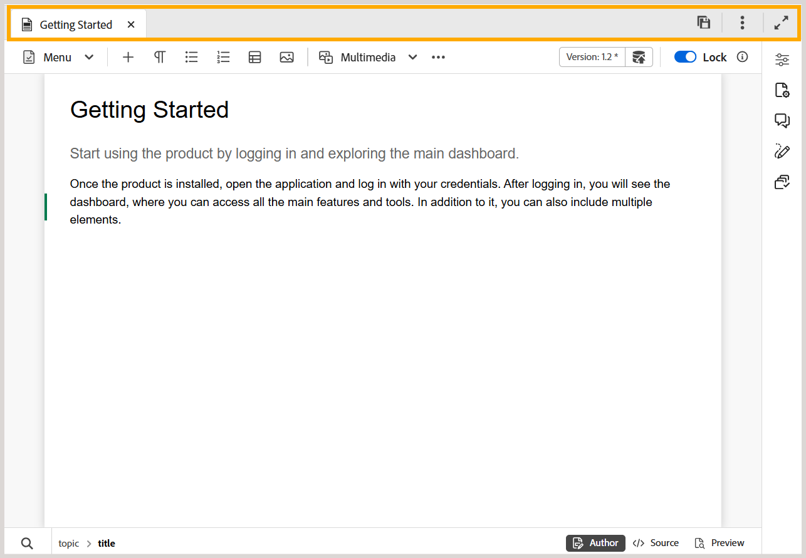

# 編輯器中的索引標籤列

>[!INFO]
>
> 此主題適用於新編輯器和舊編輯器。 雖然核心功能保持一致，但內容會使用索引標籤和圖說文字（如適用）來指出使用者介面、術語和互動的差異。

標籤列位於編輯器介面的頂端，提供對各種檔案層級功能的存取權。

>[!BEGINTABS]

>[!TAB 新編輯器]

>[!TAB 舊編輯器]

>[!ENDTABS]

**索引標籤**

將編輯器中目前開啟的主題顯示為檔案標籤。 您可以同時開啟多個主題，這些主題會顯示在標籤列的個別標籤中。 依預設，您可以在標籤中檢視檔案標題。 當您將滑鼠停留在檔案上時，您可以檢視檔案標題和檔案路徑作為工具提示。

>[!NOTE]
>
> 身為管理員，您也可以選擇在索引標籤中依檔案名稱檢視檔案清單。 在[使用者偏好設定](./intro-home-page.md#user-preferences)下的&#x200B;**編輯器檔案顯示設定**&#x200B;區段中，選取&#x200B;**檔案名稱**&#x200B;選項。

選取檔案索引標籤會開啟內容功能表，其中包含「另存為新版本」、「複製」、「尋找位置」、「新增至」、「屬性」、「分割」、「下載為PDF」和「關閉」選項。

**儲存全部**

儲存您在所有開啟的主題中所做的變更。 如果您在編輯器中開啟了多個主題，選取&#x200B;**全部儲存**&#x200B;或使用&#x200B;**Ctrl**+**S**&#x200B;快速鍵只要按一下即可儲存所有檔案。 您不必個別儲存每個檔案。

>[!NOTE]
>
> 「**儲存全部**」作業不會建立您主題的新版本。 若要建立新版本，請使用&#x200B;**另存為新版本**&#x200B;選項。

**AI小幫手**： AI小幫手有兩種模式可用： **Agentic**&#x200B;和&#x200B;**Standard**。

>[!NOTE]
>
> 若要在您的環境中使用AI助理功能的代理模式，請聯絡客戶成功團隊。 啟用此功能後，管理員可以從Workspace設定中將其開啟或關閉。 一次只能啟用一個AI助理模式；Agentic或Standard。

- **全能**：將Adobe CX Enterprise Coworker的智慧型、全能型智慧型標籤技能帶入編輯器，啟用自然的對話式內容標籤。 它會分析您的內容、建議相關標籤，並幫助您以最省力的方式套用一致且準確的中繼資料。 您可以檢閱建議的標籤，並選擇在確認選取之前套用或拒絕這些標籤。 [在代理模式中使用AI小幫手](../user-guide/ai-assistant-agentic.md)可簡化標籤程式，改善內容組織和可發現性。

- **Standard**：功能強大、AI導向的工具，可透過智慧說明功能提升生產力。 此外，在編輯器介面中工作時，您可以利用AI Assistant的智慧型撰寫功能，透過對內容重複使用和最佳化的智慧型建議，讓您的撰寫流程更聰明、更快。

[AI助理](./ai-assistant.md)功能目前僅適用於Adobe Experience Manager as Cloud Service。

**展開檢視**：可讓您使用&#x200B;**展開**&#x200B;圖示展開頁面檢視。 在此檢視中，包含Adobe Experience Manager標誌的標題列會隱藏。 如此可最大化內容空間以供編輯。 若要返回標準檢視，請使用&#x200B;**結束展開檢視**&#x200B;圖示。

**其他動作**：提供其他選項的存取權。 選取此按鈕會開啟包含下列選項的功能表：

- **Assets**：根據您的設定，將您帶往目的地。
  - **雲端服務**：如果您正在使用雲端服務，選取&#x200B;**Assets**&#x200B;選項會帶您前往AEM導覽頁面。

  - **內部部署軟體**：如果您正在使用Adobe Experience Manager Guides （4.2.1和更新版本），選取&#x200B;**Assets**&#x200B;選項會帶您前往Assets UI中的目前檔案路徑。
- **Workspace設定**：帶您前往Workspace設定對話方塊。 如需詳細資料，請檢視[設定Workspace設定](../install-conf-guide/workspace-settings.md)。

>[!NOTE]
>
>如果在5.2版之前的內部部署設定中使用Adobe Experience Manager Guides，則Workspace設定選項會繼續顯示為「**設定**」（在「更多動作」功能表下）。

- **編輯器設定**：帶您進入「編輯器設定」對話方塊，您可以在其中自訂個別作者層級的編輯器行為。 它可讓您在編寫期間控制標籤、註解和其他編輯器層級設定的可見度和行為。 如需詳細資訊，請檢視[編輯器設定](../user-guide/config-editor-settings.md)。

**父級主題：**&#x200B;[&#x200B;編輯器簡介](web-editor.md)
