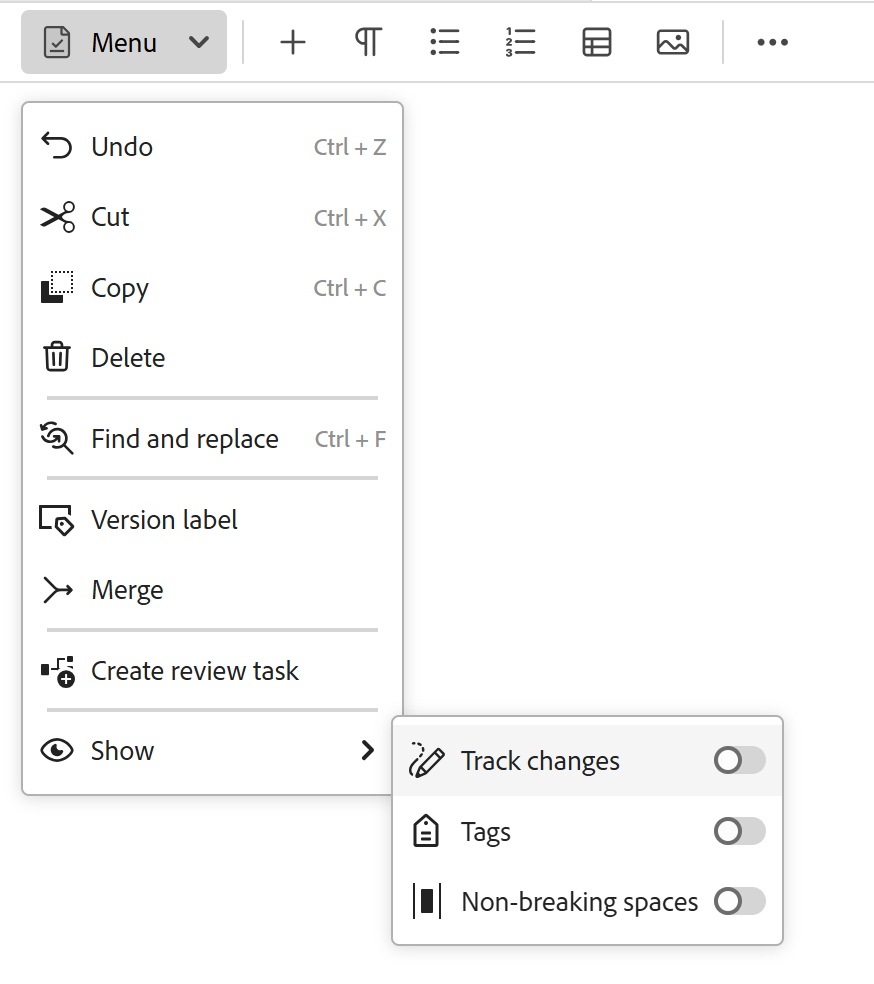
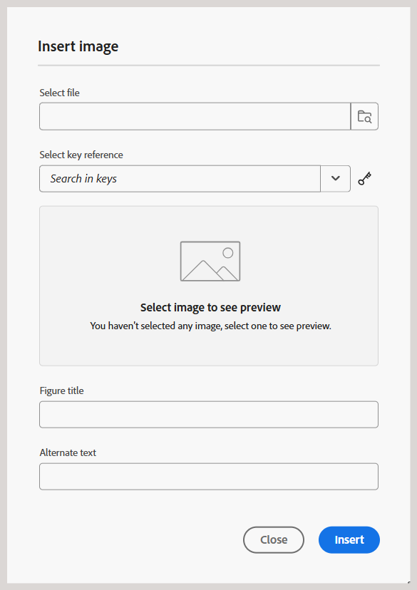
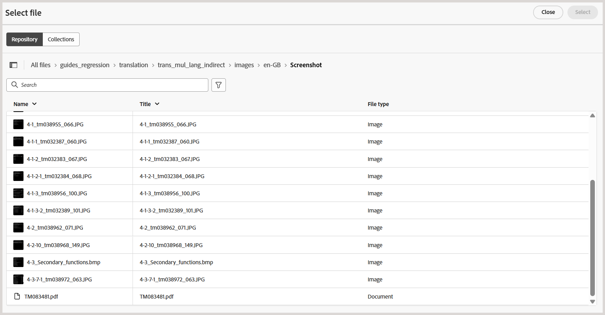
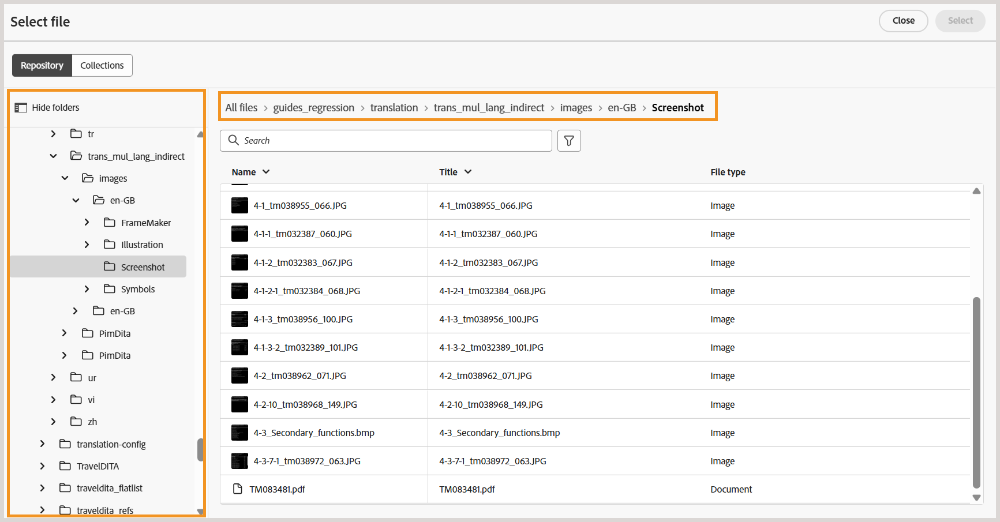
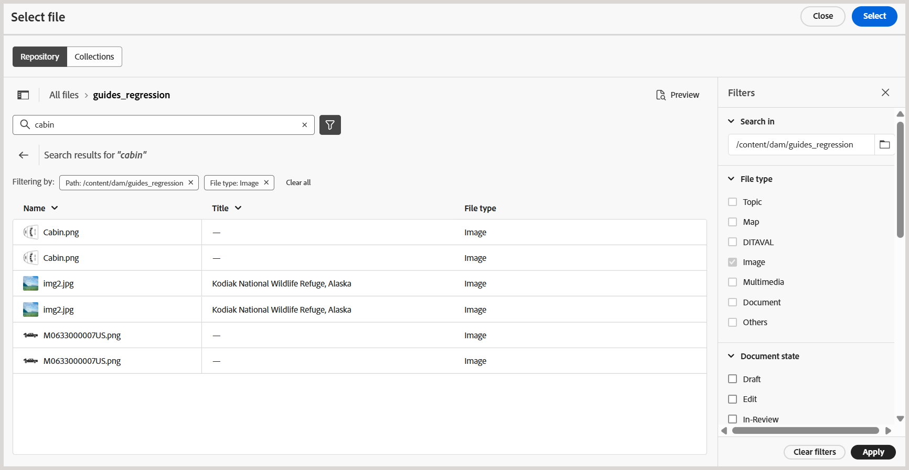
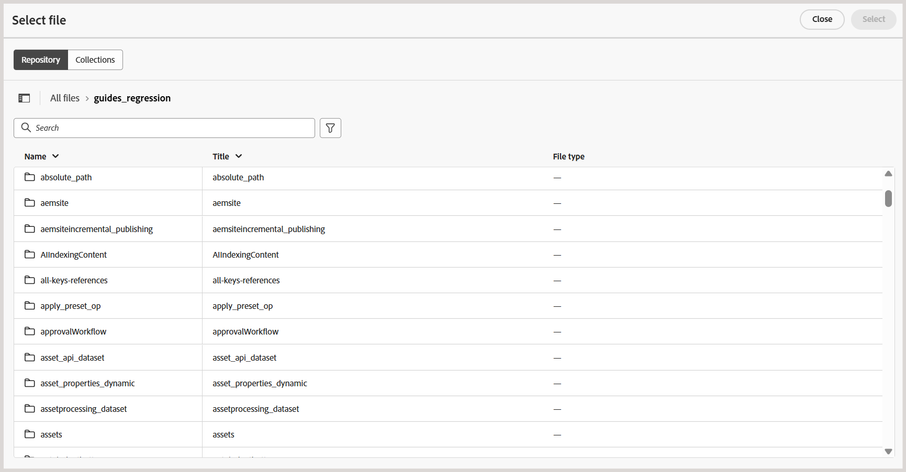
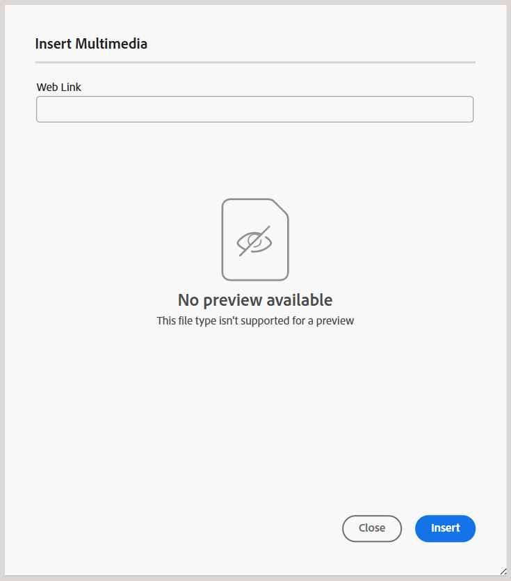

# 編輯器中的工具列

在編輯器中開啟主題或地圖以進行編輯時，工具列隨即顯示。 工具列中的可用功能如下：

- [功能表下拉式清單](#menu-dropdown)
- [內容插入選項](#content-insertion-options)
- [版本資訊和另存為新版本按鈕](#version-information-and-save-as-new-version)
- [鎖定/解鎖](#lockunlock)

>[!NOTE]
>
> 以上列出的功能僅適用於主題檔案。 使用對應檔案時，會根據目前的「對應」編輯器檢視，在工具列中顯示不同的選項。 瞭解[地圖編輯器功能](./map-editor-advanced-map-editor.md)檔案中的地圖編輯器工具列選項。

## 功能表下拉式清單

「選單」下拉式清單提供編輯動作、「尋找和取代」、「版本記錄」、「版本標籤」、「合併」、「建立稽核」任務和「顯示」選單（包括「追蹤變更」、「標籤」、「不斷行空格」）的存取權。

編輯器工具列的{width="350" align="left"}

這些功能的詳細說明如下：

**正在編輯動作**

在編輯器中編輯主題時，存取各種編輯動作，例如&#x200B;**剪下**&#x200B;或&#x200B;***Ctrl***+***X***、**複製**&#x200B;或&#x200B;***Ctrl***+***C***、**復原**&#x200B;或&#x200B;***Ctrl***+***Z***、**重做**&#x200B;或&#x200B;***Ctrl***+***Y***&#x200B;以及選單下拉選單中存在&#x200B;**刪除**。

**尋找和取代**

**尋找和取代**&#x200B;功能可在作者和Source檢視模式中使用。 啟用時，「尋找和取代」文字列會顯示在主題編輯區域的底部。 您可以使用快速鍵&#x200B;**CTRL**+**F**&#x200B;來叫用尋找與取代列。

{align="left"}

使用設定圖示\(\)，您可以切換&#x200B;**忽略大小寫**&#x200B;和僅&#x200B;**全字**&#x200B;搜尋選項。 若要執行不區分大小寫的搜尋，請開啟\（或選取\） **忽略大小寫**&#x200B;選項。 否則，如果您要執行區分大小寫的搜尋，請關閉\（或取消選取\） **忽略大小寫**&#x200B;選項。 您也可以選擇搜尋整個單字。

搜尋是即時的，這表示當您在&#x200B;**尋找**&#x200B;欄位中鍵入搜尋字詞或文字時，會立即在主題中搜尋並選取該字詞。 同樣地，若要取代主題中的文字，請在個別欄位中輸入搜尋字詞及其取代字詞，並選取&#x200B;**取代**&#x200B;或&#x200B;**全部取代**&#x200B;按鈕。

在Source檢視中，**尋找和取代**&#x200B;功能對於搜尋特定元素或屬性非常有用。 例如，如果您想取代`@product`屬性的值，可以從Source檢視輕鬆地完成此操作。 「作者」檢視不允許您根據屬性或元素進行搜尋。 不過，使用&#x200B;**全部取代**&#x200B;功能時必須小心，因為它可能會覆寫XML程式碼。

**版本記錄**

編輯器中的&#x200B;**版本記錄**&#x200B;功能可讓您檢查DITA檔案的可用版本、比較這些版本，以及還原編輯器本身的任何版本。 您可以將目前版本的內容和中繼資料（也可以是工作復本）與相同檔案的任何先前版本進行比較。 您也可以檢視比較版本的標籤和註解。

>[!NOTE]
>
> 只有在對主題或地圖的第一版本進行變更時，才會顯示版本記錄選項。

    
 存取版本記錄的步驟 

1. 在編輯器中開啟主題。
1. 從&#x200B;**功能表**&#x200B;下拉式清單中選取&#x200B;**版本歷程記錄**。

   **版本記錄**&#x200B;對話方塊就會顯示。

   {width="550" align="left"}

   *預覽不同版本主題中的變更。*

1. 在&#x200B;**比較對象**&#x200B;下拉式清單中，選擇要比較或還原的主題版本。

   >[!NOTE]
   >
   > 如果版本套用了標籤，它們也會與版本編號一起顯示\（在方括弧中）。

1. 啟用&#x200B;**檢視標籤和註解**&#x200B;選項，以檢視套用至目前版本和比較版本的標籤和註解。
1. 您也可以在&#x200B;**版本記錄**&#x200B;對話方塊中檢視下列資訊：

   **預覽**&#x200B;標籤：新加入的內容是綠色字型，而刪除的內容是紅色字型。

   **中繼資料**&#x200B;標籤：新加入的中繼資料為綠色字型，而刪除的中繼資料為紅色字型。

   {width="550" align="left"}的中繼資料差異

   *比較版本記錄中不同版本的中繼資料。*

   >[!NOTE]
   >
   > 您的系統管理員可以從&#x200B;**設定**&#x200B;的中繼資料標籤變更要顯示的中繼資料。 如需詳細資訊，請參閱&#x200B;**索引標籤列**&#x200B;的[更多動作](./web-editor-tab-bar.md)區段。

   您也可以檢視目前版本和比較版本的使用者和時間詳細資訊。

   從下拉式清單中選擇版本後，**還原為選取的版本**&#x200B;選項即可使用。 預覽視窗會顯示目前版本與所選主題版本之間的差異。

1. 選取&#x200B;**回覆至選取的版本**&#x200B;以回覆主題選取版本的工作復本。

   「回覆版本」對話方塊隨即顯示。

   {width="550" align="left"}

1. \（*選擇性*\）提供回覆至舊版的原因。 您也可以建立目前使用中之主題工作復本的新版本。

1. 選取&#x200B;**確認**。

   您的檔案工作復本將還原為所選版本。 如果您選擇建立目前作用中工作副本的新版本，則會建立包含所有工作變更的新版本檔案。

   當您回覆至較舊的版本時，會顯示視覺提示，指出您目前使用的版本不是最新版本。

   {align="left"}

**版本標籤**

標籤可協助您識別DDLC \（檔案開發生命週期\）中特定主題的階段。 例如，當您處理主題時，可以將標籤設定為「已核准」。 主題發佈並可供客戶使用後，您就可以為該主題指派「已發行」標籤。

Experience Manager Guides可讓您以自由格式文字格式指定標籤，或使用一組預先定義的標籤。 自訂標籤可讓系統中的任何作者根據其選擇指定標籤。 這可提供彈性，但會導致系統中出現不一致的標籤。 若要克服此問題，管理員可以設定一組預先定義的標籤。 如需有關設定預先定義標籤的詳細資訊，請在[安裝與設定Adobe Experience Manager Guides as a Cloud Service]中檢視&#x200B;*設定和自訂XML Web編輯器*。

這些標籤會以下拉式清單的形式顯示給需要指定標籤的作者。 這可確保在系統中只使用預先定義、一致的標籤。

您可以透過不同的方法將標籤套用至主題 — Assets UI、[基準](web-editor-use-label.md) UI和編輯器中的[版本記錄](/help/product-guide/user-guide/generate-output-use-baseline-for-publishing.md)面板。 編輯器中的版本標籤功能可讓作者快速輕鬆地為其主題指派標籤。

    
 從編輯器新增標籤至主題的步驟 

1. 在編輯器中開啟主題。

1. 從功能表下拉式清單中選取&#x200B;**版本標籤**。

   隨即顯示「版本標籤管理」對話方塊。

   {width="350" align="left"}

   「版本標籤管理」對話方塊分為兩個部分 — 左側面板包含可用於主題的版本清單，以及標籤下拉式清單\（或文字方塊以輸入標籤\），右側面板包含主題預覽。

1. 選取要套用標籤的版本。

   當您從版本清單中選擇不同的主題版本時，預覽面板會顯示目前版本和所選主題版本之間的變更

   >[!NOTE]
   >
   > 如果標籤已套用至版本，則會顯示在下拉式清單中的版本編號旁，以及「選取版本」清單的下方。 您可以選取標籤旁邊的\(**x**\)圖示來移除現有標籤。

1. 如果您的管理員已定義標籤清單，則會顯示一個標籤下拉式清單，您可以從中選擇要套用的標籤。 您可以從下拉式清單中選取多個標籤。

   否則，您會看到一個文字方塊，您可以在其中輸入要新增至主題的標籤。

   >[!NOTE]
   >
   > 您無法在一個主題的多個版本上套用相同的標籤。 如果您嘗試關聯現有的標籤，則系統會提供您選項，讓您從現有版本中移除該標籤，並將其套用至主題的所選版本。

1. 選取&#x200B;**新增標籤**。

1. 在「套用標籤」確認訊息中，選取&#x200B;**移動標籤（若用於其他版本）**&#x200B;選項，將標籤從現有版本移動至選取的版本。 如果您未選取此選項，而且有標籤指派給不同的主題版本，則不會將其移至所選主題的版本。 在標籤應用程式中會忽略此類標籤。

**合併**

當您在多作者環境中工作時，很難追蹤其他作者在主題或地圖中所做的變更。 「合併」功能可讓您更進一步控制檢視變更，以及哪些變更會保留在檔案的最新版本中。

    
 合併主題檔案 

若要合併主題中的變更，請執行下列步驟：

1. 在編輯器中開啟主題。

1. 選取&#x200B;**合併**。

   「合併」對話方塊隨即顯示。

   {width="550" align="left"}

1. *\（選擇性\）*&#x200B;您也可以瀏覽並從存放庫的其他位置選取新檔案。

1. 選取要與檔案目前版本進行比較的檔案版本。

1. 從「選項」中選擇：

   - **從選取的版本追蹤變更**：此選項會以追蹤變更的形式顯示所有內容更新。 然後，您可以選擇一次接受或拒絕一個檔案變更，或一次接受或拒絕全部檔案變更。

   - **還原至選取的版本**：此選項會將檔案的目前版本還原至選取的版本。 此選項無法讓您控制接受或拒絕哪些內容。

1. 選取「**完成**」。

1. 如果您選取&#x200B;**從選取的版本**&#x200B;追蹤變更選項，則從選取的版本進行的所有變更都會顯示在右側面板的追蹤變更功能中。

   您可以從「追蹤的變更」面板選擇接受或拒絕所有註解，或接受或拒絕個別註解。

    
 合併對應檔案 

若要合併對映檔案中的變更，請執行下列步驟：

1. 在編輯器中開啟對應。

1. 選取&#x200B;**合併**。

   「合併」對話方塊隨即顯示。

   {width="550" align="left"}

1. *\（選擇性\）*&#x200B;您也可以瀏覽並從存放庫的其他位置選取新檔案。

1. 選取要與檔案目前版本進行比較的檔案版本。

1. 從「選項」中選擇：

   - **從選取的版本追蹤變更**：此選項會以追蹤變更的形式顯示所有內容更新。 然後，您可以選擇一次接受或拒絕一個檔案變更，或一次接受或拒絕全部檔案變更。

   - **還原至選取的版本**：此選項會將檔案的目前版本還原至選取的版本。 此選項無法讓您控制接受或拒絕哪些內容。

1. 選取「**完成**」。

1. 如果您選取&#x200B;**從選取的版本**&#x200B;追蹤變更選項，則選取版本的所有變更都會顯示在「追蹤的變更」面板\（在右側\）中。

   您可以選擇從「追蹤的變更」面板接受或拒絕所有變更，或者接受或拒絕對應檔案中的個別變更。

**建立稽核任務**

您可以直接從編輯器[建立目前主題的稽核工作](./review-send-topics-for-review.md)或對應檔案。 開啟您要建立稽核工作的檔案，並從[功能表]下拉式清單中選取[建立稽核工作] **，以啟動稽核建立程式。**

**顯示功能表**

「顯示」選單包含下列功能：

- **追蹤變更：**您可以啟用[追蹤]變更模式，以追蹤檔案上所做的所有更新。 啟用追蹤變更後，所有插入和刪除動作都會擷取到檔案中。 所有刪除的內容會使用「刪除線」反白顯示，而所有插入會以綠色文字反白顯示。 此外，您也會在主題頁面的邊緣取得變更列。 對於刪除的內容，再次顯示紅色列，對於新增的內容，則顯示綠色列。 如果同一行有新增和刪除，則會同時顯示綠色和紅色長條。
下列熒幕擷圖會醒目顯示刪除和插入的內容以及變更列：
  {width="650" align="left"}

  追蹤檔案中變更的典型使用案例可能是進行同級檢閱。 您可以啟用追蹤變更並共用檔案以供檢閱，然後檢閱者會進行變更並開啟追蹤變更。 當您收到檔案時，您應該具有檢視建議更新的機制，以及接受或拒絕變更的便利方式。

  Experience Manager Guides提供追蹤變更功能，其中包含檔案中所做更新的相關資訊。 追蹤變更功能提供有關已進行哪些更新、誰進行這些更新以及何時進行的資訊。 使用追蹤的變更功能，您也可以輕鬆地接受或拒絕檔案中建議的更新。

  若要存取此功能，請選取右側面板中的&#x200B;**追蹤變更**&#x200B;圖示。

  {width="300" align="left"}

  選取追蹤的變更會選取檔案中的變更內容。 您可以選取「接受變更」圖示來接受變更，或選取「拒絕變更」來拒絕變更。

  如果您要接受或拒絕所有變更，只要按一下，請選取&#x200B;**接受所有變更**&#x200B;或&#x200B;**拒絕所有變更**。

  >[!NOTE]
  >
  > 「預覽」模式可讓您檢視包含或不包含變更內容標示的檔案。 如需詳細資訊，請檢視[預覽](web-editor-views.md#preview-mode)模式。

- **標籤：**&#x200B;編輯器中的&#x200B;**標籤**&#x200B;功能是控制DITA元素可見性的切換按鈕。 啟用時，它會在內容中顯示結構標籤，讓您更有效地檢視和管理基礎DITA元素。 停用後，編輯器會隱藏這些標籤，提供更乾淨、更聚焦的製作環境。

  下列熒幕擷圖顯示已啟用「標籤」檢視的檔案：

  {width="650" align="left"}

  下列操作可在含有「標籤」的檔案中執行：

   - **選取元素**：選取元素的開頭或結尾標籤，以選取其內容。

   - **展開或收合標籤**：選取+或 — 登入標籤，以展開或收合標籤。

   - **使用內容功能表**：內容功能表提供剪下、複製或貼上選取專案的選項。 您也可以在選取的元素之前或之後插入元素。 其他選項可讓您為選取的元素產生ID或開啟「屬性」面板。

   - **拖放元素**：選取元素的標籤，然後輕鬆將其拖放到您的檔案中。 如果放置位置是允許元素的有效位置，則元素會放置在放置位置。

  >[!NOTE]
  >
  > 如果使用者從編輯器啟用「標籤」檢視，則即使跨工作階段，該檢視也會保持啟用狀態。 這表示您不需要再次啟用標籤檢視即可稍後存取。 新使用者工作階段的標籤檢視預設值由`tagsView`檔案中的`ui\_config.json`屬性決定。 如需詳細資訊，請檢視安裝與設定Adobe Experience Manager Guides as a Cloud Service中的[設定標籤檢視的預設值](../cs-install-guide/configure-default-value-tags-view.md)區段。

- **不間斷空格：**&#x200B;啟用此選項，以在編輯器中編輯不間斷空格時顯示指示器。 它只會顯示在DITA主題和DITA map的&#x200B;**作者**&#x200B;檢視中。

## 內容插入選項

**元素** - 

在目前或下一個有效位置插入有效元素。 您也可以使用鍵盤快速鍵&#x200B;***Alt***+***Enter***&#x200B;來開啟[元素]對話方塊。 例如，您正在編輯一個段落，然後在&#x200B;**元素**&#x200B;對話方塊中，會顯示可插入段落中的元素清單。 選取您要插入的元素。 您可以使用鍵盤捲動元素清單，然後按&#x200B;***Enter***&#x200B;插入必要的元素。

您可以檢視兩種有效元素：

- **目前位置的有效元素**：清單會顯示您可在目前游標位置本身插入的元素。

- **目前位置以外的有效元素**：清單會顯示您可以在元素階層內目前元素的任何父項之後插入的元素。

例如，如果您在內嵌`<b>`元素內，則可以在目前位置插入`<u>`、`<xref>`、`<i>`等元素。 相反地，您可以在目前位置之外插入`<table>`和`<topic>`等元素。

您也可以在搜尋方塊中輸入字元或字串，並搜尋以它開頭的元素。

{width="300" align="left"}

*輸入&#39;t&#39;以搜尋以&#39;t&#39;開頭的所有有效元素。*

如果您在區塊元素（如`note`）內工作，則使用[插入元素]圖示在`note`元素之後插入新元素。 在下列熒幕擷圖中，筆記元素已插入p \(paragraph\)元素內：

{align="left"}

如果您在註記元素中按Enter鍵，會在註記元素本身中建立新段落。 若要在附註外插入新元素，請在元素階層連結中選取p元素\（在熒幕擷取畫面中反白顯示\），然後選取「元素」圖示，或按&#x200B;***Alt***+***Enter***&#x200B;開啟「插入元素」對話方塊。 然後，選取想要的元素並按Enter鍵將選取的元素插入註記元素之後。

當閃爍的區塊游標出現時，您也可以在兩個元素之間新增元素。

{width="300" align="left"}

例如，如果您正在處理DITA主題，而區塊游標在簡短說明與內文之間閃爍，您可以新增`prolog`元素，然後新增版權、作者和其他詳細資料。

輸入新元素的另一種方法是使用快顯選單。 在檔案中的任何位置按一下滑鼠右鍵，以叫用前後關聯功能表。 從此功能表選擇&#x200B;**插入元素**&#x200B;以顯示&#x200B;**插入元素**&#x200B;對話方塊，並選擇您要插入的元素。

{width="300" align="left"}

**段落** - 

在目前或下一個有效位置插入段落元素。

**專案符號清單** - 

在目前或下一個有效位置建立專案符號清單。 如果您在專案符號清單中並選取此圖示，專案會轉換為一般段落。

**編號清單** - 

在目前或下一個有效位置建立編號清單。 如果您在編號清單中並選取此圖示，專案會轉換為一般段落。

>[!NOTE]
>
>您也可以從清單專案的內容功能表中選取&#x200B;**分割清單**&#x200B;選項，以分割目前清單並在相同層級開始新的清單。

**資料表** - 

在目前或下一個有效位置插入表格。 選取「表格」圖示以開啟「插入簡單表格」對話方塊。

{width="550" align="left"}

>[!NOTE]
>
> 您也可以從MS Word或Excel複製表格，並將其貼到Experience Manager Guides主題檔案中。 根據XML編輯器組態中設定的設定，複製的資料表將貼上為`<simpletable>`或`<tgroup>`。 如需詳細資訊，請檢視[設定貼上表格的顯示](../cs-install-guide/conf-pasted-tables.md)。

您可以指定表格中所需的列數和欄數。 如果要保留第一列作為表格標題，請選取&#x200B;**將第一列設定為標題**&#x200B;選項。 若要為表格新增標題，請在「標題」欄位中輸入標題。

插入表格之後，您可以使用前後關聯功能表來修改表格。

{width="550" align="left"}

使用表格的內容功能表，您可以：

- 插入儲存格、列或欄

- 合併向右和向下方向的儲存格

- 水平或垂直分割儲存格

- 刪除儲存格、列或欄

- 產生ID

    
 定義表格中多個儲存格、整列或欄的屬性 

您也可以在表格的多個儲存格、整列或欄上定義屬性。 例如，若要對齊表格儲存格，請拖曳並選取所需的儲存格。 在「內容屬性」面板（右側）中，屬性&#x200B;**Type**&#x200B;變更為&#x200B;**entry**。

1. 在&#x200B;**屬性**&#x200B;區段中，選取&#x200B;**+新增**。
1. 從`@valign`屬性&#x200B;**下拉式清單中選取**&#x200B;屬性。
1. 從值下拉式清單中，選取您想要套用至所選表格儲存格的文字對齊方式。
1. 選取&#x200B;**新增。**

{align="left"}

**影像** - 

在目前或下一個有效位置插入影像。 選取「影像」圖示以開啟「插入影像」對話方塊，然後搜尋並選取您要插入的影像。

>[!NOTE]
>
> 您也可以將影像從本機系統拖放到文章上，以新增影像。 在此情況下，會使用&#x200B;**上傳Assets**&#x200B;工作流程新增影像檔案。  如需詳細資訊，請在&#x200B;**左側面板**&#x200B;區段中檢視[上傳Assets](./web-editor-left-panel.md)工作流程。

{width="300" align="left"}

在&#x200B;**選取檔案**&#x200B;對話方塊中，您可以從&#x200B;**存放庫**&#x200B;或&#x200B;**集合**&#x200B;瀏覽必要的影像檔案。

>[!NOTE]
>
> 檔案和資料夾路徑瀏覽器在Experience Manager Guides as a Cloud Service 2601年發行版本中透過改版的UI引入。 新介面預設為啟用。 如果您偏好在不進行這些更新的情況下繼續使用現有UI，請聯絡您的客戶成功團隊，以停用此新增強功能。

使用頂部的階層連結和左側的資料夾導覽面板，可輕鬆導覽各個資料夾。

您可以依檔案名稱、檔案標題和內容來搜尋所需的影像檔案。 您也可以依路徑\（以搜尋\）、檔案狀態、鎖定者、上次修改時間和標籤來篩選搜尋結果。 檔案型別篩選器已預先套用至&#x200B;**影像**，且其他檔案型別仍保持停用狀態，以允許有效的檔案選擇。 如需在此路徑瀏覽器上使用篩選的詳細資訊，請在編輯器中檢視[其他功能](./web-editor-other-features.md)。

找到必要的影像檔之後，請選取檔案並選擇&#x200B;**選取**&#x200B;將影像插入檔案中。 您可以插入各種格式的影像檔案，例如`.png`、`.svg`、`.gif`、`.jpg`、`.eps`、`.ai`、`.psd`等。

您也可以在「插入影像」對話方塊中為影像新增影像/圖形標題和替代文字。

>[!NOTE]
>
> 當您插入影像並為其指定替代文字時，會根據最新的DITA標準將其新增到`<alt>`元素中。 不建議將`@alt`屬性用於替代文字，但在舊版DITA中仍支援此功能。

插入影像後，您可以從「內容屬性」面板變更高度、寬度、位置和屬性。 選取影像檔案，然後在右側面板的「內容屬性」面板中進行變更。

{align="left"}

Source欄位會顯示所插入影像檔案的UUID。 您可以將滑鼠指標停留在Source欄位上，以找到所插入影像檔案的完整路徑。 路徑會顯示在工具提示中。

您可以提供影像檔案的「高度」或「寬度」值來調整影像大小。 影像的外觀比例會自動維持不變。 如果需要，您也可以選取鎖定圖示\(屬於「維持外觀比例」(Maintain Aspect Ratio\)，並提供「高度」(Height)和「寬度」(Width)值，來選擇不維持影像檔案的外觀比例。

您也可以將影像的「位置」設定指定為「內嵌」或「破斷」。 如果您選擇使用「破斷位置」(Break placement)選項，則可以選擇對齊影像的位置(「左」(Left)、「中」(Center)或「右」(Right))。

您也可以選取&#x200B;**屬性**&#x200B;欄位中的必要屬性，為影像檔案新增其他屬性。

>[!NOTE]
>
>您也可以在影像中定義可點按區域\（影像地圖\）。 如需詳細資訊，請在&#x200B;**左側面板**&#x200B;區段中檢視[插入/編輯影像地圖](web-editor-left-panel.md)功能說明。

影像或媒體檔案的&#x200B;**內容功能表**

您也可以使用快顯選單執行影像和媒體檔案的一些常見操作。 在影像上的任何位置按一下滑鼠右鍵，以叫用快顯選單。

快顯選單提供剪下、複製或貼上影像或媒體的選項。 您可以在選取的元素之前或之後插入元素。 您也可以選擇重新命名或取消繞排元素。 您可以在存放庫中找出選取的影像或媒體，或在Assets UI中檢視檔案預覽。

快顯選單中的其他選項可讓您複製路徑、編輯影像地圖、重新命名元素、建立程式碼片段，或產生所選元素的ID。

**插入/編輯影像地圖**

在選取的影像上插入影像地圖。 含有連結至主題或網頁之可點按區域的影像稱為影像地圖。

在目前主題中選取影像，並選取「插入/編輯影像地圖」圖示以開啟「插入影像地圖」對話方塊。

{width="650" align="left"}

選擇偏好的形狀「矩形」、「圓形」或「多邊形」，在影像上定義要做為連結的區域。 定義區域後，會出現「參照」對話方塊，您必須在其中指定內部或外部內容的連結：

{width="350" align="left"}

如果區域重疊，您可以按一下工具列中的個別圖示，將形狀向前或向後傳送。 您也可以選取區域並按一下「刪除」圖示來移除區域。 連按兩下區域會開啟「參照」對話方塊，您可以在此變更目的地連結。 在影像上標示必要的區域後，選取&#x200B;**完成**&#x200B;以儲存變更。

**多媒體**

插入不同型別的多媒體檔案。 選取「多媒體」下拉式圖示，然後選擇要插入的檔案型別。 支援的多媒體格式包括：

- 音訊檔案
- 視訊檔案
- YouTube
- Vimeo

選取[音訊或視訊檔案]選項時，您會看到&#x200B;**選取檔案**&#x200B;對話方塊以瀏覽並從[儲存庫]或[集合]中選取所要的檔案。

{width="650" align="left"}

如果您選擇YouTube或Vimeo，則會出現&#x200B;**插入多媒體**&#x200B;對話方塊。 在網頁連結欄位中貼上視訊檔案的連結，然後選取「插入」，在檔案中目前或下一個有效位置新增視訊。

{width="350" align="left"}

>[!NOTE]
>
> 新增YouTube視訊連結時，您需要在URL中將字串`watch?v=`取代為`embed`。 例如，若要新增YouTube視訊連結： `https://www.youtube.com/**watch?v**=WlIKQOrmZcs`，您必須將它新增為： `https://www.youtube.com/**embed/**WlIKQOrmZcs`。 這項變更可確保影片嵌入到AEM網站和PDF輸出中。

您也可以從&#x200B;**插入多媒體**&#x200B;對話方塊新增音訊或視訊檔案。 選取「音訊/視訊檔案」選項，然後選取瀏覽圖示以啟動存放庫檢視。 從儲存庫選取音訊或視訊檔案，然後選取&#x200B;**選取**，在[音訊/視訊檔案]欄位中新增檔案的連結。 如果您選擇視訊檔案，則該檔案的預覽也會顯示在「預覽」區域中。 您可以播放視訊檔案以檢視其預覽。

{width="650" align="left"}

**交叉引用**

插入參照 — 內容參照、內容索引鍵參照、索引鍵參照、檔案參照、網頁連結或電子郵件連結。

選取&#x200B;**選取檔案**&#x200B;圖示\（適用於「內容參考」和「檔案參考」\）或&#x200B;**選取根對應**&#x200B;圖示\（適用於「內容索引鍵參考」和「索引鍵參考」\），並選取要連結到的所需檔案或內容。

{width="650" align="left"}

所選參照的連結會加入檔案中。 連結上的內容功能表提供下列選項：

- **插入元素**：顯示可在指定內容插入的有效元素清單。
- **複製UUID**：複製插入參考的UUID。
- **複製路徑**：複製插入參照的完整路徑。
- **產生ID**：為插入的參考產生唯一ID。

您也可以使用要參照之檔案的UUID來搜尋。 在「內容」和「鍵參照」連結中，輸入要連結之檔案的UUID，檔案會自動搜尋並顯示在「預覽」區段中。 當您指定檔案的UUID時，您不需要明確提及.xml檔案的副檔名。 .xml副檔名會自動附加至UUID。

{width="650" align="left"}

如果您的管理員已啟用&#x200B;*XMLEditorConfig*&#x200B;中的UUID選項，則您將會在&#x200B;**Link**&#x200B;屬性中檢視參考內容的UUID。

>[!IMPORTANT]
>
> 根據標準DITA行為，scope=`external`屬性不可套用至內部連結，因為它僅適用於外部資源的參考。 將此屬性套用至內部連結可能會中斷工作流程。 對於Experience Manager Guides中管理的內容，請改用預設範圍=`local`或索引鍵型參考。

{align="left"}

>[!NOTE]
>
> 如果未啟用&#x200B;**啟用UUID**&#x200B;選項，則會顯示參考內容的相對路徑。

>[!IMPORTANT]
>
> 即使參考內容的相對路徑顯示在&#x200B;**Link**&#x200B;屬性中，內部仍會使用參考內容的UUID建立連結。

>[!TIP]
>
> 檢視最佳實務指南中的參照區段，瞭解參照內容的最佳實務。

**在存放庫檢視中篩選搜尋**

在&#x200B;**選取檔案**&#x200B;對話方塊中，您可以搜尋&#x200B;**存放庫**&#x200B;選取路徑上檔案中的某些文字。 例如，*制動*&#x200B;會在下面的熒幕擷圖中進行搜尋。

>[!NOTE]
>
> 檔案和路徑瀏覽器在Experience Manager Guides as a Cloud Service 2601年發行版本中透過改版的UI引入。 新介面預設為啟用。 如果您偏好在不進行這些更新的情況下繼續使用現有UI，請聯絡您的客戶成功團隊，以停用此新增強功能。

{width="650" align="left"}

您可以使用頂部的階層連結和左側的資料夾導覽面板，輕鬆導覽各個資料夾。

您可以依檔案名稱、檔案標題和內容來搜尋所需的檔案。 您也可以從右側面板使用增強型篩選器來縮小搜尋範圍。 如需詳細資訊，請在編輯器中檢視[其他功能](./web-editor-other-features.md)。

將顯示包含搜尋文字的篩選檔案清單。 您也可以預覽檔案的內容。

>[!NOTE]
>
> 您的系統管理員也可以設定文字篩選器，並顯示或隱藏其他篩選器。 如需詳細資訊，請檢視「安裝與設定Adobe Experience Manager Guides as a Cloud Service」中的&#x200B;*設定文字篩選器*&#x200B;區段。

**可重複使用的內容** - 

重複使用專案中任何其他檔案內存在的內容。 您可以直接連結到檔案中的內容，或使用金鑰參照來插入內容，檢視[解析金鑰參照](map-editor-other-features.md#id176GD01H05Z)。 當您選取「可重複使用的內容」圖示時，您會看到「重複使用內容」對話方塊：

{width="650" align="left"}

在「重複使用內容」對話方塊中，選取檔案參照的DITA檔案或包含關鍵參照的DITA map檔案。 選取後，對話方塊中會顯示主題或關鍵參照。 您可以選取要插入之主題的ID/索引鍵，並選取&#x200B;**完成**&#x200B;以插入主題中的內容。

若要插入「內容參照」，您也可以輸入檔案的UUID，且該檔案中的可重複使用內容會列在「預覽」區段中。

根據插入連結的設定，您可以在「屬性」面板或Source程式碼檢視中檢視插入內容的UUID或相對路徑。 連結一律會使用參照內容的UUID來建立。 檢視「安裝」中的&#x200B;*設定UUID型連結*，並設定Adobe Experience Manager Guides as a Cloud Service。

>[!NOTE]
>
> 若要在參照的內容之前或之後新增內容，請使用&#x200B;*Alt*+*Left*&#x200B;方向鍵或Alt+*Right*&#x200B;方向鍵將游標移至所要的位置。

您也可以在主題中內嵌參照的內容，方法是以滑鼠右鍵按一下參照的內容，然後從內容功能表中選擇&#x200B;**以內容取代參照**。

**符號** - 

在主題中插入特殊字元。 選取「符號」圖示以開啟「插入特殊字元」對話方塊。

>[!NOTE]
>
> Experience Manager Guides提供可移動和可調整大小的對話方塊。 在右下角有兩個橫線的對話方塊可以調整大小。 「特殊字元」對話方塊中的十字線顯示如下。

{width="350" align="left"}

在「插入特殊字元」對話方塊中，您可以使用特殊字元的名稱來搜尋特殊字元。 所有特殊字元都儲存在各種類別下。 使用選取類別下拉式清單並選取類別。 會顯示所選類別中可用的特殊字元。 您可以使用方向鍵瀏覽特殊字元的清單，或選取想要插入的字元。 所選特殊字元的「名稱」和「十六進位代碼」會顯示在清單下方。 選取&#x200B;**插入**&#x200B;以在檔案中插入選取的字元。

**關鍵字** - 

插入在DITA map中定義的關鍵字。 選取「關鍵字」選項以開啟「鍵參照」對話方塊。

{width="550" align="left"}

關鍵字會依字母順序列出，您也可以在「搜尋」方塊中輸入搜尋字串來搜尋關鍵字。 搜尋結果會傳回包含ID或值字串的關鍵字。 DITA map中定義的關鍵字會列在此對話方塊中。 選擇要插入的關鍵字並選取&#x200B;**插入**。

您也可以在關鍵字上按一下滑鼠右鍵並選取「屬性」選項，以變更插入關鍵字的屬性。 關鍵字&#x200B;**的**&#x200B;屬性對話方塊開啟：

{width="550" align="left"}

您可以變更關鍵字的屬性或新增屬性至關鍵字。

**代碼片段** - 

在目前或下一個有效位置插入程式碼片段。 若要讓此功能運作，您必須在系統中定義程式碼片段。 如需新增程式碼片段的詳細資訊，請檢視&#x200B;**左側面板**&#x200B;區段中的[程式碼片段](./web-editor-left-panel.md)功能說明。

選取「程式碼片段」選項時，您會看到「插入程式碼片段」目錄。 目錄是內容感應式的，這表示只有在目前位置允許程式碼片段時，才會顯示程式碼片段。

下列範例顯示兩個預先設定的程式碼片段 — 「警告」和「錯誤」，可插入檔案中的目前位置。

{width="300" align="left"}

當您從清單中選擇程式碼片段時，它會插入檔案中目前或下一個有效位置。 下列熒幕擷圖顯示插入檔案中的錯誤程式碼片段：

{width="400" align="left"}

**引文** - 

建立引文並將其新增至您的內容。 瞭解如何[新增和管理內容中的引文](./web-editor-apply-citations.md)。

**查詢資料** - 

與您的資料來源連線，並使用資料建立內容。 了解如何 [使用資料來源中的資料](./web-editor-content-snippet.md)。

## 版本資訊和另存為新版本

**版本資訊和另存為新版本**&#x200B;功能將版本追蹤和內容儲存結合為單一功能。

- 版本資訊會顯示目前版本的主題或地圖。 版本編號旁會出現星號(*)，表示未儲存的變更。

  版本編號會隨著為主題或對應檔案建立的每個新版本而變更。 如果您正在處理新建立的檔案，則版本資訊會顯示為&#x200B;**none**。

  {align="left"}

- **另存為新版本**&#x200B;按鈕可儲存您在主題中所做的變更，並建立主題的新版本。

  {align="left"}

當您選擇使用&#x200B;**另存為新版本**&#x200B;來儲存主題或地圖時，會出現下列對話方塊：

{width="300" align="left"}

輸入註釋和版本標籤以識別變更，並選取&#x200B;**儲存**&#x200B;以建立檔案的新版本。

當您選擇&#x200B;**另存為新版本**&#x200B;選項時，主題的第一版本會在DAM中建立，這也會成為您主題的目前使用中版本。 稍後，如果您回覆成舊版主題，該版本就會成為您目前使用中的主題版本。

如果您的管理員有預先設定的版本標籤，您將在下拉式清單中檢視這些標籤。 您可以從可用標籤清單中選擇標籤，並儲存檔案。

{width="300" align="left"}

儲存主題時，您可以新增註解，指定您在主題中所做的變更。 此註解會顯示在主題的「版本記錄」中。

如果您的主題正在稽核中，您的稽核者將收到通知，指出有較新版本的主題可用。 他們可以輕鬆存取您檔案的最新修訂版本，並繼續檢閱您主題的最新版本。

當您將指標停留在主題標題上時，會顯示檔案標題、檔案路徑和版本號碼。

{align="left"}

>[!NOTE]
>
> 主題版本可用後，您也可以在主題中新增標籤。 然後，您可以使用這些標籤來建立基準線，以發佈檔案的特定版本。 如需有關在主題中使用標籤的詳細資訊，請檢視[使用標籤](web-editor-use-label.md#)。

## 鎖定/解鎖

鎖定或解除鎖定目前的檔案。 鎖定檔案可讓您以獨佔方式寫入檔案。 這會限制其他使用者編輯檔案。 如果您希望其他人有編輯存取權，請解除鎖定檔案。 解除鎖定檔案時，變更會儲存在檔案的目前版本中。

{align="left"}

如果您在「對映檢視」中，並展開父對映，只要按一下即可鎖定對映中的所有檔案。 只要展開父對映檔案並選取父檔案，就會選取對映中的所有檔案。 然後，您可以選取&#x200B;**鎖定** 以取得對應中所有檔案的鎖定。

在「存放庫」面板中，鎖定的檔案會顯示一個鎖定圖示。 當您將滑鼠懸停在此鎖定圖示上時，「由您鎖定/使用者名稱」會顯示為工具提示。

{width="350" align="left"}

如果檔案已由其他使用者鎖定，將游標暫留在存放庫中的鎖定圖示上會顯示鎖定該檔案的使用者名稱。 在此情況下，檔案會以唯讀模式開啟，版本資訊旁邊會顯示&#x200B;**唯讀存取權**。

身為管理員，您還能存取&#x200B;**強制解除鎖定**&#x200B;功能，讓您解除鎖定其他使用者鎖定的檔案。 使用此功能可存取其他使用者鎖定的檔案的編輯許可權。

{width="350" align="left"}
**父級主題：**[&#x200B;編輯器簡介](web-editor.md)
