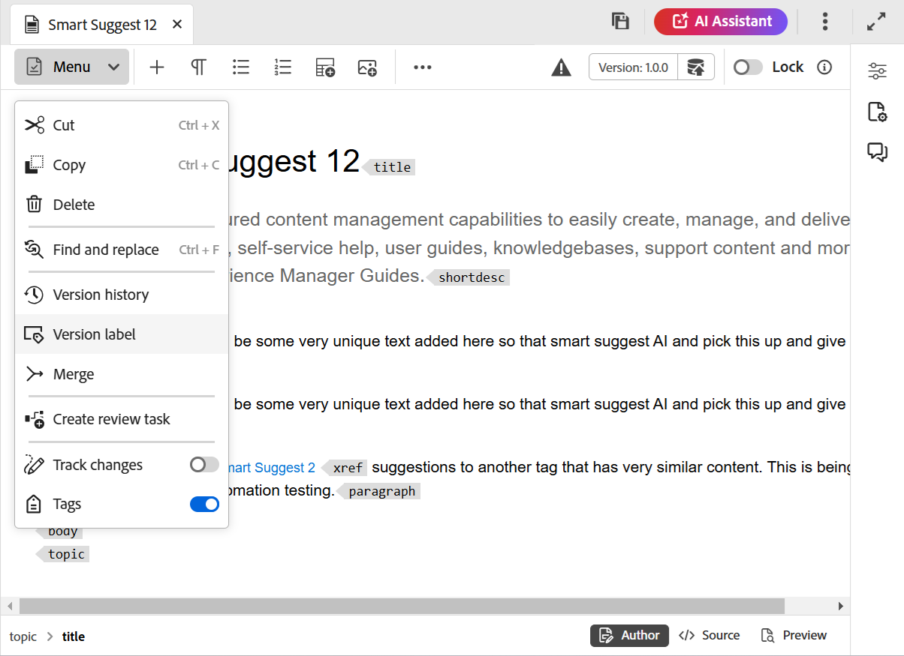
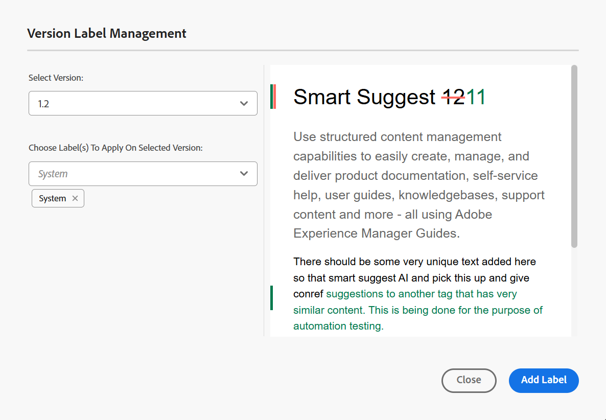
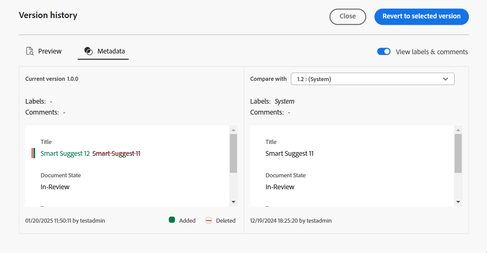
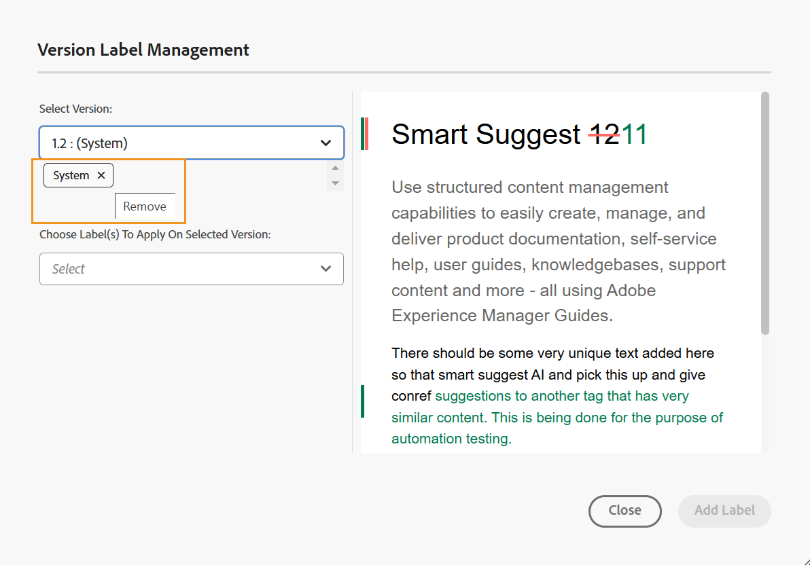

# 使用標籤 {#id164JBG0M0T1}

Adobe Experience Manager Guides可讓您將標籤新增至檔案的不同版本。 您可以使用這些標籤來指定要包含在基準線中以供發佈的版本。 如需使用標籤建立基準線的詳細資訊，請檢視[使用基準線](generate-output-use-baseline-for-publishing.md#)。

例如，如果您要在&#x200B;*版本2.0*&#x200B;中使用&#x200B;*版本1.0*&#x200B;中主題的&#x200B;*版本1.0*&#x200B;和&#x200B;*版本1.1*&#x200B;中的相同主題，您可以在&#x200B;*版本1.0*&#x200B;上新增&#x200B;*版本1.0*&#x200B;標籤，在&#x200B;*版本1.1*&#x200B;上新增&#x200B;*版本2.0*&#x200B;標籤。

新增標籤之後，您可以建立基準線，並指定使用該基準線發佈時應該包含的主題版本。 若要檢視基準線中應包含或排除的版本，您可以使用「版本記錄」選項。

## 從編輯器新增標籤

執行以下步驟，從編輯器將標籤新增至主題：

1. 在「存放庫」面板中，導覽至主題並在編輯器中開啟它。
1. 從&#x200B;**功能表**&#x200B;下拉式清單中選取&#x200B;**版本標籤**。

   {width="400" align="left"}

   顯示&#x200B;**版本標籤管理**&#x200B;對話方塊。

1. 在&#x200B;**版本標籤管理**&#x200B;對話方塊中，選取您要新增標籤的版本。
1. 選取選取版本的標籤，並選取&#x200B;**新增標籤**。

   {width="650" align="left"}

   >[!NOTE]
   >
   > 您無法將相同的標籤新增至主題的不同版本。 不過，您可以將多個標籤新增至主題的相同版本。
1. 確認以在確認提示中套用標籤。

   標籤會顯示在所選主題的「版本記錄」中。

   {width="650" align="left"}

   >[!NOTE]
   >
   > 您可以使用基準線將標籤新增至多個主題。 如需使用基準線新增標籤的詳細資訊，請檢視[新增標籤至基準線](generate-output-use-baseline-for-publishing.md#id184KD0T305Z)。

若要從主題中刪除版本標籤，請使用針對「版本標籤管理」對話方塊中新增的每個標籤提供的&#x200B;**移除**&#x200B;圖示。

{width="800" align="left"}

## 從Assets UI使用標籤

您也可以新增標籤至主題，並視需要從Assets UI中刪除標籤。

執行以下步驟，從Assets UI將標籤新增至主題：

1. 在Assets UI中，選取主題並開啟它。
1. 選取左側邊欄選擇器圖示，然後選取&#x200B;**版本記錄**。
1. 在「版本記錄」下拉式清單中，選取您要新增標籤的版本。
1. 輸入所選版本的標籤，然後按Enter鍵。 例如，*2.6版本*。

   >[!NOTE]
   >
   > 您無法將相同的標籤新增至主題的不同版本。 不過，您可以將多個標籤新增至主題的相同版本。

   標籤會顯示在所選主題的「版本記錄」中。 下列熒幕擷圖顯示已新增至主題反白版本中的標籤&#x200B;*x.x版本*&#x200B;和&#x200B;*使用手冊*。

   {width="300" align="left"}

>[!NOTE]
>
> 您可以使用基準線將標籤新增至多個主題。 如需使用基準線新增標籤的詳細資訊，請檢視[新增標籤至基準線](generate-output-use-baseline-for-publishing.md#id184KD0T305Z)。

若要從主題中刪除版本標籤，請使用「版本記錄」面板中針對每個標籤提供的&#x200B;**刪除**&#x200B;按鈕。

{width="300" align="left"}

**父級主題：**[&#x200B;編輯器簡介](web-editor.md)
