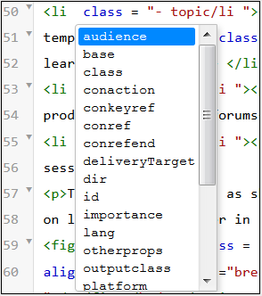
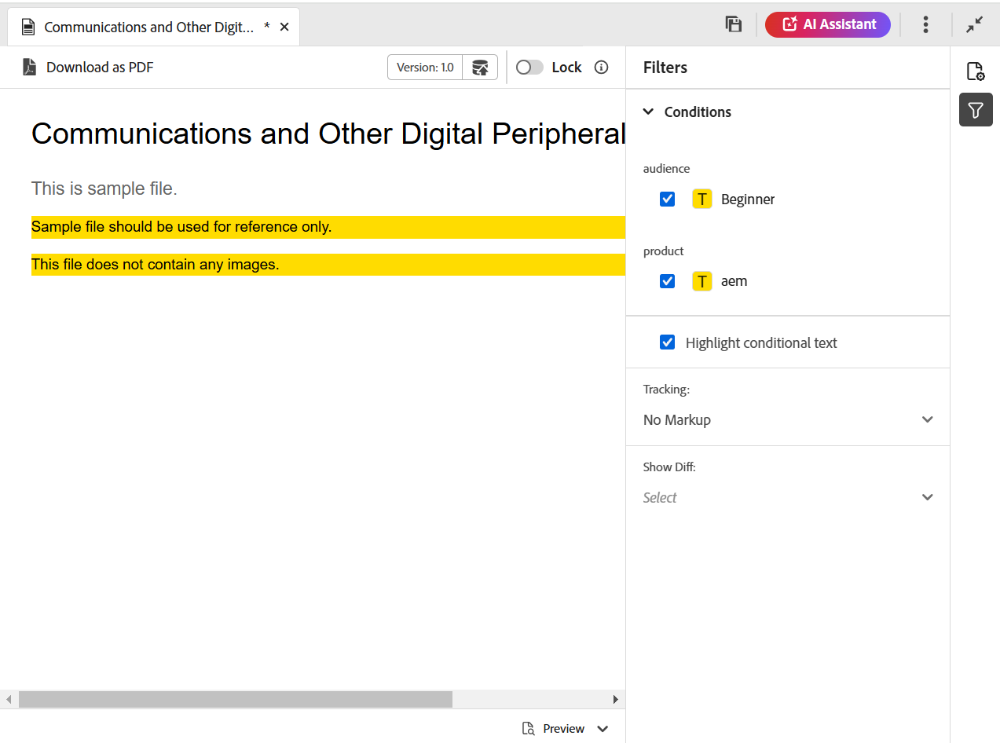
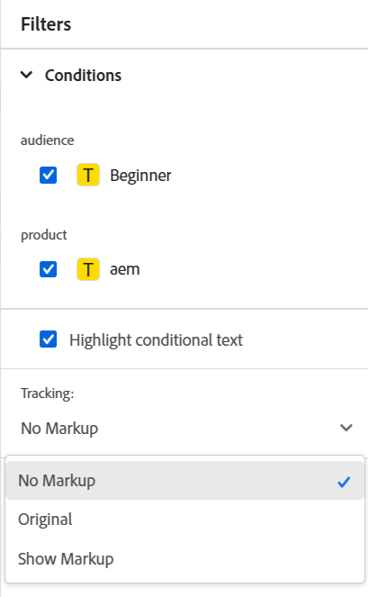
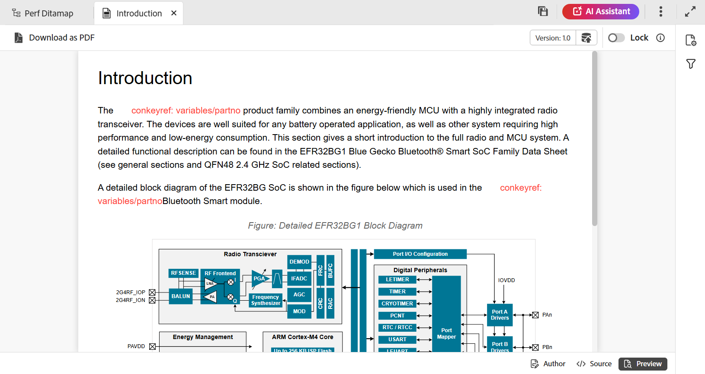

# 主題的編輯器檢視 {#id204GK0D0V5Z}

Adobe Experience Manager中的編輯器介面支援以三種不同的模式或檢視檢視檢視主題：

* [作者](#author)
* [來源](#source)
* [預覽](#preview)

## 作者

這是一般的&#x200B;**您所看到的內容，是您在編輯器中取得的** \(WYSISYG\)檢視。 您可以像在任何一般RTF編輯器中一樣編輯主題。 在「作者」檢視中，您可以選擇儲存檔案的修訂版本、尋找及取代內容、插入元素、插入超連結、插入內容參照等等。

>[!NOTE]
>
> 當您使用內容參照時，參照的內容也會以藍色顯示在「作者」檢視中。 引用的內容不可編輯。

## 來源

Source檢視會顯示組成主題的基礎XML。 如果您習慣直接使用XML，則應該使用Source檢視。 除了在此檢視中進行一般文字編輯外，您也可以使用「智慧型目錄」來新增元素和屬性，或尋找及取代文字、元素或屬性。

* 若要叫用智慧型錄，請將游標置於您要插入新元素的任何元素標籤結尾，然後輸入&quot;&lt;&quot;。 編輯器會顯示您可以在該位置插入的所有有效XML元素清單。 使用方向鍵選取要插入的元素，然後按Enter鍵。 當您輸入右括弧「\>時，將自動新增元素的右標籤。

  {width="400" align="left"}

* 您也可以從Source檢視輕鬆變更元素。 例如，如果您將`p`專案的開頭標籤變更為`note`，則結尾的`p`標籤會自動變更為`/note`。 如果您以不正確的元素取代元素，則會立即顯示驗證錯誤。

* 如果要將屬性加入元素，請將游標置於元素標籤內，然後按空格鍵。 該元素的有效屬性清單會顯示在「智慧目錄」中。 使用方向鍵選取所需元素，然後按一下Enter以插入元素。 若要指定屬性值，請輸入等號\(=\)，編輯器會自動輸入開頭和結尾的引號「」，您可以在其中指定屬性值。

  {width="350" align="left"}

* 在Source檢視中，有一個「自動縮排」選項，可讓您以可呈現和易於讀取的格式重新組織XML程式碼。 此外，如果您選取任何文字並從「作者」切換至Source，或從「Source」切換至「作者」檢視，則其他檢視中也會反白顯示選取的文字。
* Source檢視中的另一個強大功能是檔案中的XML驗證。 如果您開啟包含無效XML的檔案，則會在Source檢視中開啟包含無效XML相關資訊的檔案。 例如，在下列熒幕擷圖中，「剖析錯誤」快顯視窗會提供關於錯誤XML的確切資訊。

  {width="650" align="left"}

  在上述熒幕擷圖中，交叉反白顯示用於指出包含錯誤XML的行。

* 「尋找和取代」功能可讓您在Source檢視中搜尋任何文字、元素或屬性。
如需詳細資訊，請檢視[索引標籤列](web-editor-features.md#tab-bar)區段中的&#x200B;**尋找和取代**&#x200B;功能說明。

* Source檢視提供許多捷徑，幫助您快速導覽及處理檔案。 下表列出支援的動作及其快速鍵：

  | 操作步驟 | 使用此捷徑 |
  |----------|-----------------|
  | 新增多個游標 | **Ctrl**+按一下滑鼠左鍵 |
  | 多個非連續文字選取範圍 | **Ctrl**+按一下滑鼠左鍵以拖曳並選取文字 |
  | 選取跨越行與行之間的文字 | **Alt**+按一下滑鼠左鍵以拖曳並選取文字 |
  | 復原多個選取範圍或退出全熒幕模式 | **Esc** |
  | 顯示自動完成 | **Ctrl**+**空間** |
  | 移至目前標籤的開頭或結尾標籤 | **Ctrl**+**J** |
  | 展開或收合目前的標籤及其內容 | **Ctrl**+**Q** |
  | 選取目前元素及其內容 | **Ctrl**+**L** |
  | 將目前元素凸排 | **Shift**+**Tab** |
  | 刪除目前元素及其內容 | **Shift**+**Ctrl**+**K** |
  | 將游標向左移動一個單字 | **Alt**+**向左箭號** |
  | 將游標向右移動一個單字 | **Alt**+**向右箭號** |
  | 向上捲動一行而不變更游標位置 | **Ctrl**+**向上鍵** |
  | 向下捲動一行而不變更游標位置 | **Ctrl**+**向下箭號** |
  | 切換全熒幕 | **F11** |
  | 在目前元素後面插入新行 | **Ctrl**+**Enter** |
  | 在目前元素之前插入新行 | **Shift**+**Ctrl**+**Enter** |
  | 尋找並選取目前文字的下一個出現位置 | **Ctrl**+**D** |
  | 將目前元素及其內容向上移動一個元素 | **Shift**+**Ctrl**+**向上箭號** |
  | 將目前的元素及其內容向下移動一個元素 | **Shift**+**Ctrl**+**向下箭號** |
  | 在註解標籤中繞排目前的元素 | **Ctrl**+**/** |
  | 複製目前元素及其內容 | **Shift**+**Ctrl**+**D** |
  | 刪除游標後面的文字。 如果游標在開啟的元素之前，則會刪除整個元素。 | **Ctrl**+**K**+**K** |
  | 刪除目前行中游標左側的文字。 如果游標位在元素的結束標籤之後，則會刪除整個元素。 | **Ctrl**+**K**+**退格鍵** |
  | 將目前的文字轉換為大寫 | **Ctrl**+**K**+**U** |
  | 將目前的文字轉換為小寫 | **Ctrl**+**K**+**L** |
  | 將目前元素捲動到編輯器的中央 | **Ctrl**+**K**+**C** |
  | 在目前位置上方新增游標 | **Ctrl**+**Alt**+**向上箭號** |
  | 在目前位置下方新增游標 | **Ctrl**+**Alt**+**向下箭號** |
  | 遞回尋找目前單字\（往前方向\） | **Ctrl**+**F3** |
  | 遞回尋找目前字詞\（在向後方向\） | **Shift**+**Ctrl**+**F3** |

## 預覽

在預覽模式中開啟主題會顯示當使用者在瀏覽器中檢視主題時，主題的顯示方式。 在DITA map中，會顯示對映的預覽，其中顯示對映中所有主題的單一複合檔案。

「預覽」模式提供下列功能：

* [根據條件篩選器檢視內容](#id2114BI00VXA)
* [檢視追蹤變更標示](#id2114BJ00CE8)
* [將主題匯出為PDF](#id2114BL00B5U)

### 根據條件篩選器檢視內容 {#id2114BI00VXA}

如果您在主題或地圖中使用了條件，這些條件會顯示在「篩選器」面板中。 依預設，會選取所有條件並顯示整個內容。 如果您取消選取條件，則具有該條件的內容會從檢視中移除。 您也可以選擇反白條件式內容。

下圖顯示使用兩個條件的主題 — `Audience`和`Product`。 條件化內容會以黃色背景反白。

{align="left"}

### 檢視追蹤變更標示 {#id2114BJ00CE8}

如果檔案包含追蹤變更標示\（或視覺提示\），則您也可以預覽包含或不包含這些標示的檔案。 預覽檔案時，右側面板會包含「篩選器」和「追蹤」選項。

{width="400" align="left"}

有三個&#x200B;**追蹤**&#x200B;選項可供您選擇：

* **沒有標籤**：在此檢視中，接受所有插入和刪除，並顯示檔案的簡單檢視。 在此檢視中，您不會檢視任何追蹤變更標示。
* **原始**：在此檢視中，會拒絕所有插入並還原所有刪除，然後顯示預覽。 在啟用追蹤變更模式之前，您只需要取得檔案的原始表單。
* **顯示標籤**：在此檢視中，您會取得插入和刪除內容的所有標籤。

  下圖顯示含有標示的對應檔案預覽：

  {width="300" align="left"}

### 將主題匯出為PDF {#id2114BL00B5U}

PDF是在檔案開發週期的每個可能階段中最常用的輸出格式之一。 Experience Manager Guides可讓您靈活地產生個別主題或整個地圖檔案的PDF。 匯出為PDF功能可讓作者、發佈者或管理員輕鬆產生個別主題的PDF輸出。 它會使用儲存在資料夾層級設定檔中的DITA-OT設定來產生PDF。

此功能支援下列功能：

* 產生主題目前作用中工作復本的PDF。
* 接受DITA-OT轉換名稱和命令列引數來產生PDF。
* 將產生的輸出儲存在本機系統上。
* 產生輸出之前，請先解析主題中使用的索引鍵和內容參照。

若要將主題匯出為PDF，請執行下列步驟：

1. 在預覽模式中開啟主題。 確定主題是對應檔案的一部分。

1. 從頂端選取「**下載為PDF**」選項。

   圖示。

   >[!NOTE]
   >
   > 確認已在瀏覽器設定中啟用快顯視窗，否則將不會下載PDF。

   PDF會在新標籤中產生並開啟，或是您看到一個對話方塊以在您的本機系統上儲存PDF。

**父級主題：**&#x200B;[&#x200B;編輯器簡介](web-editor.md)
