# Workfront整合

Adobe Workfront是雲端型工作管理解決方案，可協助團隊和組織有效規劃、追蹤及管理其工作。 Experience Manager Guides與Adobe Workfront的整合可讓您在Experience Manager Guides核心CCMS功能之上存取強大的專案管理功能，讓您有效率地規劃、分配和追蹤工作。

透過這項整合，您可以直接從Experience Manager Guides建立和管理Adobe Workfront工作。 例如，身為作者，您可以直接在Experience Manager Guides介面中建立稽核任務（新增一或多個DITA主題或地圖），並將其指派給稽核者。 作為稽核者，您可以在Experience Manager Guides稽核UI中處理指派的任務，並將它們帶回給具有註釋的作者。 同樣地，您可以建立發佈和翻譯任務，然後將其指派給需要在其上工作的使用者。

整合也可讓您監視工作佇列，確保您保持井然有序，掌控所有工作（指派的工作）。

**主要功能**

透過Experience Manager Guides和Adobe Workfront整合，您可以：

* 計畫、分配和追蹤個別任務和專案的進度，而不需依賴多個非整合工具。
* 更有效率地管理所有Experience Manager Guides工作流程，包括撰寫、檢閱、發佈和翻譯內容。
* 每當指派新任務時，接收來自Adobe Workfront的電子郵件通知。 如需詳細資訊，請檢視[通知總覽](https://experienceleague.adobe.com/en/docs/workfront/using/basics/use-notifications/wf-notifications)。
* 使用Adobe Workfront的直覺式儀表板監控專案狀況，提供專案績效的即時深入分析。

  若要瞭解為Experience Manager Guides中的專案經理啟用的Adobe Workfront強大專案管理功能，請檢視[計畫專案概述](https://experienceleague.adobe.com/en/docs/workfront/using/manage-work/projects/plan-a-project/plan-project)。

## 開始

管理員設定並啟用Adobe Workfront後，您就可以從[Experience Manager Guides首頁](./intro-home-page.md)存取工作。

執行以下步驟來存取您的Adobe Workfront工作：

1. 登入Experience Manager Guides並開啟&#x200B;**首頁**。
2. 在左側面板中，選取&#x200B;**Workfront**。

   顯示&#x200B;**Workfront工作**&#x200B;頁面。

   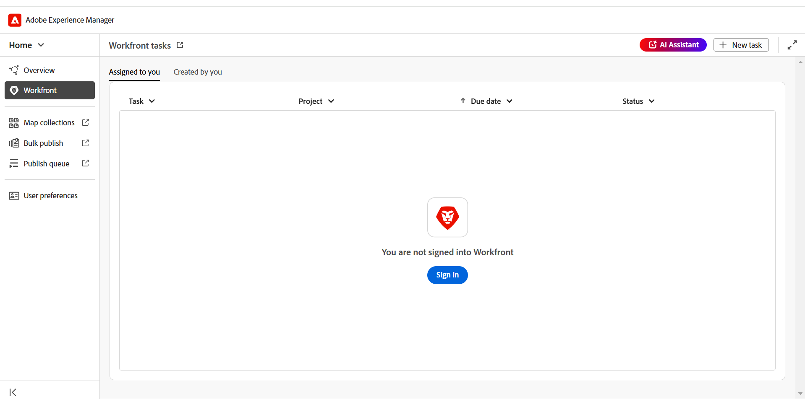{align="left"}
3. 選取&#x200B;**登入**。

   系統會將您重新導向至Adobe Workfront登入頁面。
4. 使用Experience Manager Guides中使用的相同電子郵件地址登入，然後選取[允許存取]，讓應用程式存取您的Adobe Workfront帳戶。****

   系統會自動將您重新導向至Experience Manager Guides上的&#x200B;**Workfront工作**&#x200B;頁面。

   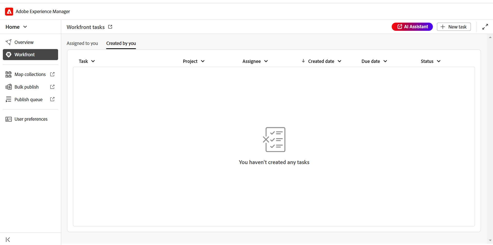{align="left"}

## Workfront工作頁面上的可用功能

Workfront工作頁面提供下列功能：

* [新任務](#create-workfront-tasks)：可讓您直接從Adobe Workfront介面建立Experience Manager Guides任務。
* [指派給您](#managing-tasks-assigned-to-you)：列出指派給您且仍在使用中的所有工作。
* [由您建立](#managing-tasks-created-by-you)：列出您已建立且仍在使用中的所有工作。

Workfront任務頁面也包含連結輸出圖示，選取此選項時會帶您前往Adobe Workfront專案頁面。 在這裡，您可以根據與您的Adobe Workfront帳戶對應的許可權，檢視任務詳細資訊、檢視註釋、新增註釋及存取其他功能。

如需更多詳細資料，請檢視[Workfront中專案、任務和問題日期的概觀](https://experienceleague.adobe.com/en/docs/workfront/using/basics/navigate/definitions-pti-dates)。

### 建立Workfront任務

您可以使用Adobe Workfront工作頁面上出現的&#x200B;**新增工作**&#x200B;按鈕，直接從Experience Manager Guides介面建立Workfront工作。

執行以下步驟來建立新的Adobe Workfront工作：

1. 在Workfront工作頁面上，選取&#x200B;**新增工作**。

   顯示&#x200B;**建立工作**&#x200B;對話方塊。

   {align="left"}
2. 在&#x200B;**一般**&#x200B;標籤中，輸入下列工作詳細資料：

   * **任務型別**：選取您要建立的任務型別。 可用的選項包括：**製作**、**檢閱**、**發佈**&#x200B;以及&#x200B;**翻譯**。
   * **專案**：選取您要建立任務的專案。
   * **工作名稱**：輸入工作的描述性名稱。
   * **描述**：輸入工作的簡短描述。
   * **到期日**：設定任務完成的到期日。
   * **受指派人**：選取工作的受指派人。
3. 在&#x200B;**Assets**&#x200B;索引標籤中，選取&#x200B;**新增**&#x200B;以將資產新增至此工作。

   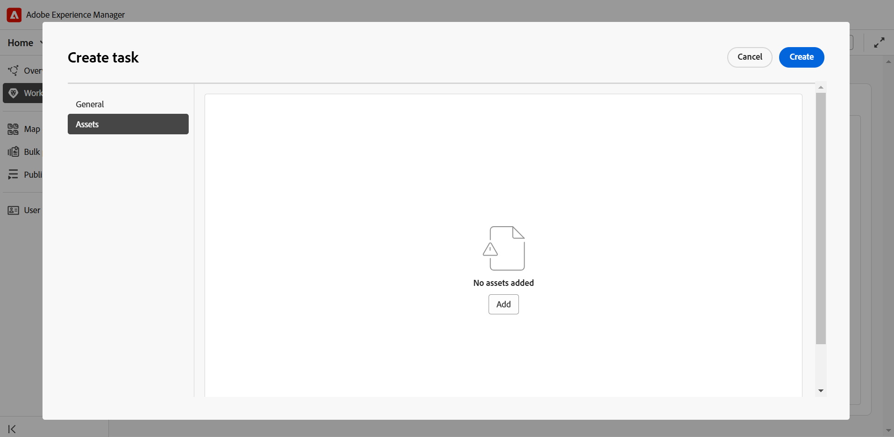{align="left"}

   顯示&#x200B;**選取路徑**&#x200B;對話方塊。 選取所需資產的路徑。 您可以在路徑瀏覽器中選取有效路徑，以新增多個資產。 您選取的路徑將會保留，讓您在重新開啟對話方塊時可輕鬆檢閱或修改它們。

   * 對於製作、發佈和翻譯工作，系統會提示您在&#x200B;**選取路徑**&#x200B;對話方塊中選取所需檔案的位置。 選取&#x200B;**建立**&#x200B;按鈕後，選取的檔案（用於編寫的主題，以及發佈和翻譯的對應）會立即新增到任務中。

     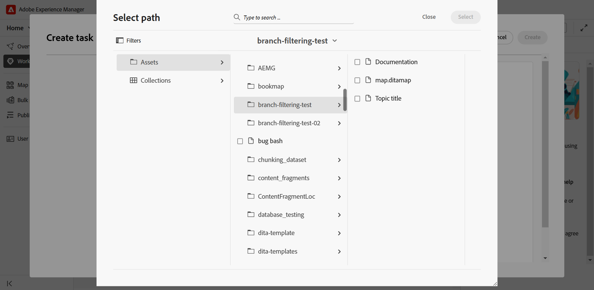{align="left"}

   * 對於稽核任務，首先提示您選取資產型別（地圖或主題），然後選取的檔案顯示如下：

     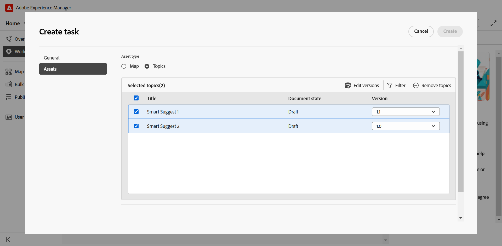{align="left"}

     *新增主題至稽核任務*

     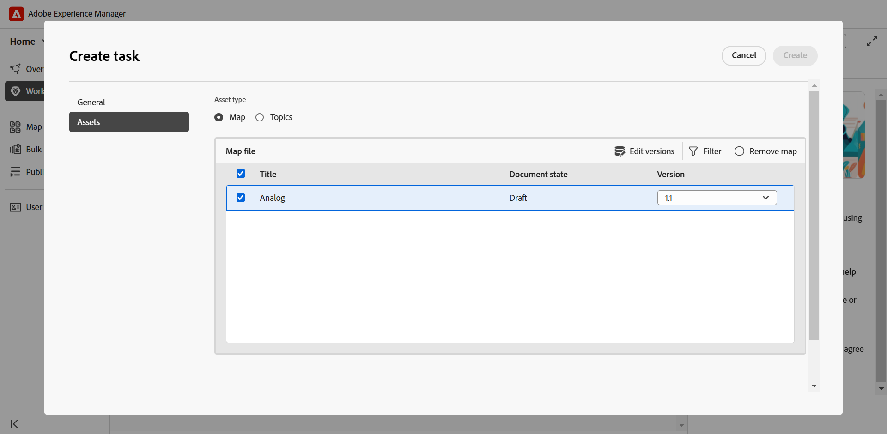{align="left"}

     *正在新增地圖至稽核任務*

     下列動作可在傳送供檢閱前修改您的選擇：

      * 從清單中取消選取一些主題。
      * 根據檔案狀態篩選主題清單。
      * 視需要編輯或設定所選主題的版本為&#x200B;**最新版本**、**以日期為基準的版本**&#x200B;和&#x200B;**基準** （僅適用於地圖）。

     如需詳細資訊，請檢視[傳送檢閱主題](./review-send-topics-for-review.md)。

   >[!NOTE]
   >
   > 將資產新增至任務可讓受分派者快速存取主題、地圖或他們需要處理的任何其他檔案。 對於編寫、發佈和翻譯任務，新增資產是選用專案，但有助於簡化工作流程。 但是，對於稽核任務，必須新增資產。

4. 選取「**建立**」。

新任務已建立並列在&#x200B;**由您建立**&#x200B;標籤下。

>[!NOTE]
>
> 身為專案經理，您可以在Adobe Workfront控制面板中檢視此新建立的任務以及其他關鍵任務詳細資訊。 如需詳細資訊，請檢視[瞭解儀表板](https://experienceleague.adobe.com/en/docs/workfront/using/reporting/dashboards/understand-dashboards/understand-dashboards)。

### 管理您建立的任務

您已建立且仍在使用中的任務會顯示在Workfront任務頁面上的&#x200B;**由您建立**&#x200B;標籤中，為您提供關鍵任務詳細資訊，例如專案名稱、受指派人、任務建立日期、任務完成日期和任務狀態。

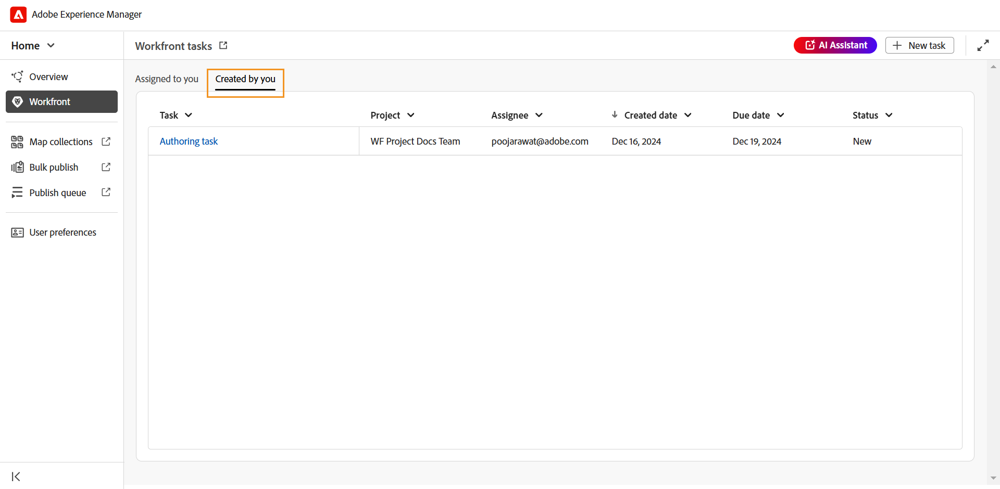{align="left"}

當您將游標停留在「由您建立」標籤中存在的任務上時，可以使用以下選項：

**開啟** - 

可讓您開啟工作。 根據任務型別，它將在編輯器、地圖控制檯或稽核UI中開啟。

**編輯** - 

可讓您編輯建立任務時新增的任務詳細資訊。 除「任務型別」和「專案」外，所有欄位都可以編輯。 您只能編輯您建立的任務。 指派的任務無法編輯。

您也可以在編輯編寫、發佈或翻譯任務時新增或移除資產。 不過，對於稽核任務，您只能變更已傳送供稽核的資產版本。

**任務詳細資料** - 

顯示任務資訊，包括在任務建立期間輸入的詳細資訊、任務狀態以及任何新增的資產。

### 管理指派給您的任務

所有指派給您且仍在作用中的任務都會顯示在Workfront任務頁面上的&#x200B;**指派給您**&#x200B;標籤中，為您提供關鍵任務詳細資訊，例如專案名稱、受指派人、到期日和任務狀態。

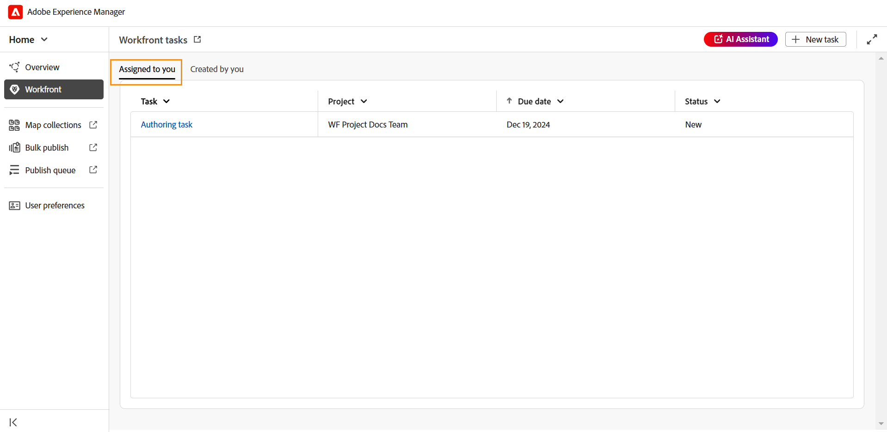{align="left"}

當您將游標停留在「指派給您」標籤中存在的任務上時，可以使用以下選項：

**開啟** - 

可讓您開啟工作。 根據任務型別，它將在編輯器、地圖控制檯或稽核UI中開啟。

**任務詳細資料** - 

顯示任務資訊，包括在任務建立期間輸入的詳細資訊、任務狀態以及任何新增的資產。

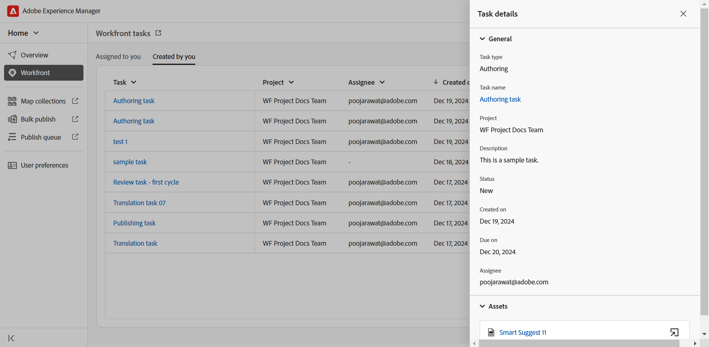{align="left"}

#### 從總覽區段存取指派的任務

您也可以從[總覽區段](./intro-home-page.md#overview)存取指派的Adobe Workfront工作。 概觀區段在選取時會顯示不同的Widget，協助您保持專注和有條不紊的狀態。

**您的任務**&#x200B;是這樣的小工具，其中會顯示Adobe Workfront任務（已指派給您且仍在作用中）的清單以及關鍵任務詳細資訊，包括任務名稱、相關專案、到期日和目前狀態。

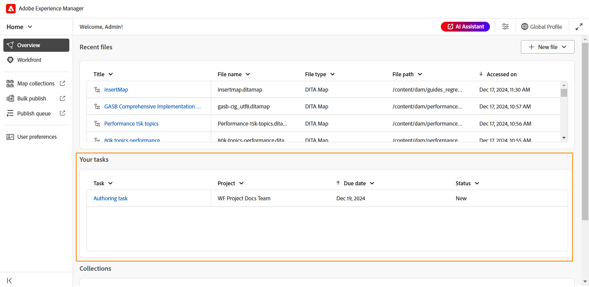{align="left"}

與「指派給您」標籤類似，「您的任務」Widget也提供選項，讓您在任務上暫留時，**開啟**&#x200B;並檢視&#x200B;**任務詳細資料**。

此Widget也提供選項，讓您為自訂檢視排序欄和調整欄大小。 若要將排序套用至欄，請選取欄標題，選項將顯示在清單中。 若要調整欄寬，請將滑鼠停留在標頭中的欄分隔線上，然後拖曳以調整大小。

>[!NOTE]
>
> 當您離開Experience Manager Guides介面時，您會收到來自Adobe Workfront的電子郵件通知，告知您所有新指派的任務。 若要簽出這些任務，請登入您的Experience Manager Guides執行個體並存取指派的任務。

## 使用Adobe Workfront指派的任務

有四種型別的Adobe Workfront工作可供您建立，然後指派或在Experience Manager Guides上處理：

1. [製作任務](#authoring-tasks)
2. [稽核任務](#review-tasks)
3. [翻譯任務](#translation-tasks)
4. [發佈任務](#publishing-tasks)

以下幾節將逐步引導您完成指派的Adobe Workfront任務的詳細工作流程。

### 製作任務

執行下列步驟以處理編寫工作：

1. 從[總覽](#accessing-assigned-tasks-from-overview-section)區段或是[指派給您](#managing-tasks-assigned-to-you)索引標籤存取任務。

   ![在[指派給您]索引標籤中編寫任務](./images/authoring-task-access.png){align="left"}

   *在[指派給您]索引標籤中編寫任務*

   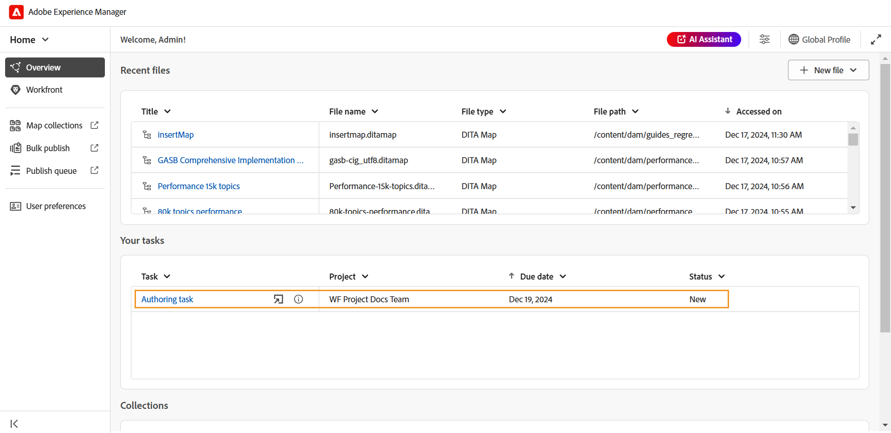{align="left"}

   *在您的工作Widget中編寫工作*
2. 將滑鼠停留在您要處理的任務上，然後選取    以開啟它。 您也可以只要選取工作來開啟工作。

   所有編寫工作都會在編輯器中開啟。
3. 檢閱&#x200B;**詳細資料**&#x200B;索引標籤中的工作詳細資料，並選取&#x200B;**資產**&#x200B;檔案以開啟它。

   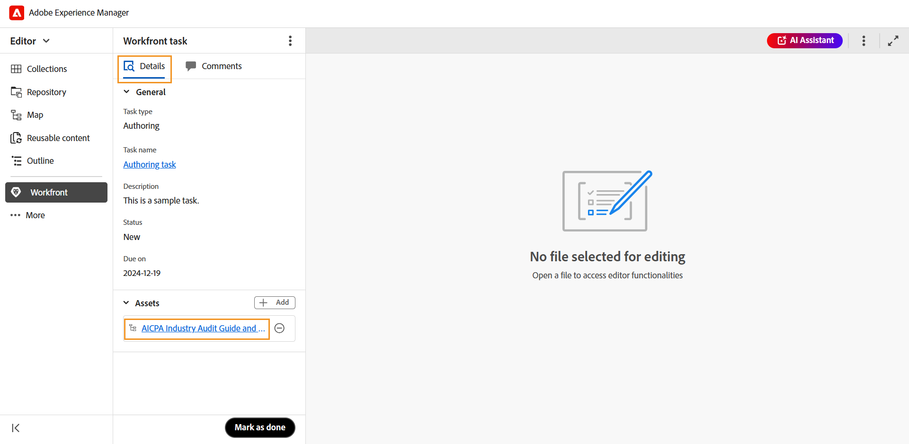{align="left"}

4. 進行必要的編輯並選取&#x200B;**標籤為完成**。
5. 切換至&#x200B;**註解**&#x200B;索引標籤以新增註解至此工作。 這些在工作層級新增的註解也會反映在Adobe Workfront專案控制面板上。

   >[!NOTE]
   >
   > 一旦將工作標示為完成，就會從您的指派工作清單及工作啟動器的&#x200B;**由您建立**&#x200B;工作清單中移除工作。

### 稽核任務

身為稽核者，您可以稽核指派給您的Adobe Workfront稽核任務。

執行以下步驟，處理指派給您的稽核任務。

1. 從[總覽](#accessing-assigned-tasks-from-overview-section)區段或是[指派給您](#managing-tasks-assigned-to-you)索引標籤存取任務。

   ![檢閱[指派給您]索引標籤中的任務](./images/review-task-access.png){align="left"}

   *檢閱指派給您的索引標籤中的任務*

   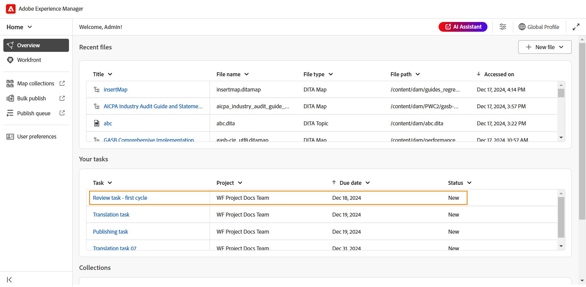{align="left"}

   *在您的工作Widget中編寫工作*
2. 將滑鼠停留在您要處理的任務上，然後選取    以開啟它。 您也可以只要選取工作來開啟工作。

   對於稽核者，稽核任務會在&#x200B;**稽核UI**&#x200B;中開啟。

   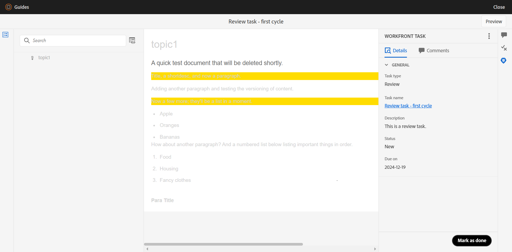{align="left"}

3. 執行所需的稽核。 如需如何檢閱主題的詳細資訊，請檢視[檢閱主題](./review-topics.md)。
4. 檢閱完成後，請選取&#x200B;**標籤為完成**。
5. 切換至&#x200B;**註解**&#x200B;索引標籤以新增註解至此工作。 這些在工作層級新增的註解也會反映在Adobe Workfront專案控制面板上。

將任務標籤為由稽核者完成並不表示任務已完成。 所有稽核任務都會指派回建立任務的使用者（最好是請求稽核的作者）。

>[!NOTE]
>
> 如果將任務指派給多個稽核者，則只有在所有稽核者將其標籤為完成之後，才會將其重新指派給任務建立者。

重新指派給建立者/作者以供稽核整合的稽核任務，可從[概觀](#accessing-assigned-tasks-from-overview-section)區段或從[指派給您的標籤](#managing-tasks-assigned-to-you)存取。

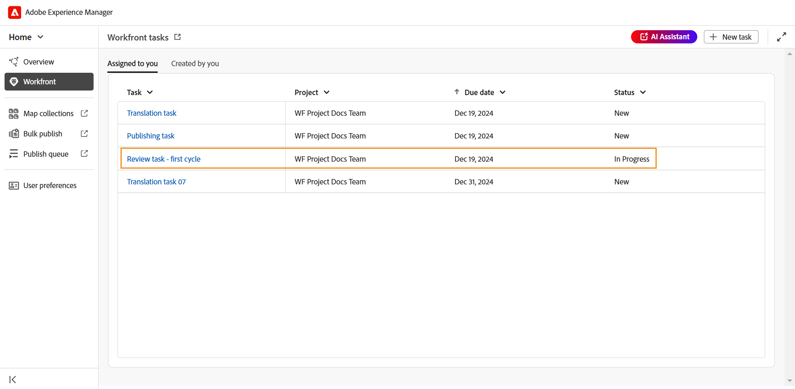{align="left"}

*檢閱指派回給作者的任務*

對於這類工作，受指派人的工作狀態會變更為&#x200B;**製作**，而工作型別仍為&#x200B;**檢閱**。 當所有稽核者完成稽核時，就會發生此狀態變更。

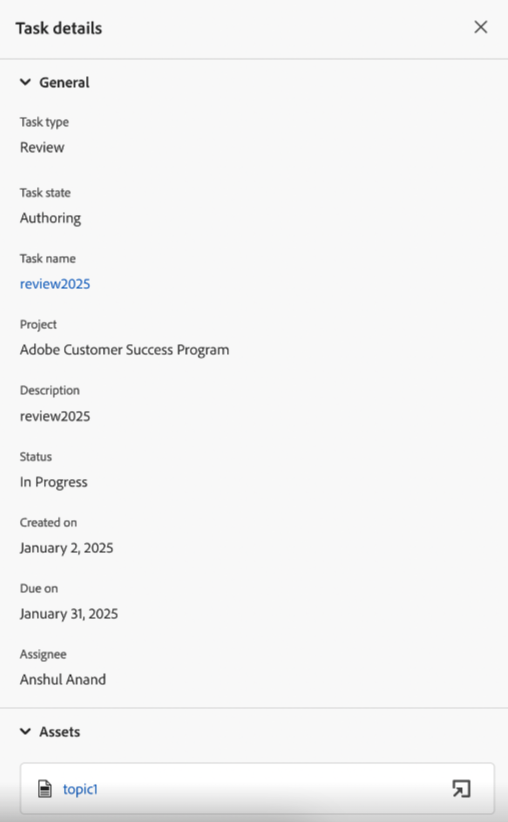{align="left"}

選取任務或開啟圖示會在編輯器中開啟任務，作者可在編輯器中[處理稽核評論](../user-guide/review-address-review-comments.md)、更新主題版本以編輯任務，然後視需要重新指派任務給稽核者。

作者也可以編輯任務並將其指派給其他作者，以委派合併註釋的任務。 若要這麼做，請選取&#x200B;**編輯**，將工作狀態變更為&#x200B;**製作**，然後選取&#x200B;**變更受指派人**。 您現在可以從清單中選取受託人。

此程式會形成一個連續的週期，在此週期中，任務會在作者和稽核者之間來回移動，直到完全完成為止。 納入所有建議的變更後，作者可以選取&#x200B;**標示為完成**&#x200B;來完成工作。

### 翻譯任務

您可以對指派給您的Adobe Workfront翻譯任務執行各種翻譯動作。

執行以下步驟以處理翻譯任務：

1. 從[總覽](#accessing-assigned-tasks-from-overview-section)區段或是[指派給您](#managing-tasks-assigned-to-you)索引標籤存取任務。

   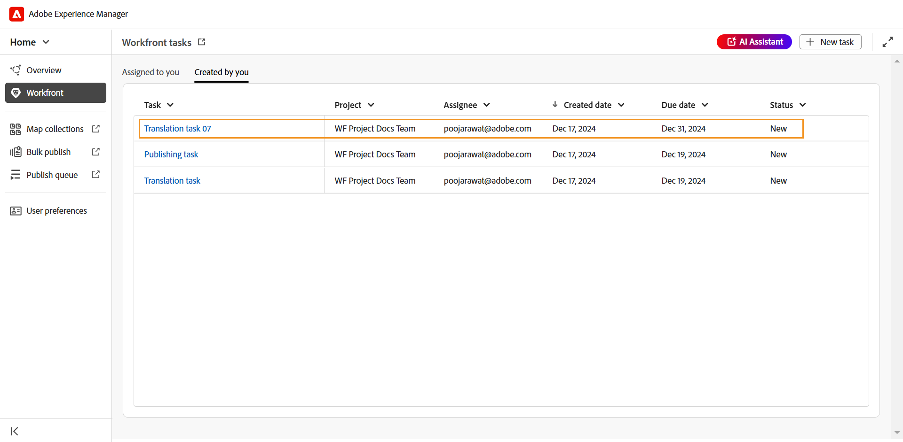{align="left"}

   *指派給您的索引標籤中的翻譯任務*

   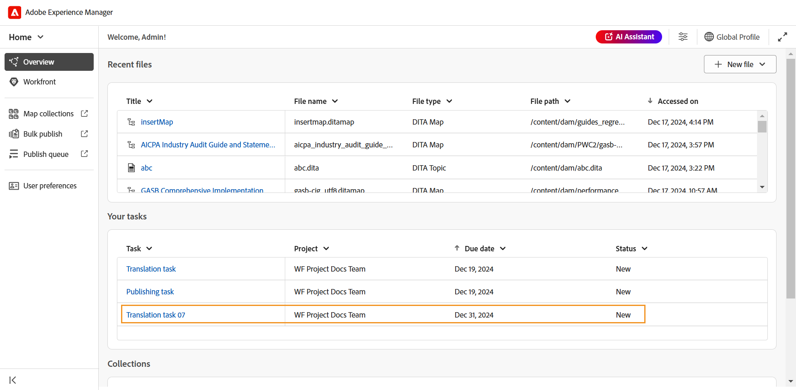{align="left"}中的翻譯工作

   *您的任務Widget*&#x200B;中的翻譯任務

2. 將滑鼠停留在您要處理的任務上，然後選取    以在&#x200B;**地圖主控台**&#x200B;中開啟。 您也可以只要選取工作來開啟工作。
3. 檢閱任務詳細資料和新增的檔案以進行翻譯。

   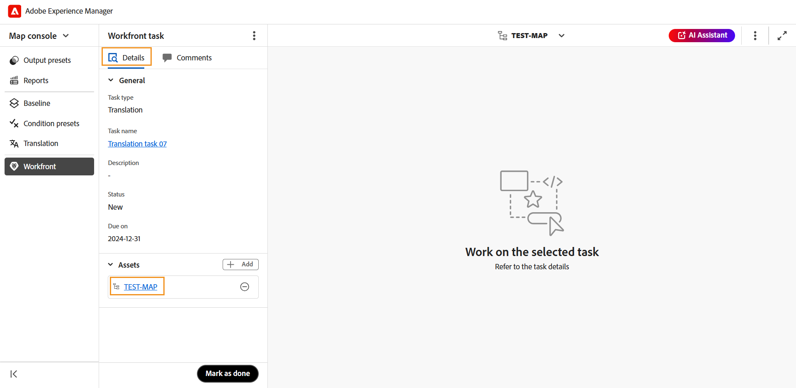{align="left"}
4. 瀏覽至&#x200B;**翻譯**&#x200B;索引標籤以取得各種翻譯選項。 瞭解如何在Experience Manager Guides中[翻譯內容](../user-guide/translation.md)。
5. 執行必要的翻譯，並選取&#x200B;**傳送以進行翻譯**。
   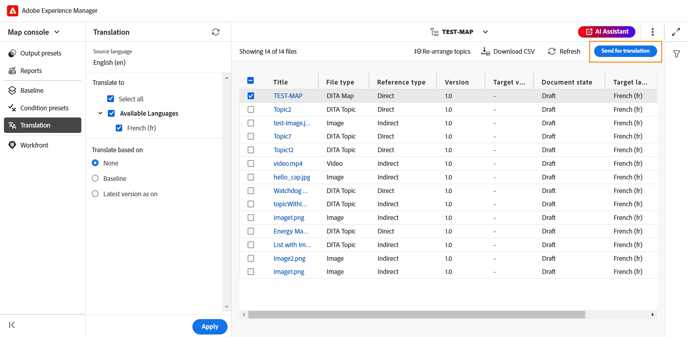{align="left"}
6. 導覽至「**Workfront**」區段，然後選取「**標示為完成**」以指出工作已完成。
7. 切換至&#x200B;**註解**&#x200B;索引標籤以新增註解至此工作。 這些在工作層級新增的註解將會反映在Adobe Workfront專案控制面板上。

   >[!NOTE]
   >
   > 一旦將工作標示為完成，就會從您的指派工作清單及工作啟動器的&#x200B;**由您建立**&#x200B;工作清單中移除工作。

### 發佈任務

身為發佈者，您可以檢視詳細資料並發佈指派給您的發佈工作。

執行以下步驟以處理發佈任務：

1. 從[總覽](#accessing-assigned-tasks-from-overview-section)區段或是[指派給您](#managing-tasks-assigned-to-you)索引標籤存取任務。

   ![發佈[指派給您]索引標籤中的任務](./images/publishing-tasks-access.png){align="left"}

   *在[指派給您]索引標籤中發佈任務*

   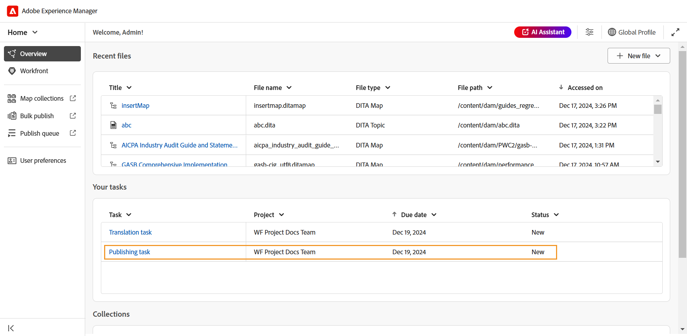{align="left"}

   *在您的工作Widget中發佈工作*
2. 將滑鼠停留在您要處理的任務上，然後選取    以在&#x200B;**地圖主控台**&#x200B;中開啟。 您也可以只要選取工作來開啟工作。
3. 檢閱任務詳細資訊和新增以供發佈的檔案。

   {align="left"}
4. 導覽至&#x200B;**輸出預設集**&#x200B;並執行發佈工作所需的發佈動作。 如需更多詳細資料，請檢視[瞭解輸出預設集](../user-guide/generate-output-understand-presets.md/)。
5. 發佈完成後，請導覽至&#x200B;**Workfront**&#x200B;區段並選取&#x200B;**標示為完成**&#x200B;以指出工作已完成。
6. 切換至&#x200B;**註解**&#x200B;索引標籤以新增註解至此工作。 這些在工作層級新增的註解將會反映在Workfront的專案控制面板上。

   >[!NOTE]
   >
   > 一旦將工作標示為完成，就會從您的指派工作清單及工作啟動器的&#x200B;**由您建立**&#x200B;工作清單中移除工作。
