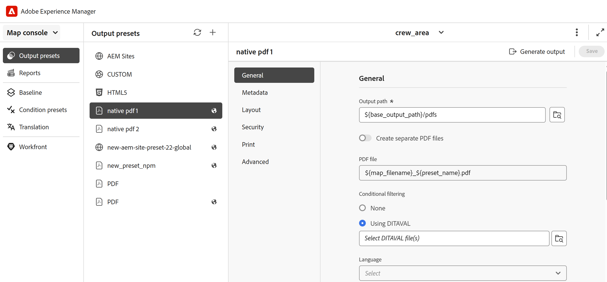
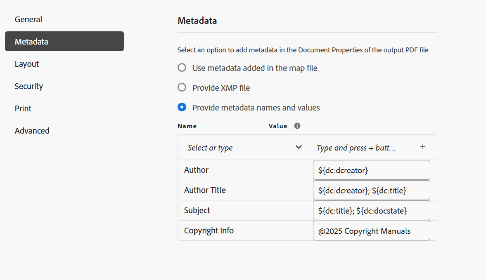

# 原生PDF輸出預設集

製作內容時，務必確保內容已針對檢視、編輯和列印進行最佳化。 使用諸如W3C CSS3等標準設定內容樣式，以及使用CSS分頁媒體標準設定頁面定義屬性（例如大小、邊界、方向、分頁符號、頁首、頁尾和頁碼），您可以設定PDF檔案的檢視與版面配置，確保一致性和可用性。 原生PDF發佈功能會使用這些標準來產生PDF。

透過原生PDF發佈，您可以使用預先定義的範本來確保內容版面與結構的一致性、套用樣式表以改變輸出的外觀、最佳化PDF、設定印表機標籤、允許熒幕助讀程式支援、設定PDF一致性、內嵌字型等等。

使用原生PDF發佈功能產生PDF有兩個方面：

* 使用範本將樣式套用至內容、設定頁面配置和各種設定，以微調PDF。 作者可以選擇使用/修改提供的範例範本，或建立自訂範本，並設定發佈者和開發人員使用的進階設定選項。

* 建立或設定PDF輸出預設集，以控制PDF設定。 建立PDF輸出預設集後，即可產生PDF。

## 建立輸出預設集

執行以下步驟，從「地圖」主控台建立PDF預設集：

1. [在Map主控台](../user-guide/open-files-map-console.md)中開啟DITA map檔案。

   您也可以從&#x200B;**概觀區段**&#x200B;中的[最近使用的檔案](../user-guide/intro-home-page.md#overview) Widget存取對應檔案。 選取的對映檔案將會在地圖主控台中開啟。
1. 在&#x200B;**輸出預設集**&#x200B;索引標籤中，選取+圖示以建立輸出預設集。
1. 從&#x200B;**新增輸出預設集**&#x200B;對話方塊的「型別」下拉式清單中選取&#x200B;**PDF**。
1. 在&#x200B;**名稱**&#x200B;欄位中，提供此預設集的名稱。
1. 在&#x200B;**使用**&#x200B;產生PDF欄位中，選取&#x200B;**Native-PDF**。
1. 選取&#x200B;**新增至目前的資料夾設定檔**&#x200B;選項，以在目前的資料夾設定檔中建立輸出預設集。 表示資料夾設定檔層級的預設集。

   深入瞭解[管理全域和資料夾設定檔輸出預設集](../user-guide/web-editor-manage-output-presets.md)。

1. 選取「**新增**」。

   隨即建立PDF的預設集。

## 原生PDF預設集設定

建立預設集後，請設定原生PDF預設集設定。 DITA-OT的預設集組態選項組織在&#x200B;**一般**、**中繼資料**、**配置**、**安全性**、**列印**&#x200B;和&#x200B;**進階**&#x200B;索引標籤下。

**一般**

用於指定基本輸出設定，例如指定輸出路徑、PDF檔案名稱等。

| 設定 | 說明 |
| --- | --- |
| **輸出路徑** | AEM存放庫內儲存PDF輸出的路徑。 確定輸出路徑不在專案資料夾內。 透過管理員設定的變數`${base_output_path}`設定輸出路徑。 若要設定輸出路徑，請檢視[設定雲端服務的基底輸出位置](../native-pdf/configure-base-location-cs.md)或[根據您使用的服務設定內部部署服務的基底輸出位置](../native-pdf/configure-base-output-location.md)。  您也可以使用下列現成的變數來定義輸出路徑。 您可以使用單一變數或變陣列合來定義此選項。  `${map_filename}`：使用DITA map檔案名稱來建立目的地路徑。  `${map_title}`：使用DITA map標題來建立目的地路徑。  `${preset_name}`：使用輸出預設集名稱來建立目的地路徑。  `${language_code}`：使用對應檔案所在的語言代碼來建立目的地路徑。  `${map_parentpath}`：使用對應檔案的完整路徑來建立目的地路徑。   `${path_after_langfolder}`：使用語言資料夾之後的對應檔路徑來建立目的地路徑。 |
| **PDF檔案** | 指定要儲存PDF的檔案名稱。 依預設，PDF檔案名稱會新增DITA map名稱以及預設集名稱。 例如，ditamap是「TestMap」，而預設集的名稱是「preset1」，則pdf的預設名稱將是「TestMap_preset1.pdf」。  您也可以使用下列現成可用的變數來定義PDF檔案。 您可以使用單一變數或變陣列合來定義此選項。 `${map_filename}` `${map_title}` `${preset_name}`   `${language_code}`。 |
| **套用條件使用** | 針對條件式內容，請從下列選項中選擇，以根據這些條件產生PDF輸出：  <ul> <li> **未套用**&#x200B;如果您不想在地圖和來源內容上套用任何條件，請選取此選項。 <li> **DITAVAL檔案**&#x200B;選取DITAVAL檔案以產生條件式內容。 您可以使用瀏覽對話方塊或手動輸入檔案路徑來選取多個DITAVAL檔案。 若要移除選取的檔案，請按一下檔案名稱旁的十字圖示。 如果選取了無效的檔案，則會顯示錯誤訊息，指出&#x200B;**選取了無效的DITAVAL檔案**。   每個DITAVAL檔案都可以包含一系列屬性，例如篩選條件和標幟樣式。 標幟可讓您使用開始和結束標幟以視覺化方式標示內容，這些標幟可包括影像或文字格式，例如粗體或斜體。 如果發生重疊條件或樣式衝突，您可以使用「樣式衝突」設定來定義背景顏色。 如需詳細資訊，請檢視[使用DITAVAL編輯器](../user-guide/ditaval-editor.md)。 <li> **條件預設集**&#x200B;從下拉式清單中選取條件預設集，以在發佈輸出時套用條件。 如果您已為DITA map檔案新增條件，則會顯示此選項。 條件設定可在DITA map主控台的「條件預設集」標籤中使用。 若要進一步瞭解條件預設集，請檢視[使用條件預設集](https://help.adobe.com/en_US/xml-documentation-for-adobe-experience-manager/index.html#t=DXML-master-map%2Fgenerate-output-use-condition-presets.html)。  </ul> |
| **使用基準線** | 如果您已經為選取的DITA map建立基準線，請選取此選項以指定要發佈的版本。 檢視[使用基準線](https://help.adobe.com/en_US/xml-documentation-for-adobe-experience-manager/index.html#t=DXML-master-map%2Fgenerate-output-use-baseline-for-publishing.html)以取得詳細資料。 |
| **使用已發佈版本之間的變更列建立PDF** | 使用下列選項來建立PDF，使用變更列顯示兩個版本之間的內容差異：    <ul><li> **先前版本的基準**&#x200B;選擇您要與目前版本或其他基準比較的基準版本。 PDF中會出現變更列，指出修改的內容。 變更列是垂直線，以視覺化方式識別新內容或修訂的內容。 變更列會顯示在已插入、變更或刪除的內容左側。  **注意**：如果您選取&#x200B;**使用基準線**&#x200B;並選擇要發佈的基準線，將會比較兩個選取的基準線版本。 例如，如果您在&#x200B;**使用基準線**&#x200B;下選擇基準線1.3版，而在先前版本&#x200B;**的**&#x200B;基準線下選擇基準線1.1版，則比較基準線1.1版和基準線1.3版。 <li> **顯示新增的文字**&#x200B;選取以綠色和底線顯示插入的文字。 依預設，會選取此選項。  <li> **顯示已刪除的文字**&#x200B;選取此選項可讓刪除的文字以紅色顯示，並標示為刪除線。 依預設，會選取此選項。  **附註**&#x200B;您也可以使用樣式表自訂變更列、插入內容或刪除內容的樣式。 </ul> |
| **產生貼文工作流程** | 選取以顯示包含AEM中已設定所有工作流程的下拉式清單。 您可以選取在PDF產生工作流程完成後要執行的工作流程。 |

**後設資料**

中繼資料是內容的說明或定義。 中繼資料有助於內容管理，也有助於在網際網路上搜尋檔案。

使用「中繼資料」標籤來設定中繼資料欄位，例如作者姓名、檔案標題、關鍵字、版權資訊，以及PDF輸出的其他資料欄位。 您也可以為PDF輸出新增自訂中繼資料。

此中繼資料對應到輸出PDF **檔案屬性**&#x200B;內&#x200B;**描述**&#x200B;索引標籤中的中繼資料。

從輸出預設集中選取&#x200B;**PDF** > **原生PDF** > **中繼資料**&#x200B;以新增和自訂中繼資料選項。
* **使用Topicmeta中新增的Metdata**

  依預設，會選取此選項。 您可以使用在DITA map的topicmeta元素中新增的中繼資料來填入PDF輸出的中繼資料欄位。

* **提供XMP檔案**

  您也可以匯入[XMP](https://www.adobe.com/products/xmp.html) （可延伸中繼資料平台）檔案，直接填入中繼資料欄位。 您可以從這裡下載範例XMP檔案。

[下載](assets/SampleXMP.xmp)

  或者，您可以使用Adobe Acrobat產生XMP檔案。
   1. 在Acrobat中選取&#x200B;**檔案** > **屬性**。
   1. 在&#x200B;**描述**&#x200B;下，選取&#x200B;**其他中繼資料**。
   1. 從左側面板中選取&#x200B;**進階**。
   1. 選取「**儲存**」。

  XMP檔案會儲存在裝置上。

* **提供中繼資料名稱和值**

   1. 從下拉式清單中選取以新增名稱，或直接在名稱欄位中輸入以新增自訂中繼資料。
   1. 輸入中繼資料的值，並選取「+」圖示。
中繼資料會新增至PDF的中繼資料清單中。

您也可以使用變數來定義中繼資料值。  您可以使用為DITA map或bookmap檔案定義的中繼資料作為變數。 中繼資料可以在DITA map或bookmap檔案的`/jcr:content/metadata`節點下找到。
使用變數時，會從中繼資料屬性中挑選變數值。

若要使用變數，您必須以`${<variable>}`格式定義它。

例如，在/`jcr:content/metadata`節點中定義的其中一個中繼資料屬性是
`dc:title`。 您可以指定`${dc:title}`，且標題值會用於最終輸出。

您可以使用單一或一組變數來定義中繼資料。 例如 `${dc:title} ${dc:docstate}`。您也可以使用變數和字串的組合。  例如，`View ${dc:title} in ${dc:language}`。

使用語言變數來定義中繼資料屬性的本地化值。 根據您選取的語言，系統會自動在PDF輸出中挑選當地語系化的值。 例如，您可以將「作者」列印為英文的中繼資料值，並將「Autorin」列印為德文。

格式： `${lng:<variable name>}`。 例如，`${lng:author-label}`其中`author-label`是語言變數。

暫留在 接近檢視其詳細資訊的選項。

**配置**

用來設定頁面配置，以及指定PDF輸出的頁面檢視選項，例如「頁面顯示」和設定「縮放等級」。

| 設定 | 說明 |
| --- | --- |
| **PDF範本** | PDF範本提供清晰的結構，可供定義頁面配置、內容樣式以及套用各種設定至PDF輸出。 從「PDF範本」下拉式選項中選取，選擇您偏好的範本。  您也可以選取&#x200B;**瀏覽範本** 以選擇範本。 在&#x200B;**選取PDF範本**&#x200B;對話方塊中，您也可以預覽縮圖，並檢視所選範本的標題和說明。 |
| **頁面顯示** | 使用「頁面顯示」進行頁面檢視，以顯示PDF在開啟時的顯示方式。 從「頁面顯示」下拉式選項中選取，以選擇偏好的檢視。 <ul><li> **預設**&#x200B;會依據使用者電腦上PDF檢視器的預設設定顯示。   <li> **單頁檢視**&#x200B;一次顯示一個頁面。     <li> **單頁捲動**&#x200B;在連續的垂直欄中顯示單頁。   <li> **兩頁檢視**&#x200B;一次並排顯示兩頁跨頁。.  <li> **兩頁捲動**&#x200B;以連續捲動方式並排顯示兩頁跨頁。 </ul> |
| **縮放** | 選取以調整頁面檢視的大小，以顯示PDF在開啟時的顯示方式。  <ul><li> **預設**&#x200B;依照使用者電腦上PDF檢視器的預設設定顯示      <li> **100%**&#x200B;讓頁面以實際大小顯示。       <li> **符合頁面**&#x200B;讓頁面寬度和高度符合檔案窗格。   .  <li> **調整頁面寬度**&#x200B;讓頁面寬度填滿檔案窗格的寬度。   <li> **調整頁面高度**&#x200B;使頁面高度填滿檔案窗格的高度。 </ul> |

**安全性**

新增開啟和讀取檔案的限制，以保護您的PDF。 使用下列選項以避免未經授權的存取。

| 設定 | 說明 |
| --- | --- |
| **設定密碼以開啟檔案** | 選取以新增安全密碼以檢視您的PDF檔案。 在&#x200B;**使用者密碼**&#x200B;欄位中指定密碼。 使用者只能透過輸入此欄位中提供的密碼來開啟PDF。 |
| **設定檔案限制** | 選取「 」以限制使用者與您的PDF互動的方式。 在&#x200B;**擁有者密碼**&#x200B;欄位中指定密碼，讓下列限制設定生效。  <ul><li> **列印**&#x200B;選取以允許使用者列印PDF。  <li> **草稿品質列印**&#x200B;選取以允許使用者以較低的解析度列印PDF。   <li> **內容複製**&#x200B;選取以允許使用者從PDF複製內容。     <li> **註解**&#x200B;選取以允許使用者在PDF中新增註解或註解。  <li> **內容修改**&#x200B;選取以允許使用者在PDF中變更內容。  <li> **為協助工具複製內容**&#x200B;選取以允許熒幕朗讀程式在PDF中讀取和導覽內容。   **檔案元件**&#x200B;選取以允許使用者在PDF中插入頁面。  **注意**：使用者必須輸入擁有者密碼，才能變更Adobe Acrobat中[檔案] > [內容]的任何限制。 |

**列印**

>[!NOTE]
>
> 從Experience Manager Guides 5.0/2025.02.0版開始，「列印」區段現在是&#x200B;**原生PDF輸出預設集**&#x200B;的一部分。 對於已儲存列印設定的現有範本，列印資料將維持不變，但將不再出現在UI中或在輸出期間套用。 若要繼續使用這些設定，您必須在原生PDF輸出預設集中重新進行設定。

設定列印成品設定以指派印表機標籤、選取色彩模式，以及指定與列印PDF輸出相關的屬性。

* **印表機標籤**：當您準備檔案以進行列印生產時，印表機標籤會新增至頁面邊界，以協助在列印期間正確對齊、裁剪及色彩選擇。 透過選取印表機標籤，頁面邊界會延伸以容納在列印期間裁剪的標籤。 您可以選擇在PDF輸出中顯示下列印表機標籤：
   * **裁剪標籤**：選取選項以在裁剪區域的每個角落處放置標籤，以指示列印後需要裁剪紙張的位置。
   * **出血標籤**：選取此選項可在出血方塊的每個角落處放置標籤，以指示延伸影像的裁剪區域。
   * **對齊標籤**：選取此選項可將標籤置於裁切區域之外，以對齊彩色檔案中的不同分色。
   * **色條**：選取此選項可在剪裁區域外加入色條，以維持色彩一致並調整列印時的油墨密度。

  使用&#x200B;**線條寬度**、**線條色彩**&#x200B;和&#x200B;**出血方塊寬度**&#x200B;選項，設定所選印表機標籤的尺寸。

* **媒體盒大小**：這是總頁大小，包含印表機標籤所佔用的延伸區域。 使用下拉式選項來選取PDF輸出的頁面大小，或建立您自己的自訂大小。

* **色域**：您可以選擇使用RGB或CMYK色域來列印PDF檔案。 選擇RGB以數位方式顯示產生的PDF和用於實體列印的CMYK。 檔案中定義的顏色會轉換成所選的色域。

* **ICC設定檔**：在這裡，您可以指定ICC設定檔來管理跨裝置的色彩準確度。 這可確保在列印輸出中呈現一致的色彩。

若要進行此設定，請指定伺服器上的ICC設定檔路徑，並提供ICC設定檔名稱以方便識別。 或者，如果ICC設定檔儲存線上上，您可以提供其URL而非檔案路徑。

>[!NOTE]
>
> 使用CMYK色域時，建立PDF/A需要ICC色彩設定檔。

<!--For more information on applying these print settings, see *Printing preferences*.-->

**進階**

使用下列選項來指定合併PDF、使用壓縮、選取規範標準等的進階設定。

| 設定 | 說明 |
| --- | --- |
| **建立可存取（已標籤） PDF** | 選取此選項即可產生含有標籤的PDF。 標籤的PDF讓熒幕助讀程式更容易閱讀及導覽內容、超連結、書籤等。 例如，如果表格已加上標籤，熒幕助讀程式會知道它正在讀取表格，而不只是行與文字。 |
| **合併目錄中包含的PDF** | 選取此選項，將現有PDF作為資源檔案新增至DITA map中，以將它們合併到輸出中。 PDF將會插入地圖中顯示的位置，頁面也會隨之增加。 |
| **內嵌已使用的字型** | 在使用可能未安裝在使用者電腦上的字型時，請選取此選項。 選取此選項後，會將使用的字型內嵌於PDF中，確保使用者可如預期檢視PDF，即使字型未安裝在他們的電腦上亦然。  **注意**：字型必須包含允許嵌入的字型廠商所設定的設定，才能被嵌入。 在內嵌字型之前，請確認您具備必要的設定或授權。 |
| **使用自動連字** | 啟用自動連字功能後，行尾的文字會在文法正確位置以連字型大小斷字。 |
| **啟用JavaScript** | 如果您有JavaScript程式碼，而且您想在產生PDF之前用來動態轉換內容，請啟用此選項。 |
| **內嵌多媒體檔案** | 選取此選項可將任何音訊、視訊和互動式內容加入PDF。 |
| **使用完整壓縮以最佳化PDF大小** | 如果要壓縮/縮小大型PDF的大小，請選取此選項。 請記住，壓縮PDF可能會降低檔案品質。 |
| **使用影像壓縮來最佳化PDF大小** | 如果您想要在PDF中壓縮/縮小使用的影像大小，請選取此選項。 請記住，壓縮影像可能會降低影像品質。 |
| **使用自訂解析度（每英吋畫素）** | 這是以畫素/英吋為單位的頁面顯示解析度。 在選取此選項時顯示的欄位中輸入偏好值。 預設值為每英吋96畫素。 設定較高的值以在一英吋內容納更多內容，反之亦然（如果您設定較低的值）。 |
| **顯示浮水印** | 選取此選項可在輸出中重疊浮水印。 您可以在文字方塊中輸入新的文字字串，其字元大小寫如您所需。   使用靜態文字或語言變數來發佈浮水印的本地化版本。  根據您選取的語言，系統會自動在PDF輸出中挑選當地語系化的值。 例如，您可以將&#39;Publisher&#39;列印成英文的浮水印，並將&#39;Auteure&#39;列印成法文。   格式： `${lng:<variable name>}`。 例如，`$ {lng:publisher-label}`其中`publisher-label`是語言變數。  暫留在 接近檢視其詳細資訊的選項。 |
| **啟用MathML方程式** | 選取此選項可呈現內容中出現的MathML方程式。 否則預設會忽略方程式。 |
| **建立互動式PDF表單** | 如果您想要在產生的PDF輸出中包含互動式且可自訂的PDF表單欄位，以強化使用者輸入，請選取此選項。 |
| **包含追蹤變更** | 如果您想要在產生的PDF中包含追蹤變更以方便檢閱和比較，請選取此選項。 |
| **保留暫存檔案** | 如果您想要保留在產生原生HTML輸出時建立的臨時PDF檔案，請選取此選項。 您稍後可以在產生輸出後下載暫存檔案。 下載的檔案也會包含`system_config.xml`檔案，提供您有關作者URL、本機URL和發佈URL的資訊。 這些URL是在AEM外部化設定中設定，並反映在`system_config.xml`檔案中。 |
| **PDF合規性** | 這是您打算儲存PDF以確保其相容的標準。 從下拉式清單中選取，以從可用的PDF標準清單中選擇。 如需支援標準的詳細資訊，請檢視[關於PDF標準](https://helpx.adobe.com/tw/acrobat/using/pdf-conversion-settings.html#about_pdf_x_pdf_e_and_pdf_a_standards)。 |
| **檔案屬性** | 選取您要傳遞至原生PDF發佈的中繼資料。 下拉式清單會同時列出自訂和預設屬性。 例如，`dc:description`、`dc:language`、`dc:title`和`docstate`為預設屬性，而您可以將`author`作為自訂屬性。 選取的中繼資料屬性會傳遞至使用原生PDF產生的PDF檔案。  這些屬性是從下列位置可用的`metadataList`檔案中挑選的：`/libs/fmdita/config/metadataList`。  此檔案可以覆蓋於： `/apps/fmdita/config/metadataList`。 |

<!--------------

### Additional notes for PDF output

**Download temporary files after generating the Native PDF output**

If you select the **Download temporary files** option in the Advanced settings, you can also download the interim HTML files created while generating the Native PDF output. Once you've generated the output, you can download the temporary files using the **Download temporary files** icon on the top bar. This feature helps you view your interim HTML styles and layouts and helps you correct or change your CSS styles according to your requirements.

>[!NOTE]
>
> The **Download temporary files**   icon appears only if you have generated the last PDF output using the preset wherein you have selected the option in the **Advanced** tab. 

**Use language variables**

AEM Guides also provides the support for language variables. Select **Language Variables**   in the left panel to define a localized version of the out-of-the-box labels like Note, Caution, and Warning or static text in the PDF output. For more details, view [Support for language variables](../native-pdf/native-pdf-language-variables.md).

**Support for Markdown documents**

Experience Manager Guides also provides support for your Markdown documents.  Markdown files are easy to author and also provide a variety of formatting options. Learn how to [author Markdown documents from the Editor](../user-guide/web-editor-markdown-topic.md). 

You can add the Markdown topics to your DITA map and generate the PDF output using the Native PDF output presets.  Learn how to configure or [create a PDF output preset](#create-a-pdf-output-preset-create-output-preset). 

--------------->