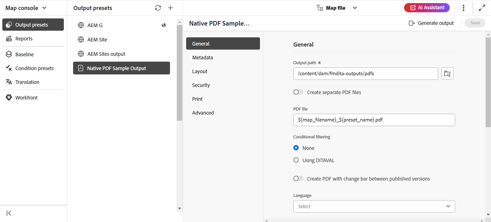

# PublishPDF輸出

透過AEM Guides，您可以產生個別主題的PDF或整個地圖檔案。 您可以使用下列三種方法之一，以PDF格式發佈您的內容：

* **DITA-OT**

使用此方法可從地圖控制面板產生地圖的PDF輸出。 您可以針對在地圖控制面板中開啟的地圖，建立輸出預設集，在產生PDF之前設定發佈屬性。 若要建立或編輯輸出預設集，[AEM Guidesas a Cloud Service使用手冊](https://helpx.adobe.com/content/dam/help/en/xml-documentation-solution/cs-apr-22/XML-Documentation-for-Adobe-Experience-Manager_CS_User-Guide_EN.pdf)中的&#x200B;*瞭解輸出預設集*&#x200B;區段。

如需使用DITA-OT方法產生PDF的詳細資訊，請參閱[使用DITA-OT產生PDF](https://help.adobe.com/en_US/xml-documentation-for-adobe-experience-manager/index.html#t=DXML-master-map%2Fgenerate-output-pdf.html)。

* **FrameMaker Publishing Server(FMPS)**

使用此方法，不僅從DITA內容產生PDF輸出，還從AEM存放庫中可用的FrameMaker檔案(.book和.fm)產生輸出。 您可設定輸出預設集來建立PDF，並使用FrameMaker Publishing Server(FMPS)發佈。 您可以針對PDF和其他格式來設計和設定輸出的外觀，並將它們儲存在設定檔案(.sts)中。 然後FMPS會使用此設定檔案來產生DITA map或.book檔案的輸出。 若要建立或編輯輸出預設集，請參閱[AEM Guidesas a Cloud Service使用手冊](https://helpx.adobe.com/content/dam/help/en/xml-documentation-solution/cs-apr-22/XML-Documentation-for-Adobe-Experience-Manager_CS_User-Guide_EN.pdf)中的&#x200B;*瞭解輸出預設集*&#x200B;一節。

如需設定FMPS的詳細資訊，請參閱[從FrameMaker檔案產生輸出](https://help.adobe.com/en_US/xml-documentation-for-adobe-experience-manager/index.html#t=DXML-master-map%2Ffm-output-generatation.html)。

* **原生PDF發佈**

此方法可根據W3C CSS3和CSS分頁媒體標準產生功能豐富的PDF輸出。 透過原生PDF發佈，您可以使用範本來設定內容的版面配置和樣式，並套用各種設定來微調PDF。 此外，您可以使用範本編輯器修改和建立自己的範本。

如需原生PDF發佈的詳細資訊，請參閱[使用原生PDF發佈](#native-pdf-publishing)。

## 使用原生PDF發佈 {#native-pdf-publishing}

製作內容時，務必確保內容已針對檢視、編輯和列印進行最佳化。 使用諸如W3C CSS3之類的內容樣式標準和諸如Size、margin、orientation、page breaks、headers、footer和page numbering等頁面定義屬性的CSS分頁媒體標準，您可以設定PDF檔案的檢視和版面配置，以確保一致性和可用性。 原生PDF發佈功能會使用這些標準來產生PDF。

透過原生PDF發佈，您可以使用預先定義的範本來確保內容版面配置與結構的一致性、套用樣式表以改變輸出的外觀、最佳化PDF、設定印表機標籤、允許熒幕助讀程式支援、設定PDF一致性、嵌入字型等等。

使用原生PDF發佈來產生PDF有兩個方面：

* 使用範本將樣式套用至內容、設定版面配置及各種設定以微調您的PDF。 作者可以選擇使用/修改提供的範例範本，或建立自訂範本，並設定發佈者和開發人員使用的進階設定選項。

* 建立或設定PDF輸出預設集，以控制PDF設定。 建立PDF輸出預設集後，即可產生PDF。

如需詳細資訊，請參閱[產生PDF輸出](#generate-pdf-output)。

## 建立PDF輸出預設集 {#create-output-preset}

產生PDF輸出的第一個步驟是建立PDF輸出預設集，這是指派給地圖的發佈屬性的集合。 您可以為在「地圖檢視」面板中開啟的任何地圖建立輸出預設集，或設定現有預設集以快速產生相同地圖的PDF。

從PDF輸出預設集中，您可以選取範本、套用條件、設定限制以控制使用者與您的PDF互動的方式，以及設定進階設定，例如壓縮、符合等等。

若要建立或設定PDF輸出預設集：

1. 在[輸出]索引標籤中，按一下左側邊欄中的&#x200B;**預設集**。
「預設集」面板隨即開啟。 

1. 在輸出&#x200B;**預設集**&#x200B;面板中，執行下列任一項作業：
   * 連按兩下預先定義的PDF輸出預設集以檢視它。
   * 對&#x200B;**預設集**&#x200B;按一下+圖示以新增&#x200B;**型別：PDF**&#x200B;的輸出預設集

1. 若要設定現有PDF預設集的設定：
   * 按一下所要的輸出預設集旁的&#x200B;**選項** 圖示，然後選取&#x200B;**編輯**。
您可以在**一般**、**中繼資料**、**配置**、**安全性**&#x200B;和&#x200B;**進階**&#x200B;標籤中使用下列設定，以設定PDF輸出預設集：

**一般**

用於指定基本輸出設定，例如指定輸出路徑、PDF檔案名稱等。

| 設定 | 說明 |
| --- | --- |
| **輸出路徑** | AEM存放庫內儲存PDF輸出的路徑。 確定輸出路徑不在專案資料夾內。 如果保留為空白，輸出會在預設DITA map輸出位置中產生。 您也可以使用下列現成的變數來定義輸出路徑。 您可以使用單一變數或變陣列合來定義此選項。  `${map_filename}`：使用DITA map檔案名稱來建立目的地路徑。  `${map_title}`：使用DITA map標題來建立目的地路徑。  `${preset_name}`：使用輸出預設集名稱來建立目的地路徑。  `${language_code}`：使用對應檔案所在的語言代碼來建立目的地路徑。  `${map_parentpath}`：使用對應檔案的完整路徑來建立目的地路徑。   `${path_after_langfolder}`：使用語言資料夾之後的對應檔路徑來建立目的地路徑。 |
| **PDF檔案** | 指定檔案名稱以儲存PDF。 依預設，PDF檔案名稱會新增DITA map名稱以及預設名稱。 例如，ditamap是「TestMap」，而預設集的名稱是「preset1」，則pdf的預設名稱將是「TestMap_preset1.pdf」。  您也可以使用下列現成的變數來定義PDF檔案。 您可以使用單一變數或變陣列合來定義此選項。 `${map_filename}` `${map_title}` `${preset_name}`   `${language_code}`。 |
| **套用條件使用** | 對於條件式內容，請從下列選項中選擇，以根據這些條件產生PDF輸出：  <ul> <li> **未套用**&#x200B;如果您不想在地圖和來源內容上套用任何條件，請選取此選項。 <li> **Ditaval檔案**&#x200B;選取DITAVAL檔案以產生條件式內容。 若要選取，請按一下「條件預設集」並找出檔案。  <li> **條件預設集**&#x200B;從下拉式清單中選取條件預設集，以在發佈輸出時套用條件。 如果您已為DITA map檔案新增條件，則會顯示此選項。 條件設定可在DITA map主控台的「條件預設集」標籤中使用。 若要進一步瞭解條件預設集，請參閱[使用條件預設集](https://help.adobe.com/en_US/xml-documentation-for-adobe-experience-manager/index.html#t=DXML-master-map%2Fgenerate-output-use-condition-presets.html)。  </ul> |
| **使用基準線** | 如果您已經為選取的DITA map建立基準線，請選取此選項以指定要發佈的版本。 如需詳細資訊，請參閱[使用基準線](https://help.adobe.com/en_US/xml-documentation-for-adobe-experience-manager/index.html#t=DXML-master-map%2Fgenerate-output-use-baseline-for-publishing.html)。 |
| **在發佈的版本之間建立含有變更列的PDF** | 使用下列選項來建立一個PDF，使用變更列顯示兩個版本之間的內容差異：    <ul><li> **先前版本的基準**&#x200B;選擇您要與目前版本或其他基準比較的基準版本。 PDF中會顯示變更列，以指出修改的內容。 變更列是垂直線，以視覺化方式識別新內容或修訂的內容。 變更列會顯示在已插入、變更或刪除的內容左側。  **注意**：如果您選取&#x200B;**使用基準線**&#x200B;並選擇要發佈的基準線，將會比較兩個選取的基準線版本。 例如，如果您在&#x200B;**使用基準線**&#x200B;下選擇基準線1.3版，而在先前版本&#x200B;**的**&#x200B;基準線下選擇基準線1.1版，則比較基準線1.1版和基準線1.3版。 <li> **顯示新增的文字**&#x200B;選取以綠色和底線顯示插入的文字。 依預設，會選取此選項。  <li> **顯示已刪除的文字**&#x200B;選取此選項可讓刪除的文字以紅色顯示，並標示為刪除線。 依預設，會選取此選項。  **附註**&#x200B;您也可以使用樣式表自訂變更列、插入內容或刪除內容的樣式。 </ul> |
| **Post產生工作流程** | 選取以顯示包含AEM中設定之所有工作流程的下拉式清單。 您可以選取在PDF產生工作流程完成後要執行的工作流程。 |

**中繼資料**

中繼資料是內容的說明或定義。 中繼資料有助於內容管理，也有助於在網際網路上搜尋檔案。

使用「中繼資料」標籤來設定中繼資料欄位，例如作者姓名、檔案標題、關鍵字、版權資訊以及PDF輸出的其他資料欄位。 您也可以為PDF輸出新增自訂中繼資料。

此中繼資料對應到輸出PDF **檔案屬性**&#x200B;內&#x200B;**描述**&#x200B;索引標籤中的中繼資料。

從輸出預設集中選取&#x200B;**PDF** > **原生PDF** > **中繼資料**&#x200B;以新增和自訂中繼資料選項。
* **使用Topicmeta中新增的Metdata**

  依預設，會選取此選項。 您可以使用在DITA map的topicmeta元素中新增的中繼資料來填入PDF輸出的中繼資料欄位。

* **提供XMP檔案**

  您也可以匯入[XMP](https://www.adobe.com/products/xmp.html) （可延伸的中繼資料平台）檔案，直接填入中繼資料欄位。 您可以從這裡下載範例XMP檔案。

[下載](assets/SampleXMP.xmp)

  或者，您可以使用Adobe Acrobat產生XMP檔案。
   1. 在Acrobat中按一下&#x200B;**檔案** > **屬性**。
   1. 在&#x200B;**描述**&#x200B;下，按一下&#x200B;**其他中繼資料**。
   1. 從左側面板中選取&#x200B;**進階**。
   1. 按一下&#x200B;**儲存**。

  XMP檔案會儲存在裝置上。

* **提供中繼資料名稱和值**

   1. 從下拉式清單中選取以新增名稱，或直接在名稱欄位中輸入以新增自訂中繼資料。
   1. 輸入中繼資料的值，然後按一下「+」圖示。
中繼資料會新增至PDF的中繼資料清單中。

您也可以使用變數來定義中繼資料值。  您可以使用為DITA map或bookmap檔案定義的中繼資料作為變數。 中繼資料可以在DITA map或bookmap檔案的`/jcr:content/metadata`節點下找到。
使用變數時，會從中繼資料屬性中挑選變數值。

若要使用變數，您必須以`${<variable>}`格式定義它。

例如，在/`jcr:content/metadata`節點中定義的其中一個中繼資料屬性是
`dc:title`。 您可以指定`${dc:title}`，且標題值會用於最終輸出。

您可以使用單一或一組變數來定義中繼資料。 例如 `${dc:title} ${dc:docstate}`。您也可以使用變數和字串的組合。  例如，`View ${dc:title} in ${dc:language}`。

使用語言變數來定義中繼資料屬性的本地化值。 系統會根據您選擇的語言，在PDF輸出中自動挑選當地語系化的值。 例如，您可以將「作者」列印為英文的中繼資料值，並將「Autorin」列印為德文。

格式： `${lng:<variable name>}`。 例如，`${lng:author-label}`其中`author-label`是語言變數。

暫留在 接近檢視其詳細資訊的選項。

**配置**

用來設定頁面配置，並指定PDF輸出的頁面檢視選項，例如「頁面顯示」和設定「縮放等級」。

| 設定 | 說明 |
| --- | --- |
| **PDF範本** | PDF範本提供清晰的結構，可用於定義頁面配置、內容樣式以及套用各種設定至PDF輸出。 從「PDF範本」下拉式選項中選取，以選擇您偏好的範本。  您也可以選取&#x200B;**瀏覽範本** 以選擇範本。 在&#x200B;**選取PDF範本**&#x200B;對話方塊中，您也可以預覽縮圖，並檢視所選範本的標題和描述。 |
| **頁面顯示** | 使用「頁面顯示」進行頁面檢視，以顯示PDF開啟時的顯示方式。 從「頁面顯示」下拉式選項中選取，以選擇偏好的檢視。 <ul><li> **預設**&#x200B;依照使用者電腦上的PDF檢視器預設設定顯示。   <li> **單頁檢視**&#x200B;一次顯示一個頁面。     <li> **單頁捲動**&#x200B;在連續的垂直欄中顯示單頁。   <li> **兩頁檢視**&#x200B;一次並排顯示兩頁跨頁。.  <li> **兩頁捲動**&#x200B;以連續捲動方式並排顯示兩頁跨頁。 </ul> |
| **縮放** | 選取以調整頁面檢視的大小，該檢視顯示PDF在開啟時的顯示方式。  <ul><li> **預設**&#x200B;依照使用者電腦上的PDF檢視器預設設定顯示      <li> **100%**&#x200B;讓頁面以實際大小顯示。       <li> **符合頁面**&#x200B;讓頁面寬度和高度符合檔案窗格。   .  <li> **調整頁面寬度**&#x200B;讓頁面寬度填滿檔案窗格的寬度。   <li> **調整頁面高度**&#x200B;使頁面高度填滿檔案窗格的高度。 </ul> |

**安全性**

新增開啟和讀取檔案的限制，以Protect您的PDF。 使用下列選項以避免未經授權的存取。

| 設定 | 說明 |
| --- | --- |
| **設定密碼以開啟檔案** | 選取以新增安全密碼以檢視您的PDF檔案。 在&#x200B;**使用者密碼**&#x200B;欄位中指定密碼。 使用者只能透過輸入在此欄位中提供的密碼來開啟PDF。 |
| **設定檔案限制** | 選取「 」以限制使用者與您的PDF互動的方式。 在&#x200B;**擁有者密碼**&#x200B;欄位中指定密碼，讓下列限制設定生效。  <ul><li> **列印**&#x200B;選取以允許使用者列印PDF。  <li> **草稿品質列印**&#x200B;選取以允許使用者以較低解析度列印PDF。   <li> **內容複製**&#x200B;選取以允許使用者從PDF複製內容。     <li> **註解**&#x200B;選取以允許使用者在PDF中新增註解或註解。  <li> **內容修改**&#x200B;選取以允許使用者變更PDF中的內容。  <li> **為協助工具複製內容**&#x200B;選取以允許熒幕朗讀程式以PDF閱讀和瀏覽內容。   **檔案元件**&#x200B;選取以允許使用者在PDF中插入頁面。  **注意**：使用者必須輸入擁有者密碼，才能變更Adobe Acrobat中[檔案] > [內容]的任何限制。 |

**進階**

使用下列選項來指定合併PDF、使用壓縮、選取規範遵循標準等的進階設定。

| 設定 | 說明 |
| --- | --- |
| **建立可存取（標籤）的PDF** | 選取此選項即可產生含有標籤的PDF。 標籤的PDF可讓熒幕助讀程式更輕鬆地閱讀及導覽內容、超連結、書籤等。 例如，如果表格已加上標籤，熒幕助讀程式會知道它正在讀取表格，而不只是行與文字。 |
| **包含在目錄**&#x200B;中的合併PDF | 選取此選項，將現有PDF作為資源檔案新增至DITA map中，以將它們合併到輸出中。 PDF將會插入地圖中顯示的位置，頁面也會隨之增加。 |
| **內嵌已使用的字型** | 在使用可能未安裝在使用者電腦上的字型時，請選取此選項。 選取此選項後，使用的字型會內嵌於PDF中，確保使用者可看到預期的PDF，即使字型未安裝在他們的電腦上。  **注意**：字型必須包含允許嵌入的字型廠商所設定的設定，才能被嵌入。 在內嵌字型之前，請確認您具備必要的設定或授權。 |
| **使用自動連字** | 啟用自動連字功能後，行尾的文字會在文法正確位置以連字型大小斷字。 |
| **啟用JavaScript** | 如果您有JavaScript程式碼，而且想在產生PDF之前動態轉換內容，請啟用此選項。 |
| **內嵌多媒體檔案** | 選取此選項可將任何音訊、視訊和互動式內容納入PDF。 |
| **使用完整壓縮以最佳化PDF大小** | 如果要壓縮/縮小大型PDF的大小，請選取此選項。 請記住，壓縮PDF可能會降低檔案品質。 |
| **使用影像壓縮來最佳化PDF大小** | 如果要在PDF中壓縮/減少使用的影像大小，請選取此選項。 請記住，壓縮影像可能會降低影像品質。 |
| **使用自訂解析度（每英吋畫素）** | 這是以畫素/英吋為單位的頁面顯示解析度。 在選取此選項時顯示的欄位中輸入偏好值。 預設值為每英吋96畫素。 設定較高的值以在一英吋內容納更多內容，反之亦然（如果您設定較低的值）。 |
| **顯示浮水印** | 選取此選項可在輸出中重疊浮水印。 您可以在文字方塊中輸入新的文字字串，其字元大小寫如您所需。   使用靜態文字或語言變數來發佈浮水印的本地化版本。  系統會根據您選擇的語言，在PDF輸出中自動挑選當地語系化的值。 例如，您可以將&#39;Publisher&#39;列印成英文的浮水印，並將&#39;Auteure&#39;列印成法文。   格式： `${lng:<variable name>}`。 例如，`$ {lng:publisher-label}`其中`publisher-label`是語言變數。  暫留在 接近檢視其詳細資訊的選項。 |
| **啟用MathML方程式** | 選取此選項以呈現內容中出現的MathML方程式。 否則預設會忽略方程式。 |
| **下載暫存檔** | 如果您想要下載在產生原生HTML輸出時建立的臨時PDF檔案，請選取此選項。 您稍後可以在產生輸出後下載暫存檔案。 |
| **符合PDF** | 這是您打算儲存PDF以確保其相容的標準。 從下拉式清單中選取，以從可用的PDF標準清單中選擇。 如需支援標準的詳細資訊，請參閱[關於PDF標準](https://helpx.adobe.com/acrobat/using/pdf-conversion-settings.html#about_pdf_x_pdf_e_and_pdf_a_standards)。 |
| **檔案屬性** | 選取您要傳遞給原生PDF發佈的中繼資料。 下拉式清單會同時列出自訂和預設屬性。 例如，`dc:description`、`dc:language`、`dc:title`和`docstate`為預設屬性，而您可以將`author`作為自訂屬性。 選取的中繼資料屬性會傳遞至使用原生PDF產生的PDF檔案。  這些屬性是從下列位置可用的`metadataList`檔案中挑選的：`/libs/fmdita/config/metadataList`。  此檔案可以覆蓋於： `/apps/fmdita/config/metadataList`。 |

## 產生PDF輸出 {#generate-pdf-output}

設定好輸出預設集後，您就可以使用&#x200B;**產生預設集**&#x200B;功能，從「預設集」面板產生輸出。

1. 在&#x200B;**作者**&#x200B;標籤下，選取&#x200B;**存放庫**&#x200B;檢視。\
   如此將可開啟「存放庫」面板。

1. 在「存放庫」面板中，在&#x200B;**Map檢視**&#x200B;中開啟DITA map檔案。

1. 在&#x200B;**輸出**&#x200B;索引標籤中，按一下&#x200B;**預設集**以檢視預設集面板。
若要建立或設定輸出預設集，請參閱[建立PDF輸出預設集](#create-output-preset)。
1. 若要儲存您的設定，請按一下「輸出」檢視中標準工具列左上角的&#x200B;**儲存全部** 圖示。
1. 按一下頂端列上的&#x200B;**產生預設集** 圖示。
您可以在「輸出預設集」面板中檢視所選輸出預設集旁的進度列。
1. 輸出產生完成後，請按一下頂端列上的&#x200B;**檢視輸出** 圖示以檢視輸出。\
   畫面的右下角會顯示&#x200B;**Success**對話方塊。
如果輸出不成功，則會顯示以下錯誤訊息。

若要檢視錯誤記錄，請按一下[關閉] ****，將滑鼠停留在選取的預設集標籤上，然後按一下[選項] ](assets/options.svg) **[選項]** > **[檢視記錄]**。![

### 產生原生PDF輸出後下載暫存檔案

如果您在[進階]設定中選取&#x200B;**下載暫存檔案**&#x200B;選項，您也可以下載在產生原生HTML輸出時建立的暫存PDF檔案。 產生輸出後，您可以使用頂端列上的&#x200B;**下載暫存檔** 圖示來下載暫存檔。 此功能可協助您檢視臨時HTML樣式和版面，並協助您根據需求修正或變更CSS樣式。

>[!NOTE]
>
> **下載暫存檔案** 圖示只有在您上次使用預設集產生PDF輸出時，才會出現，您已在其中選取&#x200B;**進階**&#x200B;索引標籤中的選項。

### 使用語言變數

AEM Guides也支援語言變數。 選取&#x200B;**語言變數** 左側面板中的可定義PDF輸出中現成可用標籤的本地化版本，例如「注意」、「警告」和「警告」或靜態文字。 如需詳細資訊，請參閱[語言變數的支援](../native-pdf/native-pdf-language-variables.md)。

### 支援Markdown檔案

Experience Manager Guides也支援您的Markdown檔案。  Markdown檔案易於編寫且
提供各種格式選項。 瞭解如何從網頁編輯器[編寫Markdown檔案](../user-guide/web-editor-markdown-topic.md)。

您可以將Markdown主題新增至DITA map，並使用原生PDF輸出預設集產生PDF輸出。  瞭解如何設定或[建立PDF輸出預設集](#create-a-pdf-output-preset-create-output-preset)。